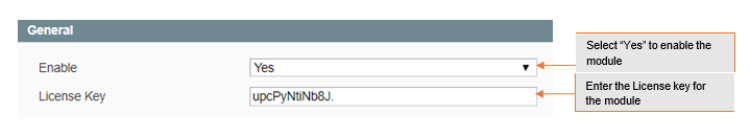

# Magento Update Order Email Address

### <mark style="color:blue;">Installation and User Guide for Magento 1 Update Order Email Address</mark>

**Table of Contents**

1. [Installation ](magento-update-order-email-address.md#\_bookmark0)
   * Disable Compilation Mode&#x20;
   * Upload Package&#x20;
   * Clear Caches&#x20;
2. [Configuration Settings for Update Order Email Address ](magento-update-order-email-address.md#\_bookmark4)
   * General Settings&#x20;
   * Update Order Email Address from Order Detail View Page&#x20;
   * Updated Email Address on the Order Detail View Page&#x20;

### <mark style="color:blue;">Installation</mark> 

* <mark style="color:orange;">**Disable Compilation Mode:**</mark>** ** To check that this is disabled, go to **System >Tools> Compilation**. If the compiler status is ‘Disabled’, you are ready to go. If not, simply click the ‘Disable’ button on the right hand side of the screen.
* <mark style="color:orange;">**Upload Package:**</mark>** ** Upload the content of the module to your root folder. This will not overwrite the existing Magento folder or files, only the new contents will be added.
* <mark style="color:orange;">**Clear Caches:**</mark>** ** This can be done from the admin console by navigating to the cache management page (**System > Cache Management**), selecting all caches, clicking ‘refresh’ from the drop-down menu, and submitting the change.

### <mark style="color:blue;">Configuration Settings for Update Order Email Address</mark> 

Go to **Admin > Stores > Configuration > Scommerce Configuration > Update Order Email Address**

#### <mark style="color:orange;">General Settings</mark> 

* **Enabled –** Select “Yes” or “No” to enable or disable the module.
* **License Key –** Please add the license for the extension which is provided in the order confirmation email. Please note license keys are site URL specific. If you require license keys for dev/staging sites then please email us at [core@scommerce-mage.com](mailto:core@scommerce-mage.com)

* <mark style="color:orange;">**Update Order Email Address from Order Detail View Page –**</mark>** ** You can update email address from **Admin > Sales > Orders > Select Orders >** Click on **“Change”** then add new email address **>** Click **“Save”.**

>)

* <mark style="color:orange;">**Updated Email Address on the Order Detail View Page –**</mark>** ** The updated email address will be shown on the order detail view page under “Account Information” section.

>)

If you have a question related to this extension please check out our [**FAQ Section**](https://www.scommerce-mage.com/magento-update-order-email-address.html#faq) **** first. If you can't find the answer you are looking for then please contact [**support@scommerce-mage.com**](mailto:core@scommerce-mage.com)**.**
