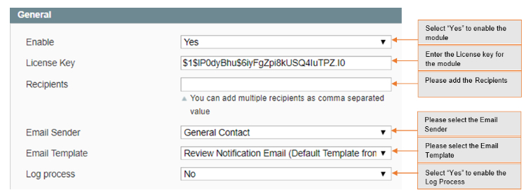

# Product Review Administrator Notification Email

### <mark style="color:blue;">Installation and User Guide for Magento 1 Product Review Administrator Notification Email</mark>

**Table of Contents**

1. [Installation ](product-review-administrator-notification-email.md#\_bookmark0)
   * Disable Compilation Mode&#x20;
   * Upload Package&#x20;
   * Clear Caches&#x20;
2. [Configuration Settings for Product Review Notification ](product-review-administrator-notification-email.md#\_bookmark4)
   * General Settings&#x20;
   * Email Template&#x20;
   * Customer Review&#x20;

### <mark style="color:blue;">Installation</mark> 

* <mark style="color:orange;">**Disable Compilation Mode:**</mark> To check that this is disabled, go to **System >Tools> Compilation**. If the compiler status is ‘Disabled’, you are ready to go. If not, simply click the ‘Disable’ button on the right hand side of the screen.
* <mark style="color:orange;">**Upload Package:**</mark> Upload the content of the module to your root folder. This will not overwrite the existing Magento folder or files, only the new contents will be added.
* <mark style="color:orange;">**Clear Caches:**</mark> This can be done from the admin console by navigating to the cache management page (**System > Cache Management**), selecting all caches, clicking ‘refresh’ from the drop-down menu, and submitting the change.

### <mark style="color:blue;">Configuration Settings for Product Review Notification</mark> 

Go to **Admin > Stores > Configuration > Scommerce Configuration > Product Review Notification**

#### <mark style="color:orange;">General Settings</mark> 

* **Enabled –** Select “Yes” or “No” to enable or disable the module.
* **License Key –** Please add the license for the extension which is provided in the order confirmation email. Please note license keys are site URL specific. If you require license keys for dev/staging sites then please email us at [core@scommerce-mage.com](mailto:core@scommerce-mage.com)
* **Recipients –** Comma separated list of recipients for the notification email.
* **Email Sender –** From email address for the notification email.
* **Email Template –** Notification Email Template.
* **Log Process –** If set to yes then will log the information about Notification Emails Sent in var/log folder.

* <mark style="color:orange;">**Email Template –**</mark> Default “Product Review Administrator Email” template will be created under **Admin > System > Transaction Emails**. This can be customised as required. The Email displays number of variable information “**Custom Nick Name”, “store name”, “Review Title”, “Review Detail“, “Logo URL”, “Product Name”, “Product SKU”, etc.**

>)

#### <mark style="color:orange;">Customer Review</mark> 

>)

If you have a question related to this extension please check out our [**FAQ Section**](https://www.scommerce-mage.com/magento-product-review-notification-email.html#faq) first. If you can't find the answer you are looking for then please contact [**support@scommerce-mage.com**](mailto:core@scommerce-mage.com)**.**
