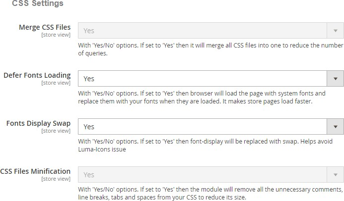

# Facebook Conversion and Audience Pixel Tracking

### <mark style="color:blue;">Installation and User Guide for Magento 1 Facebook Conversion and Audience Pixel Tracking</mark>

**Table of Contents**

1. [Installation ](facebook-conversion-and-audience-pixel-tracking.md#\_bookmark0)
   * Disable Compilation Mode&#x20;
   * Upload Package&#x20;
   * Clear Caches&#x20;
2. [Configuration Settings for Facebook Tracking ](facebook-conversion-and-audience-pixel-tracking.md#\_bookmark4)
   * General Settings&#x20;
   * Analyze Data with Facebook Events Manager&#x20;
   * Facebook Events Manager Graph&#x20;
3. [Front-end Site View ](facebook-conversion-and-audience-pixel-tracking.md#\_bookmark8)
   * Facebook Pixel Tag on the Category Page&#x20;
   * Facebook Pixel Tag on the Product Page&#x20;
   * Facebook Pixel Tag on the Cart Page&#x20;
   * Facebook Pixel Tag on the Checkout Page&#x20;
   * Facebook Pixel Tag on the Payment Page&#x20;
   * Facebook Pixel Tag on the Success Page&#x20;

### <mark style="color:blue;">Installation</mark> 

* <mark style="color:orange;">**Disable Compilation Mode:**</mark>** ** To check that this is disabled, go to **System >Tools> Compilation**. If the compiler status is ‘Disabled’, you are ready to go. If not, simply click the ‘Disable’ button on the right hand side of the screen.
* <mark style="color:orange;">**Upload Package:**</mark> Upload the content of the module to your root folder. This will not overwrite the existing Magento folder or files, only the new contents will be added.
* <mark style="color:orange;">**Clear Caches:**</mark>** ** This can be done from the admin console by navigating to the cache management page (**System > Cache Management**), selecting all caches, clicking ‘refresh’ from the drop-down menu, and submitting the change.

### <mark style="color:blue;">Configuration Settings for Facebook Tracking</mark> 

Go to **Admin > Stores > Configuration > Scommerce Configuration > Facebook Tracking**

#### <mark style="color:orange;">General Settings</mark> 

* **Enabled –** Select “Yes” or “No” to enable or disable the module.
* **License Key –** Please add the license for the extension which is provided in the order confirmation email. Please note license keys are site URL specific. If you require license keys for dev/staging sites then please email us at [core@scommerce-mage.com](mailto:core@scommerce-mage.com)
* **New Facebook Tracking Enabled –** Set “Yes” to enable Facebook new pixel tracking or Remarketing tag [**https:**//developers.facebook.com/docs/ads-for-websites/tag-api/](https://developers.facebook.com/docs/ads-for-websites/tag-api/)
* **Audience Pixel Id –** Enter custom Audience Pixel Id. This applies to old as well as new Facebook tracking.
* **Events –** Select the events which you want to track with new Facebook Tracking. For new pixel tracking it will track all the events outlined here -: [https://developers.facebook.com/docs/marketing-api/facebook-](https://developers.facebook.com/docs/marketing-api/facebook-pixel/v2.6%23standardevents) [pixel/v2.6#standardevents](https://developers.facebook.com/docs/marketing-api/facebook-pixel/v2.6%23standardevents)
* **Dynamic Product Ads Enabled –** Set “Yes” to enable Dynamic Product Ads [**https:**//en-gb.facebook.com/business/help/www/455326144628161](https://en-gb.facebook.com/business/help/www/455326144628161)
* **Remarketing Default Value –** Enter default value for events where value can’t be defined like CompleteRegistration, Search **(only used for new Facebook tracking)**
* **Base –** Set “Yes” if you want to send base order data and “No” to send store order data to Google. Set this to “Yes” always unless you have multi- store/currency is enabled and you want to send different currency data to Google.
* **Enable GDPR Cookie check –** If you are using our [GPDR Extension ](https://www.scommerce-mage.com/magento1-gdpr-compliance.html)or any other GDPR Extension and you want to block sending information to Google then set this to “Yes” based on customer preference. **Please note this is optional as far as you are not sending any PII to Google this setting needs to be turned off**

* <mark style="color:orange;">**Analyze Data with Facebook Events Manager –**</mark>** ** Facebook Business Manager gathered enough information so that you can analyze data using event log, which shows how many times the tracker has been fired.

>)

* <mark style="color:orange;">**Facebook Events Manager Graph –**</mark>** ** You can view the event log and graph in Facebook business manager with all the events view details.

>)

### <mark style="color:blue;">Front-end site view</mark> 

* <mark style="color:orange;">**Facebook Pixel Tag on the Category Page –**</mark>** ** The extension offers all standard trackers that Facebook uses. When the category page is viewed then it shows page view with event info, which you can see in the below image.

>)

* <mark style="color:orange;">**Facebook Pixel Tag on the Product Page –**</mark>** ** When a product page is viewed

e.g. landing on a product detail page, then it provides detailed product information (such as Prices, SKU’s, Currencies and Categories) for Dynamic Product Ads. You can enable dynamic product ads from **Admin > Stores > Configuration > Scommerce Configuration > Facebook Conversion Tracking > Dynamic Product Ads Enabled – “Yes”.**

>)

* <mark style="color:orange;">**Facebook Pixel Tag on the Cart Page –**</mark>** ** When a product is added to the shopping cart, then it tracks the cart event.

>)

* <mark style="color:orange;">**Facebook Pixel Tag on the Checkout Page –**</mark>** ** It tracks checkout, when a user clicks on checkout button.

>)

* <mark style="color:orange;">**Facebook Pixel Tag on the Payment Page –**</mark> It tracks AddPaymentInfo when a payment information is added in the checkout flow, e.g. click on payment method.

* <mark style="color:orange;">**Facebook Pixel Tag on the Success Page –**</mark>** ** When a purchase is made or checkout flow is completed, e.g. landing on thank you/success page, provides detailed order information such as Order Value and Cart Items.

>)

If you have a question related to this extension please check out our [**FAQ Section**](https://www.scommerce-mage.com/magento-facebook-conversion-audience-tracking.html#faq) **** first. If you can't find the answer you are looking for then please contact [**support@scommerce-mage.com**](mailto:core@scommerce-mage.com)**.**
