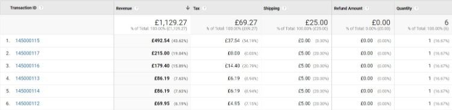

# Google Enhanced Ecommerce Tracking

### <mark style="color:blue;">Installation and User Guide for Magento 1 Google Enhanced Ecommerce Tracking</mark>

**Table of Contents**

1. [Installation ](google-enhanced-ecommerce-tracking.md#\_bookmark0)
   * Disable Compilation Mode&#x20;
   * Upload Package&#x20;
   * Clear Caches&#x20;
2. [Configuration Settings for Google Universal Analytics ](google-enhanced-ecommerce-tracking.md#\_bookmark4)
   * General Settings&#x20;
   * Enhanced Ecommerce&#x20;
3. [Set up Enhanced Ecommerce in Google Analytics ](google-enhanced-ecommerce-tracking.md#\_bookmark7)
   * Real Time Event&#x20;
   * Backend Order Tracking in Google Analytics&#x20;
   * Shopping Behaviour&#x20;
   * Checkout Behaviour&#x20;
   * Product Performance&#x20;
   * Sales Performance&#x20;
4. [Front-end Site View ](google-enhanced-ecommerce-tracking.md#\_bookmark14)
   * Home Page with Tags&#x20;
   * GA – UA Tracking Code&#x20;

### <mark style="color:blue;">Installation</mark> 

* <mark style="color:orange;">**Disable Compilation Mode:**</mark> To check that this is disabled, go to **System >Tools > Compilation**. If the compiler status is ‘Disabled’, you are ready to go. If not, simply Click the ‘Disable’ button on the right hand side of the screen.
* <mark style="color:orange;">**Upload Package:**</mark> Upload the content of the module to your root folder. This will not overwrite the existing Magento folder or files, only the new contents will be added.
* <mark style="color:orange;">**Clear Caches:**</mark> This can be done from the admin console by navigating to the cache management page (**System > Cache Management**), selecting all caches, clicking ‘Refresh’ from the drop-down menu, and submitting the change.

### <mark style="color:blue;">Configuration Settings for Google Universal Analytics</mark> 

Go to **Admin > Stores > Configuration > Scommerce Configuration > Google Universal Analytics**

#### <mark style="color:orange;">General Settings</mark> 

* **Enabled -** Select “Yes” or “No” to enable or disable the module.
* **License Key -** Please add the license for the extension which is provided in the order confirmation email. Please note license keys are site URL specific. If you require license keys for dev/staging sites then please email us at [core@scommerce-mage.com](mailto:core@scommerce-mage.com)
* **Account Id - Enter** your Google Account Id.
* **Anonymize Ip -** Sets the parameter anonymize Ip in tracking. If set to “Yes” tells Google Analytics to anonymize the information sent by the tracker objects by removing the last octet of the IP address prior to its storage.
* **Display Feature -** Enable/Disable the display feature plugin. For more information click here.
* **Enable User Id - Enable**/Disable User Id feature. Make sure this feature is enabled in Google Analytics first before enabling in Magento. For more information click here.
* **Ecommerce Enabled -** Enable/Disable the e-commerce plugin. For more information click here.
* **Domain Auto -** Enable/Disable to show ‘auto’ as domain name, when turned off, it shows the domain name itself.
* **Linker Enabled -** Enable/Disable the linker plugin to link cross domains. For more information click here.
* **Link Two GA Accounts Enabled -** Enable/Disable the link between two GA Accounts. All the information collected by google on primary Account Id will be passed to Linked Account Id.
* **Base -** Set “Yes” if you want to send base order data and “No” to send store order data to Google. Set this to “yes” always unless you have multi-store/currency is enabled and you want to send different currency data to Google.
* **Enable Optimize -** Set “Yes” to enable optimize with Google Analytics.
* **Enable GDPR cookie check -** If you are using our GDPR Extension or any other GDPR Extension and you want to block sending information to Google then set this to “Yes” based on custom preference. Please note this is optional as far as you are not sending any PII to Google this setting needs to be turned off.

#### <mark style="color:orange;">Enhanced Ecommerce</mark> 

* **Enable Enhanced Ecommerce -** Select “Yes” to enable the enhanced ecommerce.
* **Steps -** You can select multiple steps here, these steps correspond to Magento onepage standard checkout steps. Also make sure you add these same steps in Google Analytics under Ecommerce settings by turning Enhanced E-commerce on.
* **Brand Attribute -** You can select product attribute which you can use to set your brand names. This will be passed to Google for further reporting.
* **Brand text box -** You can also pass hard coded brand name using this configuration setting.
* **Send Phone or Admin Orders - Enable** this feature only if you want to send admin or phone orders on order creation.
* **Send Transactional Data Offline -** Set “Yes” to send data on order creation only. This feature could be useful if your payment gateway show their own success page instead of Magento order confirmation page.
* **Send Transactional Data only on Invoice Creation -** Set “Yes” to send data on invoice creation only. This feature could be useful if you take either payment on dispatch or your payment gateway show their own success page instead of Magento order confirmation page.
* **Allow sending transaction offline -** Enable this feature for sending missing transactions to Google. This will show a button against orders.
* **Send Cancel Order to GA -** Set “Yes” to send cancel order information to GA. This will send as a negative transaction to Google.
* **Send Frontend Form Data to GA -** Enable this feature if you want to send user inputs on the frontend to Google as events like Registration or Checkout form data.
* **Debugging -** Set “Yes” to generate **GA.log** in **var/log** directory to log all transactional data which we send to Google using measurement protocol.

### <mark style="color:blue;">Set up Enhanced Ecommerce in Google Analytics</mark> 

#### <mark style="color:orange;">To turn on Enhanced E-commerce for a view, and label your checkout steps:</mark>

1. Click Admin at the top of any Analytics page.
2. Select the view for which you want to enable Enhanced E-commerce reporting.
3. In the view column, click E-commerce Settings.
4. Under **Step 1**, Enable E-commerce, set the status to ON.
5. Click Next Step.
6. Under **Step 2**, Enhanced Ecommerce Settings, set the status to ON. When you turn this option on
   * You can see the Enhanced E-commerce reports in the conversions section
   * The older, older category of E-commerce reports is no longer visible You can turn this option off to restore the older category of E-commerce reports.
7. Optionally, enter labels for the checkout steps that you have defined in your Magento steps configuration. Please see screenshots below for reference.

* Click Submit.
* <mark style="color:orange;">**Real Time Event –**</mark> You can view the tracked events from **GA > Realtime > Events.**

* <mark style="color:orange;">**Backend Order Tracking in Google Analytics –**</mark> You can track admin orders by selecting “Yes” for **“Send Phone or Admin Orders”** from **Admin > Stores > Configuration > Scommerce Configuration > Google Universal Analytics > Enable Enhanced Ecommerce – “Yes”.**

>)

* <mark style="color:orange;">**Shopping Behaviour –**</mark> You can see the shopping behaviour from **GA > Conversion > Ecommerce > Shopping Behaviour.**

>)

* <mark style="color:orange;">**Checkout Behaviour –**</mark> You can see the checkout behaviour in GA with billing & shipping method, payment method and transactions details from **GA > Conversions> Ecommerce > Checkout Behaviour.**

>)

* <mark style="color:orange;">**Product Performance –**</mark> To view the product performance go to **GA > Conversion> Ecommerce > Product Performance.**

>)

* <mark style="color:orange;">**Sales Performance –**</mark> To view tracked sales performance go to **GA > Conversion> Ecommerce > Sales Performance.**

### <mark style="color:blue;">Front-end Site view</mark> 

* <mark style="color:orange;">**Home Page with Tags –**</mark> In Tag Assistant tool you can see the fired tags.

>)

* <mark style="color:orange;">**GA – UA Tracking Code –**</mark> In the below image you can see the UA tracking id’s added from **Admin > Stores > Configuration > Scommerce Configuration > Google Universal Analytics > Account Id** – UA – 33387561-7.

>)

If you have a question related to this extension please check out our [**FAQ Section**](https://www.scommerce-mage.com/magento-google-enhanced-ecommerce-tracking.html#faq) first. If you can't find the answer you are looking for then please contact [**support@scommerce-mage.com**](mailto:core@scommerce-mage.com)**.**
