# Magento 1 Consent mode's setup guide

**IN MAGENTO**

1. Once you have installed the modules **“Google Tag Manager Pro Tracking”**, ”**Cookie Popup**” and “**GDPR**”, enable them and enter the correct license key.

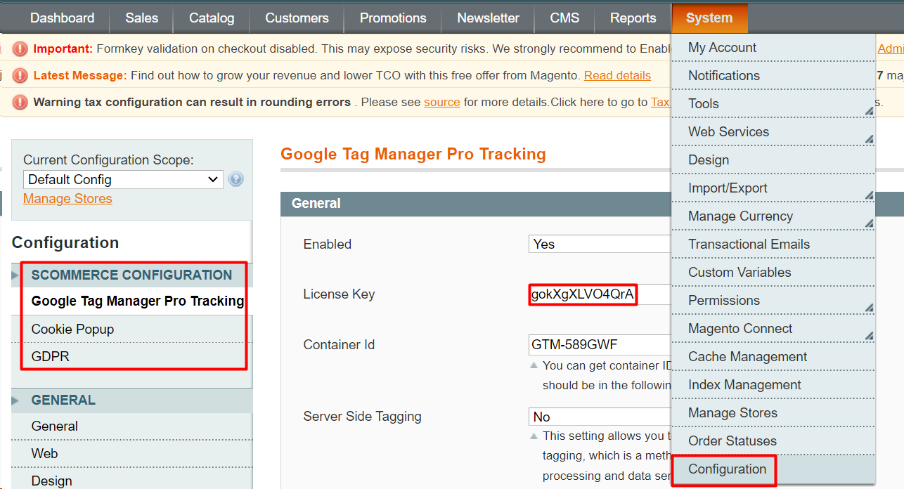

1. After that, go to **“Customers”** -> **“Cookie Choice”** and click on **“Add new”** to set up cookie choices in the Cookie Popup extension.

.png>)

*
  1. You can do the setup of a new cookie as shown in the below image or you can create your own cookie/s. Please note that **“Cookie Name”** and **“Set by default”** are the most important fields as they would be used in the cookie mapping as described in the later steps.

.png>)

*
  1. Once you have created a cookie or multiple cookies, your setup should resemble the below image-

.png>)

1. Now, go to **“System”**->**”Configuration”**->**“Google Tag Manager Pro Tracking”(GTM)**. Scroll down and you would see the field **“Enable Consent Mode”**, enable it in order to enable the consent mode.
2. _Optional step_- If you want to have consent mode only for specific countries then enable the field **“Enable GDPR country check”** and select the countries for which you want the consent mode. If a user enters your website and they belong to a country which is in the list of selected GDPR countries then upon entering they would see the cookie values based on the configuration set in the field **“Consent Mode Config”** and they would have an option to change those values . However, if a user enters your website and they don’t belong to a country which is in the list of selected GDPR countries then all the cookies would be automatically accepted and they won't be able to change that. Please disable this field and then all the users entering your website would see cookie values based on the configuration set in the field **“Consent Mode Config”** and they would have an option to change that.

.png>)

*
  1. In GTM, if you have enabled the field **“Enable GDPR country check”** and selected the countries then go to the module **“GDPR”** and enable the same field and select the same countries. If the mentioned field is disabled in “**GTM”** then it should be disabled in **“GDPR”** too. If a user enters your website and they belong to a country which is in the list of selected GDPR countries then upon entering they would see the **cookie banner** and the values of the cookies in that banner would be based on the configuration set in the field **“Consent Mode Config”**, and they would have an option to change those values . However, if a user enters your website and they don’t belong to a country which is in the list of selected GDPR countries then they will not see the **cookie banner**, all the cookies would be automatically accepted and they won't be able to change that. Please disable this field and then all the users entering your website would see the banner and cookie values based on the configuration set in the field **“Consent Mode Config”** and they would have an option to change that.

.png>)

1. In **“GTM”**, go to **“Consent Mode Config”**, add the **“Consent Param”** that are given in the description”(**personalization\_storage**, **functionality\_storage**, **security\_storage** are not mandatory for correct consent setup), set the **“Default value”** of the consent parameter as “**granted”** or “**denied”** based on the **“Set by default”** (step 2a) value of the cookie. Use the **“Cookie Name”** that you used while creating the cookies.
   1. For example- **analytics\_storage**, if you want to do mapping of this consent param with Analytics cookie then in the field **“Cookie name”** add **“analytics\_cookie”** because this cookie name was used when you were creating cookies (step 2a). While creating the cookie (in this case Analytics cookie), if the value of **“Set by default”** is set to **“No”** then while doing the mapping the **“Default value”** of the consent param (in this case analytics\_storage) that is associated with that cookie should set to **“denied”** or vice versa.

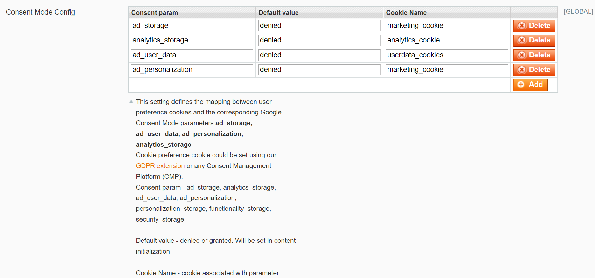

On Magento’s end consent mode setup is complete.

**In GTM**

1. Open the container that is connected with our GTM module, go to **“Admin”**->**“Container Settings”** and enable consent overview present in the additional settings.

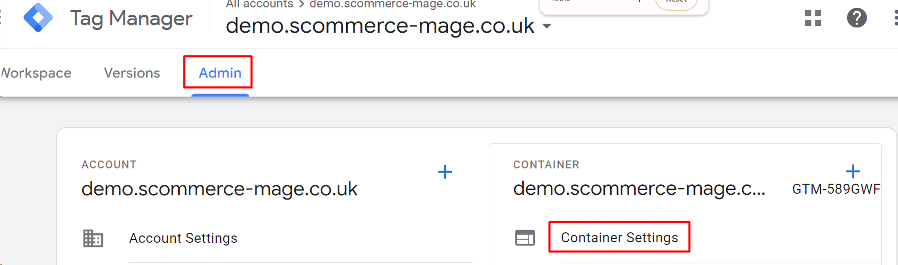

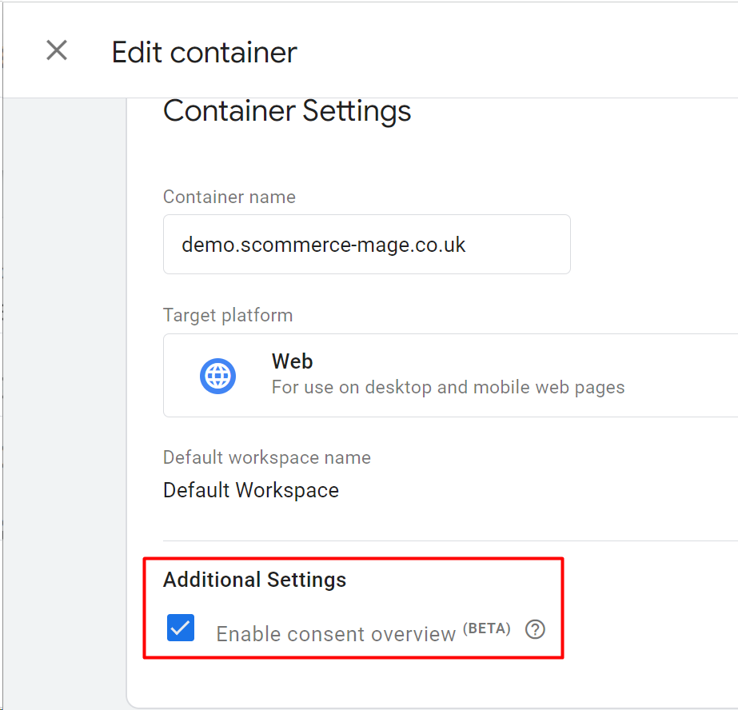

1. Go to **“Workspace”**->**”Tags”** -> click on **“Consent Overview”** (shield) and set up consent for each tag. Tags that already have **“Built-In Consent”**, make sure to select **“No additional consent required”** for those tags. These tags are generally Google related tags.

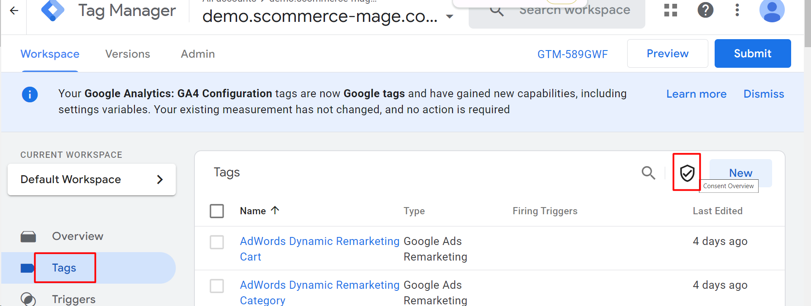

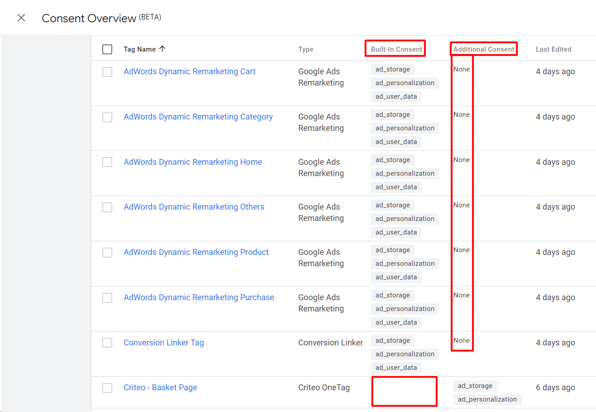

*
  1. In order to add **“Additional Consent”**, click on the tag name and go to **”Consent Settings”** and choose **“Require additional consent for tag to fire”** and add the consent param that you want as **“Additional Consent”**. If cookies related to the consent parameter that is chosen as an additional consent are not accepted then that tag would not fire.

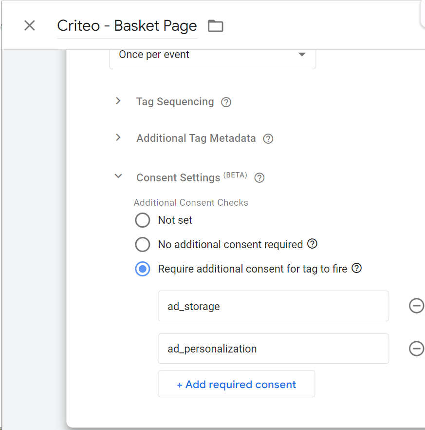

On GTM’s end consent mode setup is complete.

**Verification**

1. In order to verify whether the consent mode is working as per the configuration you have set or not, you can preview your changes and compare them with the frontend as shown in the below images. All the values should be the same.

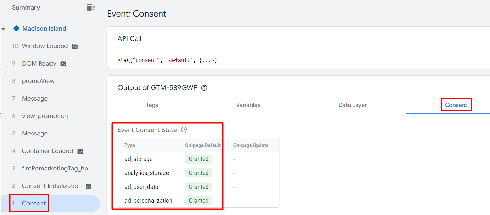

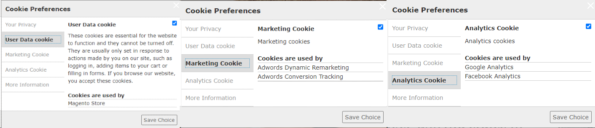

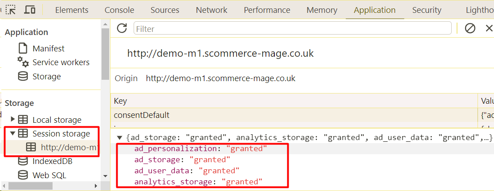

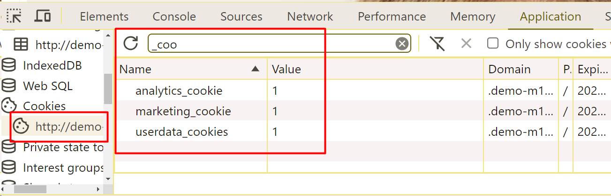
