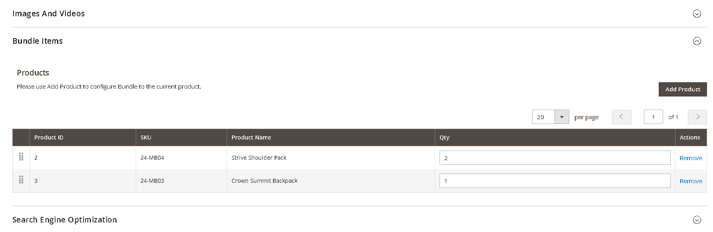

# Magento Google Tag Manager with Enhanced Ecommerce Tracking and Google Analytics 4(GA4)

### <mark style="color:blue;">Installation and User Guide for Magento 1 Google Tag Manager with Enhanced Ecommerce Tracking</mark>

**Table of Contents**

1. [Installation ](magento-google-tag-manager-with-enhanced-ecommerce-tracking-and-google-analytics-4-ga4.md#\_bookmark0)
   * Disable Compilation Mode&#x20;
   * Upload Package&#x20;
   * Clear Caches&#x20;
2. [Configuration Settings for Google Tag Manager Pro Tracking ](magento-google-tag-manager-with-enhanced-ecommerce-tracking-and-google-analytics-4-ga4.md#\_bookmark4)
   * General Settings&#x20;
   * Query String Parameter Cookies
3. [JSONs provided with extension package ](magento-google-tag-manager-with-enhanced-ecommerce-tracking-and-google-analytics-4-ga4.md#\_bookmark6)
   * Google Analytics 4
   * Facebook Pixel Tracking
   * Snapchat Pixel Tracking
   * Adwords Dynamic Remarketing
   * Google Ads Enhanced Conversion Tracking with Javascript variable
   * Google Ads Enhanced Conversion Tracking with Data layer
   * Microsoft UET Tracking (Bing Ads Tracking)
   * Tiktok Pixel Tracking
   * Twitter(X) Pixel Tracking
   * Reddit Pixel Tracking
4. [Importing JSONs into GTM](magento-google-tag-manager-with-enhanced-ecommerce-tracking-and-google-analytics-4-ga4.md#\_bookmark10)&#x20;
5. [Setting variable information in GTM](magento-google-tag-manager-with-enhanced-ecommerce-tracking-and-google-analytics-4-ga4.md#\_bookmark11)&#x20;
6. [Publishing Tags in GTM](magento-google-tag-manager-with-enhanced-ecommerce-tracking-and-google-analytics-4-ga4.md#\_bookmark12)&#x20;
7. [Set up Google Analytics 4](magento-google-tag-manager-with-enhanced-ecommerce-tracking-and-google-analytics-4-ga4.md#\_bookmark14)
8. [AJAX Add to Basket or Remove from Basket ](magento-google-tag-manager-with-enhanced-ecommerce-tracking-and-google-analytics-4-ga4.md#\_bookmark14)
   * AJAX Add to Basket&#x20;
   * AJAX Remove from Basket&#x20;
   * Back-end/Admin Tracking&#x20;
9. [_Set Primary Categories_](magento-google-tag-manager-with-enhanced-ecommerce-tracking-and-google-analytics-4-ga4.md#set-primary-categories)
10. [_Upgrading the Module From 0.0.35 and Below_](magento-google-tag-manager-with-enhanced-ecommerce-tracking-and-google-analytics-4-ga4.md#\_bookmark16)
11. [Query String Parameter Cookies](magento-google-tag-manager-with-enhanced-ecommerce-tracking-and-google-analytics-4-ga4.md#query-string-parameter-cookies)

### <mark style="color:blue;">Installation</mark> <a href="#bookmark0" id="bookmark0"></a>

* <mark style="color:orange;">**Disable Compilation Mode:**</mark> To check that this is disabled, go to **System>Tools > Compilation**. If the compiler status is ‘Disabled’, you are ready to go. If not, simply click the ‘Disable’ button on the right hand side of the screen.
* <mark style="color:orange;">**Upload Package:**</mark> Upload the content of the module to your root folder. This will not overwrite the existing Magento folder or files, only the new contents will be added.
* <mark style="color:orange;">**Clear Caches:**</mark> This can be done from the admin console by navigating to the cache management page (**System > Cache Management**), selecting all caches, clicking ‘refresh’ from the drop-down menu, and submitting the change.

### <mark style="color:blue;">Configuration Settings for Google Tag Manager Pro Tracking</mark> <a href="#bookmark4" id="bookmark4"></a>

Go to **Admin > Stores > Configuration > Scommerce Configuration > Google Tag Manager Pro Tracking**

#### <mark style="color:orange;">General Settings</mark> <a href="#bookmark5" id="bookmark5"></a>

* **Enabled –** Select “Yes” or “No” to enable or disable the module.
* **License Key –** Please add the license for the extension which is provided in the order confirmation email. Please note license keys are site URL specific. If you require license keys for dev/staging sites then please email us at [support@scommerce-mage.com](mailto:support@scommerce-mage.com).
* **Container Id –** Enter your Google Tag Manager Container Id.
* **Server Side Tagging** - This setting allows you to enable or disable server-side tagging, which is a method that shifts part of the tag processing and data sending workload from the user's device to a server that you control. \
  **Please don’t turn this on unless you understand what this setting does.**
* **GTM code HTML** - This setting allows you to enter the HTML code of server-side GTM container. This HTML code will replace the default GTM code on the frontend of your website.
* **GTM noscript HTML** - This setting allows you to enter noscript part of server-side GTM code. This noscript code will replace the default noscript GTM on the frontend of your website.
* **Enhanced Conversion –** Set “yes” to enable the enhanced conversion and send PII data with the tag. Please make sure enhanced conversion is enabled in Google Ads before using this setting.
* **Brand Attribute –** Select brand attribute to send brand information to Google Analytics.
* **Brand text box –** If you don’t have brand attribute and you want to send default brand name to Google Analytics then you can enter here.
* **Base –** Set “Yes” if you want to send base order data and ‘No’ to send store order data to Google. Set this to “Yes” always unless you have multi- store/currency is enabled and you want to send different currency data to Google.
* **Revenue without Shipping Price –** Set “yes” to send revenue data without the shipping amount.
* **Send Phone or Admin Orders –** Enable this feature only if you want to send admin orders on order creation.
* **Send Refund on Order Cancellation –** Enable this feature to send refund event when an order is cancelled from admin.
* **Source –** Add source you want to pass to Google for admin orders.
* **Medium –** Add medium you want to pass to Google for admin orders**.**
* **Enable dynamic remarketing tags and facebook tracking –** Set yes to enable dynamic remarketing tags and facebook tracking.
* **Product ID Attribute –** Select attribute for Product ID, this should be same attribute as you have in your Google Base Feed.
* **Enable GDPR cookie check –** If you are using our GDPR Extension or any other GDPR Extension and you want to block sending information to Google then set this to “yes” based on customer preference. Please note this is optional as far as you are not sending any PII to Google this setting needs to be turned off.
* **Force decline –** If you set this to yes then GTM tracking will be turned off unless customer accepts the cookie policy from the cookie notification message from your website.
* **GDPR Cookie Key –** You can add name of your GDPR cookie here for our [GDPR extension](https://www.scommerce-mage.com/magento2-gdpr-compliance.html) the name of cookie key is **cookie\_accepted** but if you are using other GDPR extension then please check with extension developer
* **Order Total Include VAT –** If set to “Yes” then VAT will be included in order total.
* **Order Item Include VAT –** If set to “Yes” then VAT will be included in order item.
* **Affiliation –** Enter the affiliation to be sent with GA4 events.
* **Enable Consent Mode -** This setting activates [Google Consent Mode v2](https://developers.google.com/tag-platform/security/guides/consent). It lets us control how Google tags use user consent and protect user data
* **Enable GDPR country check** - This setting enables you to specify a list of countries whose users will be able to choose which consent parameters to be sent to Google as 'granted' or 'denied'
* **Select GDPR countries** - This setting allows you to select a list of EEA and UK countries whose users will be able to choose which consent parameters to be sent to Google as ‘granted' or 'denied'. Users from countries not included on the list will always send consent parameters as 'granted’ to Google.
* **Consent Mode Config** - This setting defines the mapping between user preference cookies and the corresponding Google Consent Mode parameters **ad\_storage, ad\_user\_data, ad\_personalization, analytics\_storage**

Cookie preference cookie could be set using our [GDPR extension](https://www.scommerce-mage.com/magento1-gdpr-compliance.html) or any Consent Management Platform (CMP).\
**Consent param** - **ad\_storage, analytics\_storage, ad\_user\_data, ad\_personalization, personalization\_storage, functionality\_storage, security\_storage**\
\
**Default value** - **denied** or **granted**. Will be set in content initialization\
\
**Cookie Name** - **cookie** associated with parameter

<div data-full-width="true">

<figure><figcaption></figcaption></figure>

</div>

<div data-full-width="true">

<figure><figcaption></figcaption></figure>

</div>

<div data-full-width="true">

<figure><figcaption></figcaption></figure>

</div>

<div data-full-width="true">

<figure><figcaption></figcaption></figure>

</div>

<div data-full-width="true">

<figure><figcaption></figcaption></figure>

</div>

#### <mark style="color:orange;">Query String Parameter Cookies</mark> <a href="#bookmark5" id="bookmark5"></a>

* **Query String Parameters –** Enter the cookie parameter names comma separated, once the if the parameter is passed with the URL then that cookie will be generated. for eg:- [https://demo.scommerce-mage.co.uk/?msclkid=abc123](https://demo.scommerce-mage.co.uk/?msclkid=abc123) ,cookie named msclkid is created and stored in the browser.
* **Cookie Lifetime (Days) –** Enter the lifetime of the cookie in days. It will be stored in the users browser as per the time defined in this setting

<figure><figcaption></figcaption></figure>

### <mark style="color:blue;">JSONs provided with extension package</mark> <a href="#bookmark6" id="bookmark6"></a>

The extension package contains JSONs which can be imported in GTM to set up required Tags, Triggers and Variables. The JSONs can be used to set up

* Google Analytics 4
* Facebook Pixel Tracking
* Snapchat Pixel Tracking
* Adwords Dynamic Remarketing
* Google Ads Enhanced Conversion Tracking with Javascript variable
* Google Ads Enhanced Conversion Tracking with Data layer
* Microsoft UET Tracking (Bing Ads Tracking)
* Tiktok Pixel Tracking
* Twitter(X) Pixel Tracking
* Reddit Pixel Tracking

### <mark style="color:blue;">Importing JSONs into GTM</mark> <a href="#bookmark10" id="bookmark10"></a>

To import JSONS provided with extension package follow below steps:

* Log into GTM and navigate to your Account and container
* In the top navigation, click through the Admin

>)

* Under the container options, click on Import Container

>)

* Choose the JSON file which you would like to import

<div data-full-width="true">


</div>

* Choose to either Overwrite or Merge
  * Overwriting the existing container will remove all your existing tags, triggers, and variables, and will replace them with those in the imported container. A new container version will be created before the import.
  * Merging containers will let you keep your existing tags, triggers, and variables, and just add in the new ones. If you choose to Merge the new container with your existing container, you’ll have to then decide whether you want to overwrite conflicting tags or rename conflicting tags.
* **Overwrite –** If a variable, tag, or trigger in the new container has the same name but the contents are different, overwrite the old one with the new one.
* **Rename –** If a variable, tag, or trigger in the new container has the same name but the contents are different, keep the old one and rename the new one.
* **Click Continue**. You’ll see a preview of changes, showing how many tags, triggers, and variables will be added, modified, or deleted. You can also click the link to View Detailed Changes to see which tags, triggers, and variables are being added, modified, or deleted.

<div data-full-width="true">


</div>

* Once you’re satisfied with the changes, click _Confirm_.

### <mark style="color:blue;">Setting variable information in GTM</mark> <a href="#bookmark11" id="bookmark11"></a>

Once the GTM container file has been imported, you need to change variable information with correct value corresponding to the site. To access variables, go to workspace where you have imported the JSONs and click on variables on left hand side navigation.

<div data-full-width="true">


</div>

#### <mark style="color:orange;">Variables Created with JSON’s</mark>

* **GA4 MEasurement ID –** This variable is created when GTM-Google Analytics 4.json is imported and it holds value for Google Analytics 4 Measurement Id for the site. Click on the GA4 Measurement ID and change it to correct value.

<div data-full-width="true">

<figure><figcaption></figcaption></figure>

</div>

* <mark style="color:orange;">**conversionID -**</mark> This variable is created when GTM- AdwordsDynamicRemarketing.json is imported and it holds value for Google Adwords Conversion Id for the site. Click on the conversionID and change it to correct value.

<div data-full-width="true">


</div>

* <mark style="color:orange;">**facebookPixelID -**</mark> This variable is created when GTM-Facebook.json is imported and it holds value for Facebook pixel Id for the site. Click on the facebookPixelID and change it to correct value.

>)

* <mark style="color:orange;">**currencyCode -**</mark> This variable is created when GTM-Facebook.json is imported and it holds value for currency used on site. Click on the currencyCode and change it to correct value.

>)

<mark style="color:orange;">**Google Ads Conversion Tracking -**</mark> Add Conversion ID and Conversion Label in the Google Ads Conversion Tracking tag before publishing the container. These IDs can be found in your Google Ads account.&#x20;

<figure><figcaption></figcaption></figure>

<mark style="color:orange;">**Microsoft UET Tracking -**</mark> Add the Microsoft Advertising UET Tag ID which can be obtained from microsoft Ads account. &#x20;

<figure><figcaption></figcaption></figure>

<mark style="color:orange;">**Facebook Pixel Tracking**</mark>** -** Add the Microsoft Advertising UET Tag ID which can be obtained from microsoft Ads account.

<div data-full-width="true">

<figure><figcaption></figcaption></figure>

</div>

<mark style="color:orange;">**Snapchat Pixel Tracking**</mark>** -** Add the Snapchat Pixel ID which can be obtained from snapchat Ads account as shown below.

<div data-full-width="true">

<figure><figcaption></figcaption></figure>

</div>

<mark style="color:orange;">**Tiktok Pixel Tracking**</mark>** -** Add the Tiktok Pixel ID which can be obtained from Tiktok Ads account as shown below. Once your pixel is created, copy the unique pixel ID code.

<div data-full-width="true">

<figure><figcaption></figcaption></figure>

</div>

<mark style="color:orange;">**Twitter(X) Pixel Tracking**</mark>** -** Add the Twitter Pixel ID which can be obtained from Twitter Ads account as shown below.

<figure><figcaption></figcaption></figure>

<mark style="color:orange;">**Reddit Pixel Tracking**</mark>** -** Add the Reddit Pixel ID which can be obtained from Reddit Ads account as shown below.

<figure><figcaption></figcaption></figure>

### <mark style="color:blue;">Publishing Tags in GTM</mark> <a href="#bookmark12" id="bookmark12"></a>

Once all set up is done and verified, need to Publish the tags to make it live on the website.

**Step 1** − Click the SUBMIT button at the top right corner of the screen. It will show the following screen.

>)

**Step 2** − Enter an identifiable Version name so that it can be easily understood for the changes made.

With the version description, you can be as elaborate as possible on the changes/additions of the tag in that version.

**Step 3** − Scroll down to the Workspace Changes, you will see all the changes made in the tags, which are unpublished or in the PREVIEW mode.

**Step 4** − Click PUBLISH and you will be presented with a summary for this version.

### <mark style="color:blue;">Set up Google Analytics 4</mark> <a href="#bookmark14" id="bookmark14"></a>

* Go to Analytics and select the website on which you want to implement GA4 alongside universal analytics.
* Once you are in universal analytics panel go into admin settings. Here you will notice an UPGRADE TO GA4 button, click on it. You will be walked with creating a new property. Follow along, once you are finished you will see the new GA4 view on your screen.


* Now we need to setup the tag manager for GA4. If you have already imported all the tags using our JSON file then you only need to edit the tag and add your Measurement ID. However, if you are creating tags yourself then you need to create a new configuration tag.


* To create a new configuration tag in GTM. Please look at the image below: -


* To get the measurement id you need to go to your GA4 view. Go to the admin settings and then data streams. Click on the website url coloured in blue and a popup should open.

<div data-full-width="true">


</div>

* You will see the Measurement ID listed on the top right corner of this page.

<div data-full-width="true">


</div>

* Now for the final step import our Google Analytics 4 JSON file in your GTM to get all the configurations for GA4. Once done you will see data flowing into Google Analytics 4. Learn more about [Google Analytics 4](https://www.scommerce-mage.com/blog/integrate-magento-2-with-google-analytics-4ga4.html).

### <mark style="color:blue;">AJAX Add to Basket or Remove from Basket</mark> <a href="#bookmark14" id="bookmark14"></a>

Add the following two functions in your ajax add to basket js file and call **gaAddToCart** on success of Ajax add to basket and **gaRemoveFromCart** on success of Ajax remove from basket function.

#### <mark style="color:orange;">AJAX Add to Basket</mark> <a href="#bookmark15" id="bookmark15"></a>

```javascript
function gaAddToCart() {
	jQuery.cookie.json = true;
	var productToBasket = jQuery.cookie("productToBasket");
	var productlist = jQuery.cookie("productlist");
	if (productToBasket != undefined) {
		manipulationOfCart(productToBasket, 'add', productlist);
		jQuery.removeCookie("productToBasket", {
			path: '/',
			domain: '.' + document.domain
		});
	}
}
```

#### <mark style="color:orange;">AJAX Remove from Basket</mark> <a href="#bookmark16" id="bookmark16"></a>

```javascript
function gaRemoveFromCart() {
	jQuery.cookie.json = true;
	var productOutBasket = jQuery.cookie("productOutBasket");
	if (productOutBasket != undefined) {
		manipulationOfCart(productOutBasket, 'remove', '');
		jQuery.removeCookie("productOutBasket", {
			path: '/',
			domain: '.' + document.domain
		});
	}
}
```

* <mark style="color:orange;">**Back-end/Admin Tracking -**</mark> When you enable the **"**Send Phone or Admin Orders **"** from **Admin > Stores > Configuration > Scommerce Configuration > Google Tag Manager Pro Tracking,** then it tracks admin orders. To see admin order go to **GA > Conversion > Ecommerce > Sales Performance.**

>)

### <mark style="color:blue;">Set Primary Categories</mark>

You can use a script provided with the extension to automatically add primary categories for products. Admin can exclude certain categories from primary category and also prioritise one category over the other to be picked as the primary category.

Go to Admin>Catalog>Categories select a category then scroll down to find the option "Primary Category Settings". Here click on "Exclude From Primary Category" to exclude this category from primary category or enter the priority 0 being the highes. The highest priority category will be picked first for the primary category.

.png>)

To automatically assingn primary category for all products run the command given below by going into the root directory of your store.

```
scommerce:seo-base:set-primary-category
```

_<mark style="color:red;">**N.B -**</mark>_ _<mark style="color:red;">If you are using older version then run the script provided in the extension folder at the path Data/SetPrimaryCategoryM2.php from ssh</mark>_

### <mark style="color:blue;">Upgrading the Module From 0.0.35 and Below</mark> <a href="#bookmark16" id="bookmark16"></a>

If you are using an older version of the extension(0.0.35 and below) where a common data layer is used to populate data to both UA and GA4 then upon updating to the latest version you need to make the following changes in GTM.

#### Remove these Tags, Triggers and Variables from GTM container <a href="#remove-these-tags-triggers-and-variables-from-gtm-container" id="remove-these-tags-triggers-and-variables-from-gtm-container"></a>

#### TAGS <a href="#tags" id="tags"></a>

* Google Analytics 4
* GA4 Views/impressions of product/item details
* GA4 View Item List Scroll
* GA4 View Item List
* GA4 Shipping info
* GA4 Remove a product from a shopping cart
* GA4 Refunds
* GA4 Purchases
* GA4 Promotion views/impressions
* GA4 Promotion clicks
* GA4 Product/Item List Clicks
* GA4 Payment info
* GA4 Begin Checkout
* GA4 Add a product to a shopping cart

#### Variables <a href="#variables" id="variables"></a>

* Ecommerce-detail-products
* Ecommerce-product-detail-value
* Ecommerce-checkout-products
* Ecommerce-checkout-option
* Ecommerce-remove-products
* Ecommerce-refund-products
* Purchase-affiliation
* Purchase-tax
* Purchase-shipping
* ecommerce-promoView-promotions
* ecommerce-promoClick-promotions
* Ecommerce-click-products
* ecommerce-product-click-list-name

#### Triggers <a href="#triggers" id="triggers"></a>

* View\_item
* View\_item\_list
* Shipping Info
* removeFromCart
* Refund
* Purchase
* View\_promotion
* promotionClick
* productClick
* Payment\_info
* addToCart

Now follow the steps below to import the latest GA4 settings for GTM

**Step 1:-** Acquire the latest GA4 JSON file provided with the module.

**Step 2:-** Go to your GTM container then click on admin>Import Container.

<figure><figcaption></figcaption></figure>

**Step 3:-** Click on Choose container file and choose the JSON file acquired in step 1 then select the workspace new/existing. Also select Merge>Rename conflicting tags, triggers, and variables so that no crucial setting is lost.

<figure><figcaption></figcaption></figure>

**Step 4:-** Lastly, click confirm to finish the import. Once it's done you will have the latest tags, triggers and variables for GA4 in your GTM.

### <mark style="color:blue;">Set up Consent Mode V2 with GTM</mark> <a href="#bookmark13" id="bookmark13"></a>

Please follow the below guide to set up consent mode v2 with GTM, also you would need to have both GTM and GDPR modules to complete this setup.

**GDPR:-** [https://www.scommerce-mage.com/magento1-gdpr-compliance.html](https://www.scommerce-mage.com/magento1-gdpr-compliance.html)


[magento-1-consent-modes-setup-guide.md](magento-1-consent-modes-setup-guide.md)


### <mark style="color:blue;">Query String Parameter Cookies</mark>

Cookies from query Params configuration can be used to create new cookie parameters which can be stored in the users browser as per the valid time configured. for eg:- We have created a "msclkid"cookie in the configuration. Now if the cookie parameter is passwed with the URL then that cookie will be created in the browser.

[https://demo.scommerce-mage.co.uk/?msclkid=abc123](https://demo.scommerce-mage.co.uk/?msclkid=abc123) :- In this url we passed the cookie parameter "msclkid" with the value "abc123". We can see this cookie being created in the below image:-

<div data-full-width="true">

<figure><figcaption></figcaption></figure>

</div>

If you have a question related to this extension please check out our [**FAQ Section**](https://www.scommerce-mage.com/magento-next-order-discount.html#faq) first. If you can't find the answer you are looking for then please contact [**support@scommerce-mage.com**](mailto:core@scommerce-mage.com)**.**
