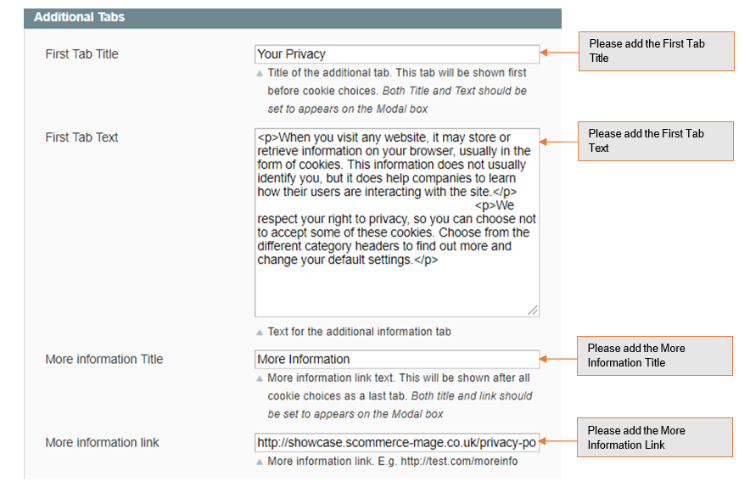

# Magento 1 GDPR Compliance: Anonymisation of order data

### <mark style="color:blue;">Installation and User Guide for Magento 1 GDPR Compliance: Anonymisation of order data</mark>

**Table of Contents**

1. [_Installation_ ](magento-1-gdpr-compliance-anonymisation-of-order-data.md#\_bookmark0)
   * _Disable Compilation Mode_&#x20;
   * _Upload Package_&#x20;
   * _Clear Caches_&#x20;
2. [_Configuration Settings for GDPR Compliance_ ](magento-1-gdpr-compliance-anonymisation-of-order-data.md#\_bookmark4)
   * _General Settings_&#x20;
   * _Cookie Notification Message_&#x20;
   * _Cookie Notification Message_&#x20;
   * _Privacy Settings_&#x20;
3. [_Configuration Settings for Cookie Popup_ ](magento-1-gdpr-compliance-anonymisation-of-order-data.md#\_bookmark4)
   * _General Settings_&#x20;
   * _Popup Styling_&#x20;
   * _Additional Tabs_&#x20;
4. [_Admin Configuration for Cookie Choice_ ](magento-1-gdpr-compliance-anonymisation-of-order-data.md#\_bookmark13)
   * _Manage Cookie Choice List_&#x20;
     * _ID_&#x20;
     * _Choice Name_&#x20;
     * _Cookie Name_&#x20;
     * _Store view_&#x20;
     * _Required_&#x20;
     * _Default State_&#x20;
   * _Cookie Choice_&#x20;
   * _Add new Cookie Choice_&#x20;
   * _Choice Name_&#x20;
   * _Cookie Name_
   * _Store view_&#x20;
   * _Choice Description_&#x20;
   * _Created by List_&#x20;
   * _Required Record_&#x20;
   * _Set by Default_&#x20;
5. [_Customers Detail in Privacy Policy Consents_ ](magento-1-gdpr-compliance-anonymisation-of-order-data.md#\_bookmark30)
6. [_Anonymize Orders from Admin Section_ ](magento-1-gdpr-compliance-anonymisation-of-order-data.md#\_bookmark31)
7. [_Newsletter Subscription_ ](magento-1-gdpr-compliance-anonymisation-of-order-data.md#\_bookmark32)
8. [_Enable / Disable Tracking_ ](magento-1-gdpr-compliance-anonymisation-of-order-data.md#\_bookmark33)
9. [_Integrate Cookies with GTM Pro Tracking_ ](magento-1-gdpr-compliance-anonymisation-of-order-data.md#integrate-cookies-with-gtm-pro-tracking)
10. [_Front-end site view_ ](magento-1-gdpr-compliance-anonymisation-of-order-data.md#\_bookmark35)
    * _Cookie Popup – Cookie Accept_&#x20;
    * _Cookie Preferences_&#x20;
    * _Cookie Preferences for store view_
    * _Strictly Necessary Cookies_&#x20;
    * _Performance Cookies_&#x20;
    * _Statistics Cookies_&#x20;
    * _Marketing Cookies_&#x20;
    * _Check the Value of the Accepted Cookies on the Front-end_&#x20;
    * _Visibility of “Accept all” Button on the Cookie Popup_&#x20;
    * _Newsletter Subscription_&#x20;
    * _Privacy Policy Checkbox on Registration and Checkout Page_&#x20;
    * _Delete Account from my Account Section_&#x20;

### <mark style="color:blue;">Installation</mark> <a href="#bookmark0" id="bookmark0"></a>

* <mark style="color:orange;">**Disable Compilation Mode:**</mark> To check that this is disabled, go to **System>Tools > Compilation**. If the compiler status is ‘Disabled’, you are ready to go. If not, simply click the ‘Disable’ button on the right hand side of the screen.
* <mark style="color:orange;">**Upload Package:**</mark> Upload the content of the module to your root folder. This will not overwrite the existing Magento folder or files, only the new contents will be added.
* <mark style="color:orange;">**Clear Caches:**</mark> This can be done from the admin console by navigating to the cache management page (**System > Cache Management**), selecting all caches, clicking ‘refresh’ from the drop-down menu, and submitting the change.

### <mark style="color:blue;">Configuration Settings for GDPR Compliance</mark> <a href="#bookmark4" id="bookmark4"></a>

Go to **Admin > Stores > Configuration > Scommerce Configuration > GDPR**

#### <mark style="color:orange;">General Settings</mark> <a href="#bookmark5" id="bookmark5"></a>

* **Enabled –** Select “Yes” or “No” to enable or disable the module.
* **License Key –** Please add the license for the extension which is provided in the order confirmation email. Please note license keys are site URL specific. If you require license keys for dev/staging sites then please email us at [core@scommerce-mage.com](mailto:core@scommerce-mage.com)
* **Enable GDPR country check** - This setting enables you to specify a list of countries whose users will be able to choose which consent parameters to be sent to Google as 'granted' or 'denied'
* **Select GDPR countries** - This setting allows you to select a list of EEA and UK countries whose users will be able to choose which consent parameters to be sent to Google as ‘granted' or 'denied'. Users from countries not included on the list will always send consent parameters as 'granted’ to Google.

<figure><figcaption></figcaption></figure>

#### <mark style="color:orange;">Cookie Notification Message</mark> <a href="#bookmark6" id="bookmark6"></a>

* **Enable Cookie Message –** If set to “yes” then cookie message will be shown to customers on the frontend.
* **Block access to site until cookie policy is accepted –** If set to “yes” then customer access to site will be blocked until cookie policy is accepted. If set to “no” then just normal cookie message block will be shown until cookie policy is accepted, but the access to the site will be allowed.
* **Cookie text message –** This message will show in cookie policy area on the top of the website.
* **Cookie notification message position –** Choose position of the cookie notification message to either at the top or bottom of the page.
* **Information page –** Static page with detailed information about cookie settings.
* **Override Information page –** Use this internal or external link for learn about cookie settings. This will override information page setting, please leave this blank if you don’t want to override.
* **Cookie link text –** Text to link to information page
* **Cookie text color –** Text color for cookie message
* **Cookie link color –** Text Color for links on cookie message
* **Cookie Background Color –** Background color for cookie message


#### <mark style="color:orange;">Cookie Notification Message</mark> <a href="#bookmark7" id="bookmark7"></a>

* **Email Sender –** This email address gets used to send link to customers to delete their account as well as send deletion confirmation email to customers.
* **Enable Sending email communication to customers –** If set to Yes then customers will receive email related to their account deletion.
* **Confirmation Email Template –** Email template to send email link to customers to delete their account.
* **Delete Confirmation Email Template –** Email Template to send email deletion confirmation to customers after successfully deleting their account
* **Enable sending customer data via email before deleting customer data–** If set to “yes” then customer data will be sending to be specified email address just before deleting specific customer record.


#### <mark style="color:orange;">Privacy Settings</mark> <a href="#bookmark8" id="bookmark8"></a>

* **Enable Privacy Setting –** This will enable privacy agreement checkbox on pages where you collection personal information.
* **Privacy Setting Text –** This text will appear next to privacy agreement checkbox.
* **Enable Newsletter –** If set to Yes then privacy agreement checkbox will appear for customers to confirm before submitting newsletter subscription
* **Enable Contact Us –** If set to Yes then privacy agreement checkbox will appear for customers to confirm before submitting contact us form.
* **Enable Checkout –** If set to Yes then privacy agreement checkbox will appear for customers to confirm before submitting billing form
* **Enable Registration –** If set to Yes then privacy agreement checkbox will appear for customers to confirm before submitting registration form.


### <mark style="color:blue;">Configuration Settings for Cookie Popup</mark> <a href="#bookmark9" id="bookmark9"></a>

Go to **Admin > Stores > Configuration > Scommerce Configuration > Cookie Popup**

#### <mark style="color:orange;">General Settings</mark> <a href="#bookmark10" id="bookmark10"></a>

* **Enabled -** Select “Yes” or **“**No**”** to enable or disable the module.
* **Modal Title -** Enter name of the modal title, this will be shown on the frontend cookie popup modal. We’ve set modal title as “Cookie preferences”.
* **Save Choice Button Text -** Enter the title of the save choice button. Click on this button will save the cookies choice. Whatever the current cookie choice is there it will save that choice.
* **Allow All Button Text -** Enter title of the allow all button**.** We've set title as "Allow All". When you click on "ALLOW All" then cookies will allow the provision of enhance functionality, it will keep track of how many people have visited website, and how they interact with the site. All the information used is aggregated and completely anonymous. If you do not allow cookies, then functionalities may not function properly.
* **Decline All Button Text -** Enter title of the decline all button**.** We've set title as "Decline All". When you click on "Decline All" then none of the cookies will be accepted and the funtionality attached to them will not work for customers such as tracking information.
* **Accept Button Text -** Enter button title for accepting cookies on the cookie message, it will accept all cookies.
* **Decline Button Text -** Enter button title for declining cookies on the cookie message, it will decline all cookies.
* **Cookies List Header -** Title of the block for the "Used by" list. Cookies name will be shown under this cookies list header. You can see "Used by" list on the frontend Cookie popup.
* **Cookie Settings Link Text -** This link will be shown on the frontend cookies message to show Cookie Popup Settings. Click on this link will open Cookie popup.
* **Use Data Layers -** Select "Yes/No". If set to "Yes" then Data Layers will be used, instead of cookies for GTM. If set to "No", then it won't add Data Layers.
* **Show if not all accepted -** Select “Yes/No”. If set to “Yes” then Cookie notice message will appear if not all cookie accepted.

<figure><figcaption></figcaption></figure>

#### <mark style="color:orange;">Popup Styling</mark> <a href="#bookmark11" id="bookmark11"></a>

* **Modal Border -** Select "Yes", if you want to set modal border. If "Yes" then you can set border color for the settings Modal box.
* **Popup Border Color -** Enter popup border color. We've set the popup border color white, which you can see in the screenshot.
* **Header Background Color -** Enter header background color. Background color of the Modal box title.
* **Header Font Color -** Enter header font color.
* **Header Bottom Border -** Select "Yes", if you want to set the bottom border. If "Yes" then bottom border of the Modal box header will be shown.
* **Header Bottom Border Color -** Enter header bottom color. We’ve set the red header bottom border.
* **Footer Background Color -** Enter footer background color.
* **Footer Font Color -** Enter footer font color.
* **Footer Top Border -** Select "Yes", if you want to set footer top border. If “Yes” then top border of the footer of the Modal Box will be shown.
* **Footer Top Border Color -** Enter footer top border color.
* **Header Logo -** Choose logo for the modal header. It will be shown in the left top corner in header.
* **Close Image -** Upload close image.
* **Active Tab Background Color -** It will highlight the selected choice text.
* **Number Tabs -** Select "Yes", if you want number tabs on cookie modal.
* **Tab Active Color -** Enter active tab color.
* **Tab Header Color -** Enter tab header color.
* **Custom Button Style -** Select "Yes", if you want to style button.
* **Custom Checkbox -** Select "Yes", if you want to show cookie choice button.
* **Font Family -** Enter base font family for the Modal Box. Should be string e.g. Arial. Font should be available on the site.
* **Notice Height -** Set min height of the Cookie Message. E.g. 80
* **Accept Button Background Color -** Enter Background color of the "Accept" button on the Cookie Message.
* **Accept Button Text Color -** Enter text color of the "Accept" button on the Cookie Message
* **Decline Button Background Color -** Enter Background color of the "Decline" button on the Cookie Message.
* **Decline Button Text Color -** Enter text color of the "Decline" button on the Cookie Message
* **Required cookie option text -** Set to "Always Active", this text will replace checkbox for mandatory cookies
* **Custom CSS -** Provide CSS code for custom style.

<figure><figcaption></figcaption></figure>

<figure><figcaption></figcaption></figure>

#### <mark style="color:orange;">Additional Tabs</mark> <a href="#bookmark12" id="bookmark12"></a>

* **First Tab Title -** Provide title of the first tab you want to display on the frontend cookie pop up. This tab will be shown first before cookie choices. Both Title and Text should be set to appears on the Modal box
* **First Tab Text -** Enter first tab text. The text will be shown on the Modal box on click of first tab. We've set first tab as "Your Privacy ".
* **More Information Title -** Provide more information title. This will be shown after all cookie choices as a last tab. Both title and link should be set to appears on the Modal box
* **More Information link -** Provide link where you want to redirect it. Click on this link will redirect you to Information page.



### <mark style="color:blue;">Admin Configuration for Cookie Choice</mark> <a href="#bookmark13" id="bookmark13"></a>

* <mark style="color:orange;">**Manage Cookie Choice List –**</mark> To create and manage cookie choices, go to **Admin > Customers > Cookie Choice.** If you need to make some modifications in the cookie choices information, you should click “Edit” in the Action column. The grid includes the following columns: -
  * ID
  * Choice Name
  * Cookie Name
  * Store view
  * Required
  * Default State

**Cookie Choice**

<figure><figcaption></figcaption></figure>

Cookie choices can be filtered based on the store view.

<figure><figcaption></figcaption></figure>

* <mark style="color:orange;">**Add new Cookie Choice –**</mark> To create a new cookie choice, click on the “Add New Cookie Choice” button from Admin > Customers > Cookie Choice > Add new Cookie Choice, it redirects on “New Cookie” page, by providing all the below configuration details you can create the cookie choice.
  * **Choice Name –** Enter the choice name. This is the text which represents the type of the cookie you are using under it.
  * **Cookie Name –** Define the cookie name. Cookie name will be used to enable/disable your relevant trackings. To explore more about cookies, please check the [**Privacy and Cookie Policy** ](http://showcase.scommerce-mage.co.uk/privacy-policy-cookie-restriction-mode/)section.
  * **Store view –** Select store view.
  * **Choice Description –** Add the choice description. This description will appear on the cookie popup when user clicks on the cookie choice name.
  * **Created by List –** Add the created by details. This is just an information which will appear on the cookie pop up under “Cookies are used by section”.
  * **Required Record –** Select “Yes” to make cookie essential, else select “No”. If set to “Yes” then the cookie choice will always be selected and you can’t turn “Off” it.
  * **Set by Default –** Select default status “Yes” or “No”. If set to “Yes” then by default the cookie choice will be selected.

<figure><figcaption></figcaption></figure>

### <mark style="color:blue;">Customers Detail in Privacy Policy Consents</mark> <a href="#bookmark30" id="bookmark30"></a>

When customer check the privacy policy agreement checkbox in the process of registration then it saves the details of the customers in backend privacy policy consents at **Admin > Customers > Privacy Policy Consents**

>)

### <mark style="color:blue;">Anonymize Orders from Admin Section</mark> <a href="#bookmark31" id="bookmark31"></a>

When you select action “Anonymise Orders” from **Admin > Sales > Orders > Actions> Anonymisation Order > Click on Submit Button**, then it anonymise customers data, which can’t be reversed. Before “Submit” it asks for confirmation and displays a message popup says “Are you sure you want to anonymise selected transaction data because of this action can’t be reversed?”

>)

### <mark style="color:blue;">Newsletter Subscription</mark> <a href="#bookmark32" id="bookmark32"></a>

To see newsletter subscription records go to **Admin > Marketing > Newsletter Subscription**

**Newsletter Subscription**

>)

### <mark style="color:blue;">Enable / Disable Tracking</mark> <a href="#bookmark33" id="bookmark33"></a>

If you are using any of our tracking extension or any other third party extensions and you don’t want to send information to Google then you need to check for the cookie name e.g. “statistics\_cookie” and this will be set to 1 for “accept” and 0 for “decline” , based on cookie value it will enable or disable the tracking.

**Here is the function which will force your tracking not to run unless the cookie has been accepted by the customer from cookie notification message.**

**e.g.** You can add name of your GDPR cookie, here for our GDPR extension the name of cookie key is statistics\_cookie”, which we have been using in below code.

```
/**
Check if the third-party cookie has been accepted or not
*
@return bool
*/
protected function hasCookie()
{
}
/**
$cookieKey = 'statistics_cookie';
$cookie = (string)Mage::getModel('core/cookie')->get($cookieKey); return ($cookie=="1" ? true : false);
```

Here is the function which will turn off your tracking only when customer declines from cookie notification message

* Check if the third-party cookie has been accepted or not

```
*
@return bool
*/
protected function hasCookie()
{
$cookieKey = 'statistics_cookie';
$cookie = (string)Mage::getModel('core/cookie')->get($cookieKey); return ($cookie=="0" ? false : true);
}
```

### <mark style="color:blue;">**Integrate Cookies with GTM Pro Tracking**</mark> &#x20;

You can integrate cookies with GTM Pro by following the below steps in GTM: -

**Step 1 –** Create a new variable named “**acceptance\_cookie**”, variable type should be 1st- **Party Cookie** and give the name of the cookie as “**statistics\_cookie**” / “cookie\_accepted”.

**Step 2 –** Create a new trigger named “**Acceptance Cookie**”, trigger type could be anything like GTM.DOM, Pageview, Custom Event etc and based on the trigger type choose some custom events or some pageview and add the following condition

* From first dropdown – select variable name created in Step 1 i.e “**acceptance\_cookie**”
* From second dropdown – select equals
* Third Input box – put value 1

**Step 3 –** Associate the trigger created in Step 2 ie.. “**Acceptance Cookie**” with any existing tag and that tag will only fire when customers accept the cookie on your website

### <mark style="color:blue;">Front-end site view</mark> <a href="#bookmark35" id="bookmark35"></a>

#### <mark style="color:orange;">Cookie Popup – Cookie Accept</mark> <a href="#bookmark36" id="bookmark36"></a>

Cookies are used to improve the experience for user. Once you accept, the file is added and the cookie helps analyse web traffic or lets you know when you visit a particular site. Cookies allow web applications to respond to you as as individual.

>)

#### <mark style="color:orange;">Cookie Preferences</mark> <a href="#bookmark37" id="bookmark37"></a>

You can configure cookie choices from **Admin > Customers > Manage Cookie Choices > Manage Choice list**, configured cookie choice will be shown on the front-end under “Cookies Settings” link, a customer will open a Cookie Preferences pop up, from where a user can Accept or Decline cookies. Below is the description under each cookies category that clarifies how the cookies it contains are used.

* **Strictly Necessary Cookies –** These cookie are essential for the website to function and they cannot be turned off. They are usually only set in response to actions made by you on your site, such as logging in, adding items to your cart or filling in form. If you browse our website, you accept these cookies.
* **Performance Cookies –** These cookies are essential for the website performance.
* **Statistics Cookies –** These cookie gets used by Google Analytics to collect statistics to optimize site functionality, and deliver content tailored to your interests.
* **Marketing Cookies –** Marketing cookies are used to track visitors across websites. The intention is to displays ads that are relevant and engaging for the individual customers and thereby more valuable for publishers and third party advertisers.

<figure><figcaption></figcaption></figure>

#### <mark style="color:orange;">Cookie Preferences for Store view</mark> <a href="#bookmark37" id="bookmark37"></a>

Change cookie preferences based on store view, create cookies accordingly and allows users to accept or deny cookies for a particular store view.

<figure><figcaption></figcaption></figure>

#### <mark style="color:orange;">Check the Value of the Accepted Cookies on the Front-end</mark> <a href="#bookmark42" id="bookmark42"></a>

You can check the value of the accepted cookies by using developer tool (F12). Here is the path to check, **Press F12 > Network > Storage > Cookies >** Click on **site URL** > Check the cookies status/value under **“Value”** column.

**When you “accept” cookies, the value will be set to “1”.**

**When you “decline” cookies, the value will be set to “0”**

#### <mark style="color:orange;">Visibility of “Accept all” Button on the Cookie Popup</mark> <a href="#bookmark43" id="bookmark43"></a>

The “Accept All” button will shown on the cookie popup, if all cookie choices are

Not required and “Set by Default” for cookie choices set to “No” from **Admin > Customers > Manage Cookie Choices > Manage Choice List > Select Cookie Choice > Edit > Set by Default** – “Yes/No”. If set to “Yes” then “Accept All” won’t appear.

#### <mark style="color:orange;">Newsletter Subscription</mark> <a href="#bookmark44" id="bookmark44"></a>

Once Enable Newsletter is configured from **Admin > Stores > Configuration > Scommerce Configuration > GDPR > Privacy Settings > Enable Newsletter** – “Yes”, then you can see the privacy agreement checkbox on the newsletter “Privacy Policy” link redirects to privacy policy page.

#### <mark style="color:orange;">Privacy Policy Checkbox on Registration and Checkout Page</mark> <a href="#bookmark45" id="bookmark45"></a>

The privacy policy checkbox will be shown on the registration and checkout page.

#### <mark style="color:orange;">Delete Account from my Account Section</mark> <a href="#bookmark46" id="bookmark46"></a>

You can delete the account from **Front-end > My Account > Delete Account** section

If you have a question related to this extension please check out our [**FAQ Section**](https://www.scommerce-mage.com/magento1-gdpr-compliance.html#faq) first. If you can't find the answer you are looking for then please contact [**support@scommerce-mage.com**](mailto:core@scommerce-mage.com)**.**
