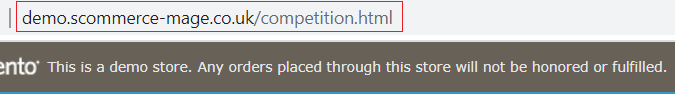

# Competition or Prize Draw Module with Social Booster

### <mark style="color:blue;">Installation and User Guide for Magento 1 Competition or Prize Draw Module with Social Booster</mark>

**Table of Contents**

1. [Installation ](competition-or-prize-draw-module-with-social-booster.md#\_bookmark0)
   * Disable Compilation Mode&#x20;
   * Upload Package&#x20;
   * Clear Caches&#x20;
2. [Configuration Settings for Competition ](competition-or-prize-draw-module-with-social-booster.md#\_bookmark4)
   * General Settings&#x20;
   * Facebook&#x20;
   * Twitter Tweet&#x20;
   * Email Settings&#x20;
3. [Static Blocks](competition-or-prize-draw-module-with-social-booster.md#static-blocks)
4. [Competition URL ](competition-or-prize-draw-module-with-social-booster.md#\_bookmark10)
5. [Competition Entries Report](competition-or-prize-draw-module-with-social-booster.md#\_bookmark11)
6. [Front-end Site view ](competition-or-prize-draw-module-with-social-booster.md#\_bookmark12)
   * Competition Form&#x20;
   * Social Sharing Links on the Form&#x20;
   * Competition Entry Confirmation Email&#x20;

### <mark style="color:blue;">Installation</mark> 

* <mark style="color:orange;">**Disable Compilation Mode:**</mark> To check that this is disabled, go to **System >Tools> Compilation**. If the compiler status is ‘Disabled’, you are ready to go. If not, simply click the ‘Disable’ button on the right hand side of the screen.
* <mark style="color:orange;">**Upload Package:**</mark> Upload the content of the module to your root folder. This will not overwrite the existing Magento folder or files, only the new contents will be added.
* <mark style="color:orange;">**Clear Caches:**</mark> This can be done from the admin console by navigating to the cache management page (**System > Cache Management**), selecting all caches, clicking ‘refresh’ from the drop-down menu, and submitting the change.

### <mark style="color:blue;">Configuration Settings for Competition</mark> 

Go to **Admin > Stores > Configuration > Scommerce Configuration > Competition**

#### <mark style="color:orange;">General Settings</mark> 

* **Enabled –** Select “Yes” or “No” to enable or disable the module.
* **License Key –** Please add the license for the extension which is provided in the order confirmation email. Please note license keys are site URL specific. If you require license keys for dev/staging sites then please email us at [core@scommerce-mage.com](mailto:core@scommerce-mage.com)
* **CSV File name –** Please add the csv file name in the competition.

#### <mark style="color:orange;">Facebook</mark> 

* **Facebook Fan Page –** Full url of your facebook page for example [www.facebook.com/scommercemage](file:///C:/Users/ri/Downloads/www.facebook.com/scommercemage)
* **Facebook App Id –** Your facebook application id which you can obtain by creating app by clicking on the following URL ([https://developers.facebook.com/apps](https://developers.facebook.com/apps)) after login to your facebook account.
* **Facebook Share Name –** Name of your promotion which appears in bold on the sharing popup. For more info see [http://fbdevwiki.com/wiki/FB.ui](http://fbdevwiki.com/wiki/FB.ui)
* **Facebook Share Picture Url –** Picture of your promotion which appears on the sharing popup. For more info see [https://fbdevwiki.com/wiki/FB.ui](https://fbdevwiki.com/wiki/FB.ui)
* **Facebook Share Caption –** Caption of your promotion which appears above share description and below the name of the promotion on the sharing popup. For more info see [http://fbdevwiki.com/wiki/FB.ui](http://fbdevwiki.com/wiki/FB.ui)
* **Facebook Share Description –** Description of your promotion which appears on the sharing popup. For more info see [http://fbdevwiki.com/wiki/FB.ui](http://fbdevwiki.com/wiki/FB.ui)

#### <mark style="color:orange;">Twitter Tweet</mark> 

* **Twitter Account –** The unique id of your twitter account. For example our twitter account is [http://www.twitter.com/scommercemage ](http://www.twitter.com/scommercemage)so you just need to put scommercemage.
* **Tweet Text –** Description of your promotion which appears on the sharing popup.
* **Hashtags –** The hashtag of your promotion which appears on the sharing popup at the end of the description.

#### <mark style="color:orange;">Email Settings</mark> 

* **Enable –** Select “Yes” to enable competition emails.
* **Email Sender –** Select email sender for competition email.
* **Email Template –** Select Email template.

### <mark style="color:blue;">**Static Blocks**</mark> &#x20;

You can find static blocks at Admin **> CMS > Static.** Below are the static blocks which you can customize as required: -

1. Competition Homepage
2. Competition Entry Banner
3. Competition Entry Text Left
4. Competition Entry Text Right
5. Competition Success Banner
6. Competition Success Text Left

**Static Blocks**

>)

### <mark style="color:blue;">Competition URL</mark> 

The Competition URL site will be as follows - \[Your Site Url ]/Competition

For demo please check our demo site URL: [http://demo.scommerce-](http://demo.scommerce-mage.co.uk/competition) [mage.co.uk/competition](http://demo.scommerce-mage.co.uk/competition)

You can give the link for competition anywhere on the site

### <mark style="color:blue;">Competition Entries Report</mark> 

Go to **Admin > Reports > Get Competition CSV**. This will give you a CSV report for all the competition entries

>)

### <mark style="color:blue;">Front-end Site view</mark> 

* <mark style="color:orange;">**Competition Form –**</mark> When you hit the competition URL it opens the competition on the front-end and by entering the email address you can enter into the competition.

>)

* <mark style="color:orange;">**Social Sharing Links on the Form –**</mark> After entering into the competition when you share the competition on the social sites, it increases the possibility to win the competition. It allows you to enter five entries in the same prize draw competition by following / liking / sharing the prize draw or competition on Facebook and Twitter, also you can enable/disable the social sharing options from the back-end.

>)

* <mark style="color:orange;">**Competition Entry Confirmation Email –**</mark> It sends an email to users to confirm their entry into the prize draw or competition.

>)

If you have a question related to this extension please check out our [**FAQ Section**](https://www.scommerce-mage.com/magento-competition-module-with-social-booster.html#faq) first. If you can't find the answer you are looking for then please contact [**support@scommerce-mage.com**](mailto:core@scommerce-mage.com)**.**
