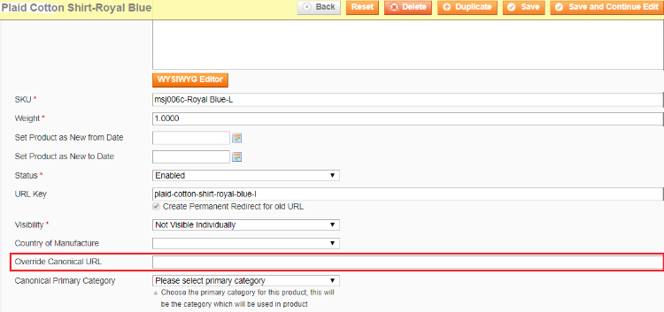
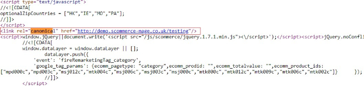
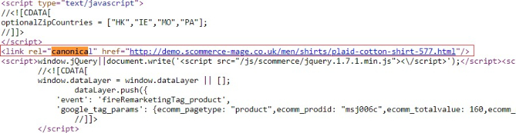
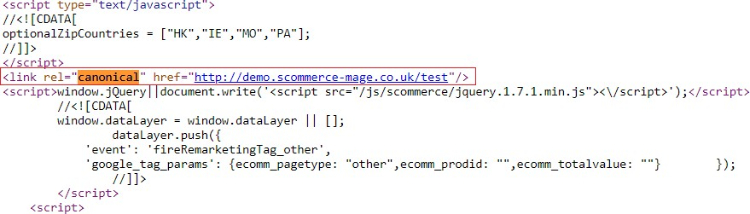

# Canonical Urls for Category, Product and CMS pages

### <mark style="color:blue;">Installation and User Guide for Magento 1 Canonical URL for Category, Product and CMS Pages</mark>

**Table of Contents**

1. [Installation ](canonical-urls-for-category-product-and-cms-pages.md#\_bookmark0)
   * Disable Compilation Mode&#x20;
   * Upload Package&#x20;
   * Clear Caches&#x20;
2. [Configuration Settings for Canonical Tags ](canonical-urls-for-category-product-and-cms-pages.md#\_bookmark4)
   * General Settings&#x20;
   * Category Canonical Tags&#x20;
   * Product Canonical Tags&#x20;
   * CMS Canonical Tags&#x20;
   * No Index No Follow&#x20;
   * Category set up for Canonical URL&#x20;
   * Product set up for Canonical URL&#x20;
   * CMS set up for Canonical URL&#x20;
   * Rollback Plan&#x20;
3. [Front-end Site View ](canonical-urls-for-category-product-and-cms-pages.md#\_bookmark14)
   * Category Canonical Tags&#x20;
   * Product Canonical Tags&#x20;
   * CMS Canonical Tags&#x20;

### <mark style="color:blue;">Installation</mark> <a href="#_bookmark0" id="_bookmark0"></a>

* <mark style="color:orange;">**Disable Compilation Mode:**</mark> To check that this is disabled, go to **System >Tools> Compilation**. If the compiler status is ‘Disabled’, you are ready to go. If not, simply click the ‘Disable’ button on the right hand side of the screen.
* <mark style="color:orange;">**Upload Package:**</mark> Upload the content of the module to your root folder. This will not overwrite the existing Magento folder or files, only the new contents will be added.
* <mark style="color:orange;">**Clear Caches:**</mark> This can be done from the admin console by navigating to the cache management page (**System > Cache Management**), selecting all caches, clicking ‘refresh’ from the drop-down menu, and submitting the change.

### <mark style="color:blue;">Configuration Settings for Canonical Tags</mark> <a href="#_bookmark4" id="_bookmark4"></a>

Go to **Admin > Stores > Configuration > Scommerce Configuration > Canonical Tags**

#### <mark style="color:orange;">General Settings</mark> <a href="#_bookmark5" id="_bookmark5"></a>

* **License Key –** Please add the license for the extension which is provided in the order confirmation email. Please note license keys are site URL specific. If you require license keys for dev/staging sites then please email us at [core@scommerce-mage.com](mailto:core@scommerce-mage.com)


#### <mark style="color:orange;">Category Canonical Tags</mark> <a href="#_bookmark6" id="_bookmark6"></a>

* **Category Canonical Enable –** Set it to yes, if you want canonical tag on category pages.
* **Exclude Current Category in Admin –** Set it to yes, if you don’t want same category to appear in the drop-down selection while choosing canonical category for a category.
* **Append Text with Every Category URL Path –** Set it to yes, if you want to append text with overridden canonical URL as well. This setting is useful when you have pagination/filtered navigation/sorting on your site.
* **Append Text with Category URL Path –** Enter text to append with canonical URL. This setting is useful when you have pagination/filtered navigation/sorting on your site. **For example** [http://www.domain.com/category.html?limit=all](http://www.domain.com/category.html?limit=all)


#### <mark style="color:orange;">Product Canonical Tags</mark> <a href="#_bookmark7" id="_bookmark7"></a>

* **Product Canonical Enable –** Set it to yes, if you want canonical tag on product pages.
* **Include Category Path –** Set it to yes, if you want to include category path in the canonical tag alone with product URL.


#### <mark style="color:orange;">CMS Canonical Tags</mark> <a href="#_bookmark8" id="_bookmark8"></a>

* **CMS Canonical Enable –** Set it to yes, if you want canonical tag on cms pages.


#### <mark style="color:orange;">No Index No Follow</mark> <a href="#_bookmark9" id="_bookmark9"></a>

* **Enable –** Set it to yes, if you want to add noindex, nofollow in the head section.
* **Action Names –** Add action names here to add noindex, nofollow in the head section for specific page. New route name needs to be added in next line. Action name can be determined using **$this > getAction() > getFullActionName()**
* **Route Names –** Add route name here to add noindex, nofollow in the head section for list of pages. New route name needs to be added in next line. Route name can be determined using **Mage::app() > getFrontController() > getRequest() > getRouteName()**


### <mark style="color:orange;">Category set up for Canonical URL</mark> <a href="#_bookmark10" id="_bookmark10"></a>

Go to **Admin > Catalog > Categories > Manage Categories > Choose Category (for which you want to set Canonical URL)**

* **Canonical URL –** Select the category from the dropdown, this selected category’s URL will be rendered for search engines to pick it up as canonical URL.
* **Override Canonical URL –** Enter text here to be used as canonical tag URL. This will be given highest priority if entered.

**For example /women.html?limit=all (without domain name)**

* **Robots Setting –** Select the robot settings from dropdown, it comes with the following options -:
  * **No Index, No Follow**
  * **No Index, Follow**
  * **Index, No Follow**

>)

#### <mark style="color:orange;">Product set up for Canonical URL</mark> <a href="#_bookmark11" id="_bookmark11"></a>

Go to **Admin > Catalog > Manage Product > Choose Product (for which you want to set Canonical URL)**

* **Override Canonical URL –** Enter text here to be used as canonical tag URL. This will be given highest priority if entered.
* **Canonical Primary Category –** Select primary category to be included in canonical URL tag.



#### <mark style="color:orange;">CMS set up for Canonical URL</mark> <a href="#_bookmark12" id="_bookmark12"></a>

Go to **Admin > Catalog > CMS > Pages > Choose Page (for which you want to set Canonical URL)**

* **Canonical URL –** Enter text here to be used as canonical tag URL. For homepage you can enter “/”
* **Robots Setting –** Select the robot settings from dropdown, it comes with the following options -:
  * **No Index, No Follow**
  * **No Index, Follow**
  * **Index, No Follow**

>)

#### <mark style="color:orange;">Rollback Plan:</mark> <a href="#_bookmark13" id="_bookmark13"></a>

* **Delete the following folders from FTP**

```
app/code/community/Scommerce Canonical
app/etc/modules/Scommerce_Canonical.xml
app/design/frontend/base/default/layout/scommerce_canonical.xml
app/design/frontend/base/default/template/scommerce/canonical/view. phtml
app/design/frontend/base/default/template/scommerce/canonical/
```

* **Run the following sql commands: -**

```
DELETE FROM core_resource WHERE CODE=’scommerce_canonical_setup’;
DELETE FROM eav_attribute WHERE attribute_code IN (‘canonical_url’,override_canonical_url;, ‘robots_settings’, canonical_primary_category’);
ALTER TABLE CMS_PAGE DROP COLUMN canonical_url
ALTER TABLE CMS_PAGE DROP COLUMN robots_settings
```

### <mark style="color:blue;">Front-end Site View</mark> <a href="#_bookmark14" id="_bookmark14"></a>

* <mark style="color:orange;">**Category Canonical Tags –**</mark> You can enable canonical tags on the category page from **Admin > Stores > Configuration > Scommerce Configuration > Canonical Tags > Category Canonical Enable – Select – “Yes”**



* <mark style="color:orange;">**Product Canonical Tags –**</mark> To add canonical tag on the product page, go to **Admin > Stores > Configuration > Scommerce Configuration > Canonical Tags> Product Canonical Enable – Select – “Yes”**



* <mark style="color:orange;">**CMS Canonical Tags –**</mark> You can add canonical tag on the CMS page from **Admin > Stores > Configuration > Scommerce Configuration > Canonical Tags> CMS Canonical Enable – Select – “Yes”**



If you have a question related to this extension please check out our [**FAQ Section**](https://www.scommerce-mage.com/magento-canonical-urls-for-category-product-and-cms-pages.html#faq) first. If you can't find the answer you are looking for then please contact [**support@scommerce-mage.com**](mailto:core@scommerce-mage.com)**.**
