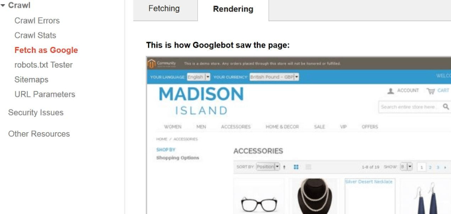

# Google Friendly SEO Layered Navigation

### <mark style="color:blue;">Installation and User Guide for Magento 1 Google Friendly SEO Layered Navigation</mark>

**Table of Contents**

1. [Installation ](google-friendly-seo-layered-navigation.md#\_bookmark0)
   * Disable Compilation Mode&#x20;
   * Upload Package&#x20;
   * Clear Caches&#x20;
2. [Configuration Settings for Layered Navigation ](google-friendly-seo-layered-navigation.md#\_bookmark4)
   * General Settings&#x20;
   * Google Friendly SEO Navigation (Fetch as Google)&#x20;
3. [Front-end Site View ](google-friendly-seo-layered-navigation.md#\_bookmark6)
   * Search Engine Optimization of Layered Navigation&#x20;
   * Custom View of Layered Navigation&#x20;

### <mark style="color:blue;">Installation</mark> 

* <mark style="color:orange;">**Disable Compilation Mode:**</mark> To check that this is disabled, go to **System >Tools> Compilation**. If the compiler status is ‘Disabled’, you are ready to go. If not, simply click the ‘Disable’ button on the right-hand side of the screen.
* <mark style="color:orange;">**Upload Package:**</mark> Upload the content of the module to your root folder. This will not overwrite the existing Magento folder or files, only the new contents will be added.
* <mark style="color:orange;">**Clear Caches:**</mark> This can be done from the admin console by navigating to the cache management page (**System > Cache Management**), selecting all caches, clicking ‘refresh’ from the drop-down menu, and submitting the change.

### <mark style="color:blue;">Configuration Settings for Layered Navigation</mark> 

Go to **Admin > Stores > Configuration > Scommerce Configuration > Layered Navigation**

#### <mark style="color:orange;">General Settings</mark> 

* **Enabled –** Select “Yes” or “No” to enable or disable the module.
* **License Key –** Please add the license for the extension which is provided in the order confirmation email. Please note license keys are site URL specific. If you require license keys for dev/staging sites then please email us at [support@scommerce-mage.com](mailto:support@scommerce-mage.com).

#### <mark style="color:orange;">Google Friendly SEO Navigation (Fetch as Google)</mark> 

### <mark style="color:blue;">Front-end Site View</mark> 

* <mark style="color:orange;">**Search Engine Optimization of Layered Navigation -**</mark> See the image below for Layered Navigation view.

>)

* <mark style="color:orange;">**Custom View of Layered Navigation –**</mark> Here is the custom view of the Layered Navigation

>)

If you have a question related to this extension please check out our [**FAQ Section**](https://www.scommerce-mage.com/google-friendly-layered-navigation.html#faq) first. If you can't find the answer you are looking for then please contact [**support@scommerce-mage.com**](mailto:core@scommerce-mage.com)**.**
