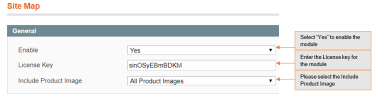
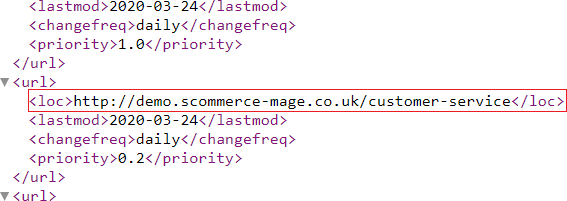

# Google Site Map Exclusion with Image sitemap

### <mark style="color:blue;">Installation and User Guide for Magento 1 Google Site Map Exclusion with Image Sitemap</mark>

**Table of Contents**

1. [Installation ](google-site-map-exclusion-with-image-sitemap.md#\_bookmark0)
   * Disable Compilation Mode&#x20;
   * Upload Package&#x20;
   * Clear Caches&#x20;
2. [Configuration Settings for Google Sitemap ](google-site-map-exclusion-with-image-sitemap.md#\_bookmark4)
   * General Settings&#x20;
   * Exclude Categories from Sitemap&#x20;
   * Exclude Products from Sitemap&#x20;
   * Exclude CMS from Sitemap&#x20;
   * How to Generate Sitemap&#x20;
   * Add new Sitemap&#x20;
   * Magento Out of the Box Functionality to set the Category Path&#x20;
3. [Google Sitemap XML ](google-site-map-exclusion-with-image-sitemap.md#google-sitemap-xml)
   * Product Link in Sitemap XML&#x20;
   * Category Link in Sitemap XML&#x20;
   * CMS Page Link in Sitemap XML&#x20;

### <mark style="color:blue;">Installation</mark> 

* <mark style="color:orange;">**Disable Compilation Mode:**</mark> To check that this is disabled, go to **System >Tools> Compilation**. If the compiler status is ‘Disabled’, you are ready to go. If not, simply click the ‘Disable’ button on the right hand side of the screen.
* <mark style="color:orange;">**Upload Package:**</mark> Upload the content of the module to your root folder. This will not overwrite the existing Magento folder or files, only the new contents will be added.
* <mark style="color:orange;">**Clear Caches:**</mark> This can be done from the admin console by navigating to the cache management page (**System > Cache Management**), selecting all caches, clicking ‘refresh’ from the drop-down menu, and submitting the change.

### <mark style="color:blue;">Configuration Settings for Google Sitemap</mark> 

Go to **Admin > Stores > Configuration > Scommerce Configuration > Sitemap**

#### <mark style="color:orange;">General Settings</mark> 

* **Enabled –** Select “Yes” or “No” to enable or disable the module.
* **License Key –** Please add the license for the extension which is provided in the order confirmation email. Please note license keys are site URL specific. If you require license keys for dev/staging sites then please email us at [core@scommerce-mage.com](mailto:core@scommerce-mage.com)
* **Include Product Image –** This option allows to add main product image or main and additional product images to Google Site Map.

* <mark style="color:orange;">**Exclude Categories from Sitemap –**</mark> To include or exclude categories, go to **Admin > Catalog > Manage Categories > Select Category** (you want to exclude from site map) > General > **Exclude from Sitemap:** Set to **“Yes/No”.**

>)

* <mark style="color:orange;">**Exclude Products from Sitemap –**</mark> To exclude products from sitemap, go to **Admin > Catalog > Manage Products > Select Product** (you want to exclude from site map) > General > **Exclude from Sitemap:** Set to **“Yes/No”.**

>)

* <mark style="color:orange;">**Exclude CMS from Sitemap –**</mark> To exclude CMS pages from sitemap, go to **Admin > CMS > Pages > Select CMS Page** (you want to exclude from site map**) > General > Exclude from Sitemap:** Set to **“Yes/No”.**

>)

* <mark style="color:orange;">**How to Generate Sitemap –**</mark> To generate the site map from the admin panel go to **Admin > Catalog > Google Sitemap >** Click **“Generate Sitemap”.**

>)

* <mark style="color:orange;">**Add new Sitemap –**</mark> You can create a new site map from **Admin > Catalog > Google Sitemap >** Click **“Add Sitemap”**, it redirects to New Site Map page**,** and by providing all the required details you can create Site Map.

>)

* <mark style="color:orange;">**Magento Out of the Box Functionality to set the Category Path –**</mark> To include category path in product URLs in sitemap.xml, go to **Admin > System > Catalog > Catalog > Search Engine Optimizations > Use Categories Path for Product URLs**: Set to **“Yes”.**

>)

### <mark style="color:blue;">**Google Sitemap XML**</mark>&#x20;

Google site map shows all the Included Products, Categories, and CMS Page links in the sitemap.xml

* <mark style="color:orange;">**Product Link in Sitemap XML –**</mark> You can see the product link in the Google Sitemap XML.

>)

* <mark style="color:orange;">**Category Link in Sitemap XML –**</mark> You can see the category link in the Google Sitemap XML.

>)

* <mark style="color:orange;">**CMS Page Link in Sitemap XML –**</mark> In the below screen grab you can see the about-us page link in the Google Sitemap XML.

If you have a question related to this extension please check out our [**FAQ Section**](https://www.scommerce-mage.com/magento-google-site-map-exclusion.html#faq) first. If you can't find the answer you are looking for then please contact [**support@scommerce-mage.com**](mailto:core@scommerce-mage.com)**.**
