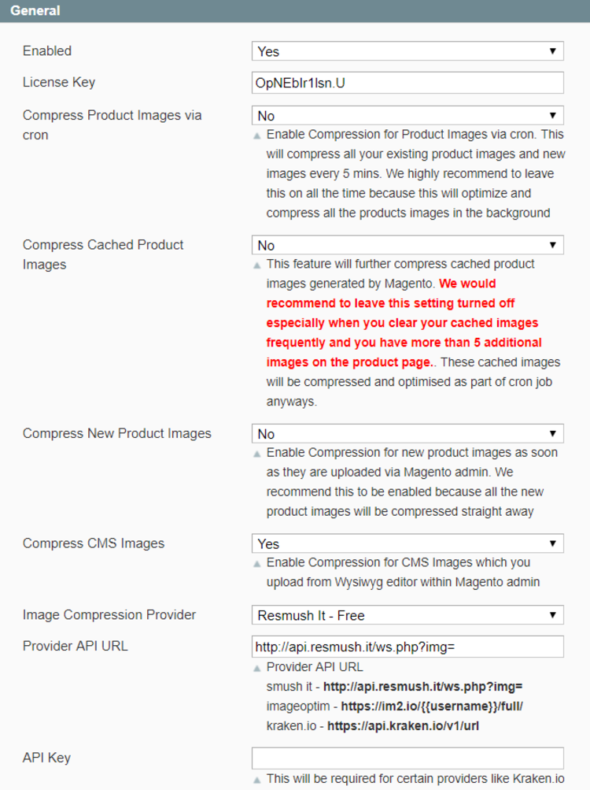
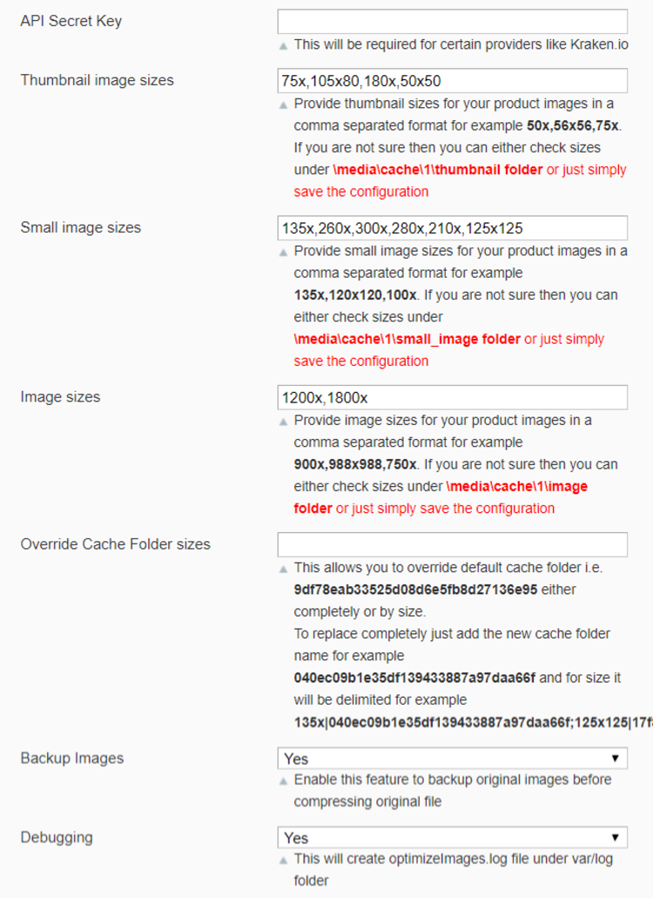
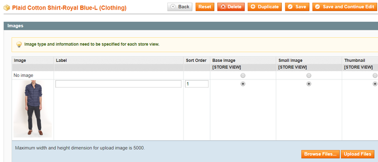
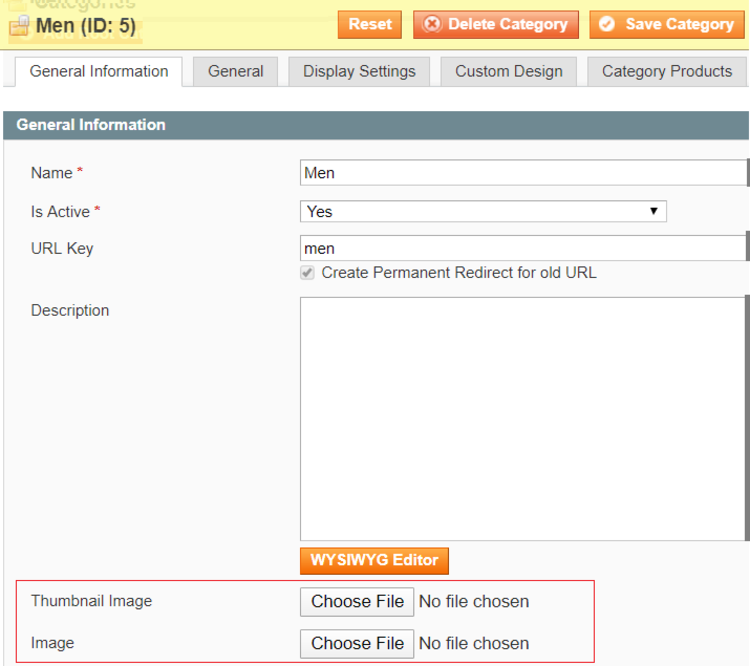
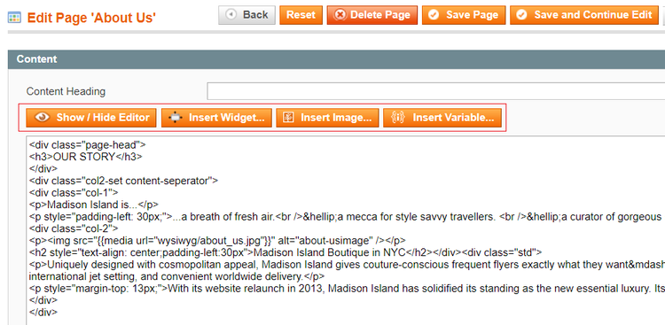
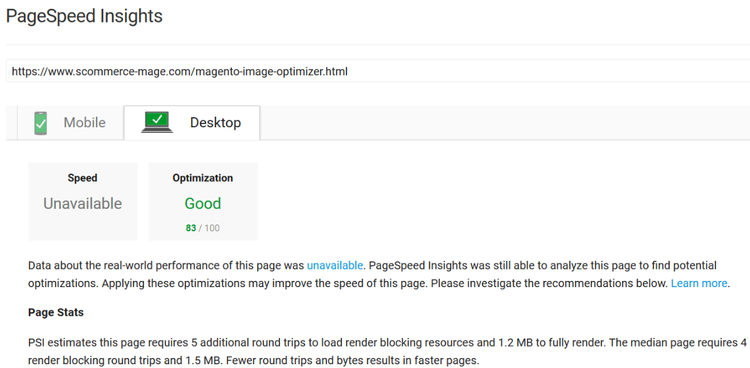
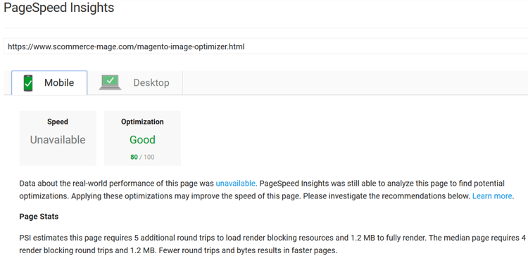

# Magento Image Optimizer

## <mark style="color:blue;">Installation and User Guide for</mark> <mark style="color:blue;"></mark><mark style="color:blue;">**Magento 1 Image Optimizer**</mark> 

**Table of Contents**

1. [_Installation_](magento-image-optimizer.md#installation)
   * &#x20;_Disable Compilation Mode_
   * &#x20;_Upload Package_
   * _Clear Caches_
2. [_Configuration Settings for Optimize Images_](magento-image-optimizer.md#\_toc40181960)
   * _General Settings_
   * _Compress/Optimize Product Images_
   * _Compress/Optimize Category Images_
   * _Compress/Optimize CMS Images_
   * _Google Page Speed Test Result for Desktop_
   * _Google Page Speed Test Result for Mobile_

### &#x20;<mark style="color:blue;">Installation</mark>

* <mark style="color:orange;">**Disable Compilation Mode:**</mark> To check that this is disabled, go to **System >Tools > Compilation**. If the compiler status is ‘Disabled’, you are ready to go. If not, simply click the ‘Disable’ button on the right hand side of the screen.
* <mark style="color:orange;">**Upload Package:**</mark> Upload the content of the module to your root folder. This will not overwrite the existing Magento folder or files, only the new contents will be added.
* <mark style="color:orange;">**Clear Caches:**</mark> This can be done from the admin console by navigating to the cache management page (**System > Cache Management**), selecting all caches, clicking ‘refresh’ from the drop-down menu, and submitting the change.

### <mark style="color:blue;">Configuration Settings for Optimize Images</mark> 

Go to **Admin > Stores > Configuration > Scommerce Configuration > Optimize Images**

#### <mark style="color:orange;">General Settings</mark>

* #### **Enabled –** Select “Yes” or “No” to enable or disable the module.
* #### **License Key –** Please add the license for the extension which is provided in the order confirmation email. Please note license keys are site URL specific. If you require license keys for dev/staging sites then please email us at [core@scommerce-mage.com](mailto:core@scommerce-mage.com)
* #### **Compress Product Images via cron –** Enable Compression for Product Images via cron. This will compress all your existing product images and new  images every 5 mins. We highly recommend leaving this on all the time because this will optimize and compress all the products images in the background.
* #### **Compress Cached Product Images –** This feature will further compress cached product images generated by Magento. We would recommend leaving this setting turned off especially when you clear your cached images frequently and you have more than 5 additional images on the product page. These cached images will be compressed and optimised as part of cron job.
* #### **Compress New Product Images –** Enable Compression for new product images as soon as they are uploaded via Magento admin. We recommend this to be enabled because all the new product images will be compressed straight away.
* #### **Compress CMS Pages –** Enable compression for CMS Images which you upload from Wysiwyg editor within Magento admin.
* #### **Image Compression Provider –** Select the compression provider from the list. These are three providers in the drop down. Resmush, ImageOptim and Kraken IO. Resmush is free and for the other two subscribe at their websites.
* #### **Provider API URL –** Provider API URL **Smush it –** [http://api.resmush.it/ws.php?img=](http://api.resmush.it/ws.php?img=) **Imageoptim –** [**http://im2.io/\{{username\}}/full/**](http://im2.io/%7B%7Busername%7D%7D/full/) **Kraken –** [https://api.kraken.io/v1/url](https://api.kraken.io/v1/url)
* **API Key –** This will be required for certain providers like Kraken.io
* **API Secret Key –** This will be required for certain providers like Krake.io
* **Thumbnail images size –** Provide thumbnail sizes for your product images in a comma separated format for example **50x,56x56,75x**. If you are not sure the you can either check sizes under **\media\cache\1\small\_image folder** or just simply save the configuration.
* **Small image sizes –** Provide small images for your product images in a comma separated format for example 135x,120x120,100x. If you are not sure then you can either check sizes under \media/cache/1/image folder or just simply save the configuration.
* **Image sizes –** Provide image sizes for your product images in a comma separated format for example 900x,988x988,750x. If you are not sure then you can either check sizes under \media\cache\1\image folder or just simply save the configuration.
* **Override Cache Folder Sizes –** This allows you to override default cache folder i.e. 9df78eab33525d08d6e5fb8d27136e95 either completely or by size. To replace completely just add the new cache folder name for example 040ec09b1e35df139433887a97daa66f and for size it will be delimited for example 135x|040ec09b1e35df139433887a97daa66f; 125x125|17f82f742ffe127f42dca9de82fb58b1
* **Backup Images –** Enable this feature to backup original images before compressing original file.
* &#x20;**Debugging –** This will create optimizeImages.log file under var/log folder.&#x20;

#### <mark style="color:orange;">Compress/Optimize Product Images</mark>&#x20;

You can compress product images by enabling module from Admin > Stores > Configuration > Optimize Images > Enabled – “Yes” > Compress Images while uploading – Select “Product”.

#### <mark style="color:orange;">Compress/Optimize Category Images</mark>&#x20;

You can compress category images by enabling module from Admin > Stores > Configuration > Optimize Images > Enabled – “Yes” > Select “Category”.

#### <mark style="color:orange;">Compress/Optimize CMS Images</mark>&#x20;

You can compress CMS images by enabling module from Admin > Stores > Configuration > Optimize Images > Enabled – “Yes” > Select “CMS”.

#### <mark style="color:orange;">Google Page Speed Test Result for Desktop</mark>

#### <mark style="color:orange;">Google Page Speed Test Result for Mobile</mark>

If you have a question related to this extension please check out our [**FAQ Section**](https://www.scommerce-mage.com/magento-image-optimizer.html#faq) first. If you can't find the answer you are looking for then please contact [**support@scommerce-mage.com**](mailto:core@scommerce-mage.com)**.**
