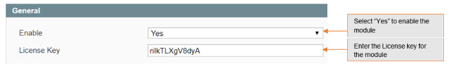
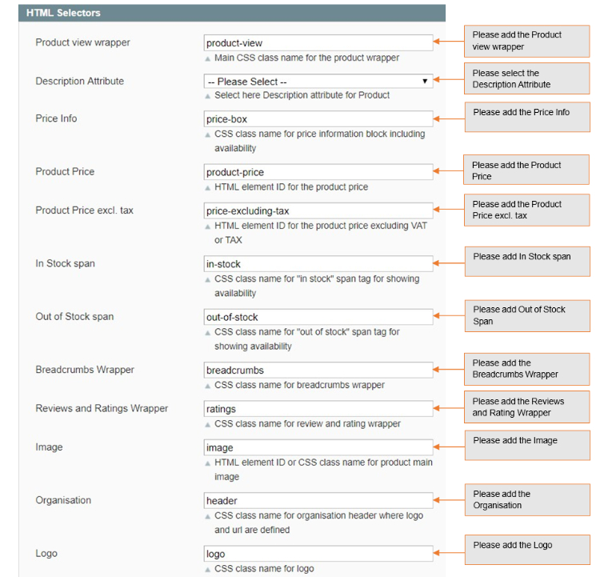
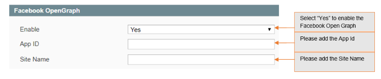
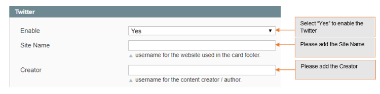
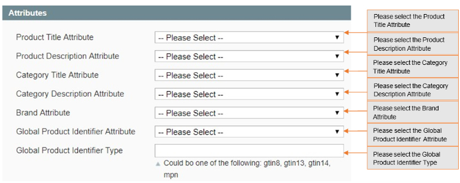

# Magento Rich Snippets & Cards (schema.org)

### <mark style="color:blue;">Installation and User Guide for Magento 1 Rich Snippets & Cards (schema.org)</mark>

**Table of Contents**

1. [Installation ](magento-rich-snippets-and-cards-schema.org.md#\_bookmark0)
   * Disable Compilation Mode&#x20;
   * Upload Package&#x20;
   * Clear Caches&#x20;
2. [Configuration Settings for Rich Snippet ](magento-rich-snippets-and-cards-schema.org.md#\_bookmark4)
   * General Settings&#x20;
   * HTML Selectors&#x20;
   * Facebook OpenGraph&#x20;
   * Twitter&#x20;
   * Attributes&#x20;
3. [Structured Data / Markup Code of Front-end Page(s) in Structured Data Testing Tool ](magento-rich-snippets-and-cards-schema.org.md#\_bookmark10)
   * Home Page Markup Code&#x20;
   * Category Page Markup Code&#x20;
   * Product Page Markup Code&#x20;
   * Twitter, Facebook Open Graph Social Sharing Code&#x20;
   * Increased and Optimized Page Ranking in Search Result&#x20;

### <mark style="color:blue;">Installation</mark> 

* <mark style="color:orange;">**Disable Compilation Mode:**</mark> To check that this is disabled, go to **System >Tools> Compilation**. If the compiler status is ‘Disabled’, you are ready to go. If not, simply click the ‘Disable’ button on the right hand side of the screen.
* <mark style="color:orange;">**Upload Package:**</mark> Upload the content of the module to your root folder. This will not overwrite the existing Magento folder or files, only the new contents will be added.
* <mark style="color:orange;">**Clear Caches:**</mark> This can be done from the admin console by navigating to the cache management page (**System > Cache Management**), selecting all caches, clicking ‘refresh’ from the drop-down menu, and submitting the change.

### <mark style="color:blue;">Configuration Settings for Rich Snippet</mark> 

Go to **Admin > Stores > Configuration > Scommerce Configuration > Rich Snippet**

#### <mark style="color:orange;">General Settings</mark> 

* **Enabled –** Select “Yes” or “No” to enable or disable the module.
* **License Key –** Please add the license for the extension which is provided in the order confirmation email. Please note license keys are site URL specific. If you require license keys for dev/staging sites then please email us at [core@scommerce-mage.com](mailto:core@scommerce-mage.com)

#### <mark style="color:orange;">HTML Selectors</mark> 

* **Product view wrapper –** Main CSS class name for the product wrapper.
* **Description Attribute –** CSS class name for short description.
* **Price Info –** CSS class name for price information block including availability.
* **Product Price –** HTML element ID for the product price.
* **Product Price excl. tax –** HTML element ID for the product price excluding VAT or TAX.
* **In Stock Span –** CSS class name for “in stock” span tag for showing availability.
* **Out of Stock span –** CSS class name for “out of stock” span tag for showing availability.
* **Breadcrumbs Wrapper –** CSS class name for breadcrumbs wrapper.
* **Reviews and Rating Wrapper –** CSS class name for review name and rating wrapper.
* **Image –** HTML element ID or CSS class name for product main image.
* **Organisation –** CSS class name for div in the where log is defined.
* **Logo –** CSS class name for anchor element of the logo.

#### <mark style="color:orange;">Facebook OpenGraph</mark> 

* **Enable –** Set “yes” to enable Facebook open graph tags.
* **AppId –** Set Facebook app id
* **Sitename –** Set Facebook site name

#### <mark style="color:orange;">Twitter</mark> 

* **Enable –** Set “yes” to enable twitter.
* **Sitename –** Set twitter site name (@username for the website used in the card footer)
* **Creator –** Set twitter creator name (@username for the content creator / author)

#### <mark style="color:orange;">Attributes</mark> 

* **Product Title Attribute –** Select product title attribute you want to send to Google, Facebook, Twitter etc.
* **Product Description Attribute –** Select product description attribute you want to send to Google, Facebook, Twitter etc.
* **Category Title Attribute –** Select category title attribute you want to send to Google, Facebook, Twitter, etc.
* **Category Description Attribute –** Select category description attribute you want to send to Google, Facebook, Twitter etc.
* **Brand Attribute –** Please select brand attribute from the dropdown.
* **Global Product Identifier Attribute –** Select product identifier attribute from the drop-down list.
* **Global Product Identifier Type –** Select product identifier type from the drop- down list. It could be one of the following: gtin8, gtin13, gtin14, mpn.

### <mark style="color:blue;">Structured Data / Markup Code of Front-end Page(s) in Structured Data Testing Tool</mark> 

* <mark style="color:orange;">**Home Page Markup Code –**</mark>** ** You can add structured data/markup code on homepage from **Admin > Stores > Configuration > Rich Snippet > Enable – “Yes”**. To test structured data, go to **Structured Data Testing Tool > Provide Home Page URL** > Click **“Run Test”**.

>)

* <mark style="color:orange;">**Category Page Markup Code –**</mark>** ** You can add markup code, breadcrumbs on category page from Admin > Stores > Configuration > Rich Snippet > Enable – “Yes”.

>)

* <mark style="color:orange;">**Product Page Markup Code –**</mark>** ** To add structured data markup code on product page, set “Enable” to “Yes” from **Admin > Configuration > Rich Snippet** .

>)

#### <mark style="color:orange;">Twitter, Facebook Open Graph Social Sharing Code</mark> 

* **Tw**<mark style="color:orange;">**itter Code –**</mark> You can enable Twitter from **Admin > Stores > Configuration> Rich Snippet > Twitter > Enable – “Yes”**

>)

* <mark style="color:orange;">**Facebook Open Graph –**</mark>** ** Enable Facebook Open Graph from **Admin > Stores> Configuration > Rich Snippet > Facebook Open Graph > Enable – “Yes”**

>)

* <mark style="color:orange;">**Increased and Optimized Page Ranking in Search Result –**</mark>** ** In the below image you can see the increased and optimized page ranking in search results.

>)

If you have a question related to this extension please check out our [**FAQ Section**](https://www.scommerce-mage.com/magento-rich-snippets-for-google-microsoft-yahoo.html#faq) **** first. If you can't find the answer you are looking for then please contact [**support@scommerce-mage.com**](mailto:core@scommerce-mage.com)**.**
