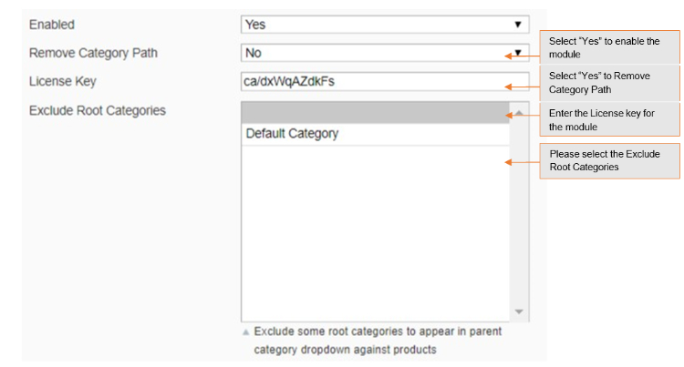
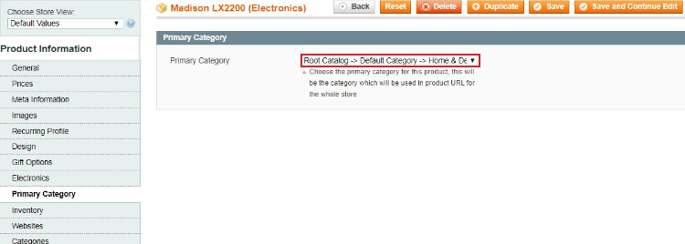
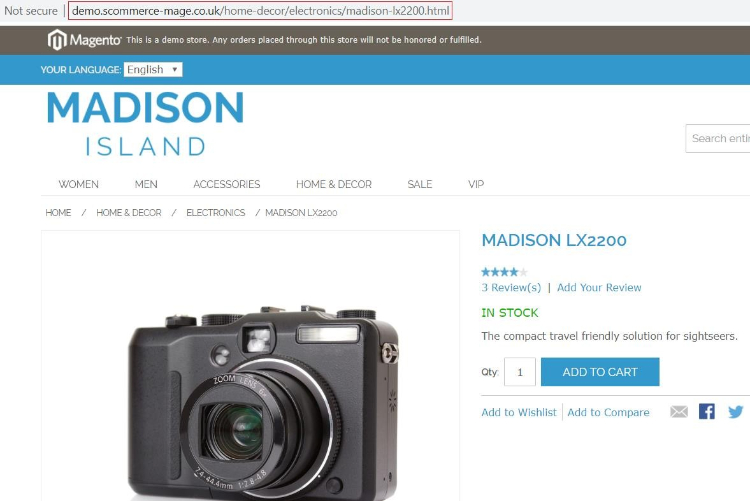
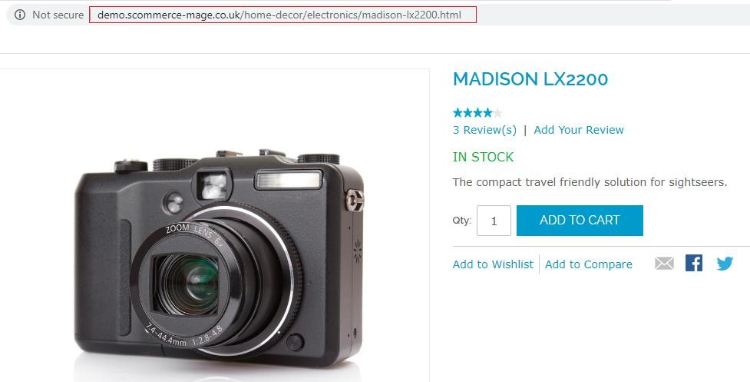

# Magento SEO Unique Catalog URLs

### <mark style="color:blue;">Installation and User Guide for Magento 1 SEO Unique Catalog URLs</mark>

**Table of Contents**

1. [Installation ](magento-seo-unique-catalog-urls.md#_bookmark0)
   * Disable Compilation Mode&#x20;
   * Upload Package&#x20;
   * Clear Caches&#x20;
2. [Configuration Settings for Catalog URL ](magento-seo-unique-catalog-urls.md#_bookmark4)
   * General Settings&#x20;
   * Configuration Path to Set Up Primary Category&#x20;
3. [Front-end Site View ](magento-seo-unique-catalog-urls.md#_bookmark7)
   * Product Page Unique URL&#x20;
   * Search Page / Category Page Unique Catalog Product URL&#x20;

### <mark style="color:blue;">Installation</mark> 

* <mark style="color:orange;">**Disable Compilation Mode:**</mark> To check that this is disabled, go to **System >Tools> Compilation**. If the compiler status is ‘Disabled’, you are ready to go. If not, simply click the ‘Disable’ button on the right-hand side of the screen.
* <mark style="color:orange;">**Upload Package:**</mark> Upload the content of the module to your root folder. This will not overwrite the existing Magento folder or files, only the new contents will be added.
* <mark style="color:orange;">**Clear Caches:**</mark> This can be done from the admin console by navigating to the cache management page (**System > Cache Management**), selecting all caches, clicking ‘refresh’ from the drop-down menu, and submitting the change.

### <mark style="color:blue;">Configuration Settings for Catalog URL</mark> 

Go to **Admin > Stores > Configuration > Scommerce Configuration > Catalog URL**

#### <mark style="color:orange;">General Settings</mark> 

* **Enabled –** Select “Yes” or “No” to enable or disable the module.
* **Remove Category Path –** Select “Yes” if you want to remove category path from product URLs. By default it is “No”.
* **License Key –** Please add the license for the extension which is provided in the order confirmation email. Please note license keys are site URL specific. If you require license keys for dev/staging sites then please email us at [support@scommerce-mage.com](mailto:support@scommerce-mage.com).
* **Exclude Root Categories –** Exclude some root categories to appear as primary category dropdown against products.

#### <mark style="color:orange;">Configuration Path to Set Up Primary Category</mark> 

To set primary category go to **Admin > Catalog > Select Product > Primary Category.** The drop down will show all the categories selected for the product from where you can select the primary category of the product.

### <mark style="color:blue;">Front-end site view</mark> 

* <mark style="color:orange;">**Product Page Unique URL –**</mark> You can assign primary category to a product from **Admin > Catalog > Select Product > Primary Category.** In the below image you can see the primary category “**Home & Decor > Electronics”** has been set for the product Madison LX220&#x30;**.**

* <mark style="color:orange;">**Search Page / Category Page Unique Catalog Product URL –**</mark> We have set the primary category of "Madison LX2200" product to “**Home & Decor > Electronics”**, and the category path remains the same when we access the product from the search or any other category, which you can see in the below image.

If you have a question related to this extension please check out our [**FAQ Section**](https://www.scommerce-mage.com/magento-seo-catalog-urls.html#faq) first. If you can't find the answer you are looking for then please contact [**support@scommerce-mage.com**](mailto:core@scommerce-mage.com)**.**
