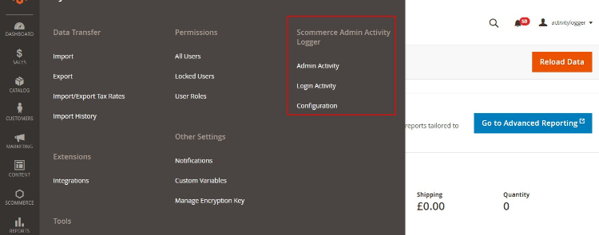

# Magento 2 Admin Action Log

### <mark style="color:blue;">Installation and User Guide for Magento 2 Admin Activity Logger Extension</mark>

**Table of Contents**

1. [_Installation_ ](magento-2-admin-action-log.md#\_bookmark0)
   * _Download Extension_
   * _Installation via app/code_&#x20;
   * _Installation via Composer_
2. [_Configuration Settings for Admin Activity Logger_ ](magento-2-admin-action-log.md#\_bookmark3)
   * _General Settings_&#x20;
   * _Modules Activity Logger_&#x20;
   * _Admin Activity Logger_&#x20;
   * _Admin Activity Grid_&#x20;
   * _Admin Logger Detailed View for Admin Activities_&#x20;
   * _Admin Logger Detailed View for Item Info_
   * _Login Activity Grid_&#x20;

### <mark style="color:blue;">Installation</mark> <a href="#_bookmark0" id="_bookmark0"></a>

* <mark style="color:orange;">**Download Extension:**</mark> Once you have placed the order from our site then go to Account section and click on My Downloadable Products and download the extension package.


* <mark style="color:orange;">**Installation via app/code:**</mark> Upload the content of the module to your root folder. This will not overwrite the existing Magento folder or files, only the new contents will be added. After the successful upload of the package, run below commands on Magento 2 root directory.

```
php bin/magento setup:upgrade
php bin/magento setup:di:compile
php bin/magento setup:static-content:deploy
```

* <mark style="color:orange;">**Installation via Composer:**</mark> Please follow the guide provided in the below link to complete the installation via composer.


[installation-via-composer.md](../installation-via-composer.md)




### <mark style="color:blue;">Configuration Settings for Admin Activity Logger</mark> <a href="#_bookmark3" id="_bookmark3"></a>

Go to **Admin > Stores > Configuration > Scommerce Configuration > Admin Activity Logger**

#### <mark style="color:orange;">General Settings</mark> <a href="#_bookmark4" id="_bookmark4"></a>

* **Enabled -** Select “Yes” or “No” to enable or disable the module.
* **License Key -** Please add the license for the extension which is provided in the order confirmation email. Please note license keys are site URL specific. If you require license keys for dev/staging sites then please email us at [core@scommerce-mage.com](mailto:core@scommerce-mage.com)
* **Admin Users Login Activity Enabled -** Enable / Disable activity. It will log login activity of the admin users.
* **Page visit History Enabled -** Enable / Disable page history visiting log.
* **Clear Admin Activity Logs After -** Enter value. Clear all admin activity logs will be cleared after X days.
* **Enabled Profiler -** Enable / Disable time profiler. Duration of the operations will be logged.


#### <mark style="color:orange;">Modules Activity Logger</mark> <a href="#_bookmark5" id="_bookmark5"></a>

* **Order -** Select “Yes” to enable. It will log order related activities.
* **Product -** Select “Yes” to enable. It will log product related activities.
* **Category -** Select “Yes” to enable. It will log category related activities.
* **Customer -** Select “Yes” to enable. It will log customer related activities.
* **Email Template -** Select “Yes” to enable.
* **Page -** Select “Yes” or “No” to Enable / Disable.
* **Block -** Select “Yes” or “No” to Enable / Disable.
* **Widget -** Select “Yes” or “No” to Enable / Disable.
* **Theme -** Select “Yes or “No” to Enable / Disable.
* **System Configuration -** Select “Yes” or “No” to Enable / Disable.
* **Product Attributes -** Select “Yes” or “No” to Enable / Disable.
* **Admin User -** Select “Yes” to enable. It will log all users activities.
* **SEO -** Select “Yes” or “No” to Enable / Disable.

>)

* <mark style="color:orange;">**Admin Activity Logger -**</mark> You can view admin activity logger from, **Admin > System > Scommerce Admin Activity Logger > Admin Activity / Login Activity.**



* <mark style="color:orange;">**Admin Activity Grid -**</mark> In the back-end under Admin Activity Logger grid you can view all the admin activities details from **Admin > System > Admin Activity Logger**. This grid will have, Admin Username, Name, Activity Type, Store View, Module, Full Action, IP, Item, Revert and Action columns.
  * **Date: -** The exact date and time of the activity performed.
  * **Admin Username: -** user name of the admin.
  * **Name: -** The name of the admin.
  * **Activity Type: -** Type of activity performed
  * **Store view: -** Name of the store view
  * **Module: -** The name of the module used in the activity.
  * **Full Action: -** It contains the URL path of the activity performed.
  * **IP Address: -** The IP address of the user.
  * **Item: -** Activity related item such as a product or system configuration changes.
  * **Revert: -** If the action is not complete then the REVERT column will have the notification.
  * **Action: -** It contains view where you can see the key details of the activity such as general and item info.

#### <mark style="color:orange;">Admin Activity Logger</mark>


* <mark style="color:orange;">**Admin Logger Detailed View for Admin Activities -**</mark> To get more details about each particular action simply click on the 'View' link from **Admin > System > Admin Activity Logger > Select Log > Click on 'View' > General, to view all the detailed data.**
  * You can view all the general details of the user’s activity in the general tab.

>)

* <mark style="color:orange;">**Admin Logger Detailed View for Item Info -**</mark> You can view the item details from **Admin > System > Admin Activity Logger > Select Log > Click on 'View' > Items info.**
  * This section contains all granular information. For instance if you place an order from the admin panel then all the details of the order such as price, store, etc. Are visible in this section.


* <mark style="color:orange;">**Login Activity Grid -**</mark> You can view login activities from **Admin > System > Login Activity > Login Activity Logger**. It logs details of each and every single activity along with what value being changed by who and when. This section contains following information: -
  * **Date: -** The precise date and time of the log.
  * **Type: -** whether logged in or logged out.
  * **Username: -** Username of the person is stored here.
  * **Name: -** Name of the user
  * **Ip Address: -** You can see the IP address here.
  * **User Agent: -** The browser and device details of the user are shown here.
  * **Status: -** If the login fails then the status will show FAILED and if the login or logout is successful then it shows SUCCESS


If you have a question related to this extension please check out our [**FAQ Section**](https://www.scommerce-mage.com/magento-2-admin-action-log.html#faq) first. If you can't find the answer you are looking for then please contact [**support@scommerce-mage.com**](mailto:core@scommerce-mage.com)**.**
