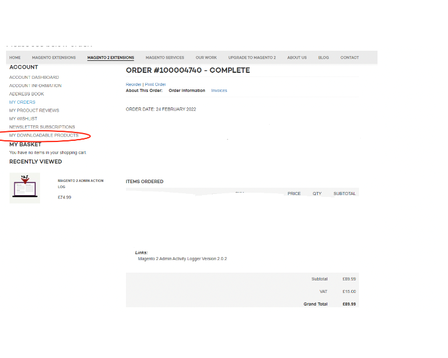

# Magento 2 Admin Security Checklist

### <mark style="color:blue;">Installation and User Guide for Magento 2 Security Checklist Extension</mark>

**Table of Contents**

1. [_Installation_ ](magento-2-admin-security-checklist.md#installation-and-user-guide-for-magento-2-security-checklist-extension)
   * _Download Extension_
   * _Installation via app/code_&#x20;
   * _Installation via Composer_
2. [_Configuration Settings for Security Base_](magento-2-admin-security-checklist.md#toc\_250003)
   * _General Settings_&#x20;
3. [_<mark style="color:blue;">Configuration Settings for Security Checklist</mark>_](magento-2-admin-security-checklist.md#bookmark3)
   * _General Settings_&#x20;
4. [_<mark style="color:blue;">Security Checklist Report</mark>_](magento-2-admin-security-checklist.md#toc\_250003-1)
   * _Security Checklist Report_&#x20;

### <mark style="color:blue;">Installation</mark> <a href="#bookmark0" id="bookmark0"></a>

* <mark style="color:orange;">**Download Extension:**</mark> Once you have placed the order from our site then go to the Account section, click on My Downloadable Products, and download the extension package.



* <mark style="color:orange;">**Installation via app/code:**</mark> Upload the content of the module to your root folder. This will not overwrite the existing Magento folder or files, only the new contents will be added. After the successful upload of the package, run the below commands on the Magento 2 root directory.

```
php bin/magento setup:upgrade
php bin/magento setup:di:compile
php bin/magento setup:static-content:deploy
```

* <mark style="color:orange;">**Installation via Composer:**</mark> Please follow the guide provided in the below link to complete the installation via composer.


[installation-via-composer.md](../installation-via-composer.md)


### <mark style="color:blue;">Configuration Settings for Security Base</mark> <a href="#toc_250003" id="toc_250003"></a>

Go to **Admin > Stores > Configuration > Scommerce Configuration > Security Base**

#### <mark style="color:orange;">General Settings</mark> <a href="#toc_250002" id="toc_250002"></a>

* **Enabled –** Select “Yes” or “No” to enable or disable the module.
* **License Key –** Please add the license for the extension which is provided in the order confirmation email. Please note license keys are site URL-specific. If you require license keys for dev/staging sites then please email us at [core@scommerce-mage.com](mailto:core@scommerce-mage.com)

<figure><figcaption></figcaption></figure>

### <mark style="color:blue;">Configuration Settings for Security Checklist</mark> <a href="#bookmark3" id="bookmark3"></a>

Go to **Admin > Stores > Configuration > Scommerce Configuration > Security Checklist**

#### <mark style="color:orange;">General Settings</mark> <a href="#bookmark4" id="bookmark4"></a>

* **Enabled Security Checklist –** This setting will be used to enable or disable admin security checklist
* **Enable Database prefix check :-** This setting will be used to enable or disable check for DB prefix. Database prefix added in **app/etc/env.php** file, to make it work you also need to make changes in database.
* **Enable FE Captcha check:-** This setting will be used to enable or disable checks for Frontend Captcha. Go to **Stores > Configuration > Security > Google reCAPTCHA** Storefront in order to verify it.w
* **Enable BE Captcha check:-** This setting will be used to enable or disable checks for Backend Captcha. Go to Stores > **Configuration > Security > Google reCAPTCHA** Admin Panel and **Stores > Configuration > Admin > CAPTCHA** Storefront in order to verify it.
* **Enable Magento version check-** This setting will be used to enable or disable check for Magento Version and latest security patches.

<figure><figcaption></figcaption></figure>

* **Enable Admin Users check-:-** This setting will be used to enable or disable check for Admin Users Security. Especially usernames, password lifetime policy and login activity. **Go to Stores > Configuration > Advanced > Admin > Security** Or **Go to System > Permission > All users to manage admin users**
* **Admin Usernames Stop List:-** You can add list of usernames that shouldn't be used for admin accounts. Comma separated.
* **Enabled Admin Path Check:-** This setting will be used to enable or disable check for Admin Path Security. Admin Path is configured in **app/etc/env.php** file or go to **Advanced > Admin > Admin Base URL > Use Custom Admin Path** to change it
* **Admin Path Stop List:-** You can add list of paths that shouldn't be used for admin. Comma separated.
* **Enable Content Script Check:-** This setting will be used to enable or disable check for scripts added in your content or configuration

<figure><figcaption></figcaption></figure>

* **Enabled Checklist Check Cron Job:-** This setting will be used to enable or disable checklist cron job
* **Checklist Cron Schedule:-** This will allow you to define schedule how often you want to clear Login Attempts logs cron.

<figure><figcaption></figcaption></figure>

### <mark style="color:blue;">Security Checklist Report</mark> <a href="#toc_250003" id="toc_250003"></a>

Go to **Admin > System > Scommerce Security> Security Checklist**

#### <mark style="color:orange;">Security Checklist Report</mark> <a href="#toc_250002" id="toc_250002"></a>

The Security checklist grid has several distinctions for various checks: Warning, Error and Success

* **Admin password Protection:** - For Admin password protection, if a password change is not forced, the user will see an error. If the lifetime is more than 90 days, the user will see a warning. If a password change is forced and the lifetime is less than 90 days, then the user will see success.
* **Magento version check**: - For a Magento version check, if the version is outdated, the user will see an error. Otherwise, the user will see success.
* **Database Prefix check**: - For the Database prefix check, if the table prefix is not set in the configuration file, the user will see an error. Otherwise, the user will see success.
* **Frontend ReCaptcha Protection** - For Frontend ReCaptchaProtection, if all frontend forms are protected with recaptcha, the user will see a success. When some forms are protected, the user will see a warning. If none of the forms are protected, the user will see an error.
* **Admin Captcha Protection**:- For Admin Captcha protection, if all backend forms are protected with Captcha, the user will see a success. When some forms are protected, the user will see a warning. If none of the forms are protected, the user will see an error.
* **Admin path protection**: - For Admin path protection, if the user's admin path doesn't contain words from the stop list, doesn't contain numbers or capital letters, and is at least 15 characters long, the user will see a success. If any of the criteria mentioned are not fulfilled, the user will see a warning.
* **Admin usernames check**:- For Admin usernames check, if the username contains words from the stop list or if the username contains numbers, the user will see a warning. Otherwise, success.
* **Admin users activity check**: - For Admin admin user activity check, if the account is unused, the user will see a warning. Otherwise, success.
* **Check for static scripts inserted from Config and CMS Pages**: - For Static scripts in Configuarion, CMS Blocks, and CMS Pages, if a text field has a static script, the user will see a warning. Otherwise, success.

<figure><figcaption></figcaption></figure>

If you have a question related to this extension please check out our **FAQ Section** first. If you can't find the answer you are looking for then please contact [**support@scommerce-mage.com**](mailto:core@scommerce-mage.com)**.**
