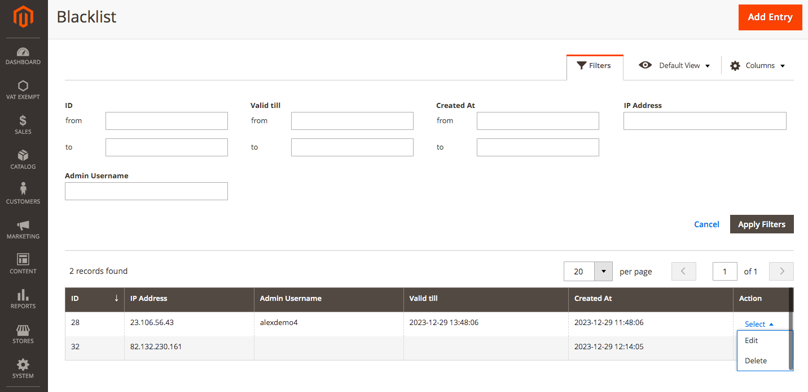
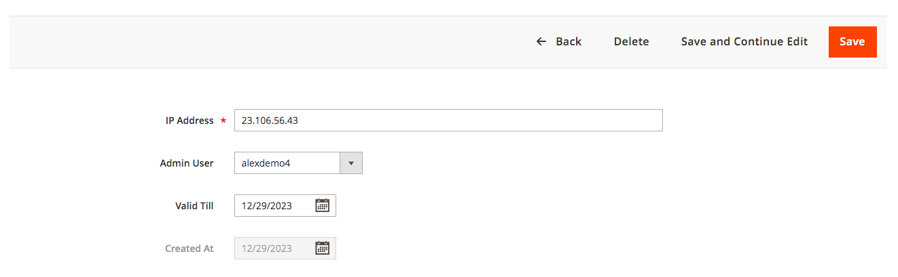
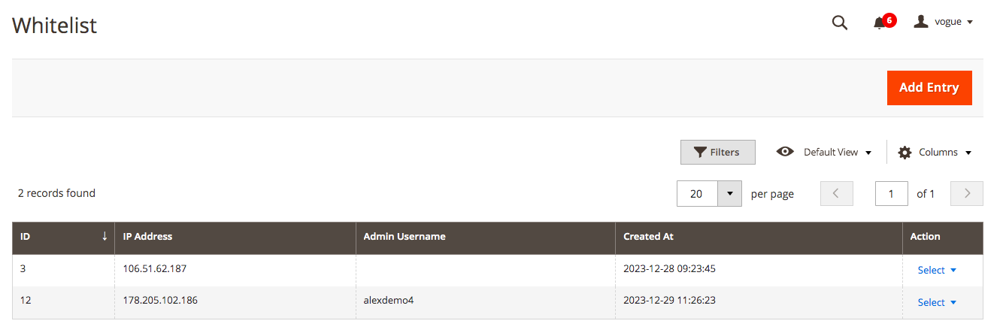
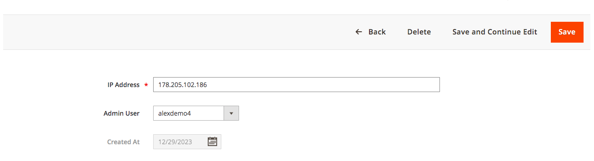

# Magento 2 Advanced Admin Login Security

### <mark style="color:blue;">Installation and User Guide for Magento 2 Advanced Admin Login Security Extension</mark>

**Table of Contents**

1. [_Installation_ ](magento-2-advanced-admin-login-security.md#bookmark0)
   * _Download Extension_
   * _Installation via app/code_&#x20;
   * _Installation via Composer_
2. [_Configuration Settings for Security Base_](magento-2-advanced-admin-login-security.md#toc\_250003)
   * _General Settings_&#x20;
3. [_Configuration Settings for Advanced Login Security_](magento-2-advanced-admin-login-security.md#bookmark3)
4. [_Scommerce Admin Login Security_](magento-2-advanced-admin-login-security.md#toc\_250003-1)
   * _Admin Login Attempts_
   * _Blacklist_
   * _Whitelist_

### <mark style="color:blue;">Installation</mark> <a href="#bookmark0" id="bookmark0"></a>

* <mark style="color:orange;">**Download Extension:**</mark> Once you have placed the order from our site then go to the Account section, click on My Downloadable Products, and download the extension package.


* <mark style="color:orange;">**Installation via app/code:**</mark> Upload the content of the module to your root folder. This will not overwrite the existing Magento folder or files, only the new contents will be added. After the successful upload of the package, run the below commands on the Magento 2 root directory.

```
php bin/magento setup:upgrade
php bin/magento setup:di:compile
php bin/magento setup:static-content:deploy
```

* <mark style="color:orange;">**Installation via Composer:**</mark> Please follow the guide provided in the below link to complete the installation via composer.


[installation-via-composer.md](../installation-via-composer.md)


### <mark style="color:blue;">Configuration Settings for Security Base</mark> <a href="#toc_250003" id="toc_250003"></a>

Go to **Admin > Stores > Configuration > Scommerce Configuration > Security Base**

#### <mark style="color:orange;">General Settings</mark> <a href="#toc_250002" id="toc_250002"></a>

* **Enabled –** Select “Yes” or “No” to enable or disable the module.
* **License Key –** Please add the license for the extension which is provided in the order confirmation email. Please note license keys are site URL specific. If you require license keys for dev/staging sites then please email us at [support@scommerce-mage.com](mailto:support@scommerce-mage.com).

<figure><figcaption></figcaption></figure>

### <mark style="color:blue;">Configuration Settings for Admin Login Security</mark> <a href="#bookmark3" id="bookmark3"></a>

Go to **Admin > Stores > Configuration > Scommerce Configuration > Admin Login Security**

#### <mark style="color:orange;">General Settings</mark> <a href="#bookmark4" id="bookmark4"></a>

* **Enabled Admin Login Security –** Select “Yes” or “No” to enable or disable the module.
* **Failed Attempts Limit :-** Set the attempt limit for admin login. Once exceeded the account will be locked out or blacklisted as per further configuration. Make sure this limit is less than default Magento configuration.
* **Apply Action On Exceed Limit:-** Choose the penalty for exceeding the failed attempt limit, between "Lockout" or "Blacklist. **Lockout** - When the number of failed attempts exceeds, the IP will remain blacklisted until the ‘Valid till' time limit. The 'Valid till' limit can be defined by the configuration 'Locked out period (in hours)'\
  **Blacklist** - This action will be applied when the 'Failed Attempts Limit’ is exceeded and the IP will be blacklisted until it is manually removed.
* **Locked out period (in hours):-** Set the “Valid Till” limit for the Lockout feature. The accounts will be locked out for period entered in this configuration.
* **Block Email Enabled:-** Enable Emails when any lockout or blacklist occurs. The email is sent to the Store Owner as well as the blacklisted/locked-out user.

<figure><figcaption></figcaption></figure>

* **IP Block Email Template:-** Select the email template to be used to send the email when a lockout/blacklist occurs.
* **Block And Lock Event Email Sender:-** Select the sender email from your Default Magento configuration in case of lockout or blacklist.
* **Recipient Block Email:-** Add the email (store owner) which will get emails about each and every lockout/blacklist. Whenever a lockout/blacklist happens the email will be sent to this address as well as the user.
* **Enabled Clear Login Attempts Logs Cron Job:-** Set "Yes" or "No" to enable or disable clear logs cron job.
* **Clear Login Attempts Logs Cron Schedule:-** Set the cron job to define how often you want to clear Login Attempts logs

<figure><figcaption></figcaption></figure>

* **Clear Login Attempts Logs Older Than X Days:-** Set the number of days based on which the Login attempts Logs will be cleared based which are older than the set days. For eg:- if set 2, any login attempts logs older than 2 days will be cleared.
* **Enabled Clear Lockouts Cron Job:-** Set "Yes" or "No" to enable or disable clear of not active lockouts by cron job
* **Clear Lockouts Cron Schedule:-** Set the cron job to define schedule how often you want to clear logs
* **Allowed Countries:-** Block users from one or multiple countries. If no country is selected, all countries are allowed.

<figure><figcaption></figcaption></figure>

* **Enabled Whitelist:-** Set "Yes" or "No" to enable or disable whitelisting for an IP. If enabled, the user won't be allowed to log in until the IP is whitelisted.
* **Whitelist Email Enabled:-** Set "Yes" or "No" to enable or disable whitelist Email. If this is enabled, the user will be sent an email with a link that allows them to either approve or deny the login.\
  **Approve** - By approving, the IP will be added to the whitelist.\
  **Deny** - The IP will be added to the blacklist if denied.
* **Whitelist request lifetime:-** Set the request lifetime to define how long whitelist request will be valid in hours By default 1 hour.
* **IP Whitelist Email Template:-** Select the email template for the login approval email that is sent to the user, based on the approval the user is whitelisted or blacklisted.
* **Whitelist Event Email Sender:-** Select the sender email to be used to send out the User approval/whitelist email to the user.
* **Recipient Email:-** Add the email (store owner) which will get emails about User approval/Whitelist emails. Whenever a user-approval/whitelist  happens the email will be sent to this address as well as the user so store owner can also approve or deny the user from the email.

<figure><figcaption></figcaption></figure>

### <mark style="color:blue;">Scommerce Admin Login Security</mark>  <a href="#toc_250003" id="toc_250003"></a>

Go to **Admin > System > Scommerce Admin Login Security>**

#### <mark style="color:orange;">Admin Login Attempts</mark> <a href="#toc_250002" id="toc_250002"></a>

The Admin Login Attempts grid keeps a record of every login attempt made to the admin panel with various key details such as:-

* ID
* IP Address
* Success
* Admin Username
* Created At

The grid is completely filterable with various columns such as ID, IP Address, Admin Username, Created At etc.

<figure><figcaption></figcaption></figure>

#### <mark style="color:orange;">Blacklist</mark> <a href="#toc_250002" id="toc_250002"></a>

The blacklist records grid contains information about all the blacklist users with several details such as ID, IP Address, Admin Username, Valid till, Created At, and Action. This grid is completely filterable. Each of the record can be deleted or edited from the Action column.

<figure><figcaption></figcaption></figure>

Go to **Action>Edit** and you can change various details for each of the records such as IP Address, Username, and Valid till date.

<figure><figcaption></figcaption></figure>

#### <mark style="color:orange;">Whitelist</mark> <a href="#toc_250002" id="toc_250002"></a>

The Whitelist records grid contains information about all the blacklist users with several details such as ID, IP Address, Admin Username, Created At, and Action. This grid is completely filterable. Each of the records can be deleted or edited from the Action column.

<figure><figcaption></figcaption></figure>

Go to **Action>Edit** and you can change various details for each of the records such as IP Address, and Username.

<figure><figcaption></figcaption></figure>

If you have a question related to this extension please check out our **FAQ Section** first. If you can't find the answer you are looking for then please contact [**support@scommerce-mage.com**](mailto:core@scommerce-mage.com)**.**
