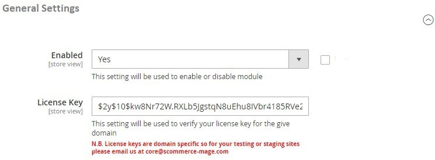
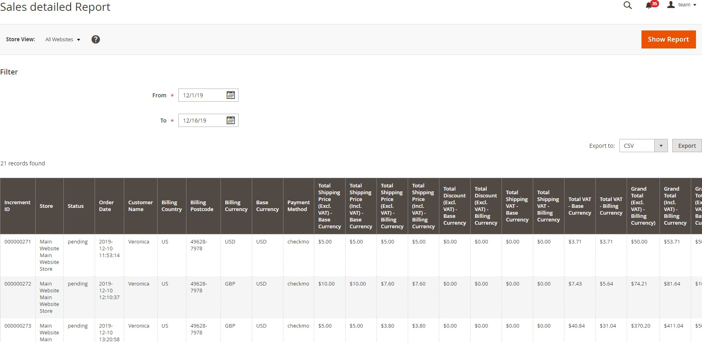
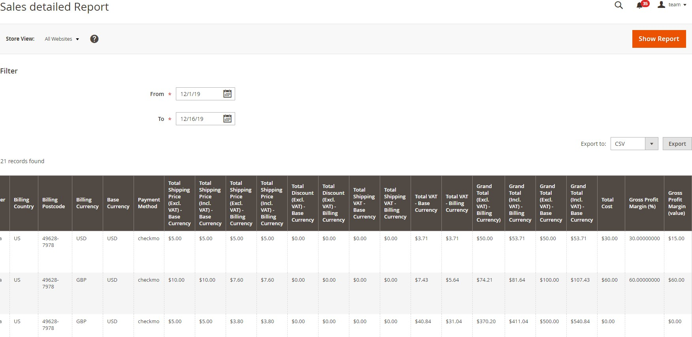
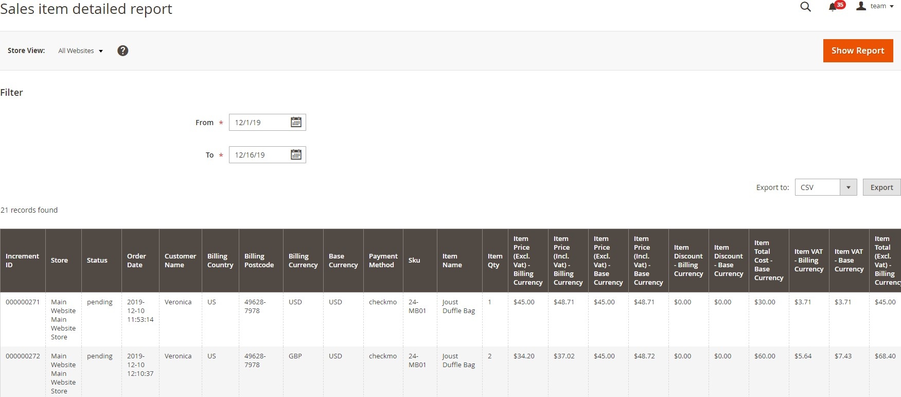
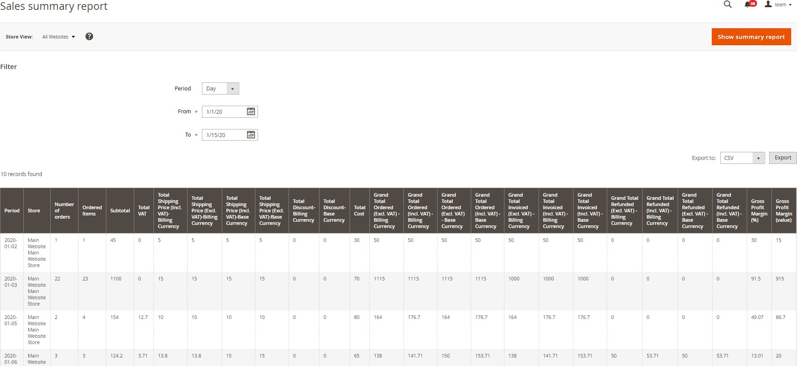

# Magento 2 Advanced Reporting Extension

### <mark style="color:blue;">Installation and User Guide for Magento 2 Advanced Reporting Extension</mark>

### Table of Contents

1. __[_Installation_ ](magento-2-advanced-reporting-extension.md#\_bookmark0)__
   * _Upload Package_&#x20;
   * _Install Extension_&#x20;
2. __[_Configuration Settings for Advanced Reporting_ ](magento-2-advanced-reporting-extension.md#\_bookmark3)__
   * _General Settings_&#x20;
3. __[_Reports of Advanced Reporting_ ](magento-2-advanced-reporting-extension.md#\_bookmark5)__
   * _Sales Detailed Report_&#x20;
   * _Sales Item Detailed Report_&#x20;
   * _Sales Summary Report_&#x20;

### <mark style="color:blue;">Installation</mark> <a href="#_bookmark0" id="_bookmark0"></a>

* <mark style="color:orange;">**Installation via app/code:**</mark>** ** Upload the content of the module to your root folder. This will not overwrite the existing Magento folder or files, only the new contents will be added. After the successful upload of the package, run below commands on Magento 2 root directory.

```
php bin/magento setup:upgrade
php bin/magento setup:di:compile
php bin/magento setup:static-content:deploy
```

* <mark style="color:orange;">**Installation via Composer:**</mark> Please follow the guide provided in the below link to complete the installation via composer.


[installation-via-composer.md](../installation-via-composer.md)


### <mark style="color:blue;">Configuration Settings for Advanced Reporting</mark> <a href="#_bookmark3" id="_bookmark3"></a>

Go to **Admin > Stores > Configuration > Scommerce Configuration > Advanced Reporting**

#### <mark style="color:orange;">General Settings</mark> <a href="#_bookmark4" id="_bookmark4"></a>

* **Enabled -** Select “Yes” or “No” to enable or disable the module.
* **License Key -** Please add the license for the extension which is provided in the order confirmation email. Please note license keys are site URL specific. If you require license keys for dev/staging sites then please email us at [core@scommerce-mage.com](mailto:core@scommerce-mage.com)

<figure><figcaption></figcaption></figure>

### <mark style="color:blue;">Reports of Advanced Reporting</mark> <a href="#_bookmark5" id="_bookmark5"></a>

#### Go to Admin > Scommerce Configuration > Reports > Advanced Reporting

#### <mark style="color:orange;">Sales Detailed Report</mark>

You can see the sales detailed report at, **Admin > Reports > Advanced Reports > Sales Detailed Report.**

#### The grid will have following columns:-

* Increment Id - Order number
* Store - Store name
* Status - Status of the order, pending/processing/complete/closed
* Order Date
* Customer Name
* Billing Country
* Billing Postcode
* Billing Currency
* Base Currency
* Payment Method
* Total Shipping Price (Excl. VAT)- Base Currency
* Total Shipping Price (Incl. VAT) – Base Currency
* Total Shipping Price (Excl. VAT) – Billing Currency
* Total Shipping Price (Incl. VAT) – Billing Currency
* Total Discount - Base Currency
* Total Discount - Billing Currency
* Total Shipping VAT – Base Currency
* Total Shipping VAT – Billing Currency
* Total VAT – Base Currency
* Total VAT – Billing Currency
* Grand Total (Excl. VAT) – Billing Currency
* Grand Total (Incl. VAT) – Billing Currency
* Grand Total (Excl. VAT) – Base Currency
* Grand Total (Incl. VAT) – Base Currency
* Total Cost
* Gross Profit Margin (%) = ((Grand Total (Excl. Vat) – (Total Cost + Total Shipping Price (Excl. VAT) + Total Discount (Excl. VAT))) / Grand Total (Excl. Vat)) \* 100
* Gross Profit Margin (value) = (Grand Total (Excl. Vat) – (Total Cost + Total Shipping Price (Incl. VAT) + Total Discount (Incl. VAT))))





#### <mark style="color:orange;">**Sales Item Detailed Report**</mark>&#x20;

It shows you the item based report with Item Price, Item Cost, Item Discount and Gross Profit Margin (%, value) and with the arranged data, you can immediately change the strategies for the better sales. You can see the report at **Admin > Reports > Advanced Reports > Sales Item Detailed Report.**

#### The grid will have following columns:-

* Increment Id - Order number
* Store - Store name
* Status - Status of the order, pending/processing/complete/closed
* Order date
* Customer Name
* Billing Country
* Billing Postcode
* Billing Currency
* Base Currency
* Payment Method
* Sku
* Item Name
* Item Qty
* Item Price (Excl. Vat) – Billing Currency
* Item Price (Incl. Vat) – Billing Currency
* Item Price (Excl. Vat) – Base Currency
* Item Price (Incl. Vat) – Base Currency
* Item Discount – Billing Currency
* Item Discount – Base Currency
* Item Total Cost – Base Currency
* Item VAT – Billing Currency
* Item VAT – Base Currency
* Item Total (Excl. Vat) – Billing Currency
* Item Total (Incl. Vat) – Billing Currency
* Item Total (Excl. Vat) – Base Currency
* Item Total (Incl. Vat) – Base Currency
* Gross Profit Margin (%) = )=((Item Price Excl. Vat) – (Item Cost + Item Discount (Incl. Vat))) \* Item Qty / Item Price (Excl. Vat)\*Item Qty) \* 100
* Gross Profit Margin (value) = (Item Price (Excl. Vat) – (Item Cost + Item Discount (Incl. Vat))) \* Item Qty



#### <mark style="color:orange;">**Sales Summary Report**</mark>** **&#x20;

You can see the summary report at **Admin > Reports>Advanced Reports > Sales Summary Report.** Based on date selection you can see the overall order based report with Grand Total and Gross Profit Margin (%, value).

#### The grid will have following columns:-

* Period - It will be Day/Month/Year as a period based on "From" and "To" date selection.
* Store - Store name
* Number of orders - Total number of orders based on filter and date selection
* Ordered Items - Total number of ordered items during the selected period
* Total VAT - Total VAT of all orders
* Total Shipping Price (Incl. VAT) – Billing Currency
* Total Shipping Price (Excl. VAT) – Billing Currency
* Total Shipping Price (Incl. VAT) – Base Currency
* Total Shipping Price (Excl. VAT) – Base Currency
* Total Discount – Billing Currency
* Total Discount – Base Currency
* Total Cost
* Grand Total Ordered (Excl. VAT) – Billing Currency
* Grand Total Ordered (Incl. VAT) – Billing Currency
* Grand Total Ordered (Excl. VAT) – Base Currency
* Grand Total Ordered (Incl. VAT) – Base Currency
* Grand Total Invoiced (Excl. VAT) – Billing Currency
* Grand Total Invoiced (Incl. VAT) – Billing Currency
* Grand Total Invoiced (Incl. VAT) – Base Currency
* Grand Total Refunded (Excl. VAT) – Billing Currency
* Grand Total Refunded (Incl. VAT) – Billing Currency
* Grand Total Refunded (Excl. VAT) – Base Currency
* Grand Total Refunded (Incl. VAT) – Base Currency
* Gross Profit Margin (%) = (((Grand Total (Invoiced (Incl. VAT)) – Grand Total (Refunded (Incl. VAT))) – (Total Cost + Total Shipping Price (Incl. VAT) + Total Discount (Incl. VAT))) / (Grand Total (Invoiced (Incl. VAT))) \* 100
* Gross Profit Margin (value) = (((Grand Total (Invoiced (Incl. VAT)) – Grand Total (Refunded (Incl. VAT))) – (Total Cost + Total Shipping Price (Incl. VAT) + Total Discount (Incl. VAT)))



If you have a question related to this extension please check out our [**FAQ Section** ](https://www.scommerce-mage.com/magento-2-advanced-reporting.html#customfaq)first. If you can't find the answer you are looking for then please contact [**support@scommerce-mage.com**](mailto:core@scommerce-mage.com)**.**
