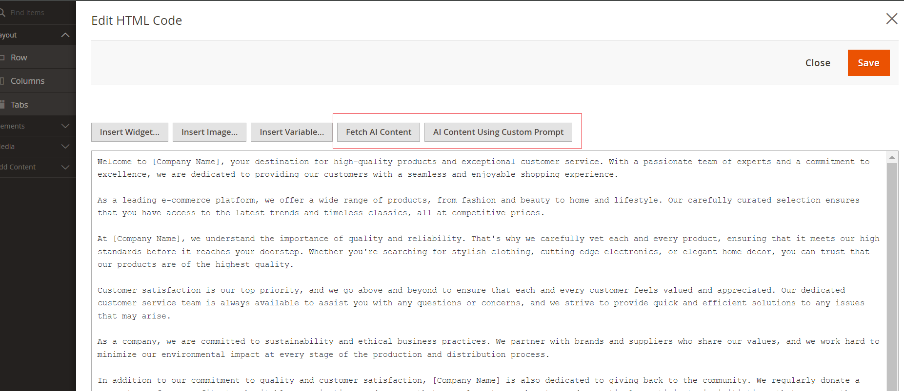
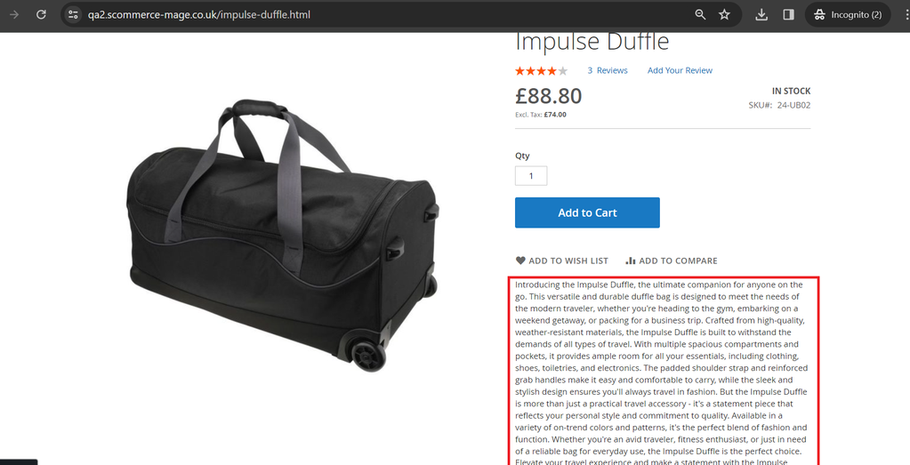
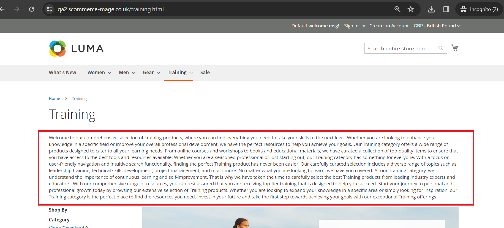
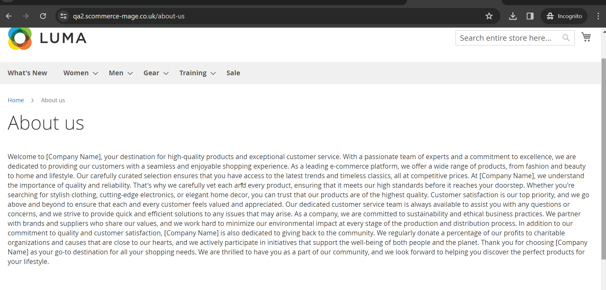

# Magento 2 AI Content Generator

### <mark style="color:blue;">Installation and User Guide for Magento 2 AI Content Generator</mark>

**Table of Contents**

1. [_Installation_ ](magento-2-ai-content-generator.md#\_bookmark0)
   * _Download Extension_
   * _Installation via app/code_&#x20;
   * _Installation via Composer_
2. [_Configuration Settings for AI Content Generator_](magento-2-ai-content-generator.md#bookmark3)
   * _General Settings_&#x20;
   * _Product Settings_&#x20;
   * _Category Settings_
   * _CMS Page Settings_
3. [_AI Content Generator Settings on Product Pages_](magento-2-ai-content-generator.md#bookmark3-1)
   * _Short Description_
   * _Description_
   * _Meta Title_
   * _Meta Description_
   * _Meta Keywords_
4. [_AI Content Generator Settings on Catgory Pages_](magento-2-ai-content-generator.md#bookmark3-2)
   * _Description_
   * _Meta Title_
   * _Meta Description_
   * _Meta Keywords_
5. [_AI Content Generator Settings on CMS Pages_](magento-2-ai-content-generator.md#bookmark3-3)
   * _Page Content_
   * _Meta Title_
   * _Meta Description_
   * _Meta Keywords_

### <mark style="color:blue;">Installation</mark> <a href="#bookmark0" id="bookmark0"></a>

* <mark style="color:orange;">**Download Extension:**</mark> Once you have placed the order from our site then go to My Account section and click on My Downloadable Products and download the extension package.


* <mark style="color:orange;">**Installation via app/code:**</mark> Upload the content of the module to your root folder. This will not overwrite the existing Magento folder or files, only the new contents will be added. After the successful upload of the package, run below commands on Magento 2 root directory.

```
composer require orhanerday/open-ai
php bin/magento setup:upgrade
php bin/magento setup:di:compile
php bin/magento setup:static-content:deploy en_GB en_US
```

* <mark style="color:orange;">**Installation via Composer:**</mark> Please follow the guide provided in the below link to complete the installation via composer.


[installation-via-composer.md](../installation-via-composer.md)




### <mark style="color:blue;">Configuration Settings for AI Content Generator</mark> <a href="#bookmark3" id="bookmark3"></a>

Go to **Admin > Stores > Configuration > Scommerce Configuration > AI Content Generator**

#### <mark style="color:orange;">General Settings</mark> <a href="#bookmark4" id="bookmark4"></a>

* **Enabled –** Select “Yes” or “No” to enable or disable the module.
* **License Key –** Please add the license for the extension which is provided in the order confirmation email. Please note license keys are site URL specific. If you require license keys for dev/staging sites then please email us at [support@scommerce-mage.com](mailto:support@scommerce-mage.com).
* **Content Writing using Chat GPT** - Set "Yes" to use ChatGPT to generate content and set "No" to configure Google Gemini to be used for content generation.
* **Chat GPT versions -** Select the ChatGPT version from the available option that you want to use to generate content.
* **Chat GPT API Key -** Enter the API key from Chat GPT ([https://help.openai.com/en/articles/4936850-where-do-i-find-my-openai-api-key](https://help.openai.com/en/articles/4936850-where-do-i-find-my-openai-api-key))

<div data-full-width="true">

<figure><figcaption></figcaption></figure>

</div>

**Note:-** Switch store view or website to expose the settings below:-

#### <mark style="color:orange;">Product Settings</mark> <a href="#bookmark4" id="bookmark4"></a>

* **Meta  Title Character Prompt–** Add the prompt for Meta Title on product pages. This prompt setting will be used to extract AI generated content from either ChatGPT or Google Gemini for Product Meta Title. This data can be overwritten or custom prompt can be used at the product level. Google recommendation for Meta title limit is up to 70 characters.
* **Meta Description Prompt –** Add the prompt for Meta Description on product pages. This prompt setting will be used to extract AI generated content from either ChatGPT or Google Gemini for Product Meta Description. This data can be overwritten or custom prompt can be used at the product level. Google recommendation for Meta Description limit is up to 160 characters.
* **Meta  Keywords Prompt–** Add the prompt for Meta Keywords on product pages. This prompt setting will be used to extract AI generated content from either ChatGPT or Google Gemini for Product Meta Keywords. This data can be overwritten or custom prompt can be used at the product level. Google recommendation for Meta keyword limit is up to 10 keyword phrases or 160 characters.
* **Short Description Prompt  –** Add the prompt for Short Description on product pages. This prompt setting will be used to extract AI generated content from either ChatGPT or Google Gemini for Product Short Description Title. This data can be overwritten or custom prompt can be used at the product level. Google recommendation for Short Description is up to 200 words.
* **Product Description Prompt  –** Add the prompt for Product Description on product pages. This prompt setting will be used to extract AI generated content from either ChatGPT or Google Gemini for Product Description. This data can be overwritten or custom prompt can be used at the product level. Google recommendation for Page Description limit is up to 3600 characters.

<div data-full-width="true">

<figure><figcaption></figcaption></figure>

</div>

#### <mark style="color:orange;">Category Settings</mark> <a href="#bookmark4" id="bookmark4"></a>

* **Meta  Title Character Prompt–** Add the prompt for Meta Title on category pages. This prompt setting will be used to extract AI generated content from either ChatGPT or Google Gemini for Category Meta Title. This data can be overwritten or custom prompt can be used at the category level. Google recommendation for Meta title limit is up to 70 characters.
* **Meta Description Prompt –** Add the prompt for Meta Description on category pages. This prompt setting will be used to extract AI generated content from either ChatGPT or Google Gemini for Category Meta Description. This data can be overwritten or custom prompt can be used at the category level. Google recommendation for Meta Description limit is up to 160 characters.
* **Meta  Keywords Prompt–** Add the prompt for Meta Keywords on category pages. This prompt setting will be used to extract AI generated content from either ChatGPT or Google Gemini for Category Meta Keywords. This data can be overwritten or custom prompt can be used at the category level. Google recommendation for Meta keyword limit is up to 10 keyword phrases or 160 characters.
* **Category Description Prompt  –** Add the prompt for Category Description on category pages. This prompt setting will be used to extract AI generated content from either ChatGPT or Google Gemini for Category Page Description. This data can be overwritten or custom prompt can be used at the category level. Google recommendation for Page Description limit is up to 3600 characters.

<div data-full-width="true">

<figure><figcaption></figcaption></figure>

</div>

#### <mark style="color:orange;">CMS Page Settings</mark> <a href="#bookmark4" id="bookmark4"></a>

* **Meta  Title Character Prompt–** Add the prompt for Meta Title on CMS Pages. This prompt setting will be used to extract AI generated content from either ChatGPT or Google Gemini for Content Meta Title. This data can be overwritten or custom prompt can be used at the CMS page level. Google recommendation for Meta title limit is up to 70 characters.
* **Meta Description Prompt –** Add the prompt for Meta Description on CMS Pages. This prompt setting will be used to extract AI generated content from either ChatGPT or Google Gemini for Content Meta Description. This data can be overwritten or custom prompt can be used at the CMS page level. Google recommendation for Meta Description limit is up to 160 characters..
* **Meta  Keywords Prompt–** Add the prompt for Meta Keywords on CMS Pages. This prompt setting will be used to extract AI generated content from either ChatGPT or Google Gemini for Content Meta Keywords. This data can be overwritten or custom prompt can be used at the CMS page level. Google recommendation for Meta keyword limit is up to 10 keyword phrases or 160 characters.
* **Page Content Prompt  –** Add the prompt for CMS pages content. This prompt setting will be used to extract AI generated content from either ChatGPT or Google Gemini for Content Page Description. This data can be overwritten or custom prompt can be used at the CMS Page level. Google recommendation for Page Description limit is up to 3600 characters.

<div data-full-width="true">

<figure><figcaption></figcaption></figure>

</div>

### <mark style="color:blue;">AI Content Generator Settings on Product Pages</mark> <a href="#bookmark3" id="bookmark3"></a>

AI content generator works with the following fields on the product pages. Go to **Admin>Catalog>Product** and then select any product.

#### <mark style="color:orange;">Short Description</mark> <a href="#bookmark4" id="bookmark4"></a>

Click on **Fetch Content** and Based on the prompt set in the configuration the content is generated and populated automatically into this field.&#x20;

<figure><figcaption></figcaption></figure>

In case you want to add a custom prompt for this product simply click on **AI Content Using Custom Prompt** and add your prompt then when you click **Fetch Content** the content is generated based on your custom prompt.

<div data-full-width="true">

<figure><figcaption></figcaption></figure>

</div>

#### <mark style="color:orange;">Description</mark> <a href="#bookmark4" id="bookmark4"></a>

Edit the description with page builder and when add a HTML element the AI Content Generator options are present. Click on **Fetch Content** and Based on the prompt set in the configuration the content is generated and populated automatically into this field. In case you want to add a custom prompt for this product simply click on **AI Content Using Custom Prompt** and add your prompt then when you click **Fetch Content** the content is generated based on your custom prompt.

<div data-full-width="true">

<figure><figcaption></figcaption></figure>

</div>

#### <mark style="color:orange;">Meta Title</mark> <a href="#bookmark4" id="bookmark4"></a>

Go to Product settings>Search Engine Optimization. Click on **Fetch Content** below Meta Title and based on the prompt set in the configuration the content is generated and populated automatically into this field. In case you want to add a custom prompt for this product simply click on **AI Content Using Custom Prompt** and add your prompt then when you click **Fetch Content** the content is generated based on your custom prompt.

<div data-full-width="true">

<figure><figcaption></figcaption></figure>

</div>

#### <mark style="color:orange;">Meta Description</mark> <a href="#bookmark4" id="bookmark4"></a>

Go to Product settings>Search Engine Optimization. Click on **Fetch Content** below Meta Description and based on the prompt set in the configuration the content is generated and populated automatically into this field. In case you want to add a custom prompt for this product simply click on **AI Content Using Custom Prompt** and add your prompt then when you click **Fetch Content** the content is generated based on your custom prompt.

<div data-full-width="true">

<figure><figcaption></figcaption></figure>

</div>

#### <mark style="color:orange;">Meta Keywords</mark> <a href="#bookmark4" id="bookmark4"></a>

Go to Product settings>Search Engine Optimization. Click on **Fetch Content** below Meta Keywords and based on the prompt set in the configuration the content is generated and populated automatically into this field. In case you want to add a custom prompt for this product simply click on **AI Content Using Custom Prompt** and add your prompt then when you click **Fetch Content** the content is generated based on your custom prompt.

<div data-full-width="true">

<figure><figcaption></figcaption></figure>

</div>

### <mark style="color:blue;">AI Content Generator Settings on Category Pages</mark> <a href="#bookmark3" id="bookmark3"></a>

#### <mark style="color:orange;">Description</mark> <a href="#bookmark4" id="bookmark4"></a>

Edit the description with page builder and when add a HTML element the AI Content Generator options are present. Click on **Fetch Content** and Based on the prompt set in the configuration the content is generated and populated automatically into this field. In case you want to add a custom prompt for this product simply click on **AI Content Using Custom Prompt** and add your prompt then when you click **Fetch Content** the content is generated based on your custom prompt.

\


<div data-full-width="true">

<figure><figcaption></figcaption></figure>

</div>

#### <mark style="color:orange;">Meta Title</mark> <a href="#bookmark4" id="bookmark4"></a>

Go to Category settings>Search Engine Optimization. Click on **Fetch Content** below Meta Title and based on the prompt set in the configuration the content is generated and populated automatically into this field. In case you want to add a custom prompt for this product simply click on **AI Content Using Custom Prompt** and add your prompt then when you click **Fetch Content** the content is generated based on your custom prompt.

<div data-full-width="true">

<figure><figcaption></figcaption></figure>

</div>

#### <mark style="color:orange;">Meta Description</mark> <a href="#bookmark4" id="bookmark4"></a>

Go to Category settings>Search Engine Optimization. Click on **Fetch Content** below Meta Description and based on the prompt set in the configuration the content is generated and populated automatically into this field. In case you want to add a custom prompt for this product simply click on **AI Content Using Custom Prompt** and add your prompt then when you click **Fetch Content** the content is generated based on your custom prompt.

<div data-full-width="true">

<figure><figcaption></figcaption></figure>

</div>

#### <mark style="color:orange;">Meta Keywords</mark> <a href="#bookmark4" id="bookmark4"></a>

Go to Category settings>Search Engine Optimization. Click on **Fetch Content** below Meta Keywords and based on the prompt set in the configuration the content is generated and populated automatically into this field. In case you want to add a custom prompt for this product simply click on **AI Content Using Custom Prompt** and add your prompt then when you click **Fetch Content** the content is generated based on your custom prompt.

<div data-full-width="true">

<figure><figcaption></figcaption></figure>

</div>

### <mark style="color:blue;">AI Content Generator Settings on CMS Pages</mark> <a href="#bookmark3" id="bookmark3"></a>

#### <mark style="color:orange;">Page Content</mark> <a href="#bookmark4" id="bookmark4"></a>

Edit the content with page builder and when add a HTML element the AI Content Generator options are present. Click on **Fetch Content** and Based on the prompt set in the configuration the content is generated and populated automatically into this field. In case you want to add a custom prompt for this product simply click on **AI Content Using Custom Prompt** and add your prompt then when you click **Fetch Content** the content is generated based on your custom prompt.

\


<div data-full-width="true">

<figure><figcaption></figcaption></figure>

</div>

#### <mark style="color:orange;">Meta Title</mark> <a href="#bookmark4" id="bookmark4"></a>

Go to Page settings>Search Engine Optimization. Click on **Fetch Content** below Meta Title and based on the prompt set in the configuration the content is generated and populated automatically into this field. In case you want to add a custom prompt for this product simply click on **AI Content Using Custom Prompt** and add your prompt then when you click **Fetch Content** the content is generated based on your custom prompt.

<div data-full-width="true">

<figure><figcaption></figcaption></figure>

</div>

#### <mark style="color:orange;">Meta Description</mark> <a href="#bookmark4" id="bookmark4"></a>

Go to Page settings>Search Engine Optimization. Click on **Fetch Content** below Meta Description and based on the prompt set in the configuration the content is generated and populated automatically into this field. In case you want to add a custom prompt for this product simply click on **AI Content Using Custom Prompt** and add your prompt then when you click **Fetch Content** the content is generated based on your custom prompt.

<div data-full-width="true">

<figure><figcaption></figcaption></figure>

</div>

#### <mark style="color:orange;">Meta Keywords</mark> <a href="#bookmark4" id="bookmark4"></a>

Go to Page settings>Search Engine Optimization. Click on **Fetch Content** below Meta Keywords and based on the prompt set in the configuration the content is generated and populated automatically into this field. In case you want to add a custom prompt for this product simply click on **AI Content Using Custom Prompt** and add your prompt then when you click **Fetch Content** the content is generated based on your custom prompt.

<div data-full-width="true">

<figure><figcaption></figcaption></figure>

</div>

### <mark style="color:blue;">Frontend</mark> <a href="#bookmark3" id="bookmark3"></a>

AI content generator generates content on all Category, Product, CMS Pages. Please check some of the frontend screengrabs of the generated content:-

#### <mark style="color:orange;">Product Pages</mark> <a href="#bookmark4" id="bookmark4"></a>

<div data-full-width="true">

<figure><figcaption></figcaption></figure>

</div>

#### <mark style="color:orange;">Category Pages</mark> <a href="#bookmark4" id="bookmark4"></a>

<div data-full-width="true">

<figure><figcaption></figcaption></figure>

</div>

#### <mark style="color:orange;">CMS Pages</mark> <a href="#bookmark4" id="bookmark4"></a>

<div data-full-width="true">

<figure><figcaption></figcaption></figure>

</div>

#### <mark style="color:orange;">Meta Keywords</mark> <a href="#bookmark4" id="bookmark4"></a>

<div data-full-width="true">

<figure><figcaption></figcaption></figure>

</div>

If you have a question related to this extension please check out our **FAQ Section** first. If you can't find the answer you are looking for then please contact [**support@scommerce-mage.com**](mailto:core@scommerce-mage.com)**.**
