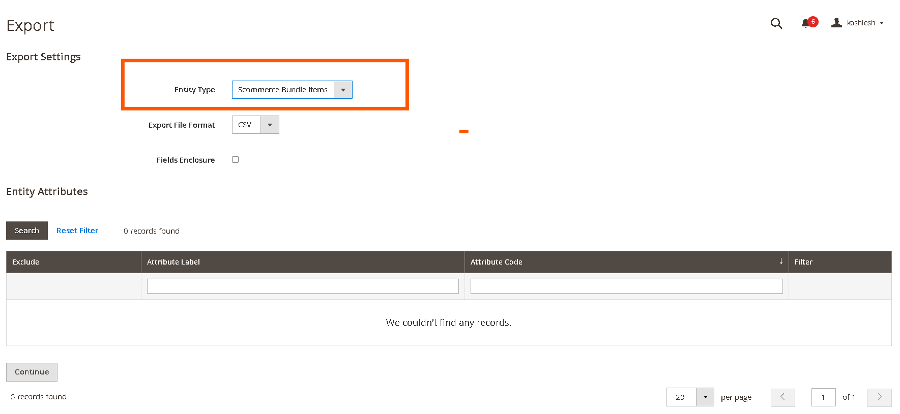

# Magento 2 Bundle Items Inventory

<mark style="color:blue;">Installation and User Guide for Magento 2 Bundle Items Inventory</mark>

**Table of Contents**

1. [_Installation_ ](magento-2-bundle-items-inventory.md#bookmark0)
   * _Download Extension_
   * _Installation via app/code_&#x20;
   * _Installation via Composer_
2. [_Configuration Settings for Bundle Items_](magento-2-bundle-items-inventory.md#toc_250003)
   * _General Settings_&#x20;
3. [_Workflow_](magento-2-bundle-items-inventory.md#bookmark3)
4. [_Setting Up Bundle Items Association_](magento-2-bundle-items-inventory.md#undefined)
   * _Associating Bundle Items & Defining Quantities_
   * _Updating or Removing Bundle Associations_
5. [_Inventory Automation_](magento-2-bundle-items-inventory.md#undefined-1)
   * _On Purchase_
   * _On Refund_
   * _Out-of-Stock Handling_
6. [_What Customers See_](magento-2-bundle-items-inventory.md#undefined-2)
7. [_Bulk Import & Export_](magento-2-bundle-items-inventory.md#undefined-3)
   * _Bulk Import_
   * _Bulk Export_

### <mark style="color:blue;">Installation</mark> <a href="#bookmark0" id="bookmark0"></a>

* <mark style="color:orange;">**Download Extension:**</mark> Once you have placed the order from our site then go to Account section and click on My Downloadable Products and download the extension package.


* <mark style="color:orange;">**Installation via app/code:**</mark> Upload the content of the module to your root folder. This will not overwrite the existing Magento folder or files, only the new contents will be added. After the successful upload of the package, run below commands on Magento 2 root directory.

```
php bin/magento setup:upgrade
php bin/magento setup:di:compile
php bin/magento setup:static-content:deploy
```

* <mark style="color:orange;">**Installation via Composer:**</mark> Please follow the guide provided in the below link to complete the installation via composer.


[installation-via-composer.md](../installation-via-composer.md)




### <mark style="color:blue;">Configuration Settings for Bundle Items</mark> <a href="#toc_250003" id="toc_250003"></a>

Go to **Admin > Stores > Configuration > Scommerce Configuration > Security Base**

#### <mark style="color:orange;">General Settings</mark> <a href="#toc_250002" id="toc_250002"></a>

* **Enabled –** Select “Yes” or “No” to enable or disable the module.
* **License Key –** Please add the license for the extension which is provided in the order confirmation email. Please note license keys are site URL specific. If you require license keys for dev/staging sites then please email us at [support@scommerce-mage.com](mailto:support@scommerce-mage.com).

<figure><figcaption></figcaption></figure>

### <mark style="color:blue;">Workflow</mark> <a href="#bookmark3" id="bookmark3"></a>

The **Magento 2 Bundle Items Inventory** extension allows store administrators to associate any number of component products with simple items in their catalogue—each with a precise quantity. This setup enables inventory deduction and restoration for both main and associated (bundle) items during purchases and refunds, streamlining complex product management and keeping total inventory accurate.

### <mark style="color:blue;">**Setting Up Bundle Item Associations**</mark> <a href="#undefined" id="undefined"></a>

#### <mark style="color:orange;">**Associating Bundle Items & Defining Quantities**</mark>

1. **Navigate to Products:**\
   `Catalog > Products` in your Magento Admin.
2. **Edit a Simple Product:**\
   Open the product you want to add bundle items to (e.g., "Deluxe Gift Set").
3. **Find the ‘Bundle Items’ Tab:**\
   (This extension will add a new tab or section named **Bundle Items**)
4. **Add Bundle Items:**
   * Click **‘Add Bundle Item’**.
   * Use the search/picker to select products you’d like to include (e.g., "Gift Box", "Greeting Card", "Ribbon").
   * Enter the number of each item required per unit (e.g., 1 ribbon per gift set, 2 cards per set).
5. **Save** the main product to commit changes.

**Example:**\
If "Family Baking Kit" requires 1 rolling pin, 2 spatulas, and 3 mixing bowls per kit, add each as a bundle item and specify quantities accordingly.

#### <mark style="color:orange;">**Updating or Removing Bundle Associations**</mark>

* **To change quantities:** Edit the relevant field next to each bundle item.
* **To remove an item:** Use the remove/delete option within the grid.

<div data-full-width="true"><figure><figcaption></figcaption></figure></div>

### <mark style="color:blue;">**Inventory Automation**</mark> <a href="#undefined" id="undefined"></a>

#### <mark style="color:orange;">**On Purchase**</mark>

When an order containing the main product is placed:

* The main product stock decreases by the quantity purchased.
* Each bundle item’s stock decreases based on the quantity defined per main product **×** number of mains sold.

**Example:**\
Purchasing 4 “Spa Kits” (each requires 2 candles and 1 bottle of oil):

* Main product: 4 deducted
* Candles: 8 deducted (4 × 2)
* Oil bottles: 4 deducted (4 × 1)

#### <mark style="color:orange;">**On Refund**</mark>

When an order for the main product is refunded:

* The main product stock increases by the quantity refunded.
* Each bundle item’s stock increases based on the refund quantity and their association.

**Example:**\
Refund 2 "Family Baking Kits":

* Main product: +2
* Rolling pins: +2
* Spatulas: +4 (2 × 2)
* Mixing bowls: +6 (2 × 3)

#### <mark style="color:orange;">**Out-of-Stock Handling**</mark>

By default, the main product can be purchased even if bundle items are out of stock.\
(_Future versions will allow configuration to prevent purchase if bundle items are unavailable._)

### <mark style="color:blue;">**What Customers See**</mark> <a href="#undefined" id="undefined"></a>

On the main product’s page, your customers will see all associated bundle items and the quantities per unit (e.g. “Includes: 2 Candles, 1 Essential Oil Bottle per kit”).

### <mark style="color:blue;">**Bulk Import & Export**</mark> <a href="#undefined" id="undefined"></a>

#### <mark style="color:orange;">**Bulk Import**</mark>

1. **Prepare a CSV File:** Each row should include:
   * Main Product SKU
   * Bundle Item SKU
   * Quantity per main product
2. **Go to:**\
   `System > Data Transfer > Import`
3. **Choose Entity Type:**\
   “Bundle Item Associations”
4. **Upload and Import:**
   * The system validates:
     * All SKUs exist
     * Quantities are whole numbers
     * No duplicate relationships are present
   * Errors will appear with guidance to fix.

### **Sample CSV Format**

| main\_product\_sku | bundle\_item\_sku | quantity\_per\_unit |
| ------------------ | ----------------- | ------------------- |
| spa-kit            | candle            | 2                   |
| spa-kit            | oil-bottle        | 1                   |
| baking-kit         | spatula           | 2                   |

<div data-full-width="true"><figure><figcaption></figcaption></figure></div>

#### <mark style="color:orange;">**Bulk Export**</mark>

1. **Go to:**\
   `System > Data Transfer > Export`
2. **Choose “Bundle Item Associations” as entity.**
3. **Download the CSV:**\
   The export will show:
   * Each main SKU
   * Associated bundle SKUs
   * Quantities for each link

<div data-full-width="true"><figure><figcaption></figcaption></figure></div>

<div data-full-width="true"><figure><figcaption></figcaption></figure></div>

If you have a question related to this extension please check out our **FAQ Section** first. If you can't find the answer you are looking for then please contact [**support@scommerce-mage.com**](mailto:core@scommerce-mage.com)**.**
