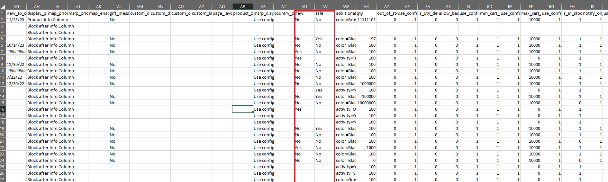

# Magento 2 Export Custom Product Attribute

### <mark style="color:blue;">Installation and User Guide for Magento 2 Export Custom Product Attribute Extension</mark>

**Table of Contents**

1. [_Installation_ ](magento-2-export-custom-product-attribute.md#\_bookmark0)
   * _Installation via app/code_&#x20;
   * _Installation via Composer_
2. [_Configuration Settings for Export Custom Product Attribute_](magento-2-export-custom-product-attribute.md#\_bookmark3)
   * _General Settings_&#x20;
3. [_Exporting Custom Product Attributes_](magento-2-export-custom-product-attribute.md#\_bookmark8)

### <mark style="color:blue;">Installation</mark> <a href="#bookmark0" id="bookmark0"></a>

* <mark style="color:orange;">**Installation via app/code:**</mark> Upload the content of the module to your root folder. This will not overwrite the existing Magento folder or files, only the new contents will be added. After the successful upload of the package, run below commands on Magento 2 root directory.

```
php bin/magento setup:upgrade
php bin/magento setup:di:compile
php bin/magento setup:static-content:deploy
```

* <mark style="color:orange;">**Installation via Composer:**</mark> Please follow the guide provided in the below link to complete the installation via composer.


[installation-via-composer.md](../installation-via-composer.md)


### <mark style="color:blue;">Configuration Settings for Export Custom Product Attribute</mark> <a href="#bookmark3" id="bookmark3"></a>

Go to **Admin > Stores > Configuration > Scommerce Configuration > Export Product Attribute**

#### <mark style="color:orange;">General Settings</mark> <a href="#bookmark4" id="bookmark4"></a>

* **Enabled –** Select “Yes” or “No” to enable or disable the module.
* **License Key –** Please add the license for the extension which is provided in the order confirmation email. Please note license keys are site URL specific. If you require license keys for dev/staging sites then please email us at [core@scommerce-mage.com](mailto:core@scommerce-mage.com)
* **Allowed Attributes –** Select the porduct attributes that you want to list in separate columns while exporting the catalog products.

<figure><figcaption></figcaption></figure>

### <mark style="color:blue;">Exporting Custom Product Attributes</mark> <a href="#bookmark8" id="bookmark8"></a>

Make sure the custom attributes that you want to import are selected under **Admin>Stores>Configuration>Scommerce Configuration>Export Custom Attributes>Allowed Attributes**. Please follow the steps below to do the export.

**Step 1:-** Go to Admin>System>Export

<figure><figcaption></figcaption></figure>

**Step 2:-** Select product from the 'Entity Type' dropdown list and select the attributes that you want to exclude from the export.

<figure><figcaption></figcaption></figure>

**Step 3:-** Click on continue and when the cron runs the export will be generated and added in the list below

<figure><figcaption></figcaption></figure>

&#x20;**Step 4:-** Finally, download the export file from the select dropdown.

<figure><figcaption></figcaption></figure>

**Step 5:-** You can see in the export file that our custom attributes new and sale are present in separate columns.

<figure><figcaption></figcaption></figure>

If you have a question related to this extension please check out our **FAQ Section** first. If you can't find the answer you are looking for then please contact [**support@scommerce-mage.com**](mailto:core@scommerce-mage.com)**.**
