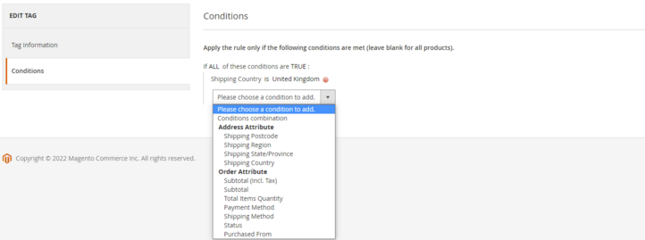
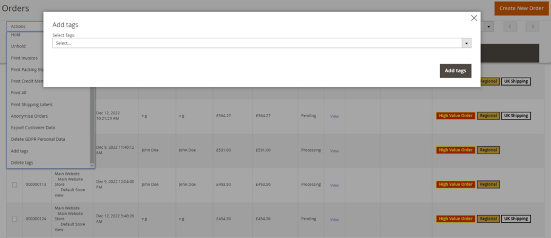

# Magento 2 Order Tagger

### <mark style="color:blue;">Installation and User Guide for Magento 2 Order Tagger Extension</mark>

**Table of Contents**

1. [_Installation_ ](magento-2-order-tagger.md#\_bookmark0)__
   * _Installation via app/code_&#x20;
   * _Installation via Composer_
2. __[_Configuration Settings for Order Tagger_](magento-2-order-tagger.md#\_bookmark3)__
   * _Order Tags Logs_
   * _Order Tags Grid_
   * _General Settings_&#x20;
3. __[_Types of Tags_](magento-2-order-tagger.md#\_bookmark3-1)__
   * _Static Tags_
   * _Dynamic Tags_
   * _Predefined Tags_
4. __[_Assign Tags_](magento-2-order-tagger.md#\_bookmark3-1)__
   * _Manually Assign/Remove Tags_&#x20;
   * _Assign Tags Based on Conditions_
5. __[_Tags in Action_](magento-2-order-tagger.md#\_bookmark3-2)__
   * _Order Grid_
   * _Filter Order Grid_

### <mark style="color:blue;">Installation</mark> <a href="#_bookmark0" id="_bookmark0"></a>

* <mark style="color:orange;">**Installation via app/code:**</mark>** ** Upload the content of the module to your root folder. This will not overwrite the existing Magento folder or files, only the new contents will be added. After the successful upload of the package, run below commands on Magento 2 root directory.

```
php bin/magento setup:upgrade
php bin/magento setup:di:compile
php bin/magento setup:static-content:deploy
```

* <mark style="color:orange;">**Installation via Composer:**</mark> Please follow the guide provided in the below link to complete the installation via composer.


[installation-via-composer.md](../installation-via-composer.md)


### <mark style="color:blue;">Configuration Settings for Order Tagger</mark> <a href="#_bookmark3" id="_bookmark3"></a>

Go to **Admin > Stores > Configuration > Scommerce Configuration > Order Tagger**

#### <mark style="color:orange;">General Settings</mark> <a href="#_bookmark4" id="_bookmark4"></a>

* **Enabled –** Select “Yes” or “No” to enable or disable the module.
* **License Key –** Please add the license key for the extension which is provided in the order confirmation email. Please note license keys are site URL specific. If you require license keys for dev/staging sites then please email us at [core@scommerce-mage.com](mailto:core@scommerce-mage.com)

<figure><figcaption></figcaption></figure>

#### <mark style="color:orange;">Order Tags Grid</mark> <a href="#_bookmark4" id="_bookmark4"></a>

Go to **Admin>Sales>Scommerce Order Tagger>Order Tags**

<figure><figcaption></figcaption></figure>

* **Name–** Enter the name of the tag.
* **Type–** Select “Static” or “Dynamic” or "Predefined". Static tags can be manually assigned and dynamic tags can be assigned using conditions. Predefined tags already have conditions set so you only to select the predefined tag type.
* **Sort Order–** Define the priority of the tag(0 being the highest priority), the highest priority tag will be displayed first.&#x20;
* **Text Color–** Add the text color for the tag.
* **Background Color–** Add the background color for the tag

<figure><figcaption></figcaption></figure>

**Conditions–** Add the conditions using order or address attributes.

<figure><figcaption></figcaption></figure>

#### <mark style="color:orange;">Order Tags Logs</mark> <a href="#_bookmark4" id="_bookmark4"></a>

Go to **Admin>Sales>Scommerce Order Tagger>Order Tags Logs**

The logs keep track of all the dynamic tags that are assigned to orders. It has its own set of filters which can be used to identify a specific assigned tag.

<figure><figcaption></figcaption></figure>

### <mark style="color:blue;">Types of Tags</mark> <a href="#_bookmark3" id="_bookmark3"></a>

There are three of tags within the extension static, dynamic, and predefined tags.&#x20;

#### <mark style="color:orange;">Static Tags</mark> <a href="#_bookmark4" id="_bookmark4"></a>

After creation, these types of tags are added manually via Magento order grid. Conditions are not added in these types of tags. They are not shown in order tags logs.

<figure><figcaption></figcaption></figure>

#### <mark style="color:orange;">Dynamic Tags</mark> <a href="#_bookmark4" id="_bookmark4"></a>

After creation, these types of tags are added automatically to the orders applicable.Conditions are added in these types of tags.They are shown in the Order tags logs.

<figure><figcaption></figcaption></figure>

#### <mark style="color:orange;">Predefined Tags</mark> <a href="#_bookmark4" id="_bookmark4"></a>

After creation, these types of tags are added automatically to the orders applicable.Conditions are not added in these types of tags as they are already set. They are shown in the Order tags logs Irrespective of the name, only one type of tag can be created for one 'Predefined' field.

<figure><figcaption></figcaption></figure>

There are five types of predefined tags to choose from:-

1. **Out of Stock :-** Gets automatically assigned to the orders whose products are out of stock. As soon as the product is available the tag gets removed automatically.
2. **Partially Shipped Order:-** Gets automatically assigned to orders that are partially shipped i.e only a few quantities are shipped from the order. As soon all the entire order is invoiced the tag gets removed automatically.&#x20;
3. **Partially Invoiced Order:-** Gets automatically assigned to orders that are partially invoiced i.e only some quantity of the order is invoiced. As soon all the entire order is invoiced the tag gets removed automatically.&#x20;
4. **Back Order:-** Gets automatically assigned to backorders. This tag doesn't work with downloadable and virtual products. As soon as all the items in the order are shipped the tag gets removed automatically.
5. **First Time Customer:-** Gets automatically assigned to the orders that are placed by first-time customers. This works for both guest/registered users.

### <mark style="color:blue;">Assign Tags</mark> <a href="#_bookmark3" id="_bookmark3"></a>

The tags can be assigned either manually or automatically using conditions set during the tag creation.&#x20;

#### <mark style="color:orange;">Manually Assign/Remove Tags</mark> <a href="#_bookmark4" id="_bookmark4"></a>

Go to **Admin>Sales>Orders** then select the order or multiple orders then click on the Actions dropdown and click on 'Add tags' or 'Remove tags'. Select the tag that you want add with the order from the 'Select Tags' dropdown and finally click on Add tags. &#x20;

**Note:-** Only static Tags can be manually assigned.

<figure><figcaption></figcaption></figure>

#### <mark style="color:orange;">Assign Tags Based on Conditions</mark> <a href="#_bookmark4" id="_bookmark4"></a>

Dynamic Tags are automatically assigned based on the conditions set while creating the tag. Go to **Admin>Sales>Scommerce Order Tagger>Order Tags** then create a new tag and set conditions from the left menu.&#x20;

### <mark style="color:blue;">Tags in Action</mark> <a href="#_bookmark3" id="_bookmark3"></a>

#### <mark style="color:orange;">Order Grid</mark> <a href="#_bookmark4" id="_bookmark4"></a>

The Tags are displayed in the order grid in a separate column. Multiple tags can be assigned and displayed for a single order.

<figure><figcaption></figcaption></figure>

#### <mark style="color:orange;">Filter Order Grid</mark> <a href="#_bookmark4" id="_bookmark4"></a>

Orders can be filtered based on the tags. New filter option can be found in the filters where orders can be sorted based on the tags selected. Go to **Admin>Sales>Filters** and click on the Tags dropdown to select the tags.&#x20;

<figure><figcaption></figcaption></figure>

If you have a question related to this extension please check out our [**FAQ Section**](https://www.scommerce-mage.com/magento-2-order-tagger.html#customfaq) **** first. If you can't find the answer you are looking for then please contact [**support@scommerce-mage.com**](mailto:core@scommerce-mage.com)**.**
