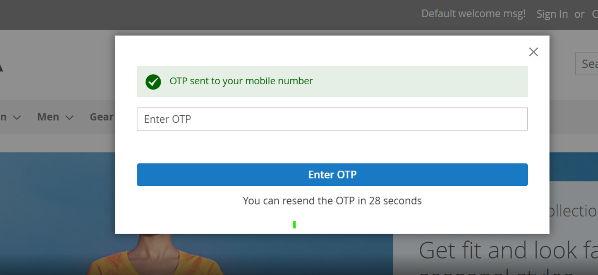
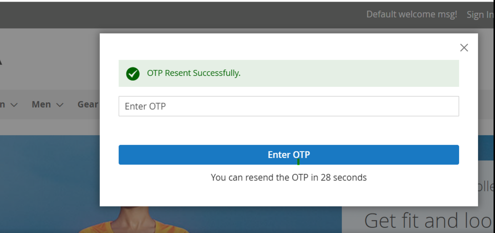
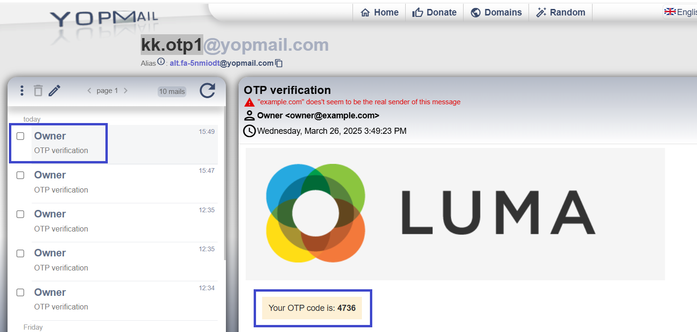
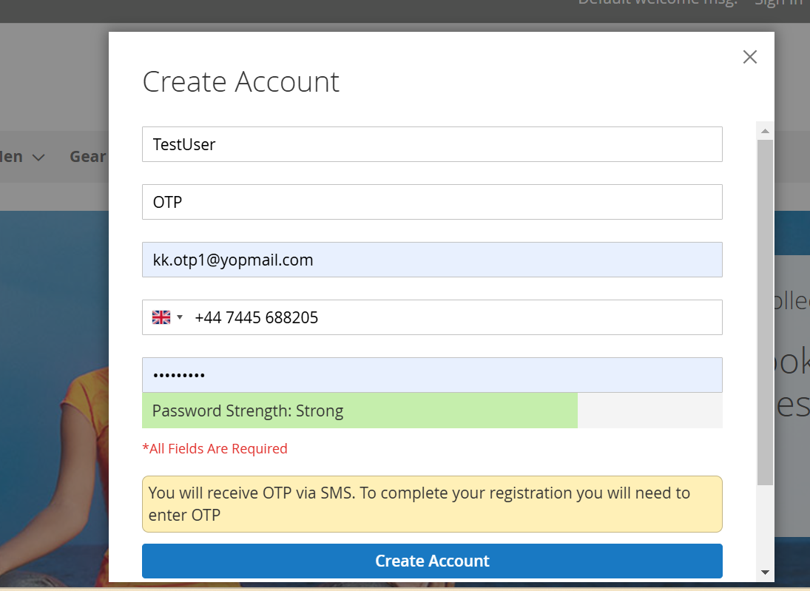
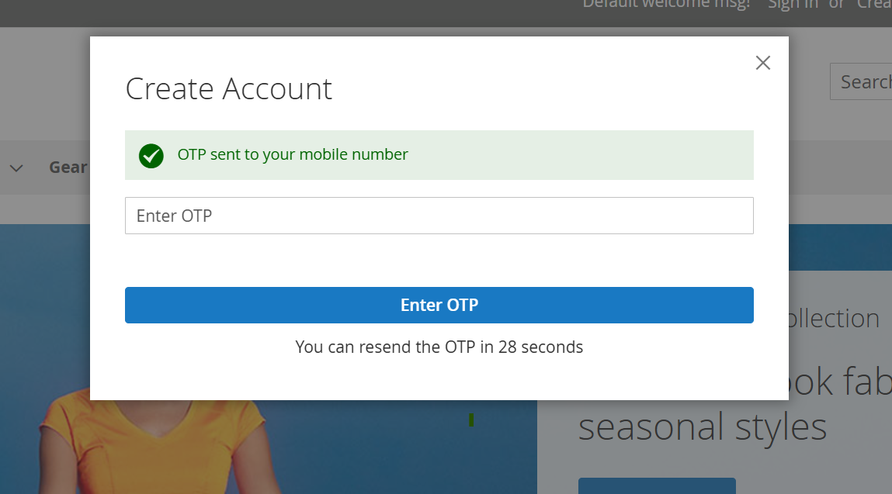
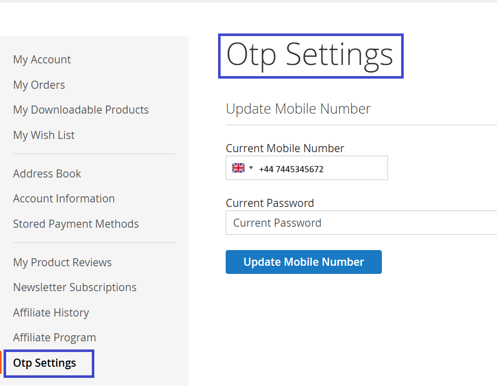

# Magento 2 OTP Login

### <mark style="color:blue;">Installation and User Guide for Magento 2 OTP Login Extension</mark>

**Table of Contents**

1. [_Installation_ ](magento-2-otp-login.md#bookmark0)
   * _Installation via app/code_&#x20;
   * _Installation via Composer_&#x20;
2. [_Configuration Settings for OTP Login_](magento-2-otp-login.md#bookmark3)
   * [_General Settings_ ](magento-2-otp-login.md#bookmark4)
   * [_OTP Configuration_](magento-2-otp-login.md#bookmark4-1)
   * [_API Configuration_](magento-2-otp-login.md#bookmark4-2)
   * [_Emails_ ](magento-2-otp-login.md#bookmark4-3)
   * [_Messages_](magento-2-otp-login.md#bookmark4-4)
3. [_Sign in using OTP_](magento-2-otp-login.md#bookmark6)
   * [_Login with Mobile_](magento-2-otp-login.md#bookmark4-5)
   * [_Login with Email_](magento-2-otp-login.md#bookmark4-6)
4. [_Registration using OTP_](magento-2-otp-login.md#bookmark6-1)
5. [_Update Mobile Number_](magento-2-otp-login.md#bookmark6-2)

### <mark style="color:blue;">Installation</mark> <a href="#bookmark0" id="bookmark0"></a>

* <mark style="color:orange;">**Installation via app/code:**</mark> Upload the content of the module to your root folder. This will not overwrite the existing Magento folder or files, only the new contents will be added. After the successful upload of the package, run below commands on Magento 2 root directory.

```
php bin/magento setup:upgrade
php bin/magento setup:di:compile
php bin/magento setup:static-content:deploy
```

* <mark style="color:orange;">**Installation via Composer:**</mark> Please follow the guide provided in the below link to complete the installation via composer.



### <mark style="color:blue;">Configuration Settings for OTP Login</mark> <a href="#bookmark3" id="bookmark3"></a>

Go to **Admin > Stores > Configuration > Scommerce Configuration > OTP Login**

#### <mark style="color:orange;">General Settings</mark> <a href="#bookmark4" id="bookmark4"></a>

* **Enabled -** Select “Yes” or “No” to enable or disable the module.
* **License Key -** Please add the license for the extension which is provided in the order confirmation email. Please note license keys are site URL specific. Please go to _Admin > Stores > Configuration > Scommerce Configuration > Core_ and click on "Verify" to verify the license key.&#x20;
* **Enable Login with Mobile** - Select "Yes" or "No". If set to "Yes" then users will be able to login to the store using their mobile number.

<div data-full-width="true"><figure><figcaption></figcaption></figure></div>

#### <mark style="color:orange;">OTP Configuration</mark> <a href="#bookmark4" id="bookmark4"></a>

* **Allowed Countries-** Select the countries allowed to be used for sending via SMS.
* **OTP Type -** You can select the OTP type that sent via sms from Number, Alphabets, and Alphanumeric.&#x20;
* **OTP Length** - Enter the length of the OTP sent.&#x20;
* **Expire Time-** Add the time after which the OTP is expired and can't be used after this duration.
* **Time Between Resend (sec)-** Enter the time in seconds after which users will be able to resend the otp.
* **Retry Count-** Enter the number of retries allowed to resend otp before the user is locked out.&#x20;
* **Lock Time (minutes)-** Add the lock time on multiple otp failures
* **Channel on Register-** Select the countries allowed to be used for sending via SMS.

<div data-full-width="true"><figure><figcaption></figcaption></figure></div>

#### <mark style="color:orange;">API Configuration</mark> <a href="#bookmark4" id="bookmark4"></a>

This section is to configure TWILIO as the SMS provider used for sending OTPs. Please visit [https://www.twilio.com/en-us](https://www.twilio.com/en-us) to create an account and extract the information to be added below:-

* **Sender ID-** Add the sender ID from Twilio.
* **Authorization Key -** Add the authorization key from Twilio
* **Mobile Number**- Add the mobile number from Twilio without the "+" sign

<div data-full-width="true"><figure><figcaption></figcaption></figure></div>

#### <mark style="color:orange;">Emails</mark> <a href="#bookmark4" id="bookmark4"></a>

This section is to configure the Sender Email and the Email template used to send OTPs via Email:-

* **Success Email Sender-** Select the Email to be used for sending successful login emails.&#x20;
* **Otp Email Template -** Select the Email template to be used for OTP emails.

<div data-full-width="true"><figure><figcaption></figcaption></figure></div>

#### <mark style="color:orange;">Messages</mark> <a href="#bookmark4" id="bookmark4"></a>

This section is to configure the Sender Email and the Email template used to send OTPs via Email:-

* **Register Channel Message-** Enter the message to be displayed on the registeration page for the users.&#x20;

<figure><figcaption></figcaption></figure>

### <mark style="color:blue;">Sign In Using OTP</mark> <a href="#bookmark6" id="bookmark6"></a>

#### <mark style="color:orange;">Login with Mobile</mark> <a href="#bookmark4" id="bookmark4"></a>

Go to the frontend and click on Sign In, you will it opens a popup to signin with Mobile. Add your Mobile number and click on Send OTP. Make sure Sign in with Mobile is enabled in the configuration only then you will be able to sign in using Mobile Number.

<div data-full-width="true"><figure><figcaption></figcaption></figure></div>

Enter the OTP to sign in&#x20;

<div data-full-width="true"><figure><figcaption></figcaption></figure></div>

If the OTP is expired click on resend to resend the otp.

<div data-full-width="true"><figure><figcaption></figcaption></figure></div>

#### <mark style="color:orange;">Login with Email</mark> <a href="#bookmark4" id="bookmark4"></a>

Go to the frontend and click on Sign In, you will it opens a popup, select Signin with Email.

<div data-full-width="true"><figure><figcaption></figcaption></figure></div>

Add credentials and proceed an OTP will be sent to your email, add to login to the store.

<div data-full-width="true"><figure><figcaption></figcaption></figure></div>

### <mark style="color:blue;">Registration using OTP</mark> <a href="#bookmark6" id="bookmark6"></a>

Go to the store and click on "Create an account", the registration will popup, add your details alongwith your phone number.

<div data-full-width="true"><figure><figcaption></figcaption></figure></div>

Finally click on Create Account and an OTP will be sent to your mobile number use it to register on the store.

<figure><figcaption></figcaption></figure>

### <mark style="color:blue;">Update Mobile Number</mark> <a href="#bookmark6" id="bookmark6"></a>

Users can update their Phone Number with the Account by signing in to the store and then going to the "My Account" section. From the left menu click on "OTP Settings". Add your new number and password to update the mobile number.&#x20;

<div data-full-width="true"><figure><figcaption></figcaption></figure></div>

If you have a question related to this extension please check out our [**FAQ Section**](https://www.scommerce-mage.com/magento-2-otp-login.html#customfaq) first. If you can't find the answer you are looking for then please contact [**support@scommerce-mage.com**](mailto:core@scommerce-mage.com)**.**

