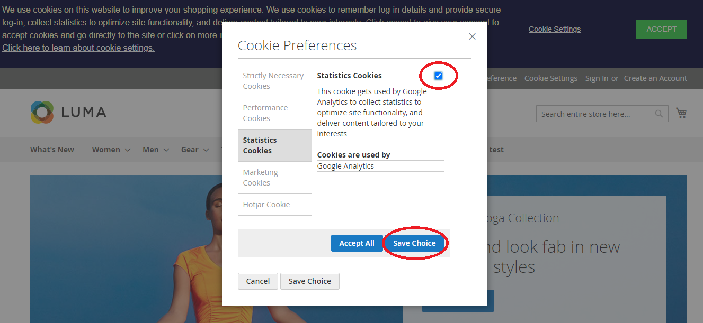

# Magento 2 Product Shelf Life

### <mark style="color:blue;">Installation and User Guide for Magento 2 Product Shelf life Extension</mark>

**Table of Contents**

1. __[_Installation_ ](magento-2-product-shelf-life.md#\_bookmark0)__
   * _Installation via app/code_&#x20;
   * _Installation via Composer_
2. __[_Configuration Settings for Product Shelf Life Expiration_ ](magento-2-product-shelf-life.md#\_bookmark3)__
   * _General Settings_&#x20;
   * _Batch Settings_&#x20;
   * _Product Batches Grid_&#x20;
   * _Add Sources at Product Level_&#x20;
   * _Add New Product Batch_&#x20;
   * _Un-Associate / Delete Product Batch_&#x20;
   * _Product Batches at Product Level_&#x20;
   * _Add Specific Batch to Product_&#x20;
   * _Select Batches During Shipment_&#x20;
   * _Batch Details on the Order View Page_&#x20;
   * _Deleting or Un- Associating a Product Batch_&#x20;
   * _Deleting_&#x20;
   * _Un-Associating_&#x20;
   * _Batch Report_&#x20;
   * _Import / Export Product Batches_&#x20;
   * _Batch Expiration Email Notification_&#x20;
3. [_API - Application Programming Interface_ ](magento-2-product-shelf-life.md#\_bookmark20)__
   * _Authentication Token_&#x20;
   * _Creating a Batch using API_&#x20;
   * _Retrieve all Batches using API_&#x20;
   * _Retrieve Date of Batch using ID 1 Using API_&#x20;
   * _Delete Batch with ID 1 Using API_&#x20;

### <mark style="color:blue;">Installation</mark> <a href="#_bookmark0" id="_bookmark0"></a>

* <mark style="color:orange;">**Installation via app/code:**</mark>** ** Upload the content of the module to your root folder. This will not overwrite the existing Magento folder or files, only the new contents will be added. After the successful upload of the package, run below commands on Magento 2 root directory.

```
php bin/magento setup:upgrade
php bin/magento setup:di:compile
php bin/magento setup:static-content:deploy
```

* <mark style="color:orange;">**Installation via Composer:**</mark> Please follow the guide provided in the below link to complete the installation via composer.


[installation-via-composer.md](../installation-via-composer.md)


### <mark style="color:blue;">Configuration Settings for Product Shelf Life Expiration</mark> <a href="#_bookmark3" id="_bookmark3"></a>

Go to **Admin > Stores > Configuration > Scommerce Configuration > Product Shelf Life Expiration**

#### <mark style="color:orange;">General Settings</mark> <a href="#_bookmark4" id="_bookmark4"></a>

* **Enabled -** Select “Yes” or “No” to enable or disable the module.
* **License Key –**Please add the license for the extension which is provided in the order confirmation email. Please note license keys are site URL specific. If you require license keys for dev/staging sites then please email us at [core@scommerce-mage.com.](file:///C:/Users/KoshleshDange/Downloads/Microsoft.SkypeApp\_kzf8qxf38zg5c!App/All/core%40scommerce-mage.com)


### Batch Settings <a href="#_bookmark5" id="_bookmark5"></a>

* **Batch expiry email notification period (number of days) -** Please define batch expiry email notification period. This setting will check the batch expiry date and will send an email notification to the admin for the same.
* **Batch expiry email notification (Yes/No) -** Please select “Yes” or “No” to “Enable” or “Disable” the email notification regarding batch expiration.
* **Disable batch once expired -** Please select “Yes” or “No” to disable the batch. It disables the batch automatically once their expiry date is passed and runs as part of cron job at midnight.
* **Email Addresses -** Please provide email addresses (comma separated) to send the batch expiration email notification.
* **Email Sender –** Please select sender/ from email addresses for Batch expiry updated.
* **Select Email Template -**Please select the email template for batch expiry email notification.
* **Cron Scheduler for expiry batch notification -** This setting will be used to send the email through the cron.
* **Batch Selection Attribute –** This setting will determine how batches are selected automatically.
* **Batch Selection Attribute Direction –** As per the batch selection attribute you can choose the direction for example Ascending(ASC) or Descending(DSC).
* **Batch Selection –** You can choose to select batches automatically based on batch selection attribute or you can set it to Manual. When Manual you will be able to select batches during shipment.


#### <mark style="color:orange;">Product Batches Grid</mark> <a href="#_bookmark6" id="_bookmark6"></a>

You can create and manage product batches from, **Admin> Product Batches**. This grid will have all the details about batches like ID, Batch Code, Product SKU, Batch Status, Batch Qty, Batch Expiry, Action/Edit and Source Inventory.

>)

* <mark style="color:orange;">**Add Sources at Product Level -**</mark>You can add product source from **Admin > Catalog > Select Products >** Click **"Assign Sources">** Select **"Source">** Click **"Done"** .

>)

* <mark style="color:orange;">**Add New Product Batch -**</mark>To create new product batch, go to **Admin > Product Batches>**click **'Add New Batch'.** It will take you to the new product batch page and by providing all the required details; you can create the new batch.

>)

* <mark style="color:orange;">**Un-Associate / Delete Product Batch -**</mark>Toun-associate and delete product batch, go to**Admin > Product Batches> Select Batch > Edit >**Click **"Un-Associate with Product''** and for **Delete** click on **"Delete"** button**.**

>)

#### <mark style="color:orange;">Product Batches at Product Level</mark> <a href="#_bookmark10" id="_bookmark10"></a>

When user enables the module then Product Batches section appears at, **Admin>Catalog>Product>Select Product>Edit>Product Batches.** From this section, users can add new batch or can associate specific existing batch to a product.

>)

#### <mark style="color:orange;">Add Specific Batch to Product</mark> <a href="#_bookmark11" id="_bookmark11"></a>

You can also add specific batches to a product from, **Admin > Catalog > Product > Select Product >Edit >Product Batches >**Click**"Add Specific Batch"**. It redirects to **Batch Grid** and by selecting batch **ID** you can associate active batches to a product.

>)

* <mark style="color:orange;">**Select Batches During Shipment -**</mark>To select the batch during shipment make sure **Batch Selection** is set to **manual** in the configuration then navigate to **Admin> Sales > Order > Select Order > View>Generate Invoice>Click on Ship.** When you scroll down on the page you will see the option to select the batches manually. The product quantity will be deducted from the selected batch. Please refer to the image below:-

>)

* <mark style="color:orange;">**Batch Details on the Order View Page -**</mark>To view theproduct batch related details, go to **Admin > Sales > Order > Select Order > View**.

>)

#### <mark style="color:orange;">Deleting or Un- Associating a Product Batch</mark> <a href="#_bookmark14" id="_bookmark14"></a>

* **Deleting: -**To delete a product batch, go to Catalog>Product Batches then select the product batch that you want to delete. From Action coloumn click Edit. Here you will see the option to delete the Product batch.

#### <mark style="color:red;">Note:- If an order has been shipped then you won’t be able to delete that product batch. You will see an error.</mark>

>)

* **Un-Associating:-** To Un-Associate a product batch, go to Catalog>Product Batches then select the product batch that you want to delete. From Action column click Edit. Here you will see the option to Un-Associate the Product batch.

>)

#### <mark style="color:red;">Note:- If an order has been shipped then you won’t be able to delete that product batch. You will see an error.</mark>

* <mark style="color:orange;">**Batch Report**</mark><mark style="color:orange;">:-</mark> To view the detailed batch report go to your admin panel then **Reports>Sales>Batches**. Here you can see all the orders associated with a product batch with the following information:-
* Order Number
* Purchase Date
* Customer
* Customer Group
* Product Name
* Batch code
* Batch Quantity
* Expiry Date

>)

#### <mark style="color:orange;">Import / Export Product Batches</mark> <a href="#_bookmark18" id="_bookmark18"></a>

To import and export product batches, go to **Admin > System >Import / Export**.

* **Import -** It updates the stock quantity and disables the batches if they are expired.
* **Export-**It exports the batches in the selected file format, e.g. CSV**.**

#### <mark style="color:blue;">Import Settings</mark>

>)

<mark style="color:blue;">**CSV File Format for Import -**</mark>** ** CSV file will have batch\_code, batch\_qty, batch\_status, batch\_expiry, product\_sku and source\_inventory.

>)

#### Export Settings

>)

* <mark style="color:orange;">**Batch Expiration Email Notification -**</mark>** ** When you select "Yes" for **"**Batch expiry email notification"from **Admin > Stores > Configuration > Scommerce Configuration > Product Shelf Life Expiration > Batch Settings**, then it sends an email notification for batch expiration.



### <mark style="color:blue;">API - Application Programming Interface</mark> <a href="#_bookmark20" id="_bookmark20"></a>

#### <mark style="color:orange;">Authentication Token</mark> <a href="#_bookmark21" id="_bookmark21"></a>

#### auth\_token can be received using the following: -

**You would need credentials to your store with admin rights Parameters:-**.Admin credentials

* Username
* Password

**POST URL:-** [http://baseurl/index.php/rest/V1/integration/admin/token](http://baseurl/index.php/rest/V1/integration/admin/token) Content-Type: application/json

{

"username": "admin", "password": "admin"

}

#### <mark style="color:orange;">Creating a Batch using API</mark> <a href="#_bookmark22" id="_bookmark22"></a>

#### Parameters:-

* Authorization token received from the above step
* Batch code
* Batch quantity
* Batch status
* Batch expiry
* Product SKU

**POSTURL:-**[http://baseurl/index.php/rest/V1/productbatches/createbatch](http://baseurl/index.php/rest/V1/productbatches/createbatch) Content-Type: application/json

Authorization: Bearer \{{auth\_token\}}

{

"batch\_code": "batchcode\_001", "batch\_qty": "10",

"batch\_status": "1",

"batch\_expiry": "2020-12-06", "product\_sku": "MH0001"

}

#### <mark style="color:orange;">Retrieve all Batches using API</mark> <a href="#_bookmark23" id="_bookmark23"></a>

#### Parameters:-

Authorization token

**GET URL:-**[http://baseurl/index.php/rest/V1/productbatches/getcollection](http://baseurl/index.php/rest/V1/productbatches/getcollection) Content-Type: application/json

Authorization: Bearer \{{auth\_token\}}

#### <mark style="color:orange;">Retrieve Date of Batch using ID 1 Using API: -</mark> <a href="#_bookmark24" id="_bookmark24"></a>

#### Parameters: -

* Authorization token
* Batch ID in URL

**GET URL:-**[http://baseurl/index.php/rest/V1/productbatches/getbatch?batchId=1](http://baseurl/index.php/rest/V1/productbatches/getbatch?batchId=1) Content-Type: application/json

Authorization: Bearer \{{auth\_token\}}

#### <mark style="color:orange;">Delete Batch with ID 1 Using API: -</mark> <a href="#_bookmark25" id="_bookmark25"></a>

#### Parameters: -

* Authorization token
* Batch ID

**PUT URL: -** [http://baseurl/index.php/rest/V1/productbatches/deletebatch](http://baseurl/index.php/rest/V1/productbatches/deletebatch) Content-Type: application/json

Authorization: Bearer \{{auth\_token\}}

{

"batchId": 1

}

If you have a question related to this extension please check out our [**FAQ Section**](https://www.scommerce-mage.com/magento-2-product-shelf-life.html#faq) **** first. If you can't find the answer you are looking for then please contact [**support@scommerce-mage.com**](mailto:core@scommerce-mage.com)**.**
