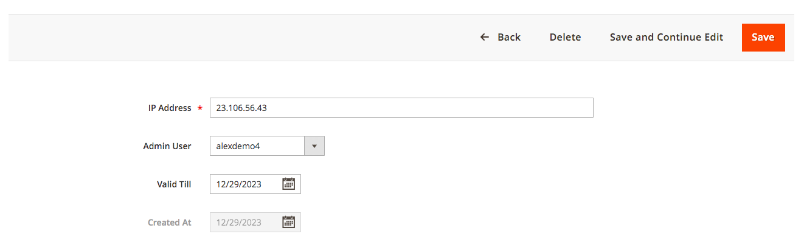

# Magento 2 Security Suite

### <mark style="color:blue;">Installation and User Guide for Magento 2 Security Suite Extension</mark>

**Table of Contents**

1. [_Installation_](magento-2-security-suite.md#bookmark0)&#x20;
   * _Download Extension_
   * _Installation via app/code_&#x20;
   * _Installation via Composer_
2. [_Configuration Settings for Security Base_](magento-2-security-suite.md#toc\_250003)
   * _General Settings_&#x20;
3. [_<mark style="color:blue;">Configuration Settings for Security Checklist</mark>_](magento-2-security-suite.md#bookmark3)
   * _General Settings_&#x20;
4. [_Configuration Settings for Admin Activity Logger_ ](magento-2-security-suite.md#bookmark3-1)
   * _General Settings_&#x20;
   * _Modules Activity Logger_&#x20;
   * _Admin Activity Logger_&#x20;
   * _Admin Activity Grid_&#x20;
   * _Admin Logger Detailed View for Admin Activities_&#x20;
   * _Admin Logger Detailed View for Item Info_
   * _Login Activity Grid_&#x20;
   * _Active Sessions Grid_
5. [_Configuration Settings for Advanced Login Security_](magento-2-security-suite.md#bookmark3-1)
6. [_Scommerce Admin Login Security_](magento-2-security-suite.md#toc\_250003-1)
   * _Admin Login Attempts_
   * _Blacklist_
   * _Whitelist_
7. [_<mark style="color:blue;">Security Checklist Report</mark>_](magento-2-security-suite.md#toc\_250003-2)
   * _Security Checklist Report_&#x20;

### <mark style="color:blue;">Installation</mark> <a href="#bookmark0" id="bookmark0"></a>

* <mark style="color:orange;">**Download Extension:**</mark> Once you have placed the order from our site then go to the Account section, click on My Downloadable Products, and download the extension package.


* <mark style="color:orange;">**Installation via app/code:**</mark> Upload the content of the module to your root folder. This will not overwrite the existing Magento folder or files, only the new contents will be added. After the successful upload of the package, run the below commands on the Magento 2 root directory.

```
php bin/magento setup:upgrade
php bin/magento setup:di:compile
php bin/magento setup:static-content:deploy
```

* <mark style="color:orange;">**Installation via Composer:**</mark> Please follow the guide provided in the below link to complete the installation via Composer.


[installation-via-composer.md](../installation-via-composer.md)




### <mark style="color:blue;">Configuration Settings for Security Base</mark> <a href="#toc_250003" id="toc_250003"></a>

Go to **Admin > Stores > Configuration > Scommerce Configuration > Security Base**

#### <mark style="color:orange;">General Settings</mark> <a href="#toc_250002" id="toc_250002"></a>

* **Enabled –** Select “Yes” or “No” to enable or disable the module.
* **License Key –** Please add the license for the extension which is provided in the order confirmation email. Please note license keys are site URL specific. If you require license keys for dev/staging sites then please email us at [support@scommerce-mage.com](mailto:support@scommerce-mage.com).

<figure><figcaption></figcaption></figure>

### <mark style="color:blue;">Configuration Settings for Security Checklist</mark> <a href="#bookmark3" id="bookmark3"></a>

Go to **Admin > Stores > Configuration > Scommerce Configuration > Security Checklist**

#### <mark style="color:orange;">General Settings</mark> <a href="#bookmark4" id="bookmark4"></a>

* **Enabled Security Checklist –** This setting will be used to enable or disable admin security checklist
* **Enable Database prefix check :-** This setting will be used to enable or disable check for DB prefix. Database prefix added in **app/etc/env.php** file, to make it work you also need to make changes in database.
* **Enable FE Captcha check:-** This setting will be used to enable or disable checks for Frontend Captcha. Go to **Stores > Configuration > Security > Google reCAPTCHA** Storefront in order to verify it.w
* **Enable BE Captcha check:-** This setting will be used to enable or disable checks for Backend Captcha. Go to Stores > **Configuration > Security > Google reCAPTCHA** Admin Panel and **Stores > Configuration > Admin > CAPTCHA** Storefront in order to verify it.
* **Enable Magento version check-** This setting will be used to enable or disable check for Magento Version and latest security patches.

<figure><figcaption></figcaption></figure>

* **Enable Admin Users check-:-** This setting will be used to enable or disable check for Admin Users Security. Especially usernames, password lifetime policy and login activity. **Go to Stores > Configuration > Advanced > Admin > Security** Or **Go to System > Permission > All users to manage admin users**
* **Admin Usernames Stop List:-** You can add list of usernames that shouldn't be used for admin accounts. Comma separated.
* **Enabled Admin Path Check:-** This setting will be used to enable or disable check for Admin Path Security. Admin Path is configured in **app/etc/env.php** file or go to **Advanced > Admin > Admin Base URL > Use Custom Admin Path** to change it
* **Admin Path Stop List:-** You can add list of paths that shouldn't be used for admin. Comma separated.
* **Enable Content Script Check:-** This setting will be used to enable or disable check for scripts added in your content or configuration

<figure><figcaption></figcaption></figure>

* **Enabled Checklist Check Cron Job:-** This setting will be used to enable or disable checklist cron job
* **Checklist Cron Schedule:-** This will allow you to define schedule how often you want to clear Login Attempts logs cron.

<figure><figcaption></figcaption></figure>

### <mark style="color:blue;">Configuration Settings for Admin Activity Logger</mark> <a href="#bookmark3" id="bookmark3"></a>

Go to **Admin > Stores > Configuration > Scommerce Configuration > Admin Activity Logger**

#### <mark style="color:orange;">General Settings</mark> <a href="#bookmark4" id="bookmark4"></a>

* **Enabled -** Select “Yes” or “No” to enable or disable the module.
* **License Key -** Please add the license for the extension which is provided in the order confirmation email. Please note license keys are site URL specific. If you require license keys for dev/staging sites then please email us at [core@scommerce-mage.com](mailto:core@scommerce-mage.com)
* **Admin Users Login Activity Enabled -** Enable / Disable activity. It will log login activity of the admin users.
* **Page visit History Enabled -** Enable / Disable page history visiting log.
* **Clear Admin Activity Logs After -** Enter value. Clear all admin activity logs will be cleared after X days.
* **Enabled Profiler -** Enable / Disable time profiler. Duration of the operations will be logged.


#### <mark style="color:orange;">Modules Activity Logger</mark> <a href="#bookmark5" id="bookmark5"></a>

* **Order -** Select “Yes” to enable. It will log order related activities.
* **Product -** Select “Yes” to enable. It will log product related activities.
* **Category -** Select “Yes” to enable. It will log category related activities.
* **Customer -** Select “Yes” to enable. It will log customer related activities.
* **Email Template -** Select “Yes” to enable.
* **Page -** Select “Yes” or “No” to Enable / Disable.
* **Block -** Select “Yes” or “No” to Enable / Disable.
* **Widget -** Select “Yes” or “No” to Enable / Disable.
* **Theme -** Select “Yes or “No” to Enable / Disable.
* **System Configuration -** Select “Yes” or “No” to Enable / Disable.
* **Product Attributes -** Select “Yes” or “No” to Enable / Disable.
* **Admin User -** Select “Yes” to enable. It will log all users activities.
* **SEO -** Select “Yes” or “No” to Enable / Disable.

>)

* <mark style="color:orange;">**Admin Activity Logger -**</mark> You can view admin activity logger from, **Admin > System > Scommerce Admin Activity Logger > Admin Activity / Login Activity.**

<figure><figcaption></figcaption></figure>

* <mark style="color:orange;">**Admin Activity Grid -**</mark> In the back-end under Admin Activity Logger grid you can view all the admin activities details from **Admin > System > Admin Activity Logger**. This grid will have, Admin Username, Name, Activity Type, Store View, Module, Full Action, IP, Item, Revert and Action columns.
  * **Date: -** The exact date and time of the activity performed.
  * **Admin Username: -** user name of the admin.
  * **Name: -** The name of the admin.
  * **Activity Type: -** Type of activity performed
  * **Store view: -** Name of the store view
  * **Module: -** The name of the module used in the activity.
  * **Full Action: -** It contains the URL path of the activity performed.
  * **IP Address: -** The IP address of the user.
  * **Item: -** Activity related item such as a product or system configuration changes.
  * **Revert: -** If the action is not complete then the REVERT column will have the notification.
  * **Action: -** It contains view where you can see the key details of the activity such as general and item info.

#### <mark style="color:orange;">Admin Activity Logger</mark>


* <mark style="color:orange;">**Admin Logger Detailed View for Admin Activities -**</mark> To get more details about each particular action simply click on the 'View' link from **Admin > System > Admin Activity Logger > Select Log > Click on 'View' > General, to view all the detailed data.**
  * You can view all the general details of the user’s activity in the general tab.

>)

* <mark style="color:orange;">**Admin Logger Detailed View for Item Info -**</mark> You can view the item details from **Admin > System > Admin Activity Logger > Select Log > Click on 'View' > Items info.**
  * This section contains all granular information. For instance if you place an order from the admin panel then all the details of the order such as price, store, etc. Are visible in this section.


* <mark style="color:orange;">**Login Activity Grid -**</mark> You can view login activities from **Admin > System > Scommerce Admin Activity Logger > Active Sessions**. It logs details of each and every single activity along with what value being changed by who and when. This section contains following information: -
  * **Date: -** The precise date and time of the log.
  * **Type: -** whether logged in or logged out.
  * **Username: -** Username of the person is stored here.
  * **Name: -** Name of the user
  * **Ip Address: -** You can see the IP address here.
  * **User Agent: -** The browser and device details of the user are shown here.
  * **Status: -** If the login fails then the status will show FAILED and if the login or logout is successful then it shows SUCCESS


* <mark style="color:orange;">**Active Sessions Grid-**</mark> You can view Active Sessions from **Admin > System > Login Activity > Login Acti**. It logs details of every active admin session on the store. The active session is listed with various useful details. Also, it gives the admin the option to terminate any active admin session through the "Terminate" button under the action column. Once terminated that admin will be logged out of the account automatically.  Furthermore, the grid is completely filterable using various columns. This section contains the following information: -
  * **Id: -** A Unique ID for each active session.
  * **Admin Username: -** Username of the admin of that particular active session.
  * **IP: -** IP address of the admin of that session.
  * **Last Action: -** Last action performed by the admin of this session.
  * **User Agent: -** Various platform, device, and browser information of the admin of this session.
  * **Action: -** Contains the option to terminate this particular session.

<figure><figcaption></figcaption></figure>

### <mark style="color:blue;">Configuration Settings for Admin Login Security</mark> <a href="#bookmark3" id="bookmark3"></a>

Go to **Admin > Stores > Configuration > Scommerce Configuration > Admin Login Security**

#### <mark style="color:orange;">General Settings</mark> <a href="#bookmark4" id="bookmark4"></a>

* **Enabled Admin Login Security –** Select “Yes” or “No” to enable or disable the module.
* **Failed Attempts Limit :-** Set the attempt limit for admin login. Once exceeded the account will be locked out or blacklisted as per further configuration. Make sure this limit is less than default Magento configuration.
* **Apply Action On Exceed Limit:-** Choose the penalty for exceeding the failed attempt limit, between "Lockout" or "Blacklist. **Lockout** - When the number of failed attempts exceeds, the IP will remain blacklisted until the ‘Valid till' time limit. The 'Valid till' limit can be defined by the configuration 'Locked out period (in hours)'\
  **Blacklist** - This action will be applied when the 'Failed Attempts Limit’ is exceeded and the IP will be blacklisted until it is manually removed.
* **Locked out period (in hours):-** Set the “Valid Till” limit for the Lockout feature. The accounts will be locked out for period entered in this configuration.
* **Block Email Enabled:-** Enable Emails when any lockout or blacklist occurs. The email is sent to the Store Owner as well as the blacklisted/locked-out user.

<figure><figcaption></figcaption></figure>

* **IP Block Email Template:-** Select the email template to be used to send the email when a lockout/blacklist occurs.
* **Block And Lock Event Email Sender:-** Select the sender email from your Default Magento configuration in case of lockout or blacklist.
* **Recipient Block Email:-** Add the email (store owner) which will get emails about each and every lockout/blacklist. Whenever a lockout/blacklist happens the email will be sent to this address as well as the user.
* **Enabled Clear Login Attempts Logs Cron Job:-** Set "Yes" or "No" to enable or disable clear logs cron job.
* **Clear Login Attempts Logs Cron Schedule:-** Set the cron job to define how often you want to clear Login Attempts logs

<figure><figcaption></figcaption></figure>

* **Clear Login Attempts Logs Older Than X Days:-** Set the number of days based on which the Login attempts Logs will be cleared based which are older than the set days. For eg:- if set 2, any login attempts logs older than 2 days will be cleared.
* **Enabled Clear Lockouts Cron Job:-** Set "Yes" or "No" to enable or disable clear of not active lockouts by cron job
* **Clear Lockouts Cron Schedule:-** Set the cron job to define schedule how often you want to clear logs
* **Allowed Countries:-** Block users from one or multiple countries. If no country is selected, all countries are allowed.

<figure><figcaption></figcaption></figure>

* **Enabled Whitelist:-** Set "Yes" or "No" to enable or disable whitelisting for an IP. If enabled, the user won't be allowed to log in until the IP is whitelisted.
* **Whitelist Email Enabled:-** Set "Yes" or "No" to enable or disable whitelist Email. If this is enabled, the user will be sent an email with a link that allows them to either approve or deny the login.\
  **Approve** - By approving, the IP will be added to the whitelist.\
  **Deny** - The IP will be added to the blacklist if denied.
* **Whitelist request lifetime:-** Set the request lifetime to define how long whitelist request will be valid in hours By default 1 hour.
* **IP Whitelist Email Template:-** Select the email template for the login approval email that is sent to the user, based on the approval the user is whitelisted or blacklisted.
* **Whitelist Event Email Sender:-** Select the sender email to be used to send out the User approval/whitelist email to the user.
* **Recipient Email:-** Add the email (store owner) which will get emails about User approval/Whitelist emails. Whenever a user-approval/whitelist  happens the email will be sent to this address as well as the user so store owner can also approve or deny the user from the email.

<figure><figcaption></figcaption></figure>

### <mark style="color:blue;">Scommerce Admin Login Security</mark>  <a href="#toc_250003" id="toc_250003"></a>

Go to **Admin > System > Scommerce Admin Login Security>**

#### <mark style="color:orange;">Admin Login Attempts</mark> <a href="#toc_250002" id="toc_250002"></a>

The Admin Login Attempts grid keeps a record of every login attempt made to the admin panel with various key details such as:-

* ID
* IP Address
* Success
* Admin Username
* Created At

The grid is completely filterable with various columns such as ID, IP Address, Admin Username, Created At, etc.

<figure><figcaption></figcaption></figure>

#### <mark style="color:orange;">Blacklist</mark> <a href="#toc_250002" id="toc_250002"></a>

The blacklist records grid contains information about all the blacklist users with several details such as ID, IP Address, Admin Username, Valid till, Created At, and Action. This grid is completely filterable. Each of the record can be deleted or edited from the Action column.

<figure><figcaption></figcaption></figure>

Go to **Action>Edit** and you can change various details for each of the records such as IP Address, Username, and Valid till date.

<figure><figcaption></figcaption></figure>

#### <mark style="color:orange;">Whitelist</mark> <a href="#toc_250002" id="toc_250002"></a>

The Whitelist records grid contains information about all the blacklist users with several details such as ID, IP Address, Admin Username, Created At, and Action. This grid is completely filterable. Each of the records can be deleted or edited from the Action column.

<figure><figcaption></figcaption></figure>

Go to **Action>Edit** and you can change various details for each of the records such as IP Address, and Username.

<figure><figcaption></figcaption></figure>

### <mark style="color:blue;">Security Checklist Report</mark> <a href="#toc_250003" id="toc_250003"></a>

Go to **Admin > System > Scommerce Security> Security Checklist**

#### <mark style="color:orange;">Security Checklist Report</mark> <a href="#toc_250002" id="toc_250002"></a>

The Security checklist grid has several distinctions for various checks: Warning, Error, and Success

* **Admin password Protection:** - For Admin password protection, if a password change is not forced, the user will see an error. If the lifetime is more than 90 days, the user will see a warning. If a password change is forced and the lifetime is less than 90 days, then the user will see success.
* **Magento version check**: - For a Magento version check, if the version is outdated, the user will see an error. Otherwise, the user will see success.
* **Database Prefix check**: - For the Database prefix check, if the table prefix is not set in the configuration file, the user will see an error. Otherwise, the user will see success.
* **Frontend ReCaptcha Protection** - For Frontend ReCaptchaProtection, if all frontend forms are protected with Recaptcha, the user will see success. When some forms are protected, the user will see a warning. If none of the forms are protected, the user will see an error.
* **Admin Captcha Protection**:- For Admin Captcha protection, if all backend forms are protected with Captcha, the user will see a success. When some forms are protected, the user will see a warning. If none of the forms are protected, the user will see an error.
* **Admin path protection**: - For Admin path protection, if the user's admin path doesn't contain words from the stop list, doesn't contain numbers or capital letters, and is at least 15 characters long, the user will see a success. If any of the criteria mentioned are not fulfilled, the user will see a warning.
* **Admin usernames check**:- For Admin usernames check if the username contains words from the stop list or if the username contains numbers, the user will see a warning. Otherwise, success.
* **Admin users activity check**: - For Admin admin user activity check if the account is unused, the user will see a warning. Otherwise, success.
* **Check for static scripts inserted from Config and CMS Pages**: - For Static scripts in Configuration, CMS Blocks, and CMS Pages, if a text field has a static script, the user will see a warning. Otherwise, success.

<figure><figcaption></figcaption></figure>

If you have a question related to this extension please check out our **FAQ Section** first. If you can't find the answer you are looking for then please contact [**support@scommerce-mage.com**](mailto:core@scommerce-mage.com)**.**
