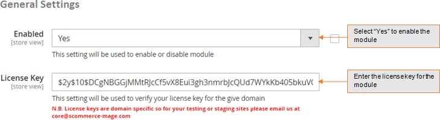

# Magento 2 Update Order Email Address

### <mark style="color:blue;">Installation and User Guide for Magento 2 Update Order Email Address Extension</mark>

**Table of Contents**

1. [_Installation_ ](magento-2-update-order-email-address.md#bookmark0)
   * _Download Extension_
   * _Installation via app/code_&#x20;
   * _Installation via Composer_
2. [_Configuration Settings for Update Order Email Address_ ](magento-2-update-order-email-address.md#bookmark3)
   * _General Settings_&#x20;
   * _Update Email Address from Order Detail View Page_&#x20;
   * _Updated Email Address Visible on the Order Detail View Page_&#x20;

### <mark style="color:blue;">Installation</mark> <a href="#bookmark0" id="bookmark0"></a>

* <mark style="color:orange;">**Download Extension:**</mark> Once you have placed the order from our site then go to Account section and click on My Downloadable Products and download the extension package.


* <mark style="color:orange;">**Installation via app/code:**</mark> Upload the content of the module to your root folder. This will not overwrite the existing Magento folder or files, only the new contents will be added. After the successful upload of the package, run below commands on Magento 2 root directory.

```
php bin/magento setup:upgrade
php bin/magento setup:di:compile
php bin/magento setup:static-content:deploy
```

* <mark style="color:orange;">**Installation via Composer:**</mark> Please follow the guide provided in the below link to complete the installation via composer.


[installation-via-composer.md](../installation-via-composer.md)




### <mark style="color:blue;">Configuration Settings for Update Order Email Address</mark> <a href="#bookmark3" id="bookmark3"></a>

Go to **Admin > Stores > Configuration > Scommerce Configuration > Update Order Email**

#### <mark style="color:orange;">General Settings</mark> <a href="#bookmark4" id="bookmark4"></a>

* **Enabled –** Select “Yes” or “No” to enable or disable the module.
* **License Key –** Please add the license for the extension which is provided in the order confirmation email. Please note license keys are site URL specific. If you require license keys for dev/staging sites then please email us at [support@scommerce-mage.com](mailto:support@scommerce-mage.com).



* <mark style="color:orange;">**Update Email Address from Order Detail View Page -**</mark> You can update email address from **Admin > Sales > Orders > Select Order >** Click on "**Change**" then add new email address **>** Click "**Save**".

>)

* <mark style="color:orange;">**Updated Email Address Visible on the Order Detail View Page -**</mark> The updated email address will be shown on the order detail view page under "Account Information" section.

>)

If you have a question related to this extension please check out our [**FAQ Section**](https://www.scommerce-mage.com/magento-2-ajax-login-add-to-wishlist.html#faq) first. If you can't find the answer you are looking for then please contact [**support@scommerce-mage.com**](mailto:core@scommerce-mage.com)**.**
