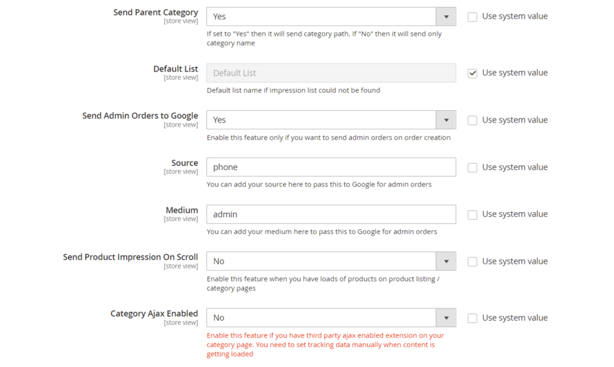
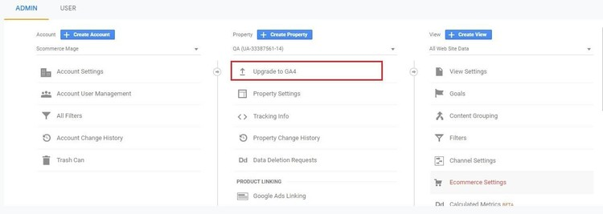
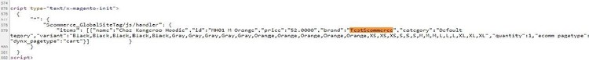

# Magento 2 Google Global Site Tag (gtag.js) with GA4(Google Analytics 4) Enabled

### <mark style="color:blue;">Installation and User Guide for Magento 2 Global Site Tag (gtag.js) Extension</mark>

**Table of Contents**

1. [_Installation_](magento-2-google-global-site-tag-gtag.js-with-ga4-google-analytics-4-enabled.md#bookmark0)&#x20;
   * _Installation via app/code_&#x20;
   * _Installation via Composer_
   * _Installation via Composer(Hyvä Theme)_
2. [_Configuration Settings for Tracking Base_](magento-2-google-global-site-tag-gtag.js-with-ga4-google-analytics-4-enabled.md#bookmark3)
   * _General Settings_&#x20;
   * _Checkout Behaviour_
3. [_Configuration Settings for Global Site Tag (gtag.js)_ ](magento-2-google-global-site-tag-gtag.js-with-ga4-google-analytics-4-enabled.md#bookmark3-1)
   * _General Settings_&#x20;
4. [_Set up Google Analytics 4_](magento-2-google-global-site-tag-gtag.js-with-ga4-google-analytics-4-enabled.md#bookmark11)
5. [_Set Up Cross Domain Measurement_](magento-2-google-global-site-tag-gtag.js-with-ga4-google-analytics-4-enabled.md#bookmark12)
6. [_Front-end Site view_ ](magento-2-google-global-site-tag-gtag.js-with-ga4-google-analytics-4-enabled.md#bookmark12-1)
   * _Home Page with Tags_&#x20;
   * _Gtag.js Code_&#x20;
   * _Gtag.js Brand Name_&#x20;

### <mark style="color:blue;">Installation</mark> <a href="#bookmark0" id="bookmark0"></a>

* <mark style="color:orange;">**Installation via app/code:**</mark> Upload the content of the module to your root folder. This will not overwrite the existing Magento folder or files, only the new contents will be added. After the successful upload of the package, run below commands on Magento 2 root directory.

```
php bin/magento setup:upgrade
php bin/magento setup:di:compile
php bin/magento setup:static-content:deploy
```

* <mark style="color:orange;">**Installation via Composer:**</mark> Please follow the guide provided in the below link to complete the installation via composer.


[installation-via-composer.md](../installation-via-composer.md)


* <mark style="color:orange;">**Installation via Composer(Hyvä Theme):**</mark> Go to My Account section then go to Composer Instructions. Run the composer config commands mentioned on the page then run the below command to install the module on hyva theme.&#x20;

```
composer require hyva-themes/magento2-scommerce-gtag
```

### <mark style="color:blue;">Configuration Settings for Tracking Base</mark> <a href="#bookmark3" id="bookmark3"></a>

Go to **Admin > Stores > Configuration > Scommerce Configuration > Tracking Base**

#### <mark style="color:orange;">General Settings</mark> <a href="#bookmark4" id="bookmark4"></a>

* **Enabled –** Select “Yes” or “No” to enable or disable the module.
* **Enable Enhanced Ecommerce –** Select ‘Yes’ to enable this module. Please make sure this feature is enabled in Google Analytics first before enabling in Magento2.
* **Product ID Attribute –** Select the attribute which you have submitted in your Google base feed. For e.g. SKU
* **Brand Attribute –** Please select brand attribute, if you have one otherwise put your brand name in the below input box.
* **Use Base Currency -** Set ‘Yes’ if you want to send base order data and ‘No’ to send store order data to Google. Set this ‘No’ only when you have multicurrency and you want to send different currency data to Google.

.png>)

* **Product Price Include Tax-** Set “Yes” then VAT will be included in the price.
* **Order Total Include VAT –** Set “Yes” then VAT will be included in order total.
* **Always Send Parent SKU –** Set “Yes” then it always send parent sku instead of child sku to GA during checkout.
* **Category Attribute-** Please select category attribute if you have one otherwise put your brand name in the below input box. **Attribute should be available for product listing 'Storefront Properties -> Used in Product Listing = Yes'**
* **Is Category ID-** Set "Yes" if "Category Attribute" is ID of the category, "No" if it is plain value

.png>)

* **Send Parent Category –** Set “Yes” to send the category path and Set “No” to send the category name only.
* **Default List-** Enter the default list name if the product impression is not found
* **Send Admin Orders to Google–** Select “Yes” to track orders created in admin
* **Source-**&#x50;lease add the Campaign Source for backend orders.
* **Medium-**&#x50;lease define the Campaign Medium for Backend Orders.
* **Send Product Impression on Scroll -** Enable this feature when you have loads of products on product listing / category pages.
* **Category Ajax Enabled –** Enable this feature if you have third party ajax enabled extension on your category page.



#### <mark style="color:orange;">Checkout Behaviour</mark> <a href="#bookmark4" id="bookmark4"></a>

* **Add Carrier Title:-** Use this to add carrier title to the shipping step. Set "Yes" to send _carrier\_code::carrier\_title_. Ex. flatrate::Flat Rate
* **Add Payment Title :-** Use this to add payment method title to payment step. Set "Yes" to send _method::title_. Ex. checkmo::Check / Money Order
* **Steps Configuration:-** define checkout steps
  * **Step:-** number of step
  * **Selector:-** add the selector for the step. Basic selector could be '#customer-email' this is equals to '#customer-email/change' and will send customer email itself
  * **Type:-** choose the step type from the dropdown

.png>)

### <mark style="color:blue;">Configuration Settings for Global Site Tag (gtag.js)</mark> <a href="#bookmark3" id="bookmark3"></a>

Go to **Admin > Stores > Configuration > Scommerce Configuration > Global Site Tag (gtag.js)**

#### <mark style="color:orange;">General Settings</mark> <a href="#bookmark4" id="bookmark4"></a>

* **Enabled –** Select “Yes” or “No” to enable or disable the module.
* **License Key –** Please add the license for the extension which is provided in the order confirmation email. Please note license keys are site URL specific. If you require license keys for dev/staging sites then please email us at [support@scommerce-mage.com](mailto:support@scommerce-mage.com).
* **Accounts ID –** You can add multiple account id, it can be Analytics, Adwords.
  * **Main Account –** Select ‘Yes’ to set your main analytics id as an account id. This account will be used to connect gtag.js.
  * **Use Linker –** If this is enabled (set to ‘Yes’) then this account will be linked to domains from “Domains to link” field, which is specified below
  * **Action –** You can delete your account\\, if required.

<div data-full-width="true"><figure><figcaption></figcaption></figure></div>


* **Enable Linker -** If this is enabled then you can set linker properties, in domain configurations which is specified below e.g. Domain to link, Decorate Forms. This setting is mainly for Cross domain mesurement, so to use this you must first enable it in Google Analytics 4 Admin.
* **Domains to Link -** Enter the domains that you want to link. Example destination.com, dest3.com or /^example.(com|de|nl)$/.
* **Decorate Forms -** If you have forms on site pointing to the destination domain, set this property of the linker parameter to Yes
* **Promotion Tracking –** Here is the format to set up the promotion tracking: \<a href="#" data-promotion="CREATIVENAME" data-id="PROMOID" data-name="PROMONAME" data-creative="PROMOCREATIVE" data-position="PROMOPOSITION"> Content \</a>
* **Enable Dynamic Remarketing Tag –** If set to ‘Yes’, then this will enable and install remarketing tag to different pages.
* **Enable Tracking for Other Sites –** This will enable other sites variables ([https://support.google.com/tagmanager/answer/6106009?hl=en-GB#zippy=%2Ccustom](https://support.google.com/tagmanager/answer/6106009?hl=en-GB#zippy=%2Ccustom)[)](https://developers.google.com/adwords-remarekting-tag/parameters#other) instead of retail site variables.

<div data-full-width="true"><figure><figcaption></figcaption></figure></div>

### <mark style="color:blue;">Set up Google Analytics 4</mark> <a href="#bookmark11" id="bookmark11"></a>

* Go to Analytics and select the website on which you want to implement GA4.
* Once you are in universal analytics panel go into admin settings. Here you will notice an UPGRADE TO GA4 button, click on it. You will be walked with creating a new property. Follow along, once you are finished you will see the new GA4 view on your screen



### <mark style="color:blue;">Set Up Cross Domain Measurement</mark> <a href="#bookmark12" id="bookmark12"></a>

&#x20;**Step 1:-** Go to Google Analytics 4 Admin>Data Streams>Select your stream>Configure Tag Settings >Configure Your Domains, here add your domains or subdomains that you want to track.&#x20;

<div data-full-width="true"><figure><figcaption></figcaption></figure></div>

**Step 2:-** Add the all domains added above in the configuration "Domains to link" comma separated. Now if you have any links taking you from your main site to the linked site, **\_gl cookie** is automatically apended to the URL that contains several information such as source website, source campaign etc hereby accomplishing the cross domain measurement. an example of such URL is as follows:-

```
https://magento2demo.scommerce-mage.co.uk/?_gl=1*fzl3bd*_ga*MTk3ODY0NTU1Mi4xNzIyODQzNDc3*_ga_FWXJFY956H*MTcyMjg1OTYxOC40LjEuMTcyMjg1OTYzNS4wLjAuMA..
```

### <mark style="color:blue;">Front-end Site view</mark> <a href="#bookmark12" id="bookmark12"></a>

* <mark style="color:orange;">**Home Page with Tags -**</mark> In Tag Assistant tool you can see all the fired tags.

<div data-full-width="true"><figure><figcaption></figcaption></figure></div>

* <mark style="color:orange;">**Gtag.js Code -**</mark> In the below image you can see the UA and AW tracking id’s from **Admin > Stores > Configuration > Scommerce Configuration > Global Site Tag (gtag.js) > Account Id** > Click on **“Add Account”** – G-R6FSTDG16K, AW-123234123.

<div data-full-width="true"><figure><figcaption></figcaption></figure></div>

* <mark style="color:orange;">**Gtag.js Brand Name –**</mark> You can add brand name from **Admin > Stores > Configuration > Scommerce Configuration > Global Site Tag (gtag.js) > Brand Name – “TestScommerce”.**



If you have a question related to this extension please check out our [**FAQ Section**](magento-2-google-global-site-tag-gtag.js-with-ga4-google-analytics-4-enabled.md#installation-and-user-guide-for-magento-2-how-did-you-hear-about-us-extension) first. If you can't find the answer you are looking for then please contact [**support@scommerce-mage.com**](mailto:core@scommerce-mage.com)**.**
