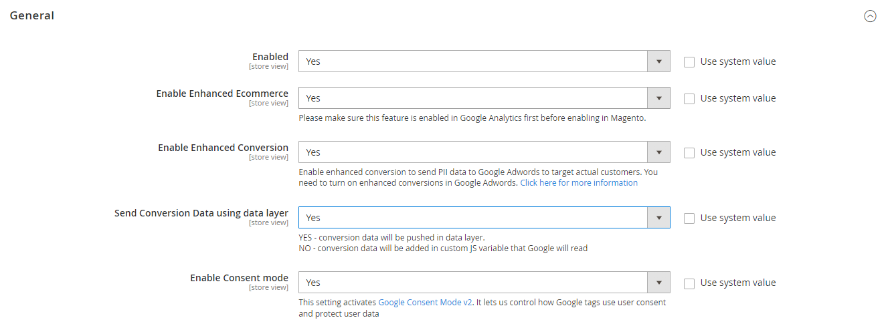
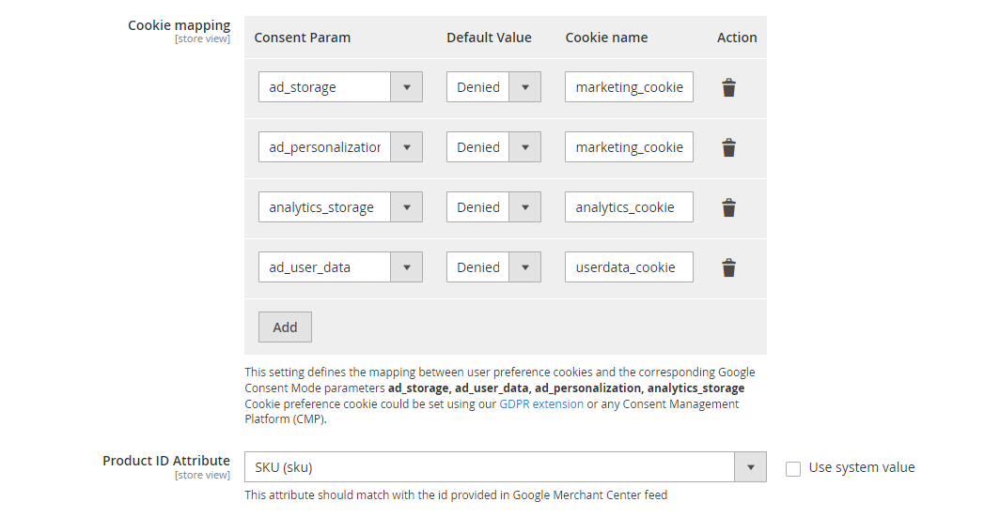
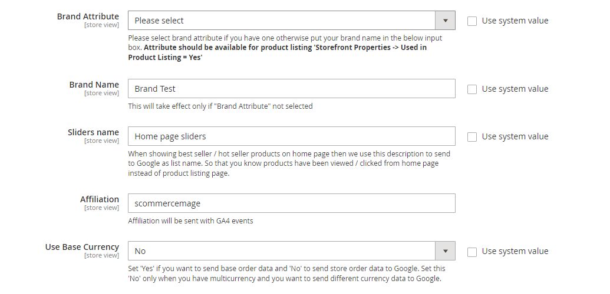
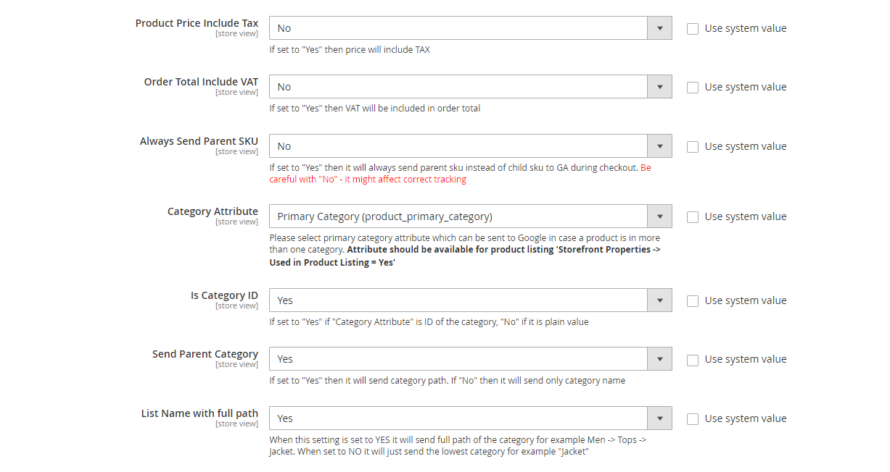
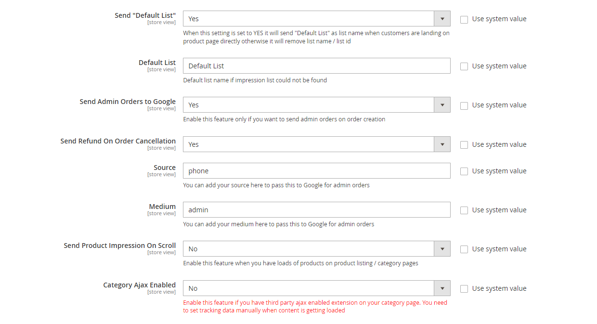
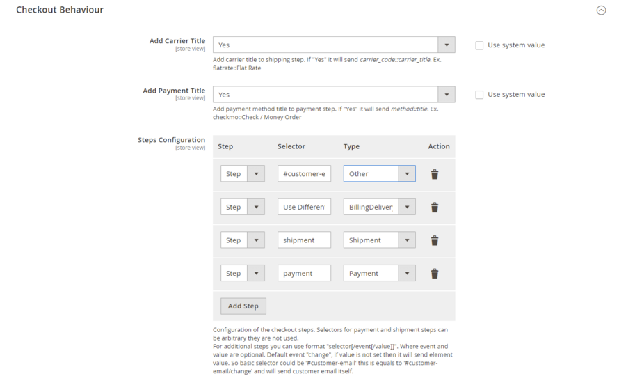
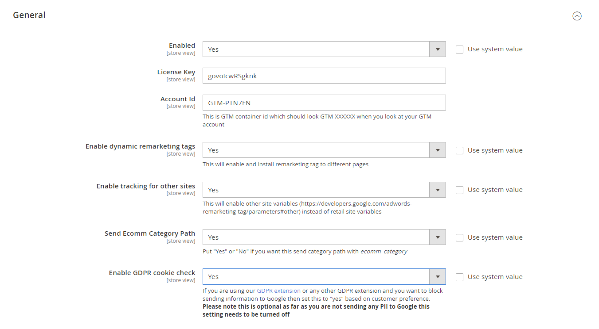
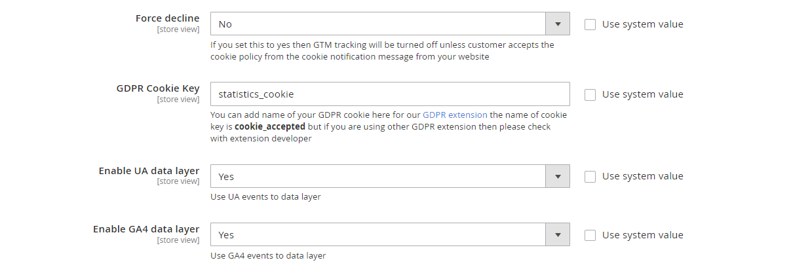
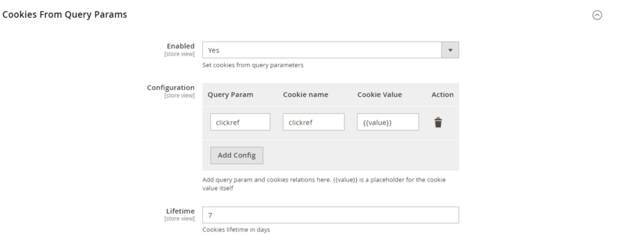

# Magento 2 Google Tag Manager (GTM) GA4 Enhanced Ecommerce Tracking

## <mark style="color:blue;">Installation and User Guide for Magento 2 Google Tag Manager Pro Tracking Extension</mark>

**Table of Contents**

1. [_Installation_ ](magento-2-google-tag-manager-gtm-ga4-enhanced-ecommerce-tracking.md#\_bookmark0)
   * _Installation via app/code_&#x20;
   * _Installation via Composer_
   * _Installation via Composer(Hyvä Theme)_
   * _Installation via Composer(Breeze Theme)_
2. [_Configuration Settings for <mark style="color:blue;">T</mark>racking Base_](magento-2-google-tag-manager-gtm-ga4-enhanced-ecommerce-tracking.md#\_bookmark3)
   * _General Settings_&#x20;
   * _Checkout Behaviour_
3. [_Configuration Settings for Google Tag Manager Pro_ ](magento-2-google-tag-manager-gtm-ga4-enhanced-ecommerce-tracking.md#\_bookmark3-1)
   * _General Settings_
   * _Cookies From Query Params_&#x20;
4. [_JSONs/Script provided with extension package_  ](magento-2-google-tag-manager-gtm-ga4-enhanced-ecommerce-tracking.md#\_bookmark5)
5. [_Importing JSONs into GTM_](magento-2-google-tag-manager-gtm-ga4-enhanced-ecommerce-tracking.md#\_bookmark10)&#x20;
6. [_Setting variable information in GTM_](magento-2-google-tag-manager-gtm-ga4-enhanced-ecommerce-tracking.md#\_bookmark11)&#x20;
7. [_Publishing Tags in GTM_](magento-2-google-tag-manager-gtm-ga4-enhanced-ecommerce-tracking.md#\_bookmark12)&#x20;
8. [_Set up Enhanced Ecommerce in Google Analytics_](magento-2-google-tag-manager-gtm-ga4-enhanced-ecommerce-tracking.md#\_bookmark13)&#x20;
9. [_Set up Google Analytics 4_](magento-2-google-tag-manager-gtm-ga4-enhanced-ecommerce-tracking.md#\_bookmark14)&#x20;
10. [_Set up Google Adwords Conversion_](magento-2-google-tag-manager-gtm-ga4-enhanced-ecommerce-tracking.md#\_bookmark14-1)
11. [_Set up Enhanced Conversion_](magento-2-google-tag-manager-gtm-ga4-enhanced-ecommerce-tracking.md#\_bookmark16)
    * _Enable Enhanced Conversions in Google Adwords_
    * _Set up Enhanced Conversion with the Module_
12. [_Back-end / Admin Tracking_ ](magento-2-google-tag-manager-gtm-ga4-enhanced-ecommerce-tracking.md#back-end-admin-tracking)
13. [_Cookies From Query Params_](magento-2-google-tag-manager-gtm-ga4-enhanced-ecommerce-tracking.md#\_bookmark16)
14. [_Upgrading the Module From 3.0.1 and Below_](magento-2-google-tag-manager-gtm-ga4-enhanced-ecommerce-tracking.md#\_bookmark16-1)
15. [_Front-end Screenshots_](magento-2-google-tag-manager-gtm-ga4-enhanced-ecommerce-tracking.md#\_bookmark16)&#x20;
    * _Order Total of Product without VAT_&#x20;
    * _Order Total of Product with VAT_&#x20;
    * _Send SKU of Child Product_&#x20;
    * _Send SKU of Parent Product Only_&#x20;
    * _Send Parent Category_&#x20;
    * _Primary Category_&#x20;
16. [_Set up Consent Mode V2 with GTM_](magento-2-google-tag-manager-gtm-ga4-enhanced-ecommerce-tracking.md#bookmark16-4)

### <mark style="color:blue;">Installation</mark> <a href="#bookmark0" id="bookmark0"></a>

* <mark style="color:orange;">**Installation via app/code:**</mark> Upload the content of the module to your root folder. This will not overwrite the existing Magento folder or files, only the new contents will be added. After the successful upload of the package, run below commands on Magento 2 root directory.

```
php bin/magento setup:upgrade
php bin/magento setup:di:compile
php bin/magento setup:static-content:deploy
```

* <mark style="color:orange;">**Installation via Composer:**</mark> Please follow the guide provided in the below link to complete the installation via composer.


[installation-via-composer.md](../installation-via-composer.md)


* <mark style="color:orange;">**Installation via Composer(Hyvä Theme):**</mark> Go to My Account section then go to Composer Instructions. Run the composer config commands mentioned on the page then run the below command to install the module on hyva theme.&#x20;

```
composer require hyva-themes/magento2-scommerce-googletagmanagerpro
```

* <mark style="color:orange;">**Installation via Composer(Breeze Theme):**</mark> Go to My Account section then go to Composer Instructions. Run the composer config commands mentioned on the page then run the below command to install the module on hyva theme.&#x20;

```
composer require scommerce/breeze-googletagmanagerpro
```

### <mark style="color:blue;">Configuration Settings for Tracking Base</mark> <a href="#bookmark3" id="bookmark3"></a>

Go to **Admin > Stores > Configuration > Scommerce Configuration > Tracking Base**

#### <mark style="color:orange;">General Settings</mark> <a href="#bookmark4" id="bookmark4"></a>

* **Enabled –** Select “Yes” or “No” to enable or disable the module.
* **Enable Enhanced Ecommerce –** Select ‘Yes’ to enable this module. Please make sure this feature is enabled in Google Analytics first before enabling in Magento2.
* **Enable Enhanced Conversion:-** Set "Yes" to enable enhanced conversion to send PII data to Google Adwords to target actual customers. You need to turn on enhanced conversions in Google Adwords. [Click here for more information](https://support.google.com/google-ads/answer/10172785)
* **Send Conversion Data using data layer:-** Set "Yes" to push the Conversion PII data as a data layer and set "No" to push Conversion PII data as a Javascript variable.
* **Enable Consent mode -** This setting activates [Google Consent Mode v2](https://developers.google.com/tag-platform/security/guides/consent). It lets us control how Google tags use user consent and protect user data

<figure><figcaption></figcaption></figure>

* **Cookie mapping -** This setting defines the mapping between user preference cookies and the corresponding Google Consent Mode parameters **ad\_storage**, **ad\_user\_data**, **ad\_personalization**, **analytics\_storage**\
  Cookie preference cookie could be set using our [GDPR extension](https://www.scommerce-mage.com/magento-2-gdpr.html) or any Consent Management Platform (CMP).
* **Product ID Attribute –** Select the attribute which you have submitted in your Google base feed. For e.g. SKU

<figure><figcaption></figcaption></figure>

* **Brand Attribute –** Please select brand attribute, if you have one otherwise put your brand name in the below input box.
* **Primary Category Attribute –** When a product is in more than one category then the primary category attribute will be sent to Google.&#x20;
* **Brand Attribute –** Please
* **Sliders name-** Enter the name for custom sliders that will be sent as list name with the data layer.
* **Affiliation-** Enter the affiliation name which you want to send with the GA4 data layers.
* **Use Base Currency -** Set ‘Yes’ if you want to send base order data and ‘No’ to send store order data to Google. Set this ‘No’ only when you have multicurrency and you want to send different currency data to Google.

<figure><figcaption></figcaption></figure>

* **Product Price Include Tax-** Set “Yes” then VAT will be included in the price.
* **Order Total Include VAT –** Set “Yes” then VAT will be included in order total.
* **Always Send Parent SKU –** Set “Yes” then it always send parent sku instead of child sku to GA during checkout.
* **Category Attribute-** Please select category attribute if you have one otherwise put your brand name in the below input box. **Attribute should be available for product listing 'Storefront Properties -> Used in Product Listing = Yes'**
* **Is Category ID-** Set "Yes" if "Category Attribute" is ID of the category, "No" if it is plain value
* **Send Parent Category –** Set “Yes” to send the category path and Set “No” to send the category name only.
* **List Name with full path-** Choose whether you want to send the full path of the category or not. When 'yes' The breadcrumbs are broken into separate categories and sent as item\_category1, item\_category2 etc. Set 'No' to send the lowest level category. for ex:- Men>Tops>Jackets, when 'yes' Men, tops, jackets all three categories will be sent. When 'no' only jackets is sent.&#x20;

<figure><figcaption></figcaption></figure>

* **Send 'Default List'-** When customers land on the product page directly then 'default' list' will be sent as list name when set to 'Yes'. When 'No' list name/ list ID will be removed.&#x20;
* **Default List-** Enter the default list name if the product impression is not found
* **Send Admin Orders to Google–** Select “Yes” to track orders created in admin
* **Source-**Please add the Campaign Source for backend orders.
* **Medium-**Please define the Campaign Medium for Backend Orders.
* **Send Product Impression on Scroll -** Enable this feature when you have loads of products on product listing / category pages.
* **Category Ajax Enabled –** Enable this feature if you have third party ajax enabled extension on your category page.

<figure><figcaption></figcaption></figure>

#### <mark style="color:orange;">Checkout Behaviour</mark> <a href="#bookmark4" id="bookmark4"></a>

* **Add Carrier Title:-** Use this to add carrier title to the shipping step. Set "Yes" to send _carrier\_code::carrier\_title_. Ex. flatrate::Flat Rate
* **Add Payment Title :-** Use this to add payment method title to payment step. Set "Yes" to send _method::title_. Ex. checkmo::Check / Money Order
* **Steps Configuration:-** define checkout steps
  * **Step:-** number of step
  * **Selector:-** add the selector for the step. Basic selector could be '#customer-email' this is equals to '#customer-email/change' and will send customer email itself
  * **Type:-** choose the step type from the dropdown



### <mark style="color:blue;">Configuration Settings for Google Tag Manager Pro</mark> <a href="#bookmark3" id="bookmark3"></a>

#### Go to Admin > Stores > Configuration > Scommerce Configuration > Google Tag Manager Pro

#### <mark style="color:orange;">General Settings</mark> <a href="#bookmark4" id="bookmark4"></a>

* **Enabled –** Select “Yes” or “No” to enable or disable the module.
* **License Key –** Please add the license for the extension which is provided in the order confirmation email. Please note license keys are site URL specific. If you require license keys for dev/staging sites then please email us at [core@scommerce-mage.com](mailto:core@scommerce-mage.com)
* **Account Id –** Enter your Google Tag Manager Account Id.
* **Enable dynamic remarketing tags –** Set “Yes” if you want to enable google dynamic remarketing tags to used for GTM.
* **Enable tracking for other sites –** Set “Yes” to enable tracking for other sites.
* **Send Ecom Category Path –**  Set "yes" to send the category path with ecomm\_category.
* **Enable GDPR Cookie Check –** Select "Yes" or "No" to enable/disable GDPR Cookie Check

<figure><figcaption></figcaption></figure>

* **Force decline –** If you set this to yes then GTM tracking will be turned off unless customer accepts the cookie policy from the cookie notification message from your website
* **GDPR Cookie Key –**  You can add name of your GDPR cookie here for our [GDPR extension](https://www.scommerce-mage.com/magento2-gdpr-compliance.html) the name of cookie key is **cookie\_accepted** but if you are using other GDPR extension then please check with extension developer
* **Enable UA data layer –** Select "Yes" to add UA (Universal Analytics) events to the data layer.
* **Enable GA4 data layer-**Select "Yes" to add GA4(Google Analytics 4) events to the data layer.

<figure><figcaption></figcaption></figure>

#### <mark style="color:orange;">Cookies From Query Params</mark> <a href="#bookmark4" id="bookmark4"></a>

* **Enabled –** Select “Yes” or “No” to enable or disable the module.
* **Configuration –** Use this setting to create cookies by entering cookie parameter, cookie name, and cookie value.
* **Lifetime –** Enter the lifetime of the cookie. It will be stored in the users browser as per the time defined in this setting.



### <mark style="color:blue;">JSONs/Script provided with extension package</mark> <a href="#bookmark5" id="bookmark5"></a>

The extension package contains JSONs which can be imported in GTM to set

up required Tags, Triggers and Variables. Go to the extension file m2-google-tag- manager-pro and then to the Data Folder (Path - **m2-google-tag-manager-pro/data/**) to find these files. The JSONs can be used to set up

* **GTM-GoogleAnalytics4.json:-** Google Analytics 4
* **GTM-UniversalAnalytics.json:-** Enhanced Ecommerce Universal Analytics
* **GTM-Facebook.json:-** Facebook Pixel tracking
* **GTM-AdwordsDynamicRemarketing.json:-** Google AdWords Dynamic Remarketing
* **GTM-google\_ads\_conversion\_tracking.json:-** Google Ads Conversion Tracking
* **GTM-Pinterest.json:-** Pinterest tracking
* **GTM-Pinterest-GA4.json:-** Use this file if you are using only GA4 and not UA
* **GTM-Partnerize.json:-** Partnerize
* **GTM-google\_ads\_enhanced\_conversion\_tracking.json:-** Google Ads Enhanced Conversion Tracking(Make sure its enabled in the extension configuration and also ensure that "send conversion data using data layer is set to "No" in tracking base configuration)
* **GTM-google\_ads\_enhanced\_conversion\_tracking\_using\_datalayers.json -** If you have set "send conversion data using data layer is set to "Yes" in tracking base configuration then import this JSON file which utilizes data layer push to populate the conversion PII data.
* #### **SetPrimaryCategories.php:-** Primary Category Script (SetPrimaryCategories.php) – All of the above JSON files can be imported into GTM but primary category script needs to be added into the root directory of your website. Add the SetPrimaryCategories.php file in your website’s root directory and open the link as follows: - http://Your\_website\_URL.com/SetPrimaryCategories.php

<mark style="color:red;">**Note:-**</mark><mark style="color:red;">** **</mark>_<mark style="color:red;">**Please import only one Pinterest JSON file depending upon the extension configuration you are using. If you are only using GA4 and no UA then you can use the Pinterest GA4 JSON file. Also if you have 'Send Product Impression on Scroll ' enabled in Admin>Stores>Configuration>Scommerce Configuration>Tracking Base**</mark>_<mark style="color:red;">** **</mark><mark style="color:red;">**then use the Pinterest GA4 JSON file as well**</mark><mark style="color:red;">** **</mark>_<mark style="color:red;">**otherwise you can use the original Pinterest JSON file.**</mark>_&#x20;

### <mark style="color:blue;">Importing JSONs into GTM</mark> <a href="#bookmark10" id="bookmark10"></a>

To import JSONS provided with extension package follow below steps:

* Log into GTM and navigate to your Account and container
* In the top navigation, click through the Admin


* Under the container options, click on Import Container


* Choose the JSON file which you would like to import


* Choose to either Overwrite or Merge
  * Overwriting the existing container will remove all your existing tags, triggers, and variables, and will replace them with those in the imported container. A new container version will be created before the import.
  * Merging containers will let you keep your existing tags, triggers, and variables, and just add in the new ones. If you choose to Merge the new container with your existing container, you’ll have to then decide whether you want to overwrite conflicting tags or rename conflicting tags.
* Overwrite – If a variable, tag, or trigger in the new container has the same name but the contents are different, overwrite the old one with the new one.
* Rename – If a variable, tag, or trigger in the new container has the same name but the contents are different, keep the old one and rename the new one.
* Click Continue. You’ll see a preview of changes, showing how many tags, triggers, and variables will be added, modified, or deleted. You can also click the link to View Detailed Changes to see which tags, triggers, and variables are being added, modified, or deleted.


* Once you’re satisfied with the changes, click _Confirm_.

### <mark style="color:blue;">Setting variable information in GTM</mark> <a href="#bookmark11" id="bookmark11"></a>

Once the GTM container file has been imported, you need to change variable information with correct value corresponding to the site. To access variables, go to workspace where you have imported the JSONs and click on variables on left hand side navigation.


<mark style="color:orange;">**Variables Created with JSON’s**</mark>

* <mark style="color:orange;">**GA ID –**</mark> This variable is created when GTM-UniversalAnalytics.json is imported and it holds value for Google Analytics Id for the site. Click on the GA ID and change it to correct value.


* <mark style="color:orange;">**conversionID -**</mark> This variable is created when GTM- AdwordsDynamicRemarketing.json is imported and it holds value for Google Adwords Conversion Id for the site. Click on the conversionID and change it to correct value.


* <mark style="color:orange;">**facebookPixelID -**</mark> This variable is created when GTM-Facebook.json is imported and it holds value for Facebook pixel Id for the site. Click on the facebookPixelID and change it to correct value.


* <mark style="color:orange;">**currencyCode -**</mark> This variable is created when GTM-Facebook.json is imported and it holds value for currency used on site. Click on the currencyCode and change it to correct value.


<mark style="color:orange;">**Google Ads Conversion Tracking -**</mark> Add Conversion ID and Conversion Label in the Google Ads Conversion Tracking tag before publishing the container. These IDs can be found in your Google Ads account.

<figure><figcaption></figcaption></figure>

<mark style="color:orange;">**Microsoft UET Tracking -**</mark> Add the Microsoft Advertising UET Tag ID which can be obtained from microsoft Ads account.

<figure><figcaption></figcaption></figure>

### <mark style="color:blue;">Publishing Tags in GTM</mark> <a href="#bookmark12" id="bookmark12"></a>

Once all set up is done and verified, need to Publish the tags to make it live on the website.&#x20;

**Step 1 −** Click the SUBMIT button at the top right corner of the screen.

It will show the following screen.


**Step 2 −** Enter an identifiable Version name so that it can be easily understood for the changes made.

With the version description, you can be as elaborate as possible on the changes/additions of the tag in that version.

**Step 3 −** Scroll down to the Workspace Changes, you will see all the changes made in the tags, which are unpublished or in the PREVIEW mode.

**Step 5 −** Click PUBLISH and you will be presented with a summary for this version.

### <mark style="color:blue;">Set up Enhanced Ecommerce in Google Analytics</mark> <a href="#bookmark13" id="bookmark13"></a>

<mark style="color:orange;">**To turn on Enhanced E-commerce for a view, and label your checkout steps:**</mark>

1. Click Admin at the top of any Analytics page.
2. Select the view for which you want to enable Enhanced E-commerce reporting.
3. In the view column, click E-commerce Settings.
4. Under **Step 1**, Enable E-commerce, set the status to ON.
5. Click Next Step.
6. Under **Step 2**, Enhanced Ecommerce Settings, set the status to ON. When you turn this option on
   * You can see the Enhanced E-commerce reports in the conversions section
   * The older, older category of E-commerce reports is no longer visible You can turn this option off to restore the older category of E-commerce reports.
7. Optionally, enter labels for the checkout steps that you have defined in your Magento steps configuration. Please see screenshots below for reference


Finally, Click Submit.

### <mark style="color:blue;">Set up Google Analytics 4</mark> <a href="#bookmark14" id="bookmark14"></a>

* Go to Analytics and select the website on which you want to implement GA4 alongside universal analytics.
* Once you are in universal analytics panel go into admin settings. Here you will notice an UPGRADE TO GA4 button, click on it. You will be walked with creating a new property. Follow along, once you are finished you will see the new GA4 view on your screen.


* Now we need to setup the tag manager for GA4. If you have already imported all the tags using our JSON file then you only need to edit the tag and add your Measurement ID. However, if you are creating tags yourself then you need to create a new configuration tag.


* To create a new configuration tag in GTM. Please look at the image below: -


* To get the measurement id you need to go to your GA4 view. Go to the admin settings and then data streams. Click on the website url coloured in blue and a popup should open.


* You will see the Measurement ID listed on the top right corner of this page.


* Now for the final step import our Google Analytics 4 JSON file in your GTM to get all the configurations for GA4. Once done you will see data flowing into Google Analytics 4. Learn more about [Google Analytics 4](https://www.scommerce-mage.com/blog/integrate-magento-2-with-google-analytics-4ga4.html).

### <mark style="color:blue;">Set up Google Adwords Conversion</mark> <a href="#bookmark14" id="bookmark14"></a>

To setup Google Adwords Conversion, please make sure you add **GTM-google\_ads\_conversion\_tracking.json (data folder of the extension)** file in your GTM container and add **Conversion Label** and **Conversion ID** which you should be able to get from Google Adwords account under Conversion section. This import will create the following tags -:

* Conversion Linker Tag&#x20;
* Google Ads Conversion Tracking

.png>)

<mark style="color:red;">**Please note: If you have GA4 enabled but UA disabled in Magento admin configuration then you need to change the following variables in GTM for Google Ads Conversion Tracking**</mark>

From&#x20;

**\{{Order Value\}} to \{{Ecommerce Value\}}**

**\{{Order Id\}} to \{{Ecommerce Transaction ID\}}**

**\{{Order Currency Code\}} to \{{Ecommerce Currency\}}**

**As shown in the below screenshots**&#x20;

**From**

.png>)

To &#x20;

.png>)

### <mark style="color:blue;">Setup Enhanced Conversion</mark>  <a href="#bookmark16" id="bookmark16"></a>

To enable enhanced conversions we first need to enable enhanced conversions in Google Adwords then complete the extension setup.

#### <mark style="color:orange;">Enable Enhanced Conversions in Google Adwords</mark>

1. Sign in to your [Google Ads account](https://ads.google.com/).
2. In the upper right corner of your account, click the tools icon , and under "Measurement," click **Conversions**.
3. Open the conversion action you want to use for setting up enhanced conversions.
4. In the “Enhanced conversions” section at the bottom, click **Turn on enhanced conversions**.
5. Select ”Google tag or Google Tag Manager” to set up enhanced conversions.
6. Click **Agree to the compliance statement**. By turning on enhanced conversions you confirm that you comply with our [policies](https://support.google.com/adspolicy/answer/7475709). The [Google Ads Data Processing Terms](https://privacy.google.com/businesses/processorterms/) apply to your use of enhanced conversions.
7. Click **Check URL** to check your website for a Google tag.
8. In “Tag type” you should be defaulted to **Google Tag Manager** if that is how you track conversions for this conversion action. Because you used Google Tag Manager to set up website tags, you need to use it to set up enhanced conversions. Follow the instructions below to set up enhanced conversions manually with Google Tag Manager.
9. Click **Save**.

**Note:** Once you have accepted the Terms of Service, it can take up to 5 days for your Google Tag Manager account to be enabled for enhanced conversions. Make sure your conversion tracking tag is set up in Google Tag Manager and then check back in 5 days to see the enhanced conversions functionality enabled. Please[ CLICK HERE](https://support.google.com/google-ads/answer/10172785) for more details.

#### <mark style="color:orange;">Setup Enhanced Conversion with the Module</mark>

Go to **Stores>Configuration>Scommerce Configuration>Tracking Base** and set "Enable Enhanced Conversion" to "Yes". This will enable user data collection from the store which will be sent to Google Adwords as part of the the Enhanced Conversion.

<figure><figcaption></figcaption></figure>

Once done import the JSON file named "GTM-google\_ads\_enh  anced\_conversion\_tracking.json" provided with the extension(data folder) in your GTM container .  Change the 'conversion label' and 'conversion ID' in the "Google Ads Conversion Tracking" tag. Finally publish the changes to finish the setup.

### <mark style="color:blue;">**Back-end / Admin Tracking**</mark>&#x20;

&#x20;It tracks orders placed from **Admin > Sales > Orders > Create New Order.**


### <mark style="color:blue;">Cookies From Query Params</mark> <a href="#bookmark16" id="bookmark16"></a>

Cookies from query Params configuration can be used to create new cookie parameters which can be stored in the users browser as per the valid time configured. for eg:- We have created a clickref cookie in the configuration. Now if the cookie parameter is passwed with the URL then that cookie will be created in the browser.

[http://magento2.scommerce-mage.co.uk/?clickref=ab101](http://magento2.scommerce-mage.co.uk/?clickref=ab101)  :- In this url we passed the cookie parameter "clickref" with the value "ab101". We can see this cookie being created in the below image:-


### <mark style="color:blue;">Upgrading the Module From 3.0.1 and Below</mark> <a href="#bookmark16" id="bookmark16"></a>

If you are using an older version of the extension(3.0.1 and below) where a common data layer is used to populate data to both UA and GA4 then upon updating to the latest version you need to make the following changes in GTM.

#### Remove these Tags, Triggers and Variables from GTM container <a href="#remove-these-tags-triggers-and-variables-from-gtm-container" id="remove-these-tags-triggers-and-variables-from-gtm-container"></a>

#### TAGS <a href="#tags" id="tags"></a>

* Google Analytics 4
* GA4 Views/impressions of product/item details
* GA4 View Item List Scroll
* GA4 View Item List
* GA4 Shipping info
* GA4 Remove a product from a shopping cart
* GA4 Refunds
* GA4 Purchases
* GA4 Promotion views/impressions
* GA4 Promotion clicks
* GA4 Product/Item List Clicks
* GA4 Payment info
* GA4 Begin Checkout
* GA4 Add a product to a shopping cart

#### Variables <a href="#variables" id="variables"></a>

* Ecommerce-detail-products
* Ecommerce-product-detail-value
* Ecommerce-checkout-products
* Ecommerce-checkout-option
* Ecommerce-remove-products
* Ecommerce-refund-products
* Purchase-affiliation
* Purchase-tax
* Purchase-shipping
* ecommerce-promoView-promotions
* ecommerce-promoClick-promotions
* Ecommerce-click-products
* ecommerce-product-click-list-name

#### Triggers <a href="#triggers" id="triggers"></a>

* View\_item
* View\_item\_list
* Shipping Info
* removeFromCart
* Refund
* Purchase
* View\_promotion
* promotionClick
* productClick
* Payment\_info
* addToCart

Now follow the steps below to import the latest GA4 settings for GTM

**Step 1:-** Acquire the latest GA4 JSON file provided with the module.

**Step 2:-** Go to your GTM container then click on admin>Import Container.

<figure><figcaption></figcaption></figure>

**Step 3:-** Click on Choose container file and choose the JSON file acquired in step 1 then select the workspace new/existing. Also select Merge>Rename conflicting tags, triggers, and variables so that no crucial setting is lost.

<figure><figcaption></figcaption></figure>

**Step 4:-** Lastly, click confirm to finish the import. Once it's done you will have the latest tags, triggers and variables for GA4 in your GTM.

### <mark style="color:blue;">Front-end Screenshots</mark> <a href="#bookmark16" id="bookmark16"></a>

#### <mark style="color:orange;">Order Total of Product without VAT</mark> <a href="#bookmark17" id="bookmark17"></a>

Go to **Stores > Configuration > Scommerce > Google Tag Manager Pro**. Scroll down to option **Order Total Include Vat** and toggle it to ‘No’. When turned ‘No’ the total order value data sent to Google analytics will not include VAT.


#### <mark style="color:orange;">Order Total of Product with VAT</mark> <a href="#bookmark18" id="bookmark18"></a>

Go to **Stores > Configuration > Scommerce > Google Tag Manager Pro**. Scroll down to option **Order Total Include Vat** and toggle it to ‘Yes’. When turned ‘Yes’ the total order value data sent to Google analytics will also include VAT.


#### <mark style="color:orange;">Send SKU of Child Product</mark> <a href="#bookmark19" id="bookmark19"></a>

Go to **Stores > Configuration > Scommerce > Google Tag Manager Pro**. Scroll down to the option **Always Send Parent SKU** and toggle it to ‘No’. When turned ‘No’ if the customer selects a configurable product then the SKU data sent to Google analytics will be of the child product.


#### <mark style="color:orange;">Send SKU of Parent Product Only</mark> <a href="#bookmark20" id="bookmark20"></a>

Go to **Stores > Configuration > Scommerce > Google Tag Manager Pro**. Scroll down to the option **Always Send Parent SKU** and toggle it to ‘Yes’. When turned ‘Yes’ if the customer selects a configurable product then only the SKU of the parent product will be sent to Google analytics.


#### <mark style="color:orange;">Send Parent Category</mark> <a href="#bookmark21" id="bookmark21"></a>

Go to **Stores > Configuration > Scommerce > Google Tag Manager Pro**. Scroll down to the option **Send Parent Category** and toggle it to ‘Yes’. When turned ‘Yes’ if the customer selects a product then it will send the entire category path to the analytics if “No” then it will only send the category name.


#### <mark style="color:orange;">Primary Category</mark> <a href="#bookmark22" id="bookmark22"></a>

Go to **Catalog > Products** and select any product. Then Scroll down to the option Primary Category.


Here you can set the primary category for any product. If you do not wish to send the assigned category to analytics, then you select which category path or name you want to send.


### <mark style="color:blue;">Set up Consent Mode V2 with GTM</mark> <a href="#bookmark16" id="bookmark16"></a>

Please follow the below guide to set up consent mode v2 with GTM, also you would need to have both GTM and GDPR modules to complete this setup.

**GDPR:-** [https://www.scommerce-mage.com/magento-2-gdpr.html](https://www.scommerce-mage.com/magento-2-gdpr.html)


[magento-2-consent-modes-setup-guide.md](magento-2-consent-modes-setup-guide.md)


If you have a question related to this extension please check out our [**FAQ Section**](https://www.scommerce-mage.com/magento-2-google-tag-manager.html#faq) first. If you can't find the answer you are looking for then please contact [**support@scommerce-mage.com**](mailto:core@scommerce-mage.com)**.**
