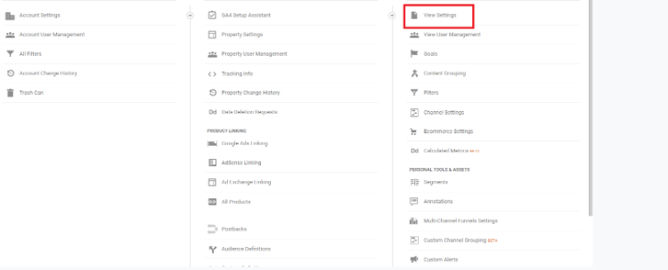

# Magento 2 missing orders or transactions in Google Analytics (GA)

### <mark style="color:blue;">Installation and User Guide for Magento 2 Google Analytics Synchronization Extension</mark> <a href="#_toc62670227" id="_toc62670227"></a>

**Table of Contents**

[_1. Installation_ ](magento-2-missing-orders-or-transactions-in-google-analytics-ga.md#\_toc62151771)

* _Installation via app/code_&#x20;
* _Installation via Composer_

[_2. Configuration Settings for Google Analytics Synchronization_](magento-2-missing-orders-or-transactions-in-google-analytics-ga.md#\_toc65169380)

* _General Settings_
* _GA4_
* _Select Store View_

[_3. Create Project in Google Developer Console for GA Reporting API_ ](magento-2-missing-orders-or-transactions-in-google-analytics-ga.md#\_toc65169382)

[_4. Getting View ID_ ](magento-2-missing-orders-or-transactions-in-google-analytics-ga.md#\_toc65169393)

[_5. Command to run the Synch Manually_ ](magento-2-missing-orders-or-transactions-in-google-analytics-ga.md#\_toc65169394)

### <mark style="color:blue;">Installation</mark> <a href="#_toc62151771" id="_toc62151771"></a>

* <mark style="color:orange;">**Installation via app/code:**</mark> Upload the content of the module to your root folder. This will not overwrite the existing Magento folder or files, only the new contents will be added. After the successful upload of the package, run below commands on Magento 2 root directory.

```
composer require google/apiclient:^2.9
composer require google/analytics-data:^0.8.1
php bin/magento setup:upgrade
php bin/magento setup:di:compile
php bin/magento setup:static-content:deploy
```

* <mark style="color:orange;">**Installation via Composer:**</mark> Please follow the guide provided in the below link to complete the installation via composer.


[installation-via-composer.md](../installation-via-composer.md)


### <mark style="color:blue;">Configuration Settings for Google Analytics Synchronization</mark> <a href="#_toc65169380" id="_toc65169380"></a>

Go to **Admin > Stores > Configuration > Scommerce Configuration > Google Analytics Synchronization**

#### <mark style="color:orange;">**General Settings**</mark> <a href="#_toc65169381" id="_toc65169381"></a>

* **Enabled –** Select “Yes” or “No” to enable or disable the module.
* **Enabled –** Select “Yes” or “No” to enable or disable synchronization with UA(Universal Analytics).
* **License Key –** Please add the license for the extension which is provided in the order confirmation email. Please note license keys are site URL specific. If you require license keys for dev/staging sites then please email us at [core@scommerce-mage.com](mailto:core@scommerce-mage.com)
* **Application Name –** It is the project name that you get from Google console. ( https://console.developers.google.com/ )
* **Security key (JSON) –** Security key JSON file can be obtained from Google Console under account credentials.
* **Google View id –** View Id can be obtained from Google Analytics. Go to Admin>View Settings>View ID.
* **Exclude order statuses –** You can choose to exclude certain order statues from sync. These orders won’t be synced with Google Analytics.
* **Orders day Skip –** Enter the number of days you want to skip checking. For eg:- Suppose if you enter 2 then orders from 2days ago will be synced today.
* **Skip Hours-** This setting works in conjunction with Order days skip" setting. When **Order days skip** is set to 0 then you can add hours here to allow number of hours to skip before considering transaction has been missing and sending it to GA. Default value is 4 and we will recommend to keep it that way because original transaction can take longer to appear in Google Analytics.
* **Send Base Data –** Select whether you want to send base order data or store order data.
* **Send Phone or Admin Orders –** Enabling this option will also sync orders placed from admin panel and phone
* **Source –** Pass a source to Google for admin orders
* **Medium –** Pass a medium to Google for admin orders
* **Brand Attribute –** Select a brand attribute to send with brand names
* **Brand Text box –** Input brand name to send to Google
* **Default Landing Page -** This setting allows you to set default landing page value which shows in Google Analytics in case landing page is not available to sent as part of missing transaction.
* **Cron Schedule –** Schedule specific cron time to run the sync automatically.
* **Debugging –** Enabling debugging will generate a detailed log report in /var/log directory
* **Test Mode-** This setting allows you to check missing transactions before we send the transactions to GA. It helps in validating the data before it gets posted to Google Analytics


#### <mark style="color:orange;">**GA4**</mark> <a href="#_toc65169381" id="_toc65169381"></a>

* **Synch GA4 –** Select “Yes” or “No” to enable or disable the GA4 sync.
* **API Secret –** Enter the API secret key here. API secret key can be created by going into GA4>Admin>Data Streams>Select website>Measurement Protocol API Secrets>Create enter the name and click on create to get the key.
* **Skip Order days –** Enter the number of days that will be skipped before sending to GA4. Please put greater than 0 value. This is done to avoid duplicate transactions. For eg:- Suppose if you enter 2 then orders from 2days ago will be synced today.
* **Measurement ID –** Enter the measurement ID of your GA4 property. Ga4 measurement ID can be extracted from **GA4>Admin>Data Streams>Select website and it is available in the top right corner.**
* **Property ID –** Enter the property ID of GA4. **GA4>Admin>Property Settings>Property ID**&#x20;


<mark style="color:orange;">**Select Store View**</mark>&#x20;

* **Enabled –** Select “Yes” or “No” to enable or disable the module.
* **Enabled –** Select “Yes” or “No” to enable or disable synchronization with UA(Universal Analytics).
* **License Key –** Please add the license for the extension which is provided in the order confirmation email. Please note license keys are site URL specific. If you require license keys for dev/staging sites then please email us at [core@scommerce-mage.com](mailto:core@scommerce-mage.com)
* **Application Name –** It is the project name that you get from Google console. ( https://console.developers.google.com/ )
* **Security key (JSON) –** Security key JSON file can be obtained from Google Console under account credentials.
* **Google View id –** View Id can be obtained from Google Analytics. Go to Admin>View Settings>View ID.
* **Exclude order statuses –** You can choose to exclude certain order statues from sync. These orders won’t be synced with Google Analytics.
* **Analytics Account Id –** It is your Google Analytics account ID.
* **Orders day Skip –** Enter the number of days you want to skip checking. For eg:- Suppose if you enter 2 then orders from 2days ago will be synced today.
* **Skip Hours-** This setting works in conjunction with Order days skip" setting. When **Order days skip** is set to 0 then you can add hours here to allow number of hours to skip before considering transaction has been missing and sending it to GA. Default value is 4 and we will recommend to keep it that way because original transaction can take longer to appear in Google Analytics.
* **Send Base Data –** Select whether you want to send base order data or store order data.
* **Send Phone or Admin Orders –** Enabling this option will also sync orders placed from admin panel and phone
* **Source –** Pass a source to Google for admin orders
* **Medium –** Pass a medium to Google for admin orders
* **Brand Attribute –** Select a brand attribute to send with brand names
* **Brand Text box –** Input brand name to send to Google
* **Default Landing Page -** This setting allows you to set default landing page value which shows in Google Analytics in case landing page is not available to sent as part of missing transaction.


#### <mark style="color:orange;">**GA4**</mark> <a href="#_toc65169381" id="_toc65169381"></a>

* **Synch GA4 –** Select “Yes” or “No” to enable or disable the GA4 sync.
* **API Secret –** Enter the API secret key here. API secret key can be created by going into **GA4>Admin>Data Streams>Select website>Measurement Protocol API Secrets>Create enter the name and click on create to get the key.**
* **Skip Order days –** Enter the number of days that will be skipped before sending to GA4. Please put greater than 0 value. This is done to avoid duplicate transactions. For eg:- Suppose if you enter 2 then orders from 2days ago will be synced today.
* **Measurement ID –** Enter the measurement ID of your GA4 property. Ga4 measurement ID can be extracted from **GA4>Admin>Data Streams>Select website and it is available in the top right corner.**
* **Property ID –** Enter the property ID of GA4. **GA4>Admin>Property Settings>Property ID**


### <mark style="color:blue;">Create Project in Google Developer Console for GA Reporting API</mark> <a href="#_toc65169382" id="_toc65169382"></a>

Please follow the steps below to create project in Google developer console for GA reporting API and to obtain “application name” and “security key JSON File”: -

#### Go to [https://console.developers.google.com/](https://console.developers.google.com/). Click on the dropdown on the left as shown in the image below and a popup will appear on your screen. <a href="#_toc65169383" id="_toc65169383"></a>

.jpg>)

#### Click on New Project <a href="#_toc65169384" id="_toc65169384"></a>

.jpg>)

#### Enter your project name and Location then click on create. <a href="#_toc65169385" id="_toc65169385"></a>


#### Click on Enable APIS and SERVICES <a href="#_toc65169386" id="_toc65169386"></a>


#### In the next window search for Google Analytics Reporting API <a href="#_toc65169387" id="_toc65169387"></a>


#### Click on Enable to enable the API <a href="#_toc65169388" id="_toc65169388"></a>


#### Similarly enable the below API's as well:- <a href="#_toc65169389" id="_toc65169389"></a>

* Google Analytics API (Used to access UA data)
* Google Analytics Data API (Used to access GA4 report Data) [https://developers.google.com/analytics/devguides/reporting/data/v1?hl=en\_US](https://developers.google.com/analytics/devguides/reporting/data/v1?hl=en\_US)

#### Click on Credentials from the left window then click on Create Credentials and choose service account. <a href="#_toc65169389" id="_toc65169389"></a>


#### In the next window, fill in your service account name and description then click on Create. An email will be automatically created as per your name. We need to add this email in google analytics. We will do it in the steps down below. Your service name will be your Application Name that you will enter in the configuration. <a href="#_toc65169390" id="_toc65169390"></a>


#### Click on continue without selecting a role. <a href="#_toc65169391" id="_toc65169391"></a>


#### Click Continue again without any selection <a href="#_toc65169392" id="_toc65169392"></a>


* Click on Create Key from the image above and select json your key file will be downloaded. **Place this key file in the VAR directory of your website**. Copy the exact name with extension “.json” and input it into **security Key** in the configuration.
* Login to your Google Analytics account. Go to **Admin > User Management**. Add the **email** we got in the steps above with “Read and Analyse” permissions.


### <mark style="color:blue;">Getting View ID</mark> <a href="#_toc65169393" id="_toc65169393"></a>

Login to Your Google Analytics account and go to **Admin>View Settings**. You will be able to see your **view Id** there. You need to input this into the configuration as well.




### <mark style="color:blue;">Command to run the Synch Manually</mark> <a href="#_toc65169394" id="_toc65169394"></a>

`php bin/magento scommerce:analyticssync:synchronize`

If you have a question related to this extension please check out our [**FAQ Section**](https://www.scommerce-mage.com/magento-2-delivery-date-and-instructions.html#faq') first. If you can't find the answer you are looking for then please contact [**support@scommerce-mage.com**](mailto:core@scommerce-mage.com)**.**
