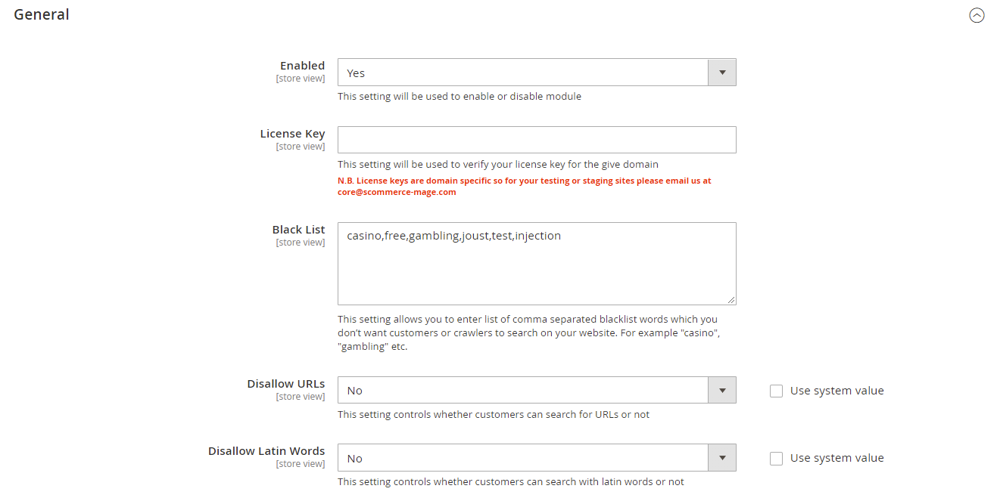
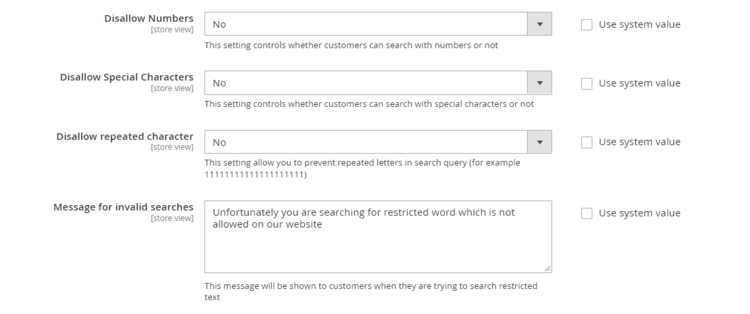

# Magento 2 Antispam Extension

### <mark style="color:blue;">Installation and User Guide for Magento 2 Antispam Extension</mark>

**Table of Contents**

1. [_Installation_ ](magento-2-antispam-extension.md#\_bookmark0)__
   * _Installation via app/code_&#x20;
   * _Installation via Composer_
2. __[_Configuration Settings for <mark style="color:blue;">A</mark>ntispam Extension_](magento-2-antispam-extension.md#\_bookmark3)__
   * _General Settings_&#x20;
   * _Rate Limiter_
3. __[_Frontend_](magento-2-antispam-extension.md#frontend)__
   * _Invalid Search_
   * _Rate Limiter_

### <mark style="color:blue;">Installation</mark> <a href="#_bookmark0" id="_bookmark0"></a>

* <mark style="color:orange;">**Installation via app/code:**</mark>** ** Upload the content of the module to your root folder. This will not overwrite the existing Magento folder or files, only the new contents will be added. After the successful upload of the package, run below commands on Magento 2 root directory.

```
php bin/magento setup:upgrade
php bin/magento setup:di:compile
php bin/magento setup:static-content:deploy
```

* <mark style="color:orange;">**Installation via Composer:**</mark> Please follow the guide provided in the below link to complete the installation via composer.


[installation-via-composer.md](../installation-via-composer.md)


### <mark style="color:blue;">Configuration Settings for Antispam</mark> <a href="#_bookmark3" id="_bookmark3"></a>

Go to **Admin > Stores > Configuration > Scommerce Configuration > Antispam Catalog Search**

#### <mark style="color:orange;">General Settings</mark> <a href="#_bookmark4" id="_bookmark4"></a>

* **Enabled –** Select “Yes” or “No” to enable or disable the module.
* **License Key –** Please add the license for the extension which is provided in the order confirmation email. Please note license keys are site URL specific. If you require license keys for dev/staging sites then please email us at [core@scommerce-mage.com](mailto:core@scommerce-mage.com)
* **Black List –** You can blacklist certain keywords from the search of your website. Enter omma separated blacklist words which you don’t want customers or crawlers to search on your website. For example "casino", "gambling" etc.
* **Disallow URLs–** Select "no" to enter URL's in your website's search and "yes" to allow.
* **Disallow Foreign Words–** Use this setting to define whether users can enter Foreign words in the search or not.




* **Disallow Numbers–** Select "no" to allow customers to search with numbers and "yes" to disallow.
* **Disallow Special Characters–** Select "no" to allow customers to search with special characters and "yes" to disallow.
* **Disallow repeated character–** Select "no" to allow customers to search with repeated characters and "yes" to disallow. It prevents repeated letters in the search query.
* **Number of repeated characters -** Enter the maximum allowed number of repeated characters
* **Message for invalid searches–** Enter the message to be displayed when an invalid search is made by the customer.&#x20;



#### <mark style="color:orange;">Rate Limiter</mark> <a href="#_bookmark4" id="_bookmark4"></a>

* **Enabled–** Select "yes" to block Ip address of the customers based on the number of searches performed in a specific time.&#x20;
* **Number of seconds–** Enter the time limit under which a user can make specific searches. If the number of searches exceeds this time limit then their IP will be temprorily blocked.&#x20;
* **Number of searches–** Enter the number of searches allowed for a user under the time restraint entered in the above setting.
* **Minutes to block IP–** Define the Ip block time for users.
* **Log Enabled–** Select "yes" to create logs under /var/log/antispamcatalogsearch.log
* **Message–** Enter the message to be displayed when the IP of an user is blocked.&#x20;


### <mark style="color:blue;">Frontend</mark>&#x20;

#### <mark style="color:orange;">Invalid Search</mark>

When an user searches with diallowed character then the warning message appears on the frontend as shown below:-

.png>)

#### <mark style="color:orange;">Rate Limiter</mark>

When an user exceeds the search limit then the IP block message appears as shown below:-

.png>)

