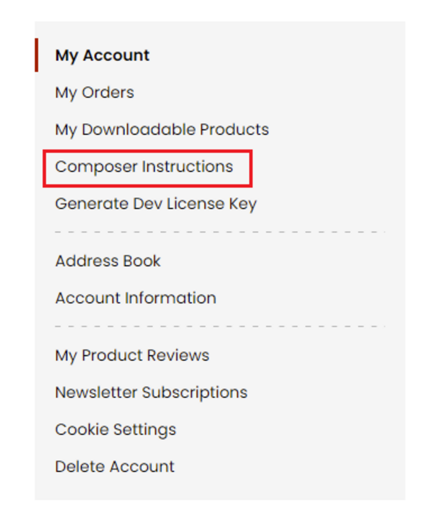
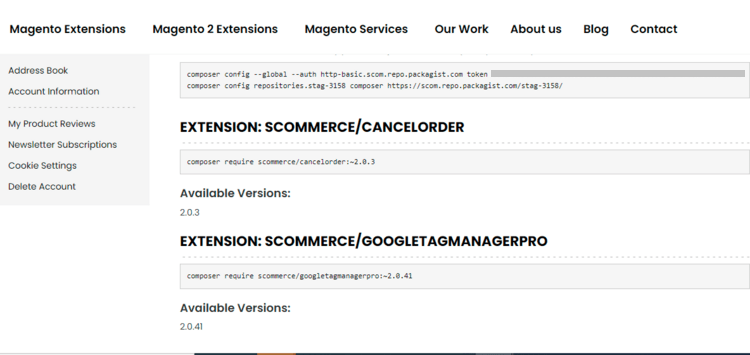

# Installation Via Composer

Please follow the instructions below to install Scommerce Mage Modules via Composer:-

<mark style="color:orange;">**Step 1:**</mark> Navigate to our store and login to your account. Then go to the **My Account** Section, on the left menu click on **Composer Instructions**.



<mark style="color:orange;">**Step 2:**</mark> Next, run the config commands shown on the top of the page then click on the extension that you want to install. A composer require command will be revealed in the dropdown menu. Run the command.



<mark style="color:orange;">**Step 3:-**</mark> Lastly run the commands given below to complete the setup.

```
php bin/magento setup:upgrade
php bin/magento setup:di:compile
php bin/magento setup:static-content:deploy
```

Please contact [**support@scommerce-mage.com**](mailto:core@scommerce-mage.com) in case of any queries**.**
