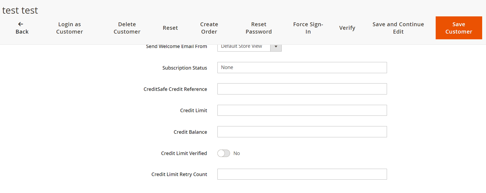
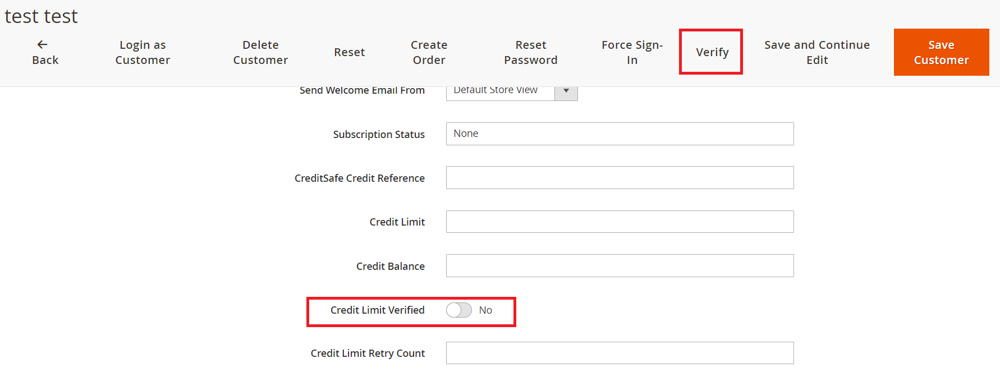
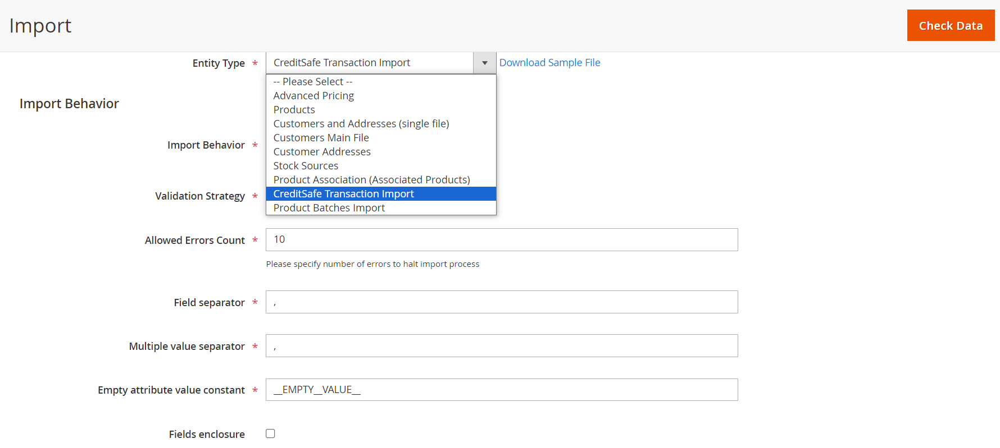
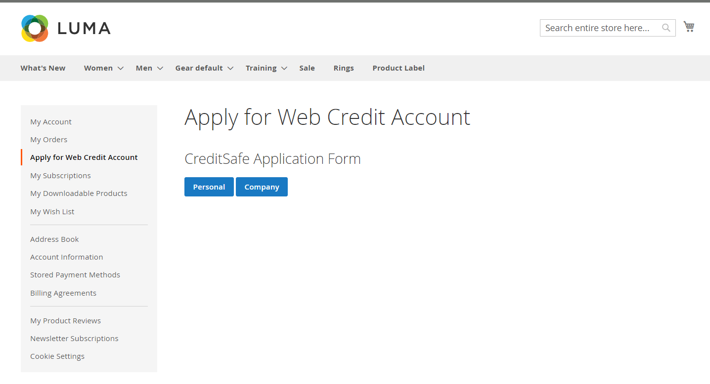
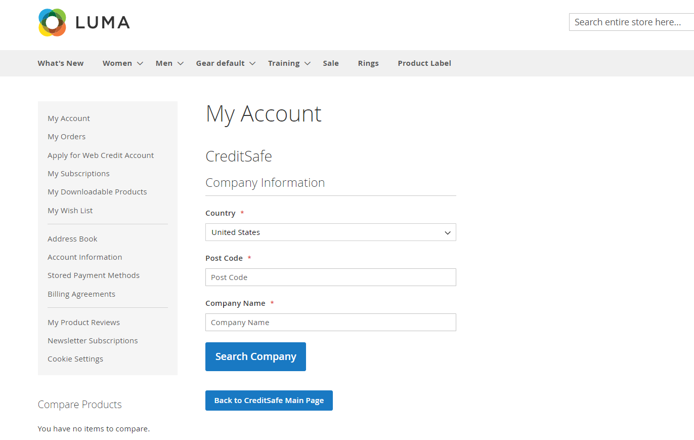

# Magento 2 Creditsafe Integration

### <mark style="color:blue;">Installation and User Guide for Magento 2 Creditsafe Integration Extension</mark>

#### **Table of Contents**

1. [_Installation_](magento-2-creditsafe-integration.md#bookmark0)
   * _Installation via app/code_&#x20;
   * _Installation via Composer_
2. [_Configuration Settings for Creditsafe Integration_](magento-2-creditsafe-integration.md#bookmark3)
   * _General Settings_&#x20;
   * _API Configuration_
   * _Limits and Messages Configuration_
   * _Limits Configuration_
   * _Emails_
   * _Customer Configuration_
3. [_CreditSafe API Logs_](magento-2-creditsafe-integration.md#bookmark3-1)
4. [_CreditSafe Information Stored Against the Customer_](magento-2-creditsafe-integration.md#bookmark3-2)
5. [_Customer Verification Process_](magento-2-creditsafe-integration.md#bookmark3-3)
6. [_CreditSafe Adjustment Grid_](magento-2-creditsafe-integration.md#bookmark3-4)
   * _CreditSafe Transactions Grid_
   * _Import CreditSafe transactions in the Grid_
7. [_Frontend_](magento-2-creditsafe-integration.md#bookmark3-3)
   * _Apply for CreditSafe Application_
   * _CreditSafe Company Application_
   * _Successful Credit Application_

### <mark style="color:blue;">Installation</mark> <a href="#bookmark0" id="bookmark0"></a>

* <mark style="color:orange;">**Installation via app/code:**</mark> Upload the content of the module to your root folder. This will not overwrite the existing Magento folder or files, only the new contents will be added. After the successful upload of the package, run below commands on Magento 2 root directory.

```
php bin/magento setup:upgrade
php bin/magento setup:di:compile
php bin/magento setup:static-content:deploy
```

* <mark style="color:orange;">**Installation via Composer:**</mark> Please follow the guide provided in the below link to complete the installation via composer.


[installation-via-composer.md](../installation-via-composer.md)


### <mark style="color:blue;">Configuration Settings for Creditsafe Integration</mark> <a href="#bookmark3" id="bookmark3"></a>

Go to _Admin> Stores> Configuration> Scommerce  > Credit Safe_

#### <mark style="color:orange;">General Settings</mark> <a href="#bookmark4" id="bookmark4"></a>

* **Enable Module –** Select “Yes” or “No” to enable or disable the module.
* **License Key –** Please add the license for the extension which is provided in the order confirmation email. Please note license keys are site URL specific. If you require license keys for dev/staging sites then please email us at [support@scommerce-mage.com](mailto:support@scommerce-mage.com).
* **Show Address Form on Registration –** Set "Yes" to collect billing address from customer on user registration or signup form. If set "No" billing address won't be captured on user registration.
* **Archiving Log –** Set "Yes" to archive credit safe logs after a certain number of days and set "No" to turn off archiving.
* **Archive Log After Number Of Days –** Enter the number of days after which the logs will be archived.&#x20;

<figure><figcaption></figcaption></figure>

#### <mark style="color:orange;">API Configuration</mark> <a href="#bookmark4" id="bookmark4"></a>

* **User Name –** Enter the Creditsafe Username
* **Password –** Enter the Creditsafe Password. Once both username and password are entered and saved click on the "Test API Creds" button if it shown "success" in green then your credentials are correct if not then please re verify your credentials.
* **Use Test Mode –** Set "Yes" to enable sandbox creditsafe and set "No" to use live creditsafe.
* **Enable API Logging –** Set "Yes" or "No" to Enable/Disable API logging in DB

<figure><figcaption></figcaption></figure>

#### <mark style="color:orange;">Limits and Messages Configuration</mark> <a href="#bookmark4" id="bookmark4"></a>

Create creditsafe rules based on your requirements.

* **Type –** Select the user type either "Business" or "Consumer" this rule will be created for the appropriate applicant type.
* **CS Credit Limit/Score Range -** Enter the credit limit or credit score range for the particular rule.
* **Limit–** Enter the credit limit to be assigned for this rule based on the score entered previously. If the score is in this range then the entered limit should be provided to the applicant.
* **Limit Type –**There are two main credit limit types:&#x20;
  * **Absolute Limit:** This limit is a fixed amount set by you or your business, regardless of external factors. It's directly entered into the "limit field" you mentioned.&#x20;
  * **Percentage Limit:** This limit is determined as a percentage of an external creditworthiness score. The external score typically comes from CreditSafe.&#x20;
  * **The calculation involves:** Credit Limit Received from CreditSafe (e.g., 1000) Limit Specified in the Limit Field (e.g., 50) The final credit limit is the percentage of the CreditSafe limit multiplied by the limit field value. In this example: Final Limit = 50% \* 1000 = 500
* **Response –** Enter the response shown to the customer when they fullfill the criteria for this rule and the the limit is assigned to them
* **Response Type –** Choose the response type from either Success or Failure.

Similarly you can create multiple rules as per your requirements to appropriately assign the credit limits to your applicants.

<figure><figcaption></figcaption></figure>

#### <mark style="color:orange;">Limits Configuration</mark> <a href="#bookmark4" id="bookmark4"></a>

* **Credit Applied Message –** Enter the message that will be displayed to user when they have previously applied for Creditsafe application.

<figure><figcaption></figcaption></figure>

#### <mark style="color:orange;">Emails</mark> <a href="#bookmark4" id="bookmark4"></a>

* **Enable Email –** Select “Yes” or “No” to enable or disable the creditsafe application emails.
* **Success Email Template –** Select the template to be used for success emails (successful credit safe application).
* **Success Email Sender –** Select the Email Sender, the email to be used to send the success emails.&#x20;
* **Success Email Recipient –** You can add an additional email where the success emails will be sent alongside the applicant.&#x20;
* **Fail Email Template –** Select the template to be used for fail emails (failed credit safe application). This email will only be sent to the customer.
* **Fail Email Sender –** Select the Email Sender, the email to be used to send the failure emails.&#x20;
* **Fail Email Recipient –** This is optional. You can add an additional email where the failure emails will be sent other than the customer. This email will be exactly same as the one sent to the customer.
* **Admin Fail Email Template –** Select the template to be used for fail emails (failed credit safe application) to admin. This email template is only sent to the Administrator and not the customer. It contains for details regarding the failure of the credit application.
* **Admin Fail Email Sender –** Select the Email Sender, the email to be used to send the failure emails to admin.&#x20;
* **Admin Fail Email Recipient –** This is optional. You can add an additional email where the failure emails will be sent alongside the admin. This failure email will be exactly same as the one sent to administrator.
* **Admin API Result Email Template –** Select the template to be used for API results to admin. When the credit application occurs the requests and responses from various end points will be sent to the admin via this email template.
* **Admin API Result Email Sender –** Select the Email Sender, the email to be used to send API results to admin.&#x20;
* **Admin API Result Email Recipient –** This is optional You can add an additional email where the API results will be sent alongside the admin. This email will be exactly same as the one sent to administrator contianing requests and responses of various end points hit during the credit application.

<figure><figcaption></figcaption></figure>

<figure><figcaption></figcaption></figure>

#### <mark style="color:orange;">Customer Configuration</mark> <a href="#bookmark4" id="bookmark4"></a>

* **Approval Type  –** Select either "disabled" "manual" or "automatic". If "disabled" is selected, the verification will be disabled. If "manual" is selected,the credtisafe applications will be only approved/verified by the magento admin. If "automatic" is selected, the credisafe applications will be automatically approved or denied based on the Credit limits and Messages Configuration.
* **Allow customers to retry –** If set to "Yes", customers will be able to re-apply for creditsafe application. If set to "No", once creditsafe application is submitted they won't be able to retry the application.
* **Maximum number of retry allowed:-** Enter the maximum number of retries for customers to check their credit limit.&#x20;
* **Email Sender –** Select the email sender which will be used to send out applicant verification emails
* **Verification Success Email Template –** Select the Email template to be used for successfull applicant verification.
* **Verification Rejected Email Template –** Select the Email template to be used for failed applicant verification.
* **Success Credit Limit message (not verified):-** Enter the success credit limit message when credit check was successfull but not verified.&#x20;
* **Success Credit Limit message (verified)):-** Enter the success credit limit message when credit check was successfull and verified.&#x20;
* **Failed Credit Limit Message  –** Enter the message that will be displayed to customer when their credit check failedbut they have retries available.
* **Failed Credit Limit (no retries)  –** Enter the message that will be displayed to customer when their credit check failed and they have no retries available.

<div data-full-width="true">

<figure><figcaption></figcaption></figure>

</div>

<div data-full-width="true">

<figure><figcaption></figcaption></figure>

</div>

### <mark style="color:blue;">CreditSafe API Logs</mark> <a href="#bookmark3" id="bookmark3"></a>

All requests and responses with regards to creditsafe endpoints are logged into a grid. You can view the logs by going into **Admin>System>CreditSafe API Logs>Credit Safe Logs**.&#x20;

<div data-full-width="true">

<figure><figcaption></figcaption></figure>

</div>

If you further click on any of the entries it contains the information as shown in the image below:-&#x20;

<div data-full-width="true">

<figure><figcaption></figcaption></figure>

</div>

### <mark style="color:blue;">CreditSafe Information Stored Against the Customer</mark> <a href="#bookmark3" id="bookmark3"></a>

Our module adds certain fields against the customer to keep track of credit assignment and available credit limits. Following fields are added:-

* **CreditSafe Credit Reference:-** Credit reference number received from creditsafe upon credit application.
* **Credit Limit:-** The limit received from creditsafe upon succefull credit application. Maximum limit that can be used by the customer to make purchases. It does not decrease after transactions.
* **Credit Balance:-** The limit received from creditsafe upon succefull credit application. Maximum limit that can be used by the customer to make purchases. This value get's updated based on transactions made by the customer. for eg:- if they make purchase using the credit limit then that amount will be deducted and reflected here.&#x20;
* **Credit Limit Verified:-** This toggle turns on when the customer verification is complete, either manual or automatic.&#x20;
* **Credit Limit Retry Count:-** The number of times a customer has applied for credit application.

<div data-full-width="true">

<figure><figcaption></figcaption></figure>

</div>

### <mark style="color:blue;">Customer Verification Process</mark> <a href="#bookmark3" id="bookmark3"></a>

Based on the "Approval Type" configuration described earlier, the customer's verification takes place:-

* **Automatic:-** The customer verification is done automatically.
* **Manual:-** When "manual" verification is selected, then it is upon the administrator to verify the customer, for eg:- asking for documents via email and verifying them in person. Once verified admin can click on the verify button or turn on the toggle in the customer page ( go to **Admin>Customers>All Customers>select the customer**). Once verified by using the "Verify" button, the customer get an email regarding their successful verification.

<div data-full-width="true">

<figure><figcaption></figcaption></figure>

</div>

* **Disabled:-** Customer verification is not required and upon successful application the credit limits are assigned to customer.

### <mark style="color:blue;">CreditSafe Adjustment Grid</mark> <a href="#bookmark3" id="bookmark3"></a>

#### <mark style="color:orange;">CreditSafe Transactions Grid</mark>

It allows you to track and manage adjustments made to customer credit limits based on their orders and payments. With this system, you can view and manage adjustments made to customer credit limits in a single, easy-to-use grid. Easily Keep track of adjustments made to customer credit limits. Go to **Admin>Sales>Creditsafe>Transactions.** The grid reflects both positive and negative adjustments i.e when a customer makes a purchase using their credit limit and when they make the payment of the invoice.&#x20;

<div data-full-width="true">

<figure><figcaption></figcaption></figure>

</div>

#### <mark style="color:orange;">Import CreditSafe transactions in the Grid</mark>

You can import transactions by either going into Admin>System>Import our by going to sales>Orders>Import from CSV. Next select the "Entity Type" as "CreditSafe Transaction Import" from the dropdown.&#x20;

<div data-full-width="true">

<figure><figcaption></figcaption></figure>

</div>

The format of the import file should be as shown in the image. The fields required are as follows:-

* **entity\_id:-** Enter the id of the next transaction as per your CreditSafe Transaction Grid. For eg:- if you have 1-24 transactions then you should start the list from 25..26 and so on.&#x20;
* **payment\_date:-** Date & time of the payment received or deducted.
* **adjustment\_amount:-** Enter a positive or negative adjustment amount. adding a positive amount will add the amout in the customers credit balanace wheras for negative amount it will deduct the amount from credit balance.
* **increment\_id:-** Enter the order id.&#x20;
* **customer\_email:-** Enter the customer email.
* **transaction\_description:-** You can add a description of the adjustment which will be reflected in the creditsafe transactions grid.

<div data-full-width="true">

<figure><figcaption></figcaption></figure>

</div>

### <mark style="color:blue;">Frontend</mark> <a href="#bookmark3" id="bookmark3"></a>

#### <mark style="color:orange;">Apply for CreditSafe Application</mark>

Customers can apply for creditsafe application from their My Account section using the button "Apply for Web Credit Account".

<div data-full-width="true">

<figure><figcaption></figcaption></figure>

</div>

<div data-full-width="true">

<figure><figcaption></figcaption></figure>

</div>

#### <mark style="color:orange;">CreditSafe Company Application</mark>

<div data-full-width="true">

<figure><figcaption></figcaption></figure>

</div>

#### <mark style="color:orange;">Successful Credit Application</mark>

<div data-full-width="true">

<figure><figcaption></figcaption></figure>

</div>

If you have a question related to this extension please check out our **FAQ Section** first. If you can't find the answer you are looking for then please contact [**support@scommerce-mage.com**](mailto:core@scommerce-mage.com)**.**
