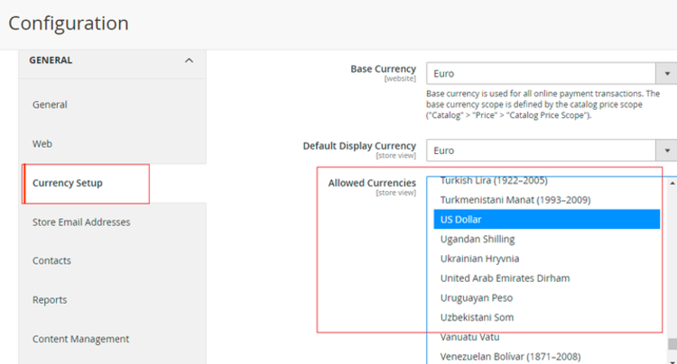

# Magento 2 Diamond Search

### <mark style="color:blue;">Installation and User Guide for Magento 2 Diamond Search Extension</mark>

#### **Table of Contents**

1. [_Prerequisites( module installed previously )_](magento-2-diamond-search.md#\_bookmark0)
   * _Module Installed via composer_
   * _Module Installed by Placing Files in app/code_
2. [_Installation_](magento-2-diamond-search.md#\_bookmark0-1)
   * _Installation via app/code_&#x20;
   * _Installation via Composer_
3. [_Configuration Settings for Diamond Search_](magento-2-diamond-search.md#\_bookmark3)
   * _General Settings_&#x20;
   * _Filter Widget Settings_
   * _Myo Widget_
4. [_Integration Modes_](magento-2-diamond-search.md#integration-modes)
   * _Local_
   * _RapNet_
5. [_Custom Attribute Set_](magento-2-diamond-search.md#custom-attribute-set)
   * _Settings_
   * _Diamonds_
6. [_Ring Builder_](magento-2-diamond-search.md#ring-builder)
   * _Choosing a Diamond_
   * _Choosing a Setting_
   * _Review Complete Ring_
7. [_Setup 360 view and Certificate_](magento-2-diamond-search.md#setup-360-view-and-certificate)
   * _Certificate_
   * _360 view_
8. [_Frontend_](magento-2-diamond-search.md#frontend)

### <mark style="color:blue;">Prerequisites( module installed previously )</mark> <a href="#bookmark0" id="bookmark0"></a>

If you have previously installed this module on your store using **MageInn** Extension then you need to follow the steps below in order to install it again on your site. You will need to remove the module first then proceed with the installation steps in the next section.

#### <mark style="color:orange;">Module Installed via Composer</mark>

If the module was installed previously via composer then run the commands below to remove it completely:-

```
// disable the module
php bin/magento module:disable Mageinn_DiamondSearch

//remove the module 
composer remove mageinn/module-diamondsearch

//run upgrade commands
php bin/magento setup:upgrade
php bin/magento setup:di:compile
php bin/magento setup:static-content:deploy
```

#### <mark style="color:orange;">Module Installed by placing files in app/code</mark>

If the module was previously installed by placing extension files in app/code then simply go the following directory `app/code/MageInn/` and remove the **DiamondSearch** folder completely then run the upgrade commands as shown below:-

```
php bin/magento setup:upgrade
php bin/magento setup:di:compile
php bin/magento setup:static-content:deploy
```

### <mark style="color:blue;">Installation</mark> <a href="#bookmark0" id="bookmark0"></a>

* <mark style="color:orange;">**Installation via app/code:**</mark> Upload the content of the module to your root folder. This will not overwrite the existing Magento folder or files, only the new contents will be added. After the successful upload of the package, run below commands on Magento 2 root directory.

```
php bin/magento setup:upgrade
php bin/magento setup:di:compile
php bin/magento setup:static-content:deploy
```

* <mark style="color:orange;">**Installation via Composer:**</mark> Please follow the guide provided in the below link to complete the installation via composer.


[installation-via-composer.md](../installation-via-composer.md)


### <mark style="color:blue;">Configuration Settings for Diamond Search</mark> <a href="#bookmark3" id="bookmark3"></a>

Go to _Admin> Stores> Configuration> Scommerce  > Diamond Search_

#### <mark style="color:orange;">General Settings</mark> <a href="#bookmark4" id="bookmark4"></a>

* **Enable Module –** Select “Yes” or “No” to enable or disable the module.
* **License Key –** Please add the license for the extension which is provided in the order confirmation email. Please note license keys are site URL specific. If you require license keys for dev/staging sites then please email us at [support@scommerce-mage.com](mailto:support@scommerce-mage.com).
* **Source:-** Select the source from where the products are pulled. Rapnet/Demo pulls products via Rapnet API where Rapnet is live. "Local" pulls products from Magento.
*   **API Key (RapNet):-** Enter the API key provided by RapNet here. •         [http://technet.rapaport.com/ProgrammaticAccess/Keys.aspx](http://technet.rapaport.com/ProgrammaticAccess/Keys.aspx) <mark style="color:red;">The following key works only “localhost” domain:</mark> <mark style="color:red;"></mark>_<mark style="color:red;">8EC95570ABE6411290197CB28845A6FF</mark>_

    _<mark style="color:red;">Please note - “localhost” means domain. Not IP- address like “127.0.0.1”, not other domain matched to local IP, “localhost” means domain. So this test API-key used only for local site running via “</mark>_[_<mark style="color:red;">http://localhost</mark>_](http://localhost/)_<mark style="color:red;">”. Not for “</mark>_[_<mark style="color:red;">http://127.0.0.1</mark>_](http://127.0.0.1/)_<mark style="color:red;">”, not for “</mark>_[_<mark style="color:red;">http://my-domain-resolved-to-local-ip.tld</mark>_](http://my-domain-resolved-to-local-ip.tld/)_<mark style="color:red;">”, only for</mark>_ [_<mark style="color:red;">“h</mark>_](http://localhost/)_<mark style="color:red;">t</mark>_[_<mark style="color:red;">tp://localhost</mark>_](http://localhost/)_<mark style="color:red;">”</mark>_
* **Theme Color:-** Enter the color code for the entire diamond search theme
* **Diamond Image Type:-** Choose between two image types schematic or photo for diamonds that appear in the list
* **Settings Attribute Set:-** Attribute Set used to select products on Settings step(step 2) in Ring Builder (eg:- something like "Rings"). If you are creating a custom attribute set for rings then include critical **Settings** attributes which are **Shape, Size from, and Size To,** and these attributes must have values against them for everything to work correctly on the front end as these values get used to select the correct Ring.
* **Diamond Search Category:-** Diamond Search Category used to show Settings on Step 2(choose a setting)
* **Show Dropdown filters:-** If set then filters will be dropdowned. If not set then filters will be always displayed


#### <mark style="color:orange;">Widget Filter Settings</mark> <a href="#bookmark4" id="bookmark4"></a>

* **Expand filters:-** Select "Yes" to expand widget filters by default and select "No" to keep it hidden
* **Show Natural / Lab filter:-** Select "Yes" or "no" to show or hide the natural/lab filter for diamonds.
* **Default Diamond Type:-** Select default diamond type filter natural or lab.
* **Show selected Shapes:-** Select "Yes" to show different diamond varieties in filter menu and select  "No" to keep them hidden
* **Shapes:-** Allowed Shapes(list of diamonds to appear in filter menu)
* **Show selected Sizes:-** Enable/Disable CARAT filter. Set "Yes" to show CARAT filter. If set to "No" CARAT filter will be disabled


* **Size From:-** CARAT filter range start
* **Size To:-** CARAT filter range end
* **Show selected Colors:-** Enable/Disable COLOR filter. Set "Yes" to show COLOR filter. If set to "No" COLOR filter will be disabled
* **Color From:-** COLOR filter range start
* **Color To:-** COLOR filter range end
* **Show selected Clarities:-** Enable/Disable CLARITY filter. Set "Yes" to show CLARITY filter. If set to "No" CLARITY filter will be disabled
* **Clarity From:-** CLARITY filter range start
* **Clarity To:-** CLARITY filter range end
* **Show selected Cuts:-** Enable/Disable CUT filter. Set "Yes" to show CUT filter. If set to "No" CUT filter will be disabled
* **Cut From:-** CUT filter range start
* **Cut To:-** CUT filter range end


* **Show selected Polishes:-** Enable/Disable POLISH filter. Set "Yes" to show POLISH filter. If set to "No" POLISH filter will be disabled
* **Polish From:-** POLISH filter range start
* **Polish To:-** POLISH filter range end
* **Show selected Symmetry:-** Enable/Disable SYMMETRY filter. Set "Yes" to show SYMMETRY filter. If set to "No" SYMMETRY filter will be disabled
* **Symmetry From:-** SYMMETRY filter range start
* **Symmetry To:-** SYMMETRY filter range end


* **Show selected Labs:-** Enable/Disable CERTIFICATE/LAB filter. Set "Yes" to show CERTIFICATE/LAB filter. If set to "No" CERTIFICATE/LAB filter will be disabled
* **Labs:-** Select list of labs to appear in CERTIFICATE/LAB filter


* **Filter by Price Total In Currency:-** Enable/Disable PRICE filter. Set "Yes" to show PRICE filter. If set to "No" PRICE filter will be disabled
* **Filter by Price Total In Currency From:-** PRICE filter range start
* **Filter by Price Total In Currency To:-** PRICE filter range end
* **Show selected Fancy Colors:-** ENABLE/DISABLE fancy colors in COLOR filter. NOTE:- Fancy Colors will only appear when "fancy" is selected in "Default Search Type" setting.
* **Fancy Colors:-** Allowed Fancy Colors(List of fancy colours to appear in the COLOR filter) _<mark style="color:red;">NOTE:- Fancy Colors will only appear when "fancy" is selected in "Default Search Type" setting.</mark>_


* **Show Filter by Paired:-** ENABLE/DISABLE PAIR filter. If "yes" Pair will be available in the Filter. It allows to filter diamonds by paired attribute.
* **Diamond Title Format In Widget:**- Placeholders like \[size] means diamond property. Placeholders like {STRING} means lexicon string


* **Default Search Type:-** WHITE/Fancy selecting "white" will enable COLOR filter and color filter range wheras selecting "fancy" will enable the FANCY filter and fancy filter range.
* **Page Size:-** Enter the total number of products to appear in the Diamond list.
* **Show Price:-** If set to "Yes" then the PRICE column will be available in the Diamond list. If "No" then price column will disappear from the diamond list.
* **Show Add To Cart Button:-** Set "Yes" or "No" to show or hide Add To Cart Button On Frontend Diamond Page
* **Show Add To Wishlist Button:-** Set "Yes" or "No" to show or hide Add To Wishlist Button On Frontend Diamond Page
* **Is Responsive:-** Set "Yes" or "No" to choose whether the style is reponsive for diamond search or not.


#### <mark style="color:orange;">Myo Widget</mark>  <a href="#bookmark4" id="bookmark4"></a>

* **Add custom size option to bundle product:-** Set "Yes" or "No" to Add or Remove custom size option to bundle product
* **Bundle Generated Size Label:-** Bundle Generated Size Label for dropdown with custom options of generated bundle product
* **Custom Sizes:**- Select the custom Sizes added to bundle product on the fly


### <mark style="color:blue;">Integration Modes</mark>

The extension comes with two integration modes:- Local and RapNet.

#### <mark style="color:orange;">Local</mark>

When mode is set to local you can create your diamond products directly from Magento admin. All you need to do is to assign “Diamonds” attribute set to your diamond products

#### <mark style="color:orange;">RapNet</mark>

RapNet brings millions of dollars in diamond product to your Magento store, without the cost of owning the physical diamonds. All diamonds and attributes should be configured directly from RapNet admin panel. RapNet provides data and pricing in real time. Once the customer places the order using the ring builder the product gets automatically created in Magento catalog. [https://www.rapnet.com/](https://www.rapnet.com/)

### <mark style="color:blue;">Custom Attribute Set</mark>

By default, the module adds two attribute sets i.e. Settings and Diamonds. These contain essential attributes for the module to work. If you want to create a custom attribute set, you need to include the attributes from these existing sets in order for your custom attribute set to work properly and the functional flow to be correct. We will go through each of these attribute sets and the attributes contained within them.

#### <mark style="color:orange;">Settings</mark>

If you want to use a custom attribute set for "Rings" aside from settings then include critical **Settings** attributes which are **Shape, Size from and Size To** and these attributes must have values against them for everything to work correctly on frontend as these values get used to select correct Ring. All the attributes included in this attribute set are as follows:-

* ds\_size\_min
* ds\_size\_max
* ds\_shape
* ds\_is\_paired

#### <mark style="color:orange;">Rings</mark>

All the attributes included in this attribute set are as follows:-

* mdiamond\_id
* mshape
* msize
* mcolor
* mfancy\_color\_dominant\_color
* mfancy\_color\_secondary\_color
* mfancy\_color\_overtone
* mfancy\_color\_intensity
* mclarity
* mcut
* msymmetry
* mpolice
* mdepth\_percent
* mtable\_percent
* mmeas\_length
* mmeas\_width
* mmeas\_depth
* mgirdle\_min
* mgirdle\_max
* mgirdle\_condition
* mculet\_size
* mculet\_condition
* mfluor\_color
* mfluor\_intensity
* mhas\_cert\_file
* mcountry
* mcity
* mlab
* mtotal\_purchase\_price
* mtotal\_sales\_price
* mcurrency\_code
* mcurrency\_symbol
* mtotal\_sales\_price\_in\_currency
* mcert\_num
* mstock\_num
* mhas\_sarineloupe
* msarineloupe\_url
* mis\_fancyColor
* ds\_is\_paired
* mis\_lab\_diamond

### <mark style="color:blue;">Ring Builder</mark>

Ring Builder is a great tool to allow your customers to pair any diamond with setting of their choice. Ring builder is fully responsive. You can also define a filter for each setting, so that only compatible diamonds are shown when setting is selected<mark style="color:orange;">.</mark>

The entire process is divided into three steps namely, choosing a diamond, choosing a ring and in the final step a bundled product is created using previous selections and customers can place an order with that product.

_<mark style="color:red;">**Note:-**</mark> <mark style="color:red;"></mark><mark style="color:red;">Customers can start by either choosing a diamond first or choosing a setting(ring) first they will automatically be redirected to the next step.</mark>_&#x20;

#### <mark style="color:orange;">Choosing a Diamond</mark>

If customers chooses to start by selecting a diamond then they will be able to see the diamond search page as shown in the image below. It contains several filters which can be utilized to pinpoint the exact diamond as per requirements.&#x20;


Once the customer decides on a diamond they click on it which takes them to a detailed page for that diamond. It contains all the necessary details related to that specific diamond. Once satisfied they click on **SELECT DIAMOND** and they are redirected to the next step i.e choosing a ring.&#x20;


#### <mark style="color:orange;">Choosing a Setting(Ring)</mark>

In the next step, customers are directed towards the ring selection. Rings automatically get filtered and only the compatible rings for the diamond selected are displayed on this page. Simply click on choose this setting and you will redirected to the final step.&#x20;


#### <mark style="color:orange;">Review Complete Ring</mark>

In the final step a bundled product is created using the first two selections which customers can add to basket and place an order with it.&#x20;


### Multicurrency Setup

**Multiple currencies** can be added/selected from Admin > Stores Configuration > General > Currency Setup – Allowed Currencies – Select currencies



**Currency rates** can be configured against base currency from Admin > Stores > Currency > Currency Rates

.png>)

**Base currency** can be defined from Admin > Stores Configuration > General > Currency Setup > Base Currency – Select currency

.png>)

#### Currency Switcher Frontend

.png>)

### <mark style="color:blue;">Setup 360 view and Certificate</mark>

Please follow the steps provided below in order to setup 360 view and certificate:-

1. Use local inventory in the configuration
2. Update diamond and add below values from Admin > Catalog > Products > Select Diamiond > Edit > “**Diamond Details**“
   1. Put any value with url of the document (ex. [https://certimage.s3-accelerate.amazonaws.com/images/full\_size/certificates/LG480159253.pdf](https://certimage.s3-accelerate.amazonaws.com/images/full\_size/certificates/LG480159253.pdf)) in the **“Has cert file”** attribute for the certificate
   2. Put any value for 360 url value for **“ Sarineloupe Url“** attribute (ex. [V360 Viewer](https://certimage.s3-accelerate.amazonaws.com/V360\_viewers/sample\_image/Vision360.html?surl=https://certimage.s3-accelerate.amazonaws.com/V360/\_v4.0/\&d=IM-143-102-04\&sv=0,1,2,3,4,5) ) and **1** to “ **Has Sarineloupe“** attribute**.**

**Test URL** - [Choose a diamond](https://diamondsearch.scommerce-mage.co.uk/diamondsearch/#!/93072712)

.png>)

#### <mark style="color:orange;">Certificate</mark>

.png>)

#### <mark style="color:orange;">360 view</mark>

.png>)

### <mark style="color:blue;">Frontend</mark>

The below screengrab contains order  with custom ring size selected:-


If you have a question related to this extension please check out our [**FAQ Section**](https://www.scommerce-mage.com/magento2-diamond-search.html#faq) first. If you can't find the answer you are looking for then please contact [**support@scommerce-mage.com**](mailto:core@scommerce-mage.com)**.**
