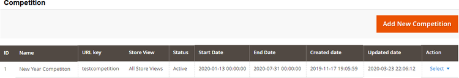
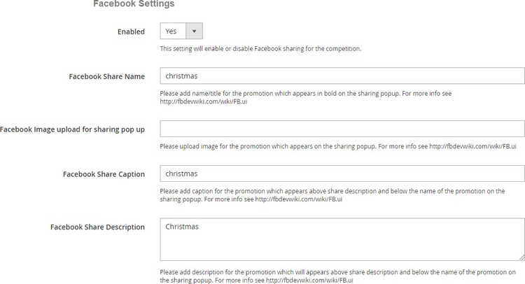
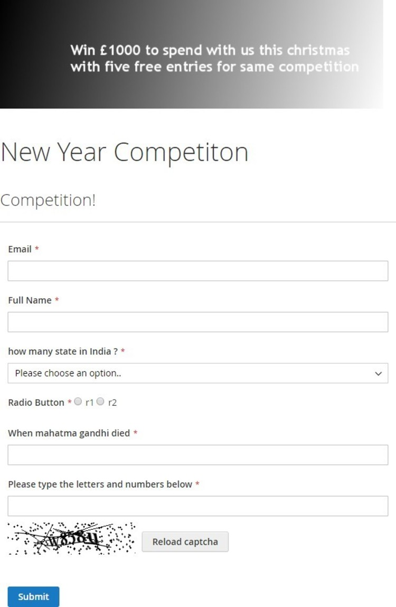
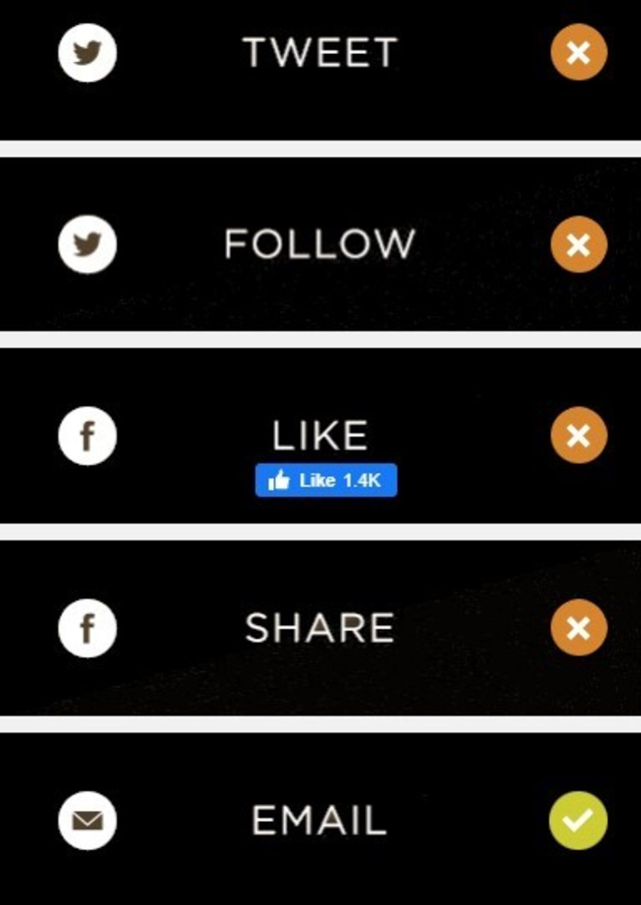
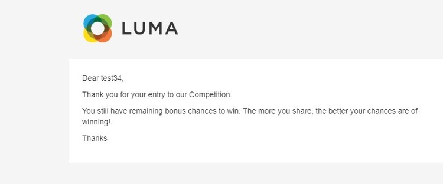
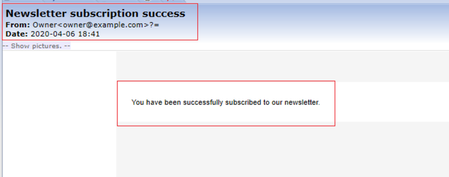
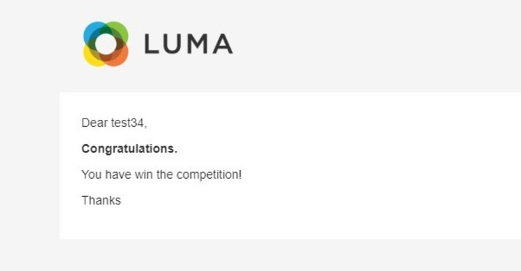

# Magento 2 Competition or Prize Draw with Social Booster

### <mark style="color:blue;">Installation and User Guide for Magento 2 Competition or Prize Draw with Social Booster Extension</mark>

**Table of Contents**

1. [_Installation_ ](magento-2-competition-or-prize-draw-with-social-booster.md#\_bookmark0)
   * _Installation via app/code_&#x20;
   * _Installation via Composer_
2. [_Configuration Settings for Competition_ ](magento-2-competition-or-prize-draw-with-social-booster.md#\_bookmark3)
   * _General Settings_&#x20;
   * _Social Booster - Facebook Settings_&#x20;
   * _Social Booster - Twitter Settings_&#x20;
   * _Email_&#x20;
3. [_Create/Edit/Delete Custom form fields_ ](magento-2-competition-or-prize-draw-with-social-booster.md#\_bookmark8)
   * _View Custom Field Screen_&#x20;
4. [_Create/Edit Competition_ ](magento-2-competition-or-prize-draw-with-social-booster.md#\_bookmark10)
   * _Create Competition_&#x20;
   * _Add Fields in Competition Form_&#x20;
   * _Add Custom Fields_&#x20;
   * _Design_&#x20;
   * _Facebook Settings_&#x20;
   * _Twitter Sharing_&#x20;
   * _Email Template for Competition Entry Email_&#x20;
   * _Choose Winner_&#x20;
5. [_Competition Entrants_ ](magento-2-competition-or-prize-draw-with-social-booster.md#competition-entrants)
   * _View Entrants_&#x20;
6. [_Front-end Site View_ ](magento-2-competition-or-prize-draw-with-social-booster.md#\_bookmark21)
   * _Competition Form_&#x20;
   * _Social Sharing Links on the Form_&#x20;
   * _Competition Entry Confirmation Email_&#x20;
   * _Newsletter Subscription Confirmation Email_&#x20;
   * _Competition Winner Confirmation Email_&#x20;

### <mark style="color:blue;">Installation</mark> <a href="#_bookmark0" id="_bookmark0"></a>

* <mark style="color:orange;">**Installation via app/code:**</mark> Upload the content of the module to your root folder. This will not overwrite the existing Magento folder or files, only the new contents will be added. After the successful upload of the package, run below commands on Magento 2 root directory.

```
php bin/magento setup:upgrade
php bin/magento setup:di:compile
php bin/magento setup:static-content:deploy
```

* <mark style="color:orange;">**Installation via Composer:**</mark> Please follow the guide provided in the below link to complete the installation via composer.


[installation-via-composer.md](../installation-via-composer.md)



### <mark style="color:blue;">Configuration Settings for Competition</mark> <a href="#_bookmark3" id="_bookmark3"></a>

Go to **Admin > Stores > Configuration > Scommerce Configuration > Competition**

#### <mark style="color:orange;">General Settings</mark> <a href="#_bookmark4" id="_bookmark4"></a>

* **Enabled –** Select “Yes” or “No” to enable or disable the module.
* **License Key –** Please add the license for the extension which is provided in the order confirmation email. Please note license keys are site URL specific. If you require license keys for dev/staging sites then please email us at [core@scommerce-mage.com](mailto:core@scommerce-mage.com)
* **Enable Captcha on Competition Form –** Please select “Yes” or “No” to enable/disable captcha on the competition form.
* **Subscription to Newsletter on Form Submission –** Please select “Yes” or “No” to enable/disable newsletter subscription on the competition form.


#### <mark style="color:orange;">Social Booster - Facebook Settings</mark> <a href="#_bookmark5" id="_bookmark5"></a>

* **Enable (Yes/No) –** Please select “Yes” or “No” to Facebook sharing for competitions global level.
* **Facebook Fan Page –** Please add full URL of your Facebook page for example [www.facebook.com/scommercemage](http://www.facebook.com/scommercemage).
* **Facebook App ID –** Please add Facebook application Id this can be obtained by creating app by clicking on the following URL ([https://developers.facebook.com/apps](https://developers.facebook.com/apps)) after login to your Facebook account.


#### <mark style="color:orange;">Social Booster - Twitter Settings</mark> <a href="#_bookmark6" id="_bookmark6"></a>


* **Enable (Yes/No) –** Please select “Yes” or “No” to Twitter for competitions on global level.
* **Twitter Account –** Please add unique id of your twitter account. For example our twitter account is [http://www.twitter.com/scommerce/mage](http://www.twitter.com/scommerce/mage) so you just need to put Scommerce Mage.

#### <mark style="color:orange;">Email</mark> <a href="#_bookmark7" id="_bookmark7"></a>

* **Enable (Yes/No) –** Please select “Yes” or “No” for competition email.
* **Email Sender (Textbox) –** Please add email sender for competition email.
* **Email Template for competition entry email –** Please select dropdown to select default global level competition entry email template from the available list of templates. A default template will be added with the extension install.


### <mark style="color:blue;">Create/Edit/Delete Custom form fields</mark> <a href="#_bookmark8" id="_bookmark8"></a>

You can create, update and delete custom fields from **Admin > Competition > Custom Fields.** The grid will have below columns:

* **ID –** This will be custom field code.
* **Field code –** This will be custom field code.
* **Field Title –** This will be custom field title.
* **Field Type –** This will be custom field type.
* **Action –** Edit/Delete

>)

* <mark style="color:orange;">**View Custom Field Screen -**</mark> Click on "Add New Custom Field" will redirect you to detailed view custom field page and by filling all the required details you can create a new custom field. It will have below tabs: -

<mark style="color:blue;">**Field Information**</mark>

* **Field Code (text box) –** This will be mandatory and unique. No spaces or special character will be allowed, and it will be all lower cases just like attribute code and will not be editable once created.
* **Display Name/Title (text box) –** Name/Title for the custom field which will be displayed on front end in competition form.
* **Type (drop down) –** This will be a drop down to select the type of the field, and it won't be editable once created.
  * Text
  * Text area
  * Checkbox
  * Radio Button
  * Dropdown
  * Multi Select
  * Date Picker
* **Maximum Character allowed (text box) –** This will be only visible, if the type is Text or Text area. User will be able to define max character for the field.
* **Options(grid) –** This will be only visible, only if the type is Checkbox or Radio or Dropdown or Multiselect. User will be able to relative options here. The grid will have the following columns: -
  * Is Default
  * Value
  * Label default store view
  * All other available store views
  * Delete/Remove (action)
* **Answer (text box) –** This will be an optional field for adding answer. If the type is date picker then the date format for answer should be correct.

>)

>)

### <mark style="color:blue;">Create/Edit Competition</mark> <a href="#_bookmark10" id="_bookmark10"></a>

You can update, delete and create a new competition from **Admin > Competition > Competitions.**

**The grid will have below columns: -**

* ID – This will be competition ID. System generated
* Name – This will be competition name/title
* URL Key – This will be competition URL Key
* Store View – This will be a store view drop down for to select stores for competition.
* Status – Competition status (active/disabled)
* Start date – Start date for the competition
* End date – End date for the competition
* Created date – Created date for the competition
* Updated date – Updated date for the competition
* Action – Edit/Delete
* **Create Competition -** Click on "Add New Competition" will redirect you to detailed competition page. It will have below tabs: -



#### <mark style="color:orange;">General</mark>

* Competition Name - Enter the competition name. The name will appear on the front-end competition form.
* Competition URL - Enter the URL. This URL will be used to open the completion form on the front-end.
* Competition Description - Add the description. This description will appear on the front-end competition form.
* Competition Store – Multi select filled with values.
* Include Name in Form – Dropdown, Include Name in Form (Yes/No)
* Competition Status – Drop Down, Competition Status (Active/Disabled)
* Competition Meta Title - Enter meta title
* Competition Meta Description – Add meta description.
* Competition Meta Keywords – Keywords
* Competition Start Date – Date picker
* Competition End Date – Date picker
* Competition form Submit Button Label

>)

* <mark style="color:orange;">**Add Fields in Competition Form -**</mark> To add fields in competition form go to **Admin > Competition > Competitions > Add Fields in Competition Form.** It will have the fields: -
  * ID
  * Field Title
  * Field Type
  * Action
  * Sort Order

>)

* <mark style="color:orange;">**Add Custom Fields -**</mark> You can add fields from **Admin > Competition > Competitions > Add Fields in Competition Form >** Click on **"Add Fields**" **>** Select fields and Click on "**Add Selected Fields"**. This screen will have all the available custom fields in a grid form and user will be able to select fields to add to the competition form.
  * Checkbox to select fields
  * Field Code
  * Field Name/Title
  * Field Type
  * Field Position – This will be editable numeric field and will decide the display position for the competition form. This is specific to competition form.

>)

* <mark style="color:orange;">**Design -**</mark> This tab will display two drop downs with all the static block where user will be able to select static block for the competition entry page and success page from **Admin > Competition > Competitions > Add Fields in Competition Form > Design.**
  * **Static block for Competition Entry Page –** Please select static block for competition entry page on front end.
  * **Static block for Competition Entry Thank you page –** Please select static block for competition entry page on the front end.

>)

* <mark style="color:orange;">**Facebook Settings –**</mark> This tab will only be visible, if enabled from **Admin > Stores > Configuration > Scommerce Configuration > Competition > Social Booster-Facebook settings**
  * **Enabled (yes/no) –** Please select “Yes” or “No” for Facebook sharing for the competition.
  * **Facebook Share Name –** Please add name/title for the promotion which appears in bold on the sharing popup. For more info see [https://fbdevwiki.com/wiki/FB.ui](https://fbdevwiki.com/wiki/FB.ui)
  * **Facebook Image upload for sharing pop up –** Please upload image for the promotion which appears on the sharing poup. For more info see [https://fbdevwiki.com/wiki/FB.ui](https://fbdevwiki.com/wiki/FB.ui)
  * **Facebook Share Caption –** Please add caption for the promotion which appears above share description and below the name of the promotion on the sharing popup. For more info see [http://fbdevwiki.com/wiki/FB.ui](http://fbdevwiki.com/wiki/FB.ui)
  * **Facebook Share Description –** Please add description for the promotion which will appears above share description and below the name of the promotion on the sharing popup. For more info see [http:fbdevwiki.com/wiki/FB.ui](http://fbdevwiki.com/wiki/FB.ui)



* <mark style="color:orange;">**Twitter Sharing –**</mark> This tab will only be visible, if enabled from **Admin >Stores > Configuration > Scommerce Configuration > Competition > Social Booster- Twitter Settings**
  * **Enabled (yes/no) –** Please select “Yes” or “No” for Twitter sharing on competition form.
  * **Twitter Text –** Please add description of your promotion which appears on the sharing popup.
  * **Hashtags –** Please add hashtag of your promotion which appears on the sharing popup at the end of the description.

>)

* <mark style="color:orange;">**Email Template for Competition Entry Email –**</mark> This will be a dropdown to select default competition level competition entry email template from the available list of templates. If nothing selected, then it will pick up template defined in section **Admin > Stores > Configuration > Scommerce Configuration > Email**.
* <mark style="color:orange;">**Choose Winner –**</mark> It generates winners only when the competition has ended. This will be determined by competition end date and will have below two elements.
  * **Number of winners –** Please add number of winners you would like to generate for the competition.
  * **Generate Winner Button –** To generate a winner, click on "Generate Winner" button. It resets manually generated winners and selects a new winner randomly. This is a random process, and doesn't validate any answer or entries.

>)

### <mark style="color:blue;">**Competition Entrants**</mark>&#x20;

You can generate winner manually from Entrants grid by selecting "Mark Winner" under "Actions" from **Admin > Competition > Entrants.** Also you can delete and view entrants by selecting "View" from "Actions" . The grid will have below columns:-

* User Email
* Username
* Competition Name
* Store
* Winner
* Date Entered
* Action

>)

* <mark style="color:orange;">**View Entrants –**</mark> To view entrants details go to **Admin > Competition > Entrants> Select "View",** it opens View Entrants page from where you can select winner ma by selecting "**Yes**" from Mark Winner drop-down. It selects winner manually and it doesn't validate any answer or entries.

>)

### <mark style="color:blue;">Front-end Site View</mark> <a href="#_bookmark21" id="_bookmark21"></a>

* <mark style="color:orange;">**Competition Form -**</mark> When you create a competition from **Admin > Competition > Competitions**, then based on defined URL key it opens the competition on the front-end site with the social sharing options, which you can see in the below screen grab.



* <mark style="color:orange;">**Social Sharing Links on the Form -**</mark> After entering into the competition when you share the competition on the social sites, it increases the possibility to win the competition. It allows you to enter five entries in the same prize draw competition by following / liking / sharing the prize draw or competition on Facebook and Twitter, also you can enable/disable the social sharing options from the back-end.



* <mark style="color:orange;">**Competition Entry Confirmation Email -**</mark> It sends an email to users to confirm their entry into the prize draw or competition.



* <mark style="color:orange;">**Newsletter Subscription Confirmation Email -**</mark> When you select "Yes" for " Subscription to Newsletter on Form Submission " from **Admin > Stores > Configuration > Scommerce Configuration > Competition,** then it sends newsletter subscription confirmation email to users.



* <mark style="color:orange;">**Competition Winner Confirmation Mail**</mark>



If you have a question related to this extension please check out our [**FAQ Section**](https://www.scommerce-mage.com/magento-2-competition-module-with-social-booster.html#faq) first. If you can't find the answer you are looking for then please contact [**support@scommerce-mage.com**](mailto:core@scommerce-mage.com)**.**
