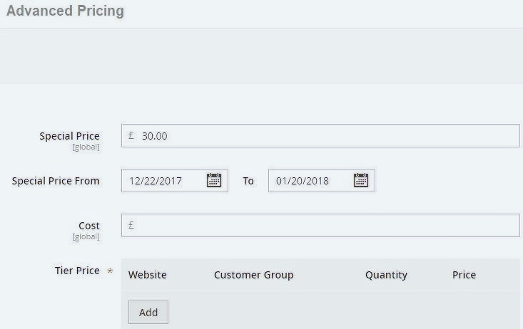
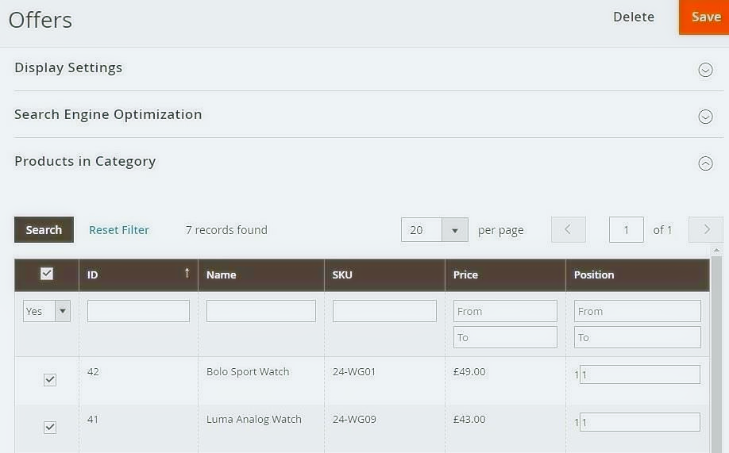
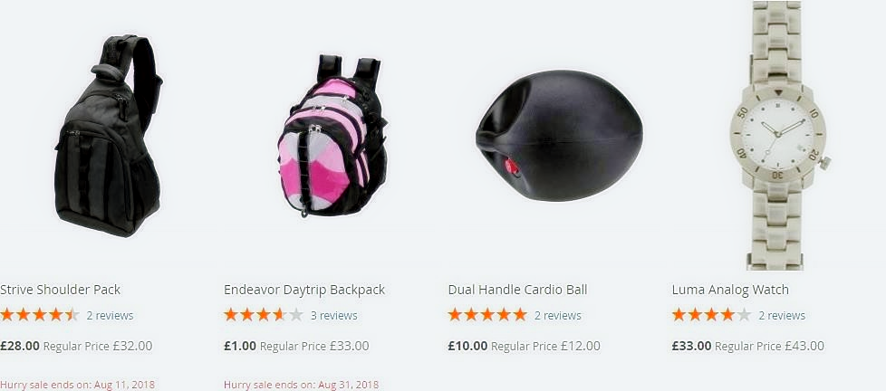

# Magento 2 Dynamic Sale Catagory

### <mark style="color:blue;">Installation and User Guide for Magento 2 Dynamic Sale Category Extension</mark>

**Table of Contents**

1. [I_nstallation_ ](magento-2-dynamic-sale-catagory.md#\_bookmark0)
   * _Installation via app/code_&#x20;
   * _Installation via Composer_
2. [_Configuration Settings for Dynamic Sale Category_ ](magento-2-dynamic-sale-catagory.md#\_bookmark3)
   * _General Settings_&#x20;
3. [_Product Special Price Set up_ ](magento-2-dynamic-sale-catagory.md#product-special-price-set-up)
   * _Products Assigned to Sale Category in the Back-end_&#x20;
4. [_Command to Force Run Sale Category Products_ ](magento-2-dynamic-sale-catagory.md#command-to-force-run-sale-category-products)
5. [_Front-end Site View_ ](magento-2-dynamic-sale-catagory.md#\_bookmark8)
   * _Sale Products on the Category Page_&#x20;

### <mark style="color:blue;">Installation</mark> <a href="#bookmark0" id="bookmark0"></a>

* <mark style="color:orange;">**Installation via app/code:**</mark> Upload the content of the module to your root folder. This will not overwrite the existing Magento folder or files, only the new contents will be added. After the successful upload of the package, run below commands on Magento 2 root directory.

```
php bin/magento setup:upgrade
php bin/magento setup:di:compile
php bin/magento setup:static-content:deploy
```

* <mark style="color:orange;">**Installation via Composer:**</mark> Please follow the guide provided in the below link to complete the installation via composer.


[installation-via-composer.md](../installation-via-composer.md)


### <mark style="color:blue;">Configuration Settings for Dynamic Sale Category</mark> <a href="#bookmark3" id="bookmark3"></a>

Go to **Admin > Stores > Configuration > Scommerce Configuration > Dynamic Sale Category**

#### <mark style="color:orange;">General Settings</mark> <a href="#bookmark4" id="bookmark4"></a>

* **Enabled –** Select “Yes” or “No” to enable or disable the module.
* **License Key –** Please add the license for the extension which is provided in the order confirmation email. Please note license keys are site URL specific. If you require license keys for dev/staging sites then please email us at [support@scommerce-mage.com](mailto:support@scommerce-mage.com).
* **Sale Category –** Choose the sale category where all the sale products will appear. All products in the current category would be removed, If any assigned. This category will only be populated with products set up for offer through special prices.
* **Exclude Categories –** Exclude some categories for pulling sale products from them.
* **Hide Sale Category with no Product –** Set to yes if you want to hide the sale category when no products are in offer.
* **Display Sale ends date on the Product Page –** Set to yes if you want to show the sales end date on the product page.
* **Sale ends text on the Product Page –** Add text for sale ends date on the product page.
* **Date Format on the Product Page –** Select the date format for sale end date to be displayed on the product page.
* **Display Sale Ends text on the category Page –** Set to yes if you want to show sales ends date in the product listing.
* **Sale ends text on the Category Page –** Add text for sale ends date in listing. Please include space if needed.
* **Date Format on the Category Page –** Select the date format for sale end date displayed on category page.


* **Cron Schedule –** This setting will be used to send the email through the cron.
* **Duplicate Urls Fix -** Use this if command shows error "URL key for specified store already exists.". Note: it's not going to fix URLs duplicated key issue. It will just use another algorithm of assigning. The best option is to to fix duplicated URLs. Put "Yes" if you know what you are doing


### <mark style="color:blue;">**Product Special Price Set up**</mark>&#x20;

&#x20;As soon as any product is set with valid special product it automatically gets assigns to category set up for sale/offers in configurations. You can set special price from **Admin > Catalog > Products > Select Product > Advanced Pricing >** Set **"Special Price" .** There is a cron job which runs midnight and checks for any product set up under offer.



* <mark style="color:orange;">**Products Assigned to Sale Category in the Back-end -**</mark> You can see the Sale Products in the back-end under "Sale/Offers" categories, from **Admin > Catalog > Categories >** Select Category **"Offers" >** Click on **"Products in category" .**



### <mark style="color:blue;">**Command to Force Run Sale Category Products**</mark>&#x20;

Run the below refresh command to show the products under sale category.

&#x20;`scommerce:dynamic-sale-category:refresh`

### <mark style="color:blue;">Front-end Site View</mark> <a href="#bookmark8" id="bookmark8"></a>

* <mark style="color:orange;">**Sale Products on the Category Page -**</mark> The products with special price will be shown on the category page under the category you have selected from **Admin > Stores > Configuration > Scommerce Configuration > Dynamic Sale Category - "Sale"** or **"Offer",** along with the sale ends date.



If you have a question related to this extension please check out our [**FAQ Section**](https://www.scommerce-mage.com/magento-2-dynamic-sale-category.html#faq) first. If you can't find the answer you are looking for then please contact [**support@scommerce-mage.com**](mailto:core@scommerce-mage.com)**.**
