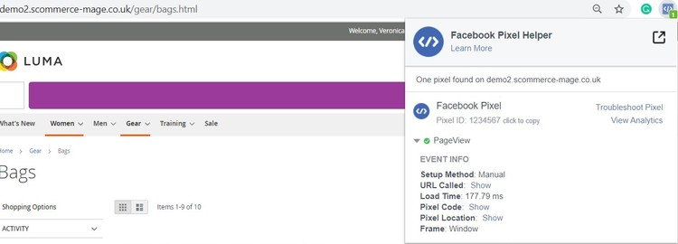
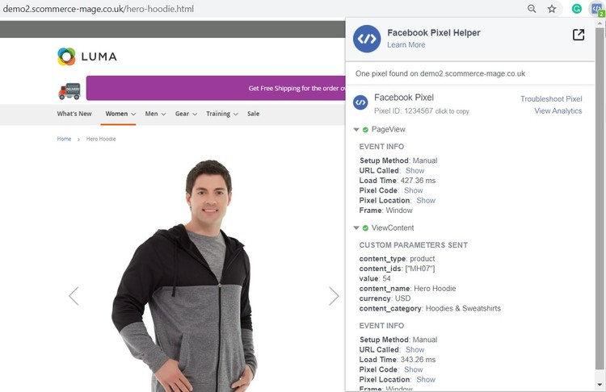

# Magento 2 Facebook Conversion and Audience Pixel Tracking

### <mark style="color:blue;">Installation and User Guide for Magento 2 Facebook Conversion and Audience Pixel Tracking Extension</mark>

**Table of Contents**

1. [_Installation_ ](magento-2-facebook-conversion-and-audience-pixel-tracking.md#\_bookmark0)
   * _Installation via app/code_&#x20;
   * _Installation via Composer_
2. [_Configuration Settings for Facebook Conversion Tracking_ ](magento-2-facebook-conversion-and-audience-pixel-tracking.md#\_bookmark3)
   * _General Settings_&#x20;
   * _Analyze Data with Facebook Events Manager_&#x20;
   * _Facebook Events Manager Graph_&#x20;
3. [_Enable GDPR Support_](magento-2-facebook-conversion-and-audience-pixel-tracking.md#\_bookmark7)
4. [_Front-end site view_ ](magento-2-facebook-conversion-and-audience-pixel-tracking.md#\_bookmark7)
   * _Facebook Pixel Tag on the Category Page_&#x20;
   * _Facebook Pixel Tag on the Product Page_&#x20;
   * _Facebook Pixel Tag on the Cart Page_&#x20;
   * _Facebook Pixel Tag on the Checkout page_&#x20;
   * _Facebook Pixel Tag on the Payment Page_&#x20;
   * _Facebook Pixel Tag on the Success Page_&#x20;

### <mark style="color:blue;">Installation</mark> <a href="#bookmark0" id="bookmark0"></a>

* <mark style="color:orange;">**Installation via app/code:**</mark> Upload the content of the module to your root folder. This will not overwrite the existing Magento folder or files, only the new contents will be added. After the successful upload of the package, run below commands on Magento 2 root directory.

```
php bin/magento setup:upgrade
php bin/magento setup:di:compile
php bin/magento setup:static-content:deploy
```

* <mark style="color:orange;">**Installation via Composer:**</mark> Please follow the guide provided in the below link to complete the installation via composer.


[installation-via-composer.md](../installation-via-composer.md)


* <mark style="color:orange;">**Installation via Composer(Breeze Theme):**</mark> Go to My Account section then go to Composer Instructions. Run the composer config commands mentioned on the page then run the below command to install the module on hyva theme.&#x20;

```
composer require scommerce/breeze-googletagmanagerpro
```

### <mark style="color:blue;">Configuration Settings for Facebook Conversion Tracking</mark> <a href="#bookmark3" id="bookmark3"></a>

Go to **Admin > Stores > Configuration > Scommerce Configuration > Facebook Conversion Tracking**

### General Settings <a href="#bookmark4" id="bookmark4"></a>

* **Enabled –** Select “Yes” or “No” to enable or disable the module.
* **License Key –** Please add the license for the extension which is provided in the order confirmation email. Please note license keys are site URL specific. If you require license keys for dev/staging sites then please email us at [support@scommerce-mage.com](mailto:support@scommerce-mage.com).
* **New Facebook Tracking Enabled –** Set yes to enable Facebook new pixel tracking or Remarketing tag [**https://developers.facebook.com/docs/ads-for-websites/tag/api/**](https://developers.facebook.com/docs/ads-for-websites/tag/api/)
* **Audience Pixel Tag Id –** Enter Custom Audience Pixel Id. This applies to old as well as new Facebook tracking.
* **Dynamic Product Ads Enabled –** Set yes to enable the Dynamic Product Ads [**http://en-gb.facebook.com/business/help/www/455326144628161**](http://en-gb.facebook.com/business/help/www/455326144628161)
* **Remarketing Default Value –** Enter default value for events where value can’t be defined like CompleteRegistration, Search **(only used for new Facebook tracking)**
* **Always Send Parent SKU –** Set “Yes” then it always send parent sku instead of child sku to facebook
* **Enable GDPR Cookie Check –** Select "Yes" or "No" to enable/disable GDPR Cookie Check
* **Force decline –** If you set this to yes then FACEBOOK tracking will be turned off unless customer accepts the cookie policy from the cookie notification message from your website
* **GDPR Cookie Key –**  You can add name of your GDPR cookie here for our [GDPR extension](https://www.scommerce-mage.com/magento2-gdpr-compliance.html) the name of cookie key is **marketing\_cookie** but if you are using other GDPR extension then please check with extension developer

<figure><figcaption></figcaption></figure>

<figure><figcaption></figcaption></figure>

* <mark style="color:orange;">**Analyze Data with Facebook Events Manager -**</mark> Facebook Business Manager gathered enough information so that you can analyze data using event log, which shows how many times the tracker has been fired.


* <mark style="color:orange;">**Facebook Events Manager Graph -**</mark> You can view the event log and graph in Facebook business manager with all the events view details**.**


### <mark style="color:blue;">Enable GDPR Support</mark> <a href="#bookmark7" id="bookmark7"></a>

The module is GDPR compliant which can work with both our/third party GDPR modules. You can enable the GDPR support within the module so that the tracking doesent work without users consent.&#x20;

To enable GDPR support go to **Stores>Configuration>Scommerce Configuration>Facebook Conversion Tracking** and set 'Enable GDPR cookie check' to 'Yes' then set 'Force decline' to 'Yes' and provide the GDPR cookie name in the 'GDPR Cookie Key' inputbox. If you are using our GDPR module then the cookie name is 'marketing\_cookie' but if you are using other GDPR extension then please check with extension developer. Once the setting is complete unless the customer accepts the cookie the facebook tracking won't fire.&#x20;

<figure><figcaption></figcaption></figure>

### <mark style="color:blue;">Front-end site view</mark> <a href="#bookmark7" id="bookmark7"></a>

* <mark style="color:orange;">**Facebook Pixel Tag on the Category Page -**</mark> The extension offers all standard trackers that Facebook uses. When the category page is viewed then it shows page view with event info, which you can see in the below image.



* <mark style="color:orange;">**Facebook Pixel Tag on the Product Page -**</mark> When a key page is viewed such as a product page, e.g. landing on a product detail page. Provides detailed product information (such as Prices, SKU's, Currencies and Categories) for Dynamic Product Ads. You can enable dynamic product ads from **Admin > Stores > Configuration > Scommerce Configuration > Facebook Conversion Tracking > Dynamic Products Ads Enabled - "Yes".**



* <mark style="color:orange;">**Facebook Pixel Tag on the Cart Page**</mark> <mark style="color:orange;"></mark><mark style="color:orange;">-</mark> When a product is added to the shopping cart, then it tracks the cart event.

<figure><figcaption></figcaption></figure>

* <mark style="color:orange;">**Facebook Pixel Tag on the Checkout page -**</mark> It tracks checkout , when a user clicks on checkout button.

<figure><figcaption></figcaption></figure>

* <mark style="color:orange;">**Facebook Pixel Tag on the Payment Page -**</mark> It tracks AddPaymentInfo when a payment information is added in the checkout flow, e.g. click on payment method.

<figure><figcaption></figcaption></figure>

* <mark style="color:orange;">**Facebook Pixel Tag on the Success Page -**</mark> When a purchase is made or checkout flow is completed, e.g. landing on thank you/success page, provides detailed order information such as Order Value and Cart Items.

<figure><figcaption></figcaption></figure>

* <mark style="color:orange;">**Facebook Pixel Tag on Add to Wishlist Page -**</mark>Add to Wishlist when "Always Send Parent SKU" set to 'NO" AND Dynamic Product Ads Enabled - "YES"

<figure><figcaption></figcaption></figure>

* <mark style="color:orange;">**Facebook Pixel Tag on Add to Wishlist Page -**</mark>Add to cart when "Always Send Parent SKU" set to 'NO" AND Dynamic Product Ads Enabled - "YES"

<figure><figcaption></figcaption></figure>


If you have a question related to this extension please check out our [**FAQ Section**](https://www.scommerce-mage.com/magento2-facebook-conversion-audience-tracking.html#faq) first. If you can't find the answer you are looking for then please contact [**support@scommerce-mage.com**](mailto:core@scommerce-mage.com)**.**
