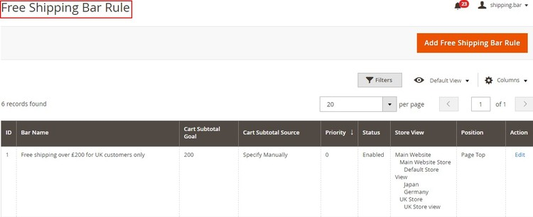

# Magento 2 Free Shipping Bar

### <mark style="color:blue;">Installation and User Guide for Magento 2 Free Shipping Bar Extension</mark>

### Table of Contents

1. [_Installation_ ](magento-2-free-shipping-bar.md#\_bookmark0)
   * _Installation via app/code_&#x20;
   * _Installation via Composer_
2. [_Configuration Settings for Free Shipping Bar Rule_ ](magento-2-free-shipping-bar.md#\_bookmark3)
   * _General Settings_&#x20;
3. [_Manage Free Shipping Bar Rules_ ](magento-2-free-shipping-bar.md#\_bookmark5)
   * _Free Shipping Bar Rule - Grid_&#x20;
   * _New Shipping Bar - General Settings_&#x20;
   * _New Shipping Bar - Websites & Customers Groups_&#x20;
   * _New Shipping Bar - Shipping Countries_&#x20;
   * _New Shipping Bar - Display Options_&#x20;
   * _New Shipping Bar - Content_&#x20;
   * _New Shipping Bar - Design_&#x20;
   * _Font Color - Enter font color_&#x20;
   * _Free Shipping Discount_&#x20;
4. [_Front-end Site View 10_](magento-2-free-shipping-bar.md#\_bookmark15)
   * _Free Shipping Bar on the Homepage with Generic Message_&#x20;
   * _Free Shipping Bar with Generic Message / Bar Position Bottom Fixed_&#x20;
   * _Free Shipping Bar with Remaining Amount_&#x20;
   * _Free Shipping Bar on the Cart Page with Success Message_&#x20;

### <mark style="color:blue;">Installation</mark> <a href="#_bookmark0" id="_bookmark0"></a>

* <mark style="color:orange;">**Installation via app/code:**</mark> Upload the content of the module to your root folder. This will not overwrite the existing Magento folder or files, only the new contents will be added. After the successful upload of the package, run below commands on Magento 2 root directory.

```
php bin/magento setup:upgrade
php bin/magento setup:di:compile
php bin/magento setup:static-content:deploy
```

* <mark style="color:orange;">**Installation via Composer:**</mark> Please follow the guide provided in the below link to complete the installation via composer.


[installation-via-composer.md](../installation-via-composer.md)


### <mark style="color:blue;">Configuration Settings for Free Shipping Bar Rule</mark> <a href="#_bookmark3" id="_bookmark3"></a>

Go to **Admin > Stores > Configuration > Scommerce Configuration > Free Shipping Bar Rule**

#### <mark style="color:orange;">General Settings</mark> <a href="#_bookmark4" id="_bookmark4"></a>

* **Enabled -** Select “Yes” or “No” to enable or disable the module.
* **License Key -** Please add the license for the extension which is provided in the order confirmation email. Please note license keys are site URL specific. If you require license keys for dev/staging sites then please email us at [core@scommerce-mage.com](mailto:core@scommerce-mage.com)


### <mark style="color:blue;">Manage Free Shipping Bar Rules</mark> <a href="#_bookmark5" id="_bookmark5"></a>

You can add and customize Free Shipping Bar Rules from, **Admin > Marketing > All Free Shipping Bar Rules > Free shipping Bar Rule**

* <mark style="color:orange;">**Free Shipping Bar Rule - Grid -**</mark> To create new free shipping bar rule click on “Add Shipping Bar” button and to edit existing rule click “Edit” option under "Action"



#### <mark style="color:orange;">New Shipping Bar - General Settings</mark> <a href="#_bookmark7" id="_bookmark7"></a>

* **Bar Name -** Enter Bar name. This is only for admin use.
* **Bar Status -** Select "Enable/Disable" bar status.
* **Cart Subtotal Source -** Select option "Specify Manually" or out of the box "Magento free shipping method".
* **From (Date) -** Select date from date picker.
* **To (Date) -** Select date from date picker.
* **Priority -** Set priority level for the free shipping bar. Highest priority level will be picked up first
* **Rule Apply On -** Select "Grand Total/Subtotal" to apply the free shipping bar rule.
* **Cart Goal -** Enter qualifying amount for cart goal.

>)

#### <mark style="color:orange;">New Shipping Bar - Websites & Customers Groups</mark> <a href="#_bookmark8" id="_bookmark8"></a>

* **Store View -** Select the store view.
* **Customer Group -** Select customer group.


#### <mark style="color:orange;">New Shipping Bar - Shipping Countries</mark> <a href="#_bookmark9" id="_bookmark9"></a>

* **Allowed Countries -** Select allowed shipping countries.

>)

#### <mark style="color:orange;">New Shipping Bar - Display Options</mark> <a href="#_bookmark10" id="_bookmark10"></a>

* **Bar Position -** Select the bar position from the dropdown list to show on the front-end.
* **Pages -** Select the page(s) where you want to show the free shipping bar. If all pages are selected then the bar will be shown on all.
* **Add Link to the Bar -** Select "Yes/No". If set to “Yes” then it will add the information link for terms and conditions.
* **Add Close Button -** If this is “Yes” then it will hide the bar with ‘x’ button.
* **Show Customize Icon -** Select “Yes/No” option. If set to “Yes” then “Upload Icon” option will be shown.
* **Upload Icon -** This will be an option for user to upload an icon (visible when "Show Customize Icon" set to "Yes")

>)

#### <mark style="color:orange;">New Shipping Bar - Content</mark> <a href="#_bookmark11" id="_bookmark11"></a>

* **Initial Message -** Provide initial message (This will be an informative or generic message about free shipping conditions).
* **In Progress Message -** Provide in progress message (A message to inform customers about the amount left for free shipping).
* **Achieved Message -** Provide achieved message (A customer will get it, when the cart total achieves the needed amount to get a free shipping).
* **Free Shipping Terms Content -** Provide shipping terms or other important information. (This will be a fill in the message to provide customers with shipping terms or other important information right on the bar).

>)

#### <mark style="color:orange;">New Shipping Bar - Design</mark> <a href="#_bookmark12" id="_bookmark12"></a>

* **Font -** Select font
* **Font Size -** Enter font size
* **Font Color -** Enter font color
* **Background Color -** Enter background color
* **Custom CSS -** Provide custom CSS (.classname {background- color:{color:#FFFFFF})

>)

* <mark style="color:orange;">**Free Shipping Discount -**</mark> The extension only implements the bar display and actual shipping discount needs to be set separately in Magento out of the box.

### Front-end Site View <a href="#_bookmark15" id="_bookmark15"></a>

* <mark style="color:orange;">**Free Shipping Bar on the Homepage with Generic Message -**</mark> You can set generic message for free shipping bar from **Admin > Marketing > All Free Shipping Bar Rules > Free shipping Bar Rule >** Click **"Add Free Shipping Bar Rule" > New Shipping Bar > Initial Message**

>)

* <mark style="color:orange;">**Free Shipping Bar on the Category Page with Generic Message / Bar Position Bottom Fixed -**</mark> You can set bar position by selecting bar options from **Admin > Marketing > All Free Shipping Bar Rules > Free shipping Bar Rule** Click **"Add Free Shipping Bar Rule" > New Shipping Bar > Display Options Bar Position.**

>)

* <mark style="color:orange;">**Free Shipping Bar with Remaining Amount -**</mark> You can inform customers about the remaining amount left for free shipping by providing in progress message from **Admin > Marketing > All Free Shipping Bar Rules > Free shipping Bar Rule >** Click **"Add Free Shipping Bar Rule" > New Shipping Bar > In Progress Message**

>)

* <mark style="color:orange;">**Free Shipping Bar on the Cart Page with Success Message -**</mark> You can set success message from **Admin > Marketing > All Free Shipping Bar Rules > Free shipping Bar Rule >** Click **"Add Free Shipping Bar Rule" > New Shipping Bar > Achieved Message**

>)

If you have a question related to this extension please check out our [**FAQ Section**](https://www.scommerce-mage.com/magento-2-free-shipping-bar.html#faq) first. If you can't find the answer you are looking for then please contact [**support@scommerce-mage.com**](mailto:core@scommerce-mage.com)**.**
