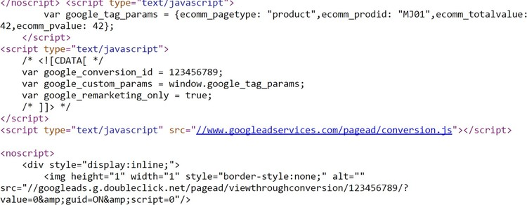
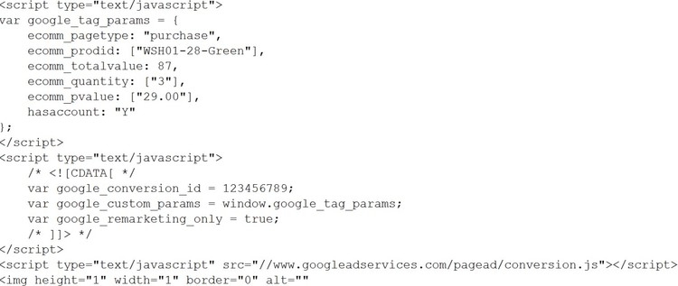
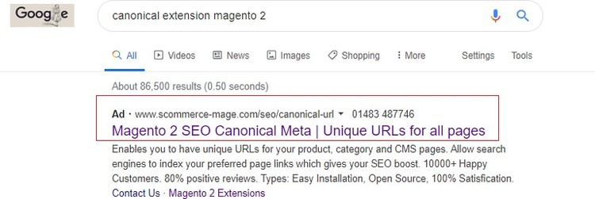

# Magento 2 Google Dynamic Remarketing Tag

### <mark style="color:blue;">Installation and User Guide for Magento 2 Google Dynamic Remarketing Tag Extension</mark>

**Table of Contents**

1. [_Installation_ ](magento-2-google-dynamic-remarketing-tag.md#\_bookmark0)
   * _Installation via app/code_&#x20;
   * _Installation via Composer_
2. [_Configuration Settings for Google Remarketing_ ](magento-2-google-dynamic-remarketing-tag.md#\_bookmark3)
   * _General Settings_&#x20;
   * _Dynamic Remarketing Tag, Code Snippets on the Homepage_&#x20;
   * _Dynamic Remarketing Tag/Code Snippets with Product Details_&#x20;
   * _Dynamic Remarketing Ad_&#x20;

### <mark style="color:blue;">Installation</mark> <a href="#_bookmark0" id="_bookmark0"></a>

* <mark style="color:orange;">**Installation via app/code:**</mark> Upload the content of the module to your root folder. This will not overwrite the existing Magento folder or files, only the new contents will be added. After the successful upload of the package, run below commands on Magento 2 root directory.

```
php bin/magento setup:upgrade
php bin/magento setup:di:compile
php bin/magento setup:static-content:deploy
```

* <mark style="color:orange;">**Installation via Composer:**</mark> Please follow the guide provided in the below link to complete the installation via composer.


[installation-via-composer.md](../installation-via-composer.md)


### <mark style="color:blue;">Configuration Settings for Google Remarketing</mark> <a href="#_bookmark3" id="_bookmark3"></a>

Go to **Admin > Stores > Configuration > Scommerce Configuration > Google Remarketing Tag**

#### <mark style="color:orange;">General Settings</mark> <a href="#_bookmark4" id="_bookmark4"></a>

* **Enabled –** Select “Yes” or “No” to enable or disable the module.
* **License Key –** Please add the license for the extension which is provided in the order confirmation email. Please note license keys are site URL specific. If you require license keys for dev/staging sites then please email us at [core@scommerce-mage.com](mailto:core@scommerce-mage.com)
* **Google Conversion Id –** Enter your Google Adwords Account Id.
* **Enable Tracking for other sites –** This will enable other sites variables (https:/.developers.google.com/adwords-remarketing-tag/parameters#other) instead of retail site variables.
* **Enable dynamic remarketing tag –** Set “Yes” to enable dynamic remarketing tag.
* **Product Id attribute –** Use the same id you have submitted in your Google base feed.


* <mark style="color:orange;">**Dynamic Remarketing Tag, Code Snippets on the Homepage -**</mark> To view remarketing tag and code snippets go to Homepage > View Source . In the below image you can see the conversion ID and Custom variable. You can add conversion Id from **Admin > Stores > Configuration > Scommerce Configuration > Google Remarketing Tag > Google Conversion Id.**



* <mark style="color:orange;">**Dynamic Remarketing Tag/Code Snippets with Product Details-**</mark> In the code snippet you can see the product details with Product ID and Google conversion id. You can select Product Id attribute from **Admin > Stores > Configuration > Scommerce Configuration > Google Remarketing Tag > Product Id attribute -** Select **"SKU".**



* <mark style="color:orange;">**Dynamic Remarketing Ad -**</mark> When you enable the dynamic remarketing from **Admin > Stores > Configuration > Scommerce Configuration > Google Remarketing Tag > Enable dynamic remarketing tag**, then it shows ads to people who have previously visited your website.



If you have a question related to this extension please check out our [**FAQ Section**](https://www.scommerce-mage.com/magento2-google-adwords-dynamic-remarketing-tag.html#faq) first. If you can't find the answer you are looking for then please contact [**support@scommerce-mage.com**](mailto:core@scommerce-mage.com)**.**
