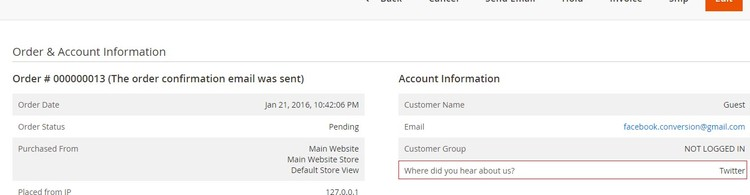
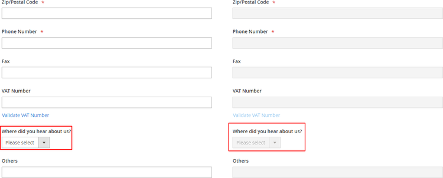

# Magento 2 How Did You Hear About Us

### <mark style="color:blue;">Installation and User Guide for Magento 2 How did you hear about us Extension</mark>

**Table of Contents**

1. [_Installation_ ](magento-2-how-did-you-hear-about-us.md#bookmark0)
   * _Installation via app/code_&#x20;
   * _Installation via Composer_
2. [_Configuration Settings for Where did you hear about us?_ ](magento-2-how-did-you-hear-about-us.md#bookmark3)
   * _General Settings_&#x20;
   * _Selected WDYHAU Option in Orders Grid_&#x20;
   * _WDYHAU Details at Customers Level_&#x20;
   * _WDYHAU Details on the Sales Order View Page_&#x20;
   * _“Where did you hear about us?” Drop-down Options in the Back-end_&#x20;
3. [_Front-end Site View_ ](magento-2-how-did-you-hear-about-us.md#bookmark9)
   * _WDYHAU Option on the Registration Page_&#x20;
   * _WDYHAU option on the Checkout Page_&#x20;

### <mark style="color:blue;">Installation</mark> <a href="#bookmark0" id="bookmark0"></a>

* <mark style="color:orange;">**Installation via app/code:**</mark> Upload the content of the module to your root folder. This will not overwrite the existing Magento folder or files, only the new contents will be added. After the successful upload of the package, run below commands on Magento 2 root directory.

```
php bin/magento setup:upgrade
php bin/magento setup:di:compile
php bin/magento setup:static-content:deploy
```

* <mark style="color:orange;">**Installation via Composer:**</mark> Please follow the guide provided in the below link to complete the installation via composer.


[installation-via-composer.md](../installation-via-composer.md)


### <mark style="color:blue;">Configuration Settings for Where did you hear about us?</mark> <a href="#bookmark3" id="bookmark3"></a>

Go to **Admin > Stores > Configuration > Scommerce Configuration > Where did you hear about us?**

#### <mark style="color:orange;">General Settings</mark> <a href="#bookmark4" id="bookmark4"></a>

* **Enabled –** Select “Yes” or “No” to enable or disable the module.
* **License Key –** Please add the license for the extension which is provided in the order confirmation email. Please note license keys are site URL specific. If you require license keys for dev/staging sites then please email us at [support@scommerce-mage.com](mailto:support@scommerce-mage.com).
* **Dropdown options –** Please add the WDHAU options for customers and administrators to choose during checkout and creating order via admin respectively. There should be semicolon (;)separated values for example Google;Facebook;Twitter;Others
* **Other Options Title -** Please add the title for other options.
* **Drop Down Label –** Please add the label.
* **Other Label –** Please add the label for other option.
* **Field Is Required On Customer Registration -** Select “Yes” or “No” to enable or disable the Field is required on customer registration.

<figure><figcaption></figcaption></figure>

#### <mark style="color:orange;">Report</mark> <a href="#bookmark4" id="bookmark4"></a>

* **Exclue Statuses -** Select exclude statuses which you would like to not include when generating the WDYHAU Report.

<figure><figcaption></figcaption></figure>

* <mark style="color:orange;">**Selected WDYHAU Option in Orders Grid -**</mark> You can see the selected "Where did you hear about us?" option at **Admin > Sales > Orders** grid.

>)

* <mark style="color:orange;">**WDYHAU Details at Customers Level -**</mark> To see the "Where did you hear about us?" option at customers level go to **Admin > Customers > All Customers > Select Customer > Account Information > Where did you hear about us?**

>)

* <mark style="color:orange;">**WDYHAU Details on the Sales Order View Page -**</mark> The selected WDYHAU option will be shown on order view page under "**Account Information**" section from **Admin > Sales > Select Order > View.**



* <mark style="color:orange;">**“Where did you hear about us?” Drop-down Options in the Back-end -**</mark> When you enable the module, then it shows WDYHAU drop-down option in the back-end at **Admin > Sales > Create New Order > Select Customer > Select Product >** Select **"Where did you hear about us?"** option.



### <mark style="color:blue;">Front-end Site View</mark> <a href="#bookmark9" id="bookmark9"></a>

* <mark style="color:orange;">**WDYHAU Option on the Registration Page -**</mark> You can define the "Where did you hear about us?" drop-down options from **Admin > Stores > Configuration> Scommerce Configuration > Where did you hear about us? - Google; Twitter; Facebook; YouTube; Others,** which will be shown on the registration page.

>)

* <mark style="color:orange;">**WDYHAU option on the Checkout Page -**</mark> You can see the "Where did you hear about us?" option on the checkout page.

>)

If you have a question related to this extension please check out our [**FAQ Section**](magento-2-how-did-you-hear-about-us.md#installation-and-user-guide-for-magento-2-how-did-you-hear-about-us-extension) first. If you can't find the answer you are looking for then please contact [**support@scommerce-mage.com**](mailto:core@scommerce-mage.com)**.**
