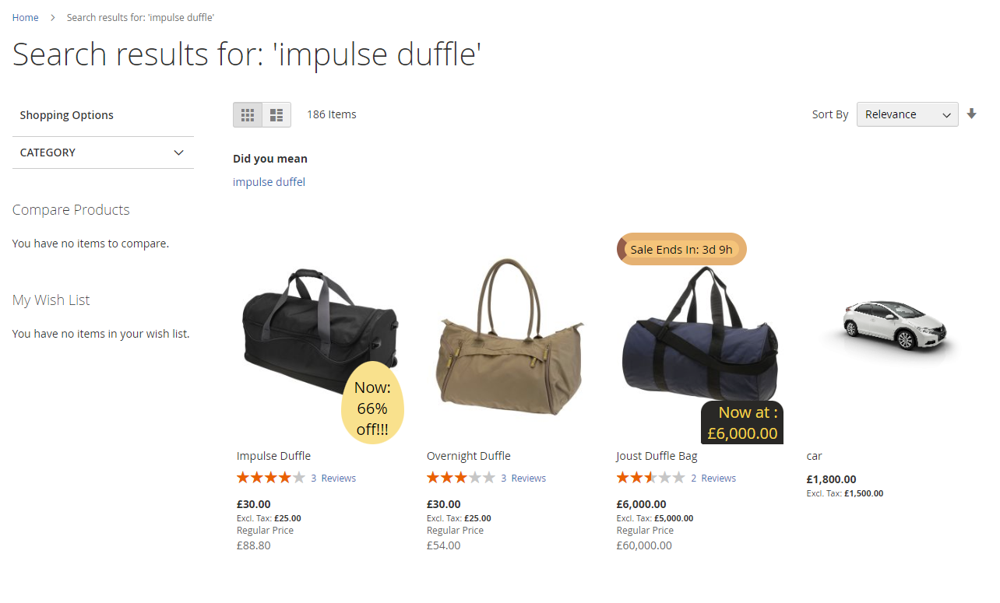

# Magento 2 Product Label

### <mark style="color:blue;">Installation and User Guide for Magento 2 Prdouct Label Extension</mark>

**Table of Contents**

1. [_Installation_ ](magento-2-product-label.md#\_bookmark0)__
   * _Installation via app/code_&#x20;
   * _Installation via Composer_
2. [_Configuration Settings for Product Label_](magento-2-product-label.md#\_bookmark3)__
   * _General Settings_&#x20;
   * _Product Label Grid_
   * _Add New Product Label_
3.  __[_Front-end Site View_ ](magento-2-product-label.md#\_bookmark9)__

    * _Product Label on Category Page_&#x20;
    * _Product Label on Product Page_

    __

### <mark style="color:blue;">Installation</mark> <a href="#_bookmark0" id="_bookmark0"></a>

* <mark style="color:orange;">**Installation via app/code:**</mark>** ** Upload the content of the module to your root folder. This will not overwrite the existing Magento folder or files, only the new contents will be added. After the successful upload of the package, run below commands on Magento 2 root directory.

```
php bin/magento setup:upgrade
php bin/magento setup:di:compile
php bin/magento setup:static-content:deploy
```

* <mark style="color:orange;">**Installation via Composer:**</mark> Please follow the guide provided in the below link to complete the installation via composer.


[installation-via-composer.md](../installation-via-composer.md)


### <mark style="color:blue;">Configuration Settings for Product Label</mark>  <a href="#_bookmark3" id="_bookmark3"></a>

Go to **Admin > Stores > Configuration > Scommerce Configuration > Product Label**

#### <mark style="color:orange;">General Settings</mark> <a href="#_bookmark4" id="_bookmark4"></a>

* **Enabled –** Select “Yes” or “No” to enable or disable the module.
* **License Key –** Please add the license key for the extension which is provided in the order confirmation email. Please note license keys are site URL specific. If you require license keys for dev/staging sites then please email us at [core@scommerce-mage.com](mailto:core@scommerce-mage.com)

<figure><figcaption></figcaption></figure>

#### <mark style="color:orange;">Product Label Grid</mark> <a href="#_bookmark4" id="_bookmark4"></a>

Go to **Admin>Catalog>Scommerce Product Labels>Product Labels**

<figure><figcaption></figcaption></figure>

#### <mark style="color:orange;">Add New Product Label</mark> <a href="#_bookmark4" id="_bookmark4"></a>

Go to **Admin>Catalog>Scommerce Product Labels>Product Labels>Add New Product Label**

* **Status–** Select “Enabled” or “Disabled” to enable or disable the product label.
* **Scope–** Choose the website scope where the product label will be applicable
* **Text–** Enter the text displayed in the product label. You can use the several special variables mentioned below the inputbox to create enticing labels. Following special variables can be used for the tag:-
  *
    * {PRICE} - regular price;
    * {PRICE\_EXTAX} - price excluding tax;
    * {BR} - new line
    * {SAVE\_PERCENT} - save percent
    * {SAVE\_PERCENT\_EXTAX} - save percent excluding tax
    * {SAVE\_AMOUNT} - save amount
    * {SAVE\_AMOUNT\_EXTAX} - save amount excluding tax
    * {SPECIAL\_PRICE} - special price
    * {SPECIAL\_PRICE\_EXTAX} - special price excluding tax;
    * {ATTR:code} - attribute value, e.g. {ATTR:color}
    * {SPDL} - days left for special price
    * {SPHL} - hours left for special price
    * {NEW\_FOR} - days ago the product was added
    * {SKU} - product SKU
    * {STOCK} - product qty (for product view page)
* **Upload Label Image–** Upload the product label image

<figure><figcaption></figcaption></figure>

* **Hide From Category–** Select “Yes” or “No” to hide or show the label on Category page.
* **Hide From Product–** Select “Yes” or “No” to hide or show the label on product page.
* **Hide From Search–** Select “Yes” or “No” to enable or disable the label on search page.
* **Priority–** Add the priority of the label with 0 being the highest priority. Product with multiple labels assigned will display the lable with highest priority.
* **Conditions–** Add conditions for the label as per your requirement&#x20;

<figure><figcaption></figcaption></figure>

* **Text Size–** Enter the text size for the product label.
* **Text Color–** Enter the text color for the product label.
* **Background Color–** Enter the background color for the product label.
* **Label Position–** Enter the label position for the product label.
* **Custom CSS–** Enter the custom CSS for the product label.

<figure><figcaption></figcaption></figure>

### <mark style="color:blue;">Front-end Site View</mark> <a href="#_bookmark9" id="_bookmark9"></a>

* <mark style="color:orange;">**Product Label on Category Page**</mark>&#x20;

<figure><figcaption></figcaption></figure>

* <mark style="color:orange;">**Product label on Product Page**</mark>&#x20;

<figure><figcaption></figcaption></figure>

* <mark style="color:orange;">**Product label on Search Page**</mark>&#x20;

<figure><figcaption></figcaption></figure>

If you have a question related to this extension please check out our **FAQ Section** first. If you can't find the answer you are looking for then please contact [**support@scommerce-mage.com**](mailto:core@scommerce-mage.com)**.**
