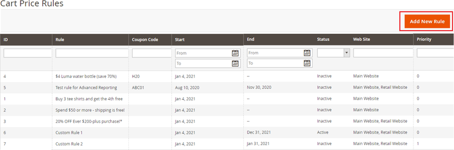

# Magento2 Custom Options Discount

### <mark style="color:blue;">Installation and User Guide for Magento 2 Custom Options Discount</mark>

**Table of Contents**

1. [I_nstallation_ ](magento2-custom-options-discount.md#\_bookmark0)
   * _Installation via app/code_&#x20;
   * _Installation via Composer_
2. [_Configuration Settings for Custom options Discount_ ](magento2-custom-options-discount.md#\_bookmark3)
   * _General Settings_&#x20;
3. [_Adding Custom Options to Products_](magento2-custom-options-discount.md#\_bookmark5)
4. [_Adding Cart Price Rules for Custom Options_ ](magento2-custom-options-discount.md#\_bookmark6)
   * _Apply Cart Rule for all custom options available_&#x20;
   * _Apply cart Rule for specific custom options_&#x20;
5. [_Frontend Screengrabs_ ](magento2-custom-options-discount.md#\_bookmark9)
   * _When “only for selected custom options is set to “Yes”_&#x20;
   * _When “only for selected custom options is set to “No”_&#x20;
   * _When “only for selected custom options is set to “Yes” and Conditions are set_&#x20;

### <mark style="color:blue;">Installation</mark> <a href="#bookmark0" id="bookmark0"></a>

* <mark style="color:orange;">**Installation via app/code:**</mark> Upload the content of the module to your root folder. This will not overwrite the existing Magento folder or files, only the new contents will be added. After the successful upload of the package, run below commands on Magento 2 root directory.

```
php bin/magento setup:upgrade
php bin/magento setup:di:compile
php bin/magento setup:static-content:deploy
```

* <mark style="color:orange;">**Installation via Composer:**</mark> Please follow the guide provided in the below link to complete the installation via composer.


[installation-via-composer.md](../installation-via-composer.md)


### <mark style="color:blue;">Configuration Settings for Custom options Discount</mark> <a href="#bookmark3" id="bookmark3"></a>

#### Go to Admin > Stores > Configuration > Scommerce Configuration > Custom options Discount

#### <mark style="color:orange;">General Settings</mark> <a href="#bookmark4" id="bookmark4"></a>

* **Enabled -** Select “Yes” or “No” to enable or disable the module.
* **License Key -** Please add the license for the extension which is provided in the order confirmation email. Please note license keys are site URL specific. If you require license keys for dev/staging sites then please email us at [support@scommerce-mage.com](mailto:support@scommerce-mage.com).


### <mark style="color:blue;">Adding Custom Options to Products</mark> <a href="#bookmark5" id="bookmark5"></a>

Login to your admin panel then go to **Catalog > Products**. Select your product and click edit from the action column. Scroll down to Customizable options. Click on add option to add a new custom option for the selected product.


### <mark style="color:blue;">Adding Cart Price Rules for Custom Options</mark> <a href="#bookmark6" id="bookmark6"></a>

Go to **Marketing > Promotions > Cart Price Rules** and click on Add New Rule.



#### <mark style="color:orange;">Apply Cart Rule for all custom options available</mark> <a href="#bookmark7" id="bookmark7"></a>

Create your Cart Price Rule Normally. Then scroll down to **Actions** dropdown. Make sure **Only for selected Custom Option?** Is set to “Yes”. This option will enable the cart price rule to be applied on the custom options. Make sure there are no conditions set.

>)

#### <mark style="color:orange;">Apply cart Rule for specific custom options</mark> <a href="#bookmark8" id="bookmark8"></a>

To create cart price rule for specific custom options you will need to add conditions in the Actions Column. For eg: - we have added a condition to apply discount only on the custom option that has custom options title as “Gift Wrap”. So now the discount will only be available for the Gift wrap custom option. Similarly, you can create conditions based on custom options SKU and create your custom options discount.

>)

Conditions available for custom options are custom options title and custom options SKU.

>)

### <mark style="color:blue;">Frontend Screengrabs</mark> <a href="#bookmark9" id="bookmark9"></a>

#### <mark style="color:orange;">When “only for selected custom options is set to “Yes”</mark> <a href="#bookmark10" id="bookmark10"></a>


#### <mark style="color:orange;">When “only for selected custom options is set to “No”</mark> <a href="#bookmark11" id="bookmark11"></a>


#### <mark style="color:orange;">When “only for selected custom options is set to “Yes” and Conditions are set</mark> <a href="#bookmark12" id="bookmark12"></a>


If you have a question related to this extension please check out our [**FAQ Section**](magento2-custom-options-discount.md#installation-and-user-guide-for-magento-2-custom-options-discount) first. If you can't find the answer you are looking for then please contact [**support@scommerce-mage.com**](mailto:core@scommerce-mage.com)**.**
