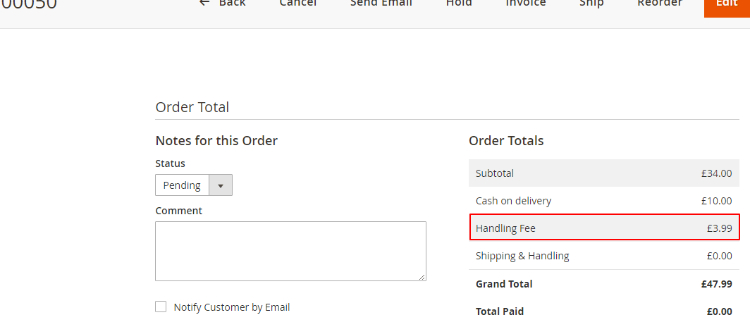
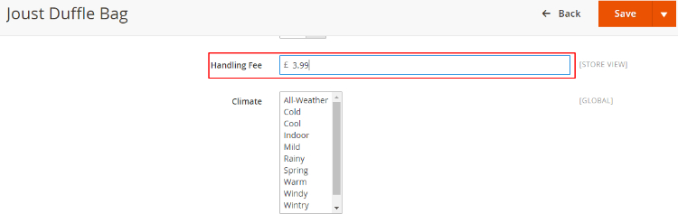
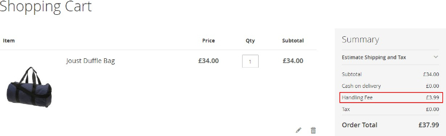
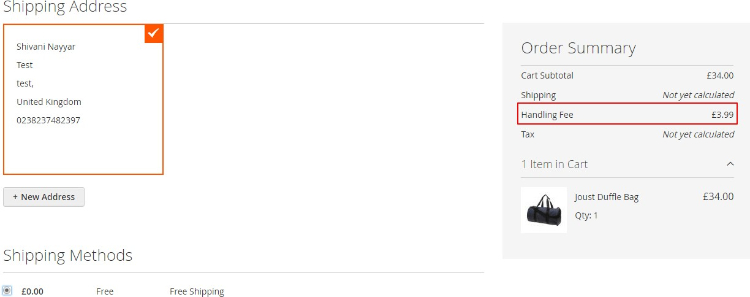

# Magento 2 Product Handling or Additional Fee

### <mark style="color:blue;">Installation and User Guide for Magento 2 Product Handling or Additional Fee Extension</mark>

**Table of Contents**

1. [_Installation_ ](magento-2-product-handling-or-additional-fee.md#\_bookmark0)
   * _Installation via app/code_&#x20;
   * _Installation via Composer_
2. [_Configuration Settings for Handling Fee_ ](magento-2-product-handling-or-additional-fee.md#\_bookmark3)
   * _General Settings_&#x20;
   * _Handling Fee on Order Detail View Page_&#x20;
   * _Add Handling Fee at Product Level_&#x20;
3. [_Front-end Site View_ ](magento-2-product-handling-or-additional-fee.md#\_bookmark7)
   * _Handling Fee on Cart Page_&#x20;
   * _Handling Fee On Checkout Page_&#x20;

### <mark style="color:blue;">Installation</mark> <a href="#_bookmark0" id="_bookmark0"></a>

* <mark style="color:orange;">**Installation via app/code:**</mark> Upload the content of the module to your root folder. This will not overwrite the existing Magento folder or files, only the new contents will be added. After the successful upload of the package, run below commands on Magento 2 root directory.

```
php bin/magento setup:upgrade
php bin/magento setup:di:compile
php bin/magento setup:static-content:deploy
```

* <mark style="color:orange;">**Installation via Composer:**</mark> Please follow the guide provided in the below link to complete the installation via composer.


[installation-via-composer.md](../installation-via-composer.md)


### <mark style="color:blue;">Configuration Settings for Handling Fee</mark> <a href="#_bookmark3" id="_bookmark3"></a>

Go to **Admin > Stores > Configuration > Scommerce Configuration > Handling Fee**

#### <mark style="color:orange;">General Settings</mark> <a href="#_bookmark4" id="_bookmark4"></a>

* **Enabled –** Select “Yes” or “No” to enable or disable the module.
* **License Key –** Please add the license for the extension which is provided in the order confirmation email. Please note license keys are site URL specific. If you require license keys for dev/staging sites then please email us at [core@scommerce-mage.com](mailto:core@scommerce-mage.com)
* **Handling Fee Label –** Please add the label displayed in totals.


* <mark style="color:orange;">**Handling Fee on Order Detail View Page -**</mark> You can see the handling fee under "Order Totals" section from **Admin > Sales > Orders > Select Order > View**



* <mark style="color:orange;">**Add Handling Fee at Product Level -**</mark> To add handling fee go to, **Admin > Catalog > Products > Select Product > Handling Fee.**



### <mark style="color:blue;">Front-end Site View</mark> <a href="#_bookmark7" id="_bookmark7"></a>

* <mark style="color:orange;">**Handling Fee on Cart Page -**</mark> In the below image you can see the handling fee under "Summary" section.



* <mark style="color:orange;">**Handling Fee on Checkout Page -**</mark> On the front-end checkout page the handling fee will be shown under "Order Summary" section.



If you have a question related to this extension please check out our [**FAQ Section**](magento-2-product-handling-or-additional-fee.md#installation-and-user-guide-for-magento-2-product-handling-or-additional-fee-extension) first. If you can't find the answer you are looking for then please contact [**support@scommerce-mage.com**](mailto:core@scommerce-mage.com)**.**
