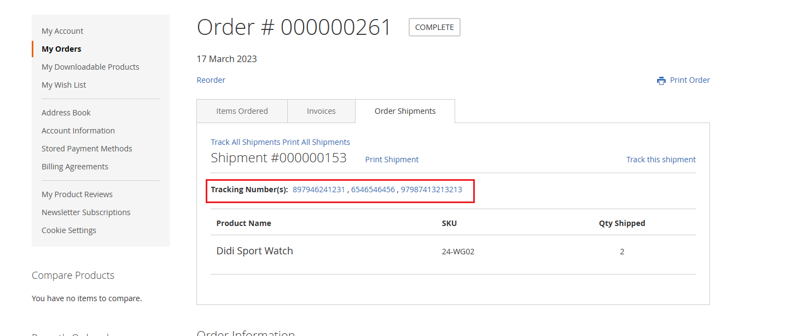

# Magento 2 Shipping Carrier Tracker

### <mark style="color:blue;">Installation and User Guide for Magento 2 Shipping Carrier Tracker Extension</mark>

**Table of Contents**

1. [_Installation_ ](magento-2-shipping-carrier-tracker.md#\_bookmark0)
   * _Installation via app/code_&#x20;
   * _Installation via Composer_
2. [_Configuration Settings for Shipping Carrier Tracker_](magento-2-shipping-carrier-tracker.md#\_bookmark3)
   * _General Settings_&#x20;
   * _Shipping Methods_
3. [_Tracking Links_](magento-2-shipping-carrier-tracker.md#\_bookmark8)
   * _Admin Panel_
   * _My Account Section_
   * _Shipment Email_

### <mark style="color:blue;">Installation</mark> <a href="#bookmark0" id="bookmark0"></a>

* <mark style="color:orange;">**Installation via app/code:**</mark> Upload the content of the module to your root folder. This will not overwrite the existing Magento folder or files, only the new contents will be added. After the successful upload of the package, run below commands on Magento 2 root directory.

```
php bin/magento setup:upgrade
php bin/magento setup:di:compile
php bin/magento setup:static-content:deploy
```

* <mark style="color:orange;">**Installation via Composer:**</mark> Please follow the guide provided in the below link to complete the installation via composer.


[installation-via-composer.md](../installation-via-composer.md)


### <mark style="color:blue;">Configuration Settings for Surcharge</mark> <a href="#bookmark3" id="bookmark3"></a>

Go to **Admin > Stores > Configuration > Scommerce Configuration > Tracking Link**

#### <mark style="color:orange;">General Settings</mark> <a href="#bookmark4" id="bookmark4"></a>

* **Enabled –** Select “Yes” or “No” to enable or disable the module.
* **License Key –** Please add the license for the extension which is provided in the order confirmation email. Please note license keys are site URL specific. If you require license keys for dev/staging sites then please email us at [core@scommerce-mage.com](mailto:core@scommerce-mage.com)

<figure><figcaption></figcaption></figure>

#### <mark style="color:orange;">Shipping Methods</mark>  <a href="#bookmark4" id="bookmark4"></a>

* **URLs –** Enter the shipping method and the URL. The URL should contain the {number} parameter which will be used to pass the tracking number to the shipping carriers tracking site where the shipment can be tracked.
* **Additional Carriers-** Add the additional carriers which will be available in the carrier selector dropdown list while creating a shipment.&#x20;

<figure><figcaption></figcaption></figure>

<figure><figcaption></figcaption></figure>

### <mark style="color:blue;">Tracking Links</mark> <a href="#bookmark8" id="bookmark8"></a>

Go to **Admin>Sales>Order** and select an order then click on 'Ship' to create a shipment. Scroll down to find shipping information then select the shipping carrier from the carrier dropdown list and enter the tracking number for that carrier. Select email copy of shipment checkbox then generate the shipment.&#x20;

<figure><figcaption></figcaption></figure>

* <mark style="color:orange;">**Admin Panel:-**</mark> Once the shipment is generated you can go to the order then from the left menu select shipments and view the generated shipment. You should see the tracking number consists a link, and once you link on that link it will take you to the shipping carriers tracking site with your tracking number.

<figure><figcaption></figcaption></figure>

* <mark style="color:orange;">**My Account Section:-**</mark> Once the shipment is generated customers can view the shipmen in the **My Account>My Orders>Order Shipments** section where the trackings numbers with links will be available as per the shipping carriers selected with the shipment.

<figure><figcaption></figcaption></figure>

* <mark style="color:orange;">**Shipment Email:-**</mark> Once the shipment is generated the shipment email will be sent to the customer with tracking links to each of the shipping carriers.

<figure><figcaption></figcaption></figure>

If you have a question related to this extension please check out our [**FAQ Section**](https://www.scommerce-mage.com/magento-2-shipping-carrier-tracker.html#customfaq) first. If you can't find the answer you are looking for then please contact [**support@scommerce-mage.com**](mailto:core@scommerce-mage.com)**.**
