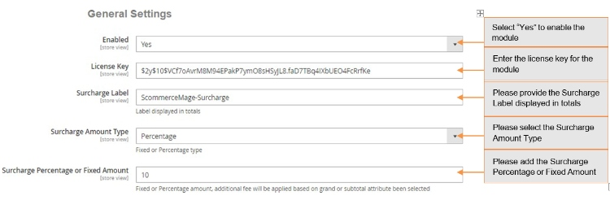
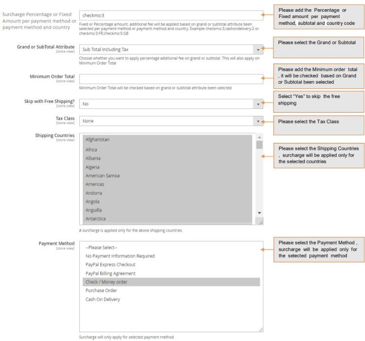

# Magento 2 Surcharge or Additional Fee

### <mark style="color:blue;">Installation and User Guide for Magento 2 Surcharge or Additional Fee Extension</mark>

**Table of Contents**

1. [_Installation_ ](magento-2-surcharge-or-additional-fee.md#bookmark0)
   * _Installation via app/code_&#x20;
   * _Installation via Composer_
2. [_Configuration Settings for Surcharge_ ](magento-2-surcharge-or-additional-fee.md#bookmark3)
   * _General Settings_&#x20;
   * _Surcharge for Multiple countries/Multiple payment methods_&#x20;
   * _View Surcharge on the Order Details View Page_&#x20;
   * _Surcharge for Admin Orders_&#x20;
3. [_Front-end Site View_ ](magento-2-surcharge-or-additional-fee.md#bookmark8)
   * _Surcharge Percentage/Fixed Amount Per Payment Method and Country_&#x20;
   * _View Surcharge on the Checkout Page_&#x20;
   * _Surcharge with the Free Shipping_&#x20;

### <mark style="color:blue;">Installation</mark> <a href="#bookmark0" id="bookmark0"></a>

* <mark style="color:orange;">**Installation via app/code:**</mark> Upload the content of the module to your root folder. This will not overwrite the existing Magento folder or files, only the new contents will be added. After the successful upload of the package, run below commands on Magento 2 root directory.

```
php bin/magento setup:upgrade
php bin/magento setup:di:compile
php bin/magento setup:static-content:deploy
```

* <mark style="color:orange;">**Installation via Composer:**</mark> Please follow the guide provided in the below link to complete the installation via composer.


[installation-via-composer.md](../installation-via-composer.md)


### <mark style="color:blue;">Configuration Settings for Surcharge</mark> <a href="#bookmark3" id="bookmark3"></a>

Go to **Admin > Stores > Configuration > Scommerce Configuration > Surcharge**

#### <mark style="color:orange;">General Settings</mark> <a href="#bookmark4" id="bookmark4"></a>

* **Enabled –** Select “Yes” or “No” to enable or disable the module.
* **License Key –** Please add the license for the extension which is provided in the order confirmation email. Please note license keys are site URL specific. If you require license keys for dev/staging sites then please email us at [support@scommerce-mage.com](mailto:support@scommerce-mage.com).
* **Surcharge Label –** This label text gets used in the frontend of the website which will be shown on basket, review, invoice, order, shipment, email confirmation and refund.
* **Surcharge Amount Type –** This option allows you to choose fixed amount or percentage value. Percentage value gets calculated based on the grand total or subtotal attribute been selected.
* **Surcharge Percentage or Fixed Amount –** This is the surcharge or additional fee which will be shown to the customer based on surcharge amount type (fixed to percentage)
* **Surcharge Percentage or Fixed Amount per payment method or payment method and country -** Fixed or Percentage amount, additional fee will be applied based on grand or subtotal attribute been selected per payment method or payment method and country. Example checkmo:3;cashondelivery:2 or checkmo:3:FR;checkmo:5:GB




* **Grand or Subtotal Attribute –** This option allows you to choose whether you want to apply percentage additional fee on grand or subtotal. This will also apply on **Minimum Order Total**.
* **Minimum Order Total –** This value will be checked / validated based on the

**Grand or Subtotal Attribute** value been selected.

* **Skip with Free Shipping –** This option can be used if you don’t want to charge additional fee when the shipping price is zero. This is useful when you are charging additional fee based on the shipping country but when the shipping is free then you might not want to charge additional fee.
* **Tax Class -** Please select the tax class from the drop-down lis&#x74;**.**
* **Shipping Countries –** The additional fee will be applied only to the specific shipping country(s). Please select all if you want to charge additional fee for all shipping countries.
* **Payment Method –** The additional fee will be applied only to the specific payment method (s). Please select all if you want to charge additional fee for all payment methods.



Please select the Payment Method, surcharge will be applied only for the selected payment method

* <mark style="color:orange;">**Surcharge for Multiple countries/Multiple payment methods -**</mark> You can set surcharge for multiple countries by selecting countries from **Admin > Stores > Configuration > Scommerce Configuration > Surcharge > General Settings > Shipping Countries**, and multiple payment methods from **Admin > Stores > Configuration > Scommerce Configuration > Surcharge > General Settings > Payment Method.**
* <mark style="color:orange;">**View Surcharge on the Order Details View Page -**</mark> You can see the applied surcharge on the order details view page from **Admin > Sales > Orders > Select Order > Edit** , under "Order Totals" section.
* <mark style="color:orange;">**Surcharge for Admin Orders -**</mark> In the below image you can see the added surcharge value for the order placed from the admin panel, **Admin > Sales > Orders > Create New Order > Select User > Select Product > Add Product.**

>)

>)

### <mark style="color:blue;">Front-end Site View</mark> <a href="#bookmark8" id="bookmark8"></a>

* <mark style="color:orange;">**Surcharge Percentage/Fixed Amount Per Payment Method and Country**</mark> When you set "Surcharge Percentage or Fixed Amount per payment method and country" to "**checkmo:3:FR**" from **Admin > Stores > Configuration > Scommerce Configuration > Surcharge > Surcharge Percentage or Fixed Amount per payment method,** then the fixed or Percentage amount, additional fee will be applied based on grand or subtotal attribute been selected per payment method or payment method and country.
* <mark style="color:orange;">**checkmo:3:FR -**</mark> It will add 3% additional fee on "Subtotal Including Tax" , will be applied for shipping country **France** and payment method **Check Money order.**

>)

* <mark style="color:orange;">**checkmo:5:GB -**</mark> It will add 5% additional fee on "Subtotal Including Tax" , will be applied for shipping country **UK** and payment method **Check Money order.**

>)

* <mark style="color:orange;">**checkmo:3 -**</mark> It will add 3% additional fee on "Subtotal Including Tax", and will be applied only for **Check Money Order** payment method and shipping countries selected from **Admin > Stores > Configuration > Scommerce Configuration > Surcharge > Shipping Countries** .

>)

* <mark style="color:orange;">**Set Different Surcharge for Countries -**</mark> You can set different surcharge for countries from **Admin > Stores > Configuration > Scommerce Configuration > Surcharge > Surcharge Percentage or Fixed Amount per payment method -** checkmo:3:FR;checkmo:5:GB.
* <mark style="color:orange;">**View Surcharge on the Checkout Page -**</mark> When you select "Surcharge Amount Type" to "**Percentage**" , " Surcharge Percentage or Fixed Amount " to "**10**" and " Payment Method " to "**Cash On Delivery**"/"**Check Money order**" from **Admin > Stores > Configuration > Scommerce Configuration > Surcharge,** then it adds 10 % additional fee on "Subtotal Including Tax" based on selected payment method and shipping countries. To add shipping countries go to **Admin > Stores > Configuration > Scommerce Configuration > Surcharge > Shipping Countries -** Select Shipping Countries from the drop-down lis&#x74;**.**

>)

* <mark style="color:orange;">**Surcharge with the Free Shipping -**</mark> You can skip surcharge for the free shipping orders from **Admin > Stores > Configuration > Scommerce Configuration > Surcharge > Skip with Free Shipping - "Yes".** This option can be used if you don’t want to charge additional fee when the shipping price is zero.

>)

If you have a question related to this extension please check out our [**FAQ Section**](https://www.scommerce-mage.com/magento2-surcharge-or-additional-fee.html#faq) first. If you can't find the answer you are looking for then please contact [**support@scommerce-mage.com**](mailto:core@scommerce-mage.com)**.**
