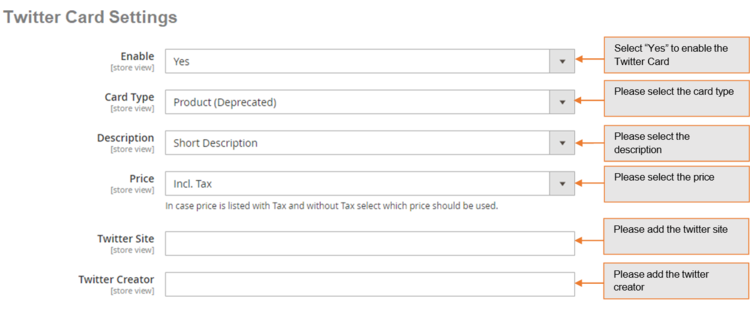
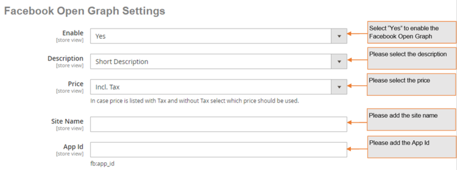

# Magento 2 Advanced SEO Suite

### <mark style="color:blue;">Installation and User Guide for Magento 2 Advanced SEO Suite</mark>

**Table of Contents**

1. [_Installation_ ](magento-2-advanced-seo-suite.md#\_toc\_250032)
   * _Installation via app/code_
   * _Installation via Composer_
2. [_Configuration Settings for SEO Base_ ](magento-2-advanced-seo-suite.md#\_toc\_250031)
   * _General Settings_&#x20;
3. [_Configuration Settings for SEO Sitemap Exclusion_ ](magento-2-advanced-seo-suite.md#\_toc\_250029)
   * _General Settings_&#x20;
   * _Exclude Categories from Sitemap_&#x20;
   * _Exclude Products from Sitemap_&#x20;
   * _Exclude CMS Pages from Sitemap_&#x20;
   * _How to Generate Sitemap_&#x20;
   * _Add new Sitemap_&#x20;
   * _Magento Out of the Box Functionality to set the Category Path_&#x20;
4. [_Google Sitemap XML_ ](magento-2-advanced-seo-suite.md#google-sitemap-xml)
   * _Product Link in Sitemap XML_&#x20;
   * _Category Link in Sitemap XML_&#x20;
   * _CMS Pages Link in Sitemap XML_&#x20;
5. [_Configuration Settings for Catalog URL_ ](magento-2-advanced-seo-suite.md#\_toc\_250027)
   * _General Settings_&#x20;
   * _Configuration Path to Set Up Primary Category_&#x20;
6. [_Front-end Site View_ ](magento-2-advanced-seo-suite.md#\_toc\_250024)
   * _Product Page Unique URL_&#x20;
7. [_Configuration Settings for Canonical Tags_ ](magento-2-advanced-seo-suite.md#\_toc\_250023)
   * _General Settings_&#x20;
   * _Category Canonical Tag_&#x20;
   * _Product Canonical Tag_&#x20;
   * _CMS Canonical Tag_&#x20;
   * _No Index No Follow_&#x20;
   * _Product Setup for Canonical URL_&#x20;
   * _Category Setup for Canonical URL_&#x20;
   * _CMS Setup for Canonical URL_&#x20;
8. [_Front-end Site View_ ](magento-2-advanced-seo-suite.md#\_toc\_250014)
   * _Canonical Tag on the Category Page_&#x20;
   * _Canonical Tag on the Product Page_&#x20;
   * _Canonical Tag on the CMS Page_&#x20;
9. [_Configuration Settings for Rich Snippets_ ](magento-2-advanced-seo-suite.md#\_toc\_250013)
   * _General Settings_&#x20;
   * _Rich Snippets General Settings_&#x20;
   * _Twitter Card Settings_&#x20;
   * _Facebook Open Graph Settings_&#x20;
   * _Facebook Open Graph Settings_&#x20;
   * _Pinterest Rich Pins Settings_&#x20;
10. [_Structured Data / Markup Code of Front-end Page(s) in Structured Data Testing Tool_ ](magento-2-advanced-seo-suite.md#\_toc\_250007)
    * _Home Page Markup Code_&#x20;
    * _Category Page Markup Code_&#x20;
    * _Product Page Markup Code_&#x20;
    * _Twitter, Facebook Open Graph Social Sharing Code_&#x20;
    * _Twitter Card_&#x20;
    * _Facebook Open Graph_&#x20;
    * _Increased and Optimized Page Ranking in Search Results_&#x20;
11. [_Configuration Settings for Hreflang_ ](magento-2-advanced-seo-suite.md#\_toc\_250005)
    * _General Settings_&#x20;
    * _Language and Country Settings_&#x20;
12. [_Front-end Site view_ ](magento-2-advanced-seo-suite.md#\_toc\_250002)
    * _Hreflang Tag on the Home Page_&#x20;
    * _Hreflang Tag on the Category Page_&#x20;
    * _Hreflang Tag on the Product Page_&#x20;
    * _Hreflang Tag on the CMS Page_&#x20;
13. [_Configuration Settings for Cross Linking_ ](magento-2-advanced-seo-suite.md#\_toc\_250001)
    * _Cross Links Grid_&#x20;
    * _Add New Cross Link._&#x20;
    * _Build External Link to Any Website_&#x20;
    * _Alert Message for Inactive Product / Category_&#x20;
14. [_Set Primary Categories_](magento-2-advanced-seo-suite.md#set-primary-categories)
15. [_Front-end Site View_ ](magento-2-advanced-seo-suite.md#\_toc\_250000)
    * _Cross Link on Category Page_&#x20;
    * _Category Page Cross Link Redirecting on External Link_&#x20;
    * _Cross Link on Product Page_
    * _Product Page Cross Link Redirecting on Internal Link_
    * _Cross Link on CMS Page_&#x20;

### <mark style="color:blue;">Installation</mark> <a href="#_toc_250032" id="_toc_250032"></a>

* <mark style="color:orange;">**Installation via app/code:**</mark> Upload the content of the module to your root folder. This will not overwrite the existing Magento folder or files, only the new contents will be added. After the successful upload of the package, run below commands on Magento 2 root directory.

```
php bin/magento setup:upgrade
php bin/magento setup:di:compile
php bin/magento setup:static-content:deploy
```

* <mark style="color:orange;">**Installation via Composer:**</mark> Please follow the guide provided in the below link to complete the installation via composer.


[installation-via-composer.md](../installation-via-composer.md)


### <mark style="color:blue;">Configuration Settings for SEO Base</mark> <a href="#_toc_250031" id="_toc_250031"></a>

Go to _Admin > Stores > Configuration > Scommerce Configuration > SEO Base_

#### <mark style="color:orange;">General Settings</mark> <a href="#_toc_250030" id="_toc_250030"></a>

* **Enabled -** Select “Yes” or “No” to enable or disable the module.
* **License Key –** Please add the license for the extension which is provided in the order confirmation email. Please note license keys are site URL specific. If you require license keys are dev/staging sites then please email us at [core@scommerce-mage.com](file:///C:/Users/jatin/OneDrive/Documents/core%40scommerce-mage.com)


### <mark style="color:blue;">Configuration Settings for SEO Sitemap Exclusion</mark> <a href="#_toc_250029" id="_toc_250029"></a>

Go to _Admin > Stores > Configuration > Scommerce Configuration > SEO Sitemap_

#### <mark style="color:orange;">General Settings</mark> <a href="#_toc_250028" id="_toc_250028"></a>

* **Enable -** Select “Yes” or “No” to enable or disable the module.


* <mark style="color:orange;">**Exclude Categories from Sitemap –**</mark> To include or exclude categories, go to _Admin > Catalog > Manage Categories > Select category (you want to exclude from site map) > General > Exclude from Sitemap: Set to “Yes/No”_

>)

* <mark style="color:orange;">**Exclude Products from Sitemap –**</mark> To exclude products from sitemap, go to _Admin > Catalog > Manage Products > Select product (you want to exclude from sitemap) > General > Exclude from Sitemap: Set to ”Yes/No”._

>)

* <mark style="color:orange;">**Exclude CMS Pages from Sitemap –**</mark> To exclude CMS pages from sitemap, go to _Admin > CMS > Pages > Select CMS Page (you want to exclude from site map) > General > Exclude from Sitemap: Set to “Yes/No”_

>)

* <mark style="color:orange;">**How to Generate Sitemap –**</mark> To generate the site map from the admin panel go to, _Admin > Marketing > Sitemap > Click ''Generate Sitemap''._

>)

* <mark style="color:orange;">**Add new Sitemap -**</mark> You can create new site map from, _Admin > Marketing > Sitemap > Click ''Add Sitemap''_, it redirects to New Site Map page and by providing all the required details you can create Site Map.

>)

* <mark style="color:orange;">**Magento Out of the Box Functionality to set the Category Path -**</mark> To include category path in product URLs in sitemap.xml, go to _Admin > System > Configuration > Catalog > Catalog > Search Engine Optimizations > Use Categories Path for Product URLs: Set to "yes"._

>)

### <mark style="color:blue;">**Google Sitemap XML**</mark>&#x20;

Google site map shows all the included Products, Categories**,** and CMS Pages links in the sitemap.xml.

* <mark style="color:orange;">**Category Link in Sitemap XML -**</mark> You can see the category link in the Google Sitemap XML.

>)

* <mark style="color:orange;">**CMS Pages Link in Sitemap XML -**</mark> In the below screen grab you can see the about-us page link in the Google Sitemap XML.

>)

* <mark style="color:orange;">**Product Link in Sitemap XML -**</mark> You can see the product link in the Google Sitemap XML.


### <mark style="color:blue;">Configuration Settings for Catalog URL</mark> <a href="#_toc_250027" id="_toc_250027"></a>

Go to _Admin > Stores > Configuration > Scommerce Configuration > Catalog URL_

#### <mark style="color:orange;">General Settings</mark> <a href="#_toc_250026" id="_toc_250026"></a>

* **Enabled -** Select “Yes” or **“**No**”** to enable or disable the module.
* **Exclude Root Categories –** Exclude some root categories to appear as primary category dropdown against products.


### <mark style="color:blue;">Configuration Path to Set Up Primary Category</mark> <a href="#_toc_250025" id="_toc_250025"></a>

Go to _Admin > Catalog > Select Product > Search Engine Optimization > Primary Category_ . The drop down will show all the categories selected for the product from where you can select the primary category of the product.

>)

### <mark style="color:blue;">Front-end Site View</mark> <a href="#_toc_250024" id="_toc_250024"></a>

* <mark style="color:orange;">**Product Page Unique URL -**</mark> You can assign primary category to any product from _Admin > Catalog > Select Product > Search Engine Optimization > Primary Category._ In the below image you can see the assigned category of product Rival Field Messenger is "Gear->Bags"**.**

>)

### <mark style="color:blue;">Configuration Settings for Canonical Tags</mark> <a href="#_toc_250023" id="_toc_250023"></a>

Go to _Admin > Stores > Configuration > Scommerce Configuration > Canonical Tags_

#### <mark style="color:orange;">General Settings</mark> <a href="#_toc_250022" id="_toc_250022"></a>

* **Enable -** Select “Yes” or “No” to enable or disable the module.


#### <mark style="color:orange;">Category Canonical Tag</mark> <a href="#_toc_250021" id="_toc_250021"></a>

* **Category Canonical Enable –** Set it to yes, if you want canonical tag on category pages.
* **Exclude Current Category in Admin –** Set it to “Yes”, if you don’t want the same category to appear in the drop-down selection while choosing canonical category for a category.
* **Append Text with Every Category URL Path –** Set it to yes, if you want to append text with overridden canonical url as well. This setting is useful when you have pagination/filtered navigation/sorting on your site.


#### <mark style="color:orange;">Product Canonical Tag</mark> <a href="#_toc_250020" id="_toc_250020"></a>

* **Product Canonical Enable –** Set it to yes, if you want canonical tag on product pages.


#### <mark style="color:orange;">CMS Canonical Tag</mark> <a href="#_toc_250019" id="_toc_250019"></a>

* **CMS Canonical Enable –** Set it to "yes", if you want canonical tag on CMS pages.


#### <mark style="color:orange;">No Index No Follow</mark> <a href="#_toc_250018" id="_toc_250018"></a>

* **No Index No Follow Enabled –** Set it to yes, if you want to add no index, no follow in the head section.
* **Action names –** Add action names here to add no index, no follow in the head section for specific page. New route name needs to be added in next line.
* **Route names –** Add route name here to add no index, no follow in the head section for list of pages.


#### <mark style="color:orange;">Product Setup for Canonical URL</mark> <a href="#_toc_250017" id="_toc_250017"></a>

Go to _Admin > Catalog > Products > Select Product (for which you want to set Canonical URL) > Search Engine Optimization Tab_

* **Primary Category –** Select primary category to be included in the canonical URL tag.
* **Override Canonical URL –** Enter text here to be used as canonical tag URL.
* **Robot Settings –** Select the robot settings from dropdown.


#### <mark style="color:orange;">Category Setup for Canonical URL</mark> <a href="#_toc_250016" id="_toc_250016"></a>

Go to _Admin > Catalog > Category > select category (for which you want to set canonical URL) > Search Engine Optimization Tab._

* **Canonical URL –** Select primary category to be included in canonical URL tag.
* **Override Canonical Tag –** Enter text here to be used as canonical tag URL.
* **Robot Settings –** Select the robot settings from dropdown.


#### <mark style="color:orange;">CMS Setup for Canonical URL</mark> <a href="#_toc_250015" id="_toc_250015"></a>

Go to _Admin > Content > Pages > Choose page (for which you want to set canonical URL) > Search Engine Optimization Tab_

* **Override Canonical URL –** Enter text here to be used as canonical tag URL.
* **Robot Settings –** Select the robot settings from dropdown.


### <mark style="color:blue;">Front-end Site View</mark> <a href="#_toc_250014" id="_toc_250014"></a>

* <mark style="color:orange;">**Canonical Tag on the Category Page -**</mark> You can enable canonical tag on the category page from _Admin > Stores > Configuration > Scommerce Configuration > Canonical Tags > Category Canonical Enable - Select "Yes"._


* <mark style="color:orange;">**Canonical Tag on the Product Page -**</mark> To add canonical tag on the product page, go to _Admin > Stores > Configuration > Scommerce Configuration > Canonical Tags > Product Canonical Enable - Select "Yes"._


* <mark style="color:orange;">**Canonical Tag on the CMS Page -**</mark> You can add canonical tag on the CMS page from _Admin > Stores > Configuration > Scommerce Configuration > Canonical Tags > CMS Canonical Enable - Select "Yes"._


### <mark style="color:blue;">Configuration Settings for Rich Snippets</mark> <a href="#_toc_250013" id="_toc_250013"></a>

Go to _Admin > Stores > Configuration > Scommerce Configuration > Rich Snippet_

#### <mark style="color:orange;">General Settings</mark> <a href="#_toc_250012" id="_toc_250012"></a>

* **Enable -** Select “Yes” or “No” to enable or disable the module.
* **Description –** Select description/short description from the drop down.
* **Price –** Select Price from the drop down. In case price is listed with tax and without tax select which price should be used.
* **Brand –** Select brand from the drop down.
* **Global Product Identifier –** Select product identifier from the drop-down list.
* **Global Identifier Type –** Select product identifier type from the drop-down list. It could be one of the following: gtin8, gtin13, gtin14, mpn.


#### <mark style="color:orange;">Rich Snippets General Settings</mark> <a href="#_toc_250011" id="_toc_250011"></a>

* **Enable -** Select “Yes” or “No” to enable or disable the module.
* **Description –** Select description/short description from the drop-down.
* **Price –** Select price from the drop down. In case price is listed with tax and without tax select which price should be used.
* **Wrap with div –** Select “Yes/No”. It helps prevent conflicts with SEO extensions.
* **Use JSON-LD –** Select “Yes/No” use JSON-LD format for product snippet.


#### <mark style="color:orange;">Twitter Card Settings</mark> <a href="#_toc_250010" id="_toc_250010"></a>

* **Enable -** Select “Yes” or “No” to enable or disable the module.
* **Card Type –** Select the card type.
* **Description -** Select description/short description from the drop down.
* **Price –** Select price from the drop down. In case price is listed with tax and without tax select which price should be used.
* **Twitter Site –** Set Twitter site name (@ username for the website used in the card footer)
* **Twitter Creator –** Set Twitter creator name (@username for the content creator / author)



#### <mark style="color:orange;">Facebook Open Graph Settings</mark> <a href="#_toc_250009" id="_toc_250009"></a>

 **Facebook Open Graph Settings**

* **Enable –** Set “Yes” to enable.
* **Description –** Select description/short description from the drop down.
* **Price –** Select price from the drop down. In case price is listed with tax and without tax select which price should be used.
* **Site Name –** Set Facebook site name.
* **App ID –** Set Facebook App ID.



#### <mark style="color:orange;">Pinterest Rich Pins Settings</mark> <a href="#_toc_250008" id="_toc_250008"></a>

* **Enable –** Set “Yes” to enable Pinterest Rich Pins . It uses same tags as Facebook open graph, make sure Facebook Open graph is enabled as well.


### <mark style="color:blue;">Structured Data / Markup Code of Front-end Page(s) in Structured Data Testing Tool</mark> <a href="#_toc_250007" id="_toc_250007"></a>

* <mark style="color:orange;">**Home Page Markup Code -**</mark> You can add structured data/markup code on home page from, _Admin > Stores > Configuration > Scommerce Configuration > Rich Snippet > Enable - Select "Yes"._ To test structured data, go to _Structured Data Testing Tool > Provide Home Page URL > Click "Run Test" button._

.png>)

* <mark style="color:orange;">**Category Page Markup Code -**</mark> You can add markup code, breadcrumbs on category page from, _Admin > Stores > Configuration > Scommerce Configuration > Rich Snippet > Enable - Select "Yes"._

>)

* <mark style="color:orange;">**Product Page Markup Code**</mark> <mark style="color:orange;"></mark><mark style="color:orange;">-</mark> To add structured data markup code on product page, set "Enable" to "Yes" from, _Admin > Stores > Configuration > Scommerce Configuration > Rich Snippet._

>)

### <mark style="color:blue;">Twitter, Facebook Open Graph Social Sharing Code</mark> <a href="#_toc_250006" id="_toc_250006"></a>

* <mark style="color:orange;">**Twitter Card -**</mark> You can enable Twitter Card from, _Admin > Stores > Configuration > Scommerce Configuration > Rich Snippet >Twitter Card Settings > Enable - "Yes"._

>)

* <mark style="color:orange;">**Facebook Open Graph -**</mark> Enable Facebook Open Graph from, _Admin > Stores > Configuration > Scommerce Configuration > Rich Snippet >Twitter Card Settings > Enable - "Yes"._

>)

* <mark style="color:orange;">**Increased and Optimized Page Ranking in Search Results -**</mark> In the below image you can see the increased and optimized page ranking in search results.

>)


### <mark style="color:blue;">Configuration Settings for Hreflang</mark> <a href="#_toc_250005" id="_toc_250005"></a>

Go to _Admin > Stores > Configuration > Scommerce Configuration > Hreflang_

#### <mark style="color:orange;">General Settings</mark> <a href="#_toc_250004" id="_toc_250004"></a>

* **Enable -** Select “Yes” or “No” to enable or disable the module.
* **Href UrLS Scope –** Select options from the list.
  * Website Hreflang URLs: It will work within one website.
  * Global Hreflang URLs: This will work across multiple websites.
* **X-Default –** Select default store view.
* **Enable Hreflang Tags for Categories –** Select “Yes/No”. If set to “Yes” then it will enable Hreflang Tags for the categories.
* **Enable Hreflang Tags for Products –** Select “Yes/No”. If set to “Yes” then it will enable Hreflang Tags for the products.
* **Enable Hreflang Tags for CMS Pages –** Select “Yes/No”. If set to “Yes” then it will enable Hreflang Tags for the CMS Pages.


#### <mark style="color:orange;">Language and Country Settings</mark> <a href="#_toc_250003" id="_toc_250003"></a>

* **Select Language –** Select Local or Custom languages from the drop down list.
* **Add Country –** Select “Yes/No”. If set to “Yes” then only the “Select Country” option will be visible.
* **Select Country –** Select country from the drop-down list.


### <mark style="color:blue;">Front-end Site view</mark> <a href="#_toc_250002" id="_toc_250002"></a>

* <mark style="color:orange;">**Hreflang Tag on the Home Page -**</mark> You can enable hreflang on the home page by selecting "Yes" for " Hreflang Tags For CMS Pages " from _Admin > Stores > Configuration > Scommerce Configuration > Hreflang > General Settings > Enable - Select "Yes " > Enable Hreflang Tags For CMS Pages._


* <mark style="color:orange;">**Hreflang Tag on the Category Page -**</mark> To enable hreflang on the category page, go to _Admin > Stores > Configuration > Scommerce Configuration > Hreflang > General Settings > Enable - Select "Yes " > Enable Hreflang Tags For Categories - "Yes"._


* <mark style="color:orange;">**Hreflang Tag on the Product Page -**</mark> You can enable hreflang on the product page by selecting "Yes" for " Hreflang Tags For Products " from _Admin > Stores > Configuration > Scommerce Configuration > Hreflang > General Settings > Enable - Select "Yes " > Enable Hreflang Tags For Products._


* <mark style="color:orange;">**Hreflang Tag on the CMS Page -**</mark> Enable hreflang on the CMS Pages From _Admin > Stores > Configuration > Scommerce Configuration > Hreflang > General Settings > Enable - Select "Yes " > Enable Hreflang Tags For CMS Pages - "Yes"._


### <mark style="color:blue;">Configuration Settings for Cross Linking</mark> <a href="#_toc_250001" id="_toc_250001"></a>

Go to _Admin > Stores > Configuration > Scommerce Configuration > Cross Linking_

* **Enabled –** Select “Yes” or “No” to enable or disable the module.
* **Product Page Replacement Limit –** Please define the replacement limit per product page. It determines how many keywords will be replaced on the given page.
* **Category Page Replacement Limit –** Please define the replacement limit per category page. It determines how many keywords will be replaced on the given page.
* **CMS Page Replacement Limit –** Please define the CMS page replacement limit. It determines how many keywords will be replaced on the given page.
* **Product Attributes for Replacement –** Please select the product attributes where text will be replaced with link on product pages.
* **Category Attribute for Replacement –** Please select the category attributes where text will be replaced with link on category page.


* <mark style="color:orange;">**Cross Links Grid -**</mark> You can manage and create new cross links from _Admin > Marketing > SEO Cross Linking > Cross Links._ This grid will have ID, Title, Status, Store View, Target, Replacement Limit, Priority, Nofollow, Action.


* <mark style="color:orange;">**Add New Cross Link -**</mark> To add new cross link, go to _Admin > Marketing > SEO Cross Linking > Cross Links > Click on "Add New Link" button._ It redirects on "Add New Cross Link" page and by providing all the general information you can create a new cross link.


This will have the following general information:-

* **Active** - Dropdown with 'YES' or 'NO' options
* **Link Title** - Title of the link
* **Link Target** - Dropdown with options self or blank
* **Keywords** - Keywords can be entered with line breaks and wildcard % anywhere with the keyword for example %phone% (iPhone7)
* **Store View** - Multi-select with options All Store Views, Default Store View
* **Reference** - Dropdown with options, Product ID, Category ID or Custom Url
* **Reference Resource** - This will show either category tree or product grid with filters or css grid with filters to choose category or product ID
* **Priority** - Priority to be given to the link which has highest priority first in case the replacement is lower number
* **Replacement limit** - Limit the number of links per page
* **No Follow** - This will add follow or nofollow with the link on frontend
* **Build External Link to Any Website -** You can set external link to any website from **Admin > Marketing > SEO Cross Linking > Cross Links >Reference - Custom Url > Custom Url -** Provide External Link.
* **Alert Message for Inactive Product / Category -** It shows an alert / warning message when you disable the category or product from **Admin > Catalog > Category / Product > Select Category / Product > Disable > Save.**
* **Alert Message for Inactive Category**

### <mark style="color:blue;">Set Primary Categories</mark>

You can use a script provided with the extension to automatically add primary categories for products. Admin can exclude certain categories from primary category and also prioritise one category over the other to be picked as the primary category.

Go to Admin>Catalog>Categories select a category then scroll down to find the option "Primary Category Settings". Here click on "Exclude From Primary Category" to exclude this category from primary category or enter the priority 0 being the highes. The highest priority category will be picked first for the primary category.

.png>)

To automatically assingn primary category for all products run the command given below by going into the root directory of your store.

```
scommerce:seo-base:set-primary-category
```

_<mark style="color:red;">**N.B -**</mark>_ _<mark style="color:red;">If you are using older version then run the script provided in the extension folder at the path Data/SetPrimaryCategoryM2.php from ssh</mark>_

### <mark style="color:blue;">Front-end Site view</mark> <a href="#_toc_250000" id="_toc_250000"></a>

* <mark style="color:orange;">**Cross Link on Category Page -**</mark> You can define the replacement limit for category page from _Admin > Stores > Configuration > Scommerce Configuration > Cross Linking > Category Page Replacement Limit - 1._ It determines how many keywords will be replaced on the given page and to define cross link, go to _Admin > Marketing > SEO Cross Linking > Cross Links > Select Link > Replacement Limit -1._


* <mark style="color:orange;">**Category Page Cross Link Redirecting on External Link -**</mark> Click on the cross link "Luma" will redirect to external link.


* <mark style="color:orange;">**Cross Link on Product Page -**</mark> You can define replacement limit for cross link from _Admin > Marketing > SEO Cross Linking > Cross Links > Select Link > Replacement Limit - 2._ Individual Cross link limit determines how many times the link will be replaced on the given page.


* <mark style="color:orange;">**Product Page Cross Link Redirecting on Internal Link -**</mark> Click on the cross link "Duffle" will redirect to defined internal link.


* <mark style="color:orange;">**Cross Link on CMS Page**</mark> <mark style="color:orange;"></mark><mark style="color:orange;">-</mark> You can set replacement limit for cross link from _Admin > Marketing > SEO Cross Linking > Cross Links > Select Link > Replacement Limit - 1._ Individual Cross link limit determines how many times the link will be replaced on the given page.


If you have a question related to this extension please check out our [**FAQ section**](magento-2-advanced-seo-suite.md#installation-and-user-guide-for-magento-2-advanced-seo-suite) first. If you can't find the answer you are looking for then please contact [**support@scommerce-mage.com**](mailto:core@scommerce-mage.com)**.**
