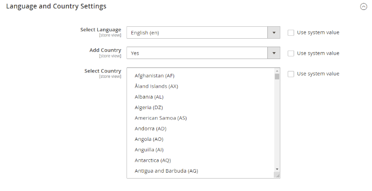

# Magento 2 Alternate Hreflang Tags

### <mark style="color:blue;">Installation and User Guide for Magento 2 Alternate Hreflang Tags</mark>

**Table of Contents**

1. __[_Installation_ ](magento-2-alternate-hreflang-tags.md#\_toc\_250006)__
   * _Installation via app/code_&#x20;
   * _Installation via Composer_
2. [_Configuration Settings for SEO Base_ ](magento-2-alternate-hreflang-tags.md#\_toc\_250005)__
   * _General Settings_&#x20;
3. [_Configuration Settings for Alternate Hreflang_ ](magento-2-alternate-hreflang-tags.md#\_toc\_250003)__
   * _General Settings_&#x20;
   * _Language and Country Settings_&#x20;
4. __[_Set Path Priority_](magento-2-alternate-hreflang-tags.md#set-path-priority)__
5. __[_Override Canonical URL_](magento-2-alternate-hreflang-tags.md#override-canonical-url)__
   * _Category Page_
   * _Product Page_
   * _CMS Page_
6. __[_Set Primary Categories_](magento-2-alternate-hreflang-tags.md#set-primary-categories)__
7. __[_Frontend Site View_ ](magento-2-alternate-hreflang-tags.md#\_toc\_250000)__
   * _Hreflang Tag on the Home Page_&#x20;
   * _Hreflang Tag on the Category Page_&#x20;
   * _Hreflang Tag on the Product Page_&#x20;
   * _Hreflang Tag on the CMS Page_&#x20;

### <mark style="color:blue;">Installation</mark> <a href="#_toc_250006" id="_toc_250006"></a>

* <mark style="color:orange;">**Installation via app/code:**</mark>** ** Upload the content of the module to your root folder. This will not overwrite the existing Magento folder or files, only the new contents will be added. After the successful upload of the package, run below commands on Magento 2 root directory.

```
php bin/magento setup:upgrade
php bin/magento setup:di:compile
php bin/magento setup:static-content:deploy
```

* <mark style="color:orange;">**Installation via Composer:**</mark> Please follow the guide provided in the below link to complete the installation via composer.


[installation-via-composer.md](../installation-via-composer.md)


### <mark style="color:blue;">Configuration Settings for SEO Base</mark> <a href="#_toc_250005" id="_toc_250005"></a>

Go to _Admin > Stores > Configuration > Scommerce Configuration > SEO Base_

#### <mark style="color:orange;">General Settings</mark> <a href="#_toc_250004" id="_toc_250004"></a>

* **Enabled –** Select “Yes” or “No” to enable or disable the module.
* **License Key –** Please add the license for the extension which is provided in the order confirmation email. Please note license keys are site URL specific. If you require license keys for dev/staging sites then please email us at [core@scommerce-mage.com](mailto:core@scommerce-mage.com)


### <mark style="color:blue;">Configuration Settings for Alternate Hreflang</mark> <a href="#_toc_250003" id="_toc_250003"></a>

Go to **Admin > Stores > Configuration > Scommerce Configuration > Hreflang**

### General Settings <a href="#_toc_250002" id="_toc_250002"></a>

* **Enable -** Select “Yes” or “No” to enable or disable the module.
* **X-Default –** Select default store view.
* **Enable Hreflang Tags for Categories –** Select “Yes/No”. If set to “Yes” then it will enable Hreflang Tags for the categories.
* **Enable Hreflang Tags for Products –** Select “Yes/No”. If set to “Yes” then it will enable Hreflang Tags for the products.
* **Enable Hreflang Tags for CMS Pages –** Select “Yes/No”. If set to “Yes” then it will enable Hreflang Tags for the CMS Pages.


#### <mark style="color:orange;">Language and Country Settings</mark> <a href="#_toc_250001" id="_toc_250001"></a>

* **Select Language –** Select local or custom languages from the drop-down list.
* **Add Country –** Select “Yes/No”. If set to “Yes” then only the “Select Country” option will be visible.
* **Select Country –** Select country from the drop-down list.



### <mark style="color:blue;">**Set Path Priority**</mark>

We have a priority system in place for the URL path that is to be included in the sitemap. The URL path is picked based on the below priority system:-

* **Override canonical URL:-** It is of highest priority. If this is set for any product, category or CMS page then canonical URL path will be picked in the hreflang tag.


* **Set Primary Category:-** It is secondest highest priority. If override canonical URL is not set then the primary category path set is picked in the hreflang tag.


* **Default Path:-** if neither override canonical URL nor Set primary Category is set then the default path of the product, category or CMS page is picked to be included in the hreflang tag.


### <mark style="color:blue;">**Override Canonical URL**</mark>

You can set the override canonical URL for any product, category or CMS page. The steps to setup override canonical URL is provided as below:-

#### <mark style="color:orange;">Category Page</mark>

Go to Admin>Catalog>Categories and select any category. Scroll down to find the tab "Search Engine Optimization". Enter the URL path in the "Override Canonical URL" section.&#x20;


#### <mark style="color:orange;">Product Page</mark>

Go to Admin>Catalog>products and select any product and click edit. Scroll down to find the tab "Search Engine Optimization". Enter the URL path in the "Override Canonical URL" section.&#x20;


#### <mark style="color:orange;">CMS Page</mark>

Go to Admin>Content>Pages and select any page. Scroll down to find the tab "Search Engine Optimization". Enter the URL path in the "Override Canonical URL" section.&#x20;


### <mark style="color:blue;">Set Primary Categories</mark>

You can use a script provided with the extension to automatically add primary categories for products. Admin can exclude certain categories from primary category and also prioritise one category over the other to be picked as the primary category.

Go to Admin>Catalog>Categories select a category then scroll down to find the option "Primary Category Settings". Here click on "Exclude From Primary Category" to exclude this category from primary category or enter the priority 0 being the highes. The highest priority category will be picked first for the primary category.

.png>)

To automatically assingn primary category for all products run the command given below by going into the root directory of your store.

```
scommerce:seo-base:set-primary-category
```

_<mark style="color:red;">**N.B -**</mark>_ _<mark style="color:red;">If you are using older version then run the script provided in the extension folder at the path Data/SetPrimaryCategoryM2.php from ssh</mark>_

### <mark style="color:blue;">Front-end Site view</mark> <a href="#_toc_250002" id="_toc_250002"></a>

* <mark style="color:orange;">**Hreflang Tag on the Home Page -**</mark>** ** You can enable hreflang on the home page by selecting "Yes" for " Hreflang Tags For CMS Pages " from _Admin > Stores > Configuration > Scommerce Configuration > Hreflang > General Settings > Enable - Select "Yes " > Enable Hreflang Tags For CMS Pages._


* <mark style="color:orange;">**Hreflang Tag on the Category Page -**</mark>** ** To enable hreflang on the category page, go to _Admin > Stores > Configuration > Scommerce Configuration > Hreflang > General Settings > Enable - Select "Yes " > Enable Hreflang Tags For Categories - "Yes"._


* <mark style="color:orange;">**Hreflang Tag on the Product Page -**</mark>** ** You can enable hreflang on the product page by selecting "Yes" for " Hreflang Tags For Products " from _Admin > Stores > Configuration > Scommerce Configuration > Hreflang > General Settings > Enable - Select "Yes " > Enable Hreflang Tags For Products._


* <mark style="color:orange;">**Hreflang Tag on the CMS Page -**</mark>** ** Enable hreflang on the CMS Pages From _Admin > Stores > Configuration > Scommerce Configuration > Hreflang > General Settings > Enable - Select "Yes " > Enable Hreflang Tags For CMS Pages - "Yes". Go to Admin > content > Pages_ select the about us page for each store view and go into _Search Engine Optimization. Put the same identifier if you want interlinking between various languages of the same about us page._

.png>)

.png>)

If you have a question related to this extension please check out our [**FAQ section**](https://www.scommerce-mage.com/magento-2-hreflang.html#faq) first. If you can't find the answer you are looking for then please contact [**support@scommerce-mage.com**](mailto:core@scommerce-mage.com)**.**
