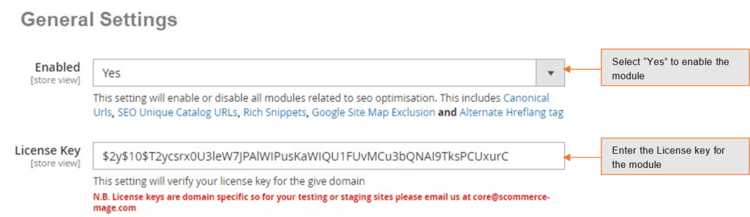
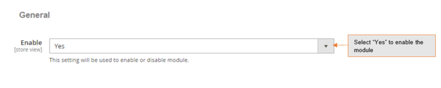
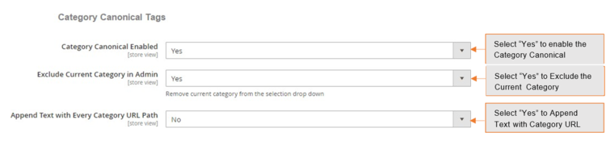
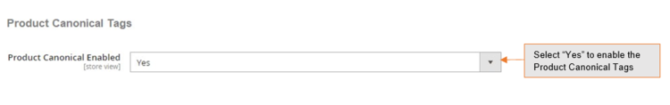
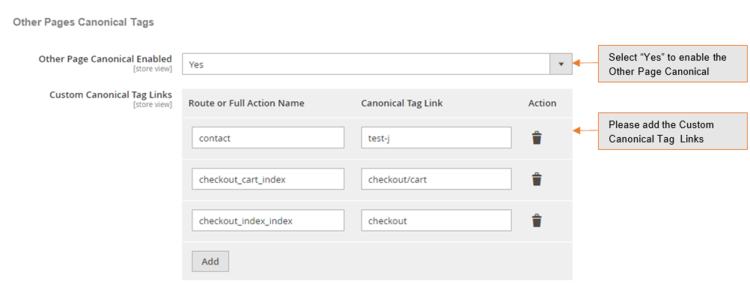
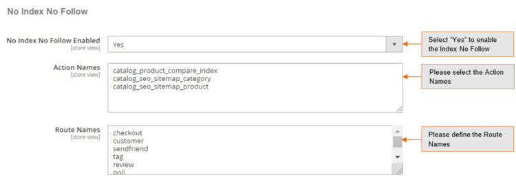

# Magento 2 Canonical Urls for Category, Product, CMS, and Other pages

### <mark style="color:blue;">Installation and User Guide for Magento 2 Canonical URLs for Category, Product, CMS, and Other pages</mark>

#### **Table of Contents**

1. [_Installation_](magento-2-canonical-urls-for-category-product-cms-and-other-pages.md#bookmark0)
   * _Installation via app/code_&#x20;
   * _Installation via Composer_
2. [_Configuration Settings for SEO Base_ ](magento-2-canonical-urls-for-category-product-cms-and-other-pages.md#bookmark3)
   * _General Settings_&#x20;
3. [_Configuration Settings for Canonical Tags_](magento-2-canonical-urls-for-category-product-cms-and-other-pages.md#bookmark5)&#x20;
   * _General Settings_&#x20;
   * _Category Canonical Tag_&#x20;
   * _Product Canonical Tag_&#x20;
   * _CMS Canonical Tag_&#x20;
   * _Others Pages Canonical Tags_&#x20;
   * _No Index No Follow_&#x20;
   * _Product set up for Canonical URL_&#x20;
   * _Category set up for Canonical URL_&#x20;
   * _CMS set up for Canonical URL_&#x20;
4. [_Set Primary Categories_](magento-2-canonical-urls-for-category-product-cms-and-other-pages.md#set-primary-categories)
5. [_Front-end Site View_ ](magento-2-canonical-urls-for-category-product-cms-and-other-pages.md#bookmark15)
   * _Category Canonical Tag_&#x20;
   * _Product Canonical Tag_&#x20;
   * _CMS Canonical Tag_&#x20;

### <mark style="color:blue;">Installation</mark> <a href="#bookmark0" id="bookmark0"></a>

* <mark style="color:orange;">**Installation via app/code:**</mark> Upload the content of the module to your root folder. This will not overwrite the existing Magento folder or files, only the new contents will be added. After the successful upload of the package, run below commands on Magento 2 root directory.

```
php bin/magento setup:upgrade
php bin/magento setup:di:compile
php bin/magento setup:static-content:deploy
```

* <mark style="color:orange;">**Installation via Composer:**</mark> Please follow the guide provided in the below link to complete the installation via composer.


[installation-via-composer.md](../installation-via-composer.md)


### <mark style="color:blue;">Configuration Settings for SEO Base</mark> <a href="#bookmark3" id="bookmark3"></a>

Go to _Admin> Stores> Configuration> Scommerce Configuration> SEOBase_

#### <mark style="color:orange;">General Settings</mark> <a href="#bookmark4" id="bookmark4"></a>

* **Enabled –** Select “Yes” or “No” to enable or disable the module.
* **License Key –** Please add the license for the extension which is provided in the order confirmation email. Please note license keys are site URL specific. If you require license keys for dev/staging sites then please email us at [support@scommerce-mage.com](mailto:support@scommerce-mage.com).



### <mark style="color:blue;">Configuration Settings for Canonical Tags</mark> <a href="#bookmark5" id="bookmark5"></a>

Go to _Admin > Stores > Configuration >Scommerce Configuration > Canonical Tags_

#### <mark style="color:orange;">General Settings</mark> <a href="#bookmark6" id="bookmark6"></a>

* **Enable -** Select “Yes” or “No” to enable or disable the module.



#### <mark style="color:orange;">Category Canonical Tag</mark> <a href="#bookmark7" id="bookmark7"></a>

* **Category Canonical Enable –** Set it to yes, if you want canonical tag on category pages.
* **Exclude Current Category in Admin –**&#x53;et it to “Yes”, if you don’t want the same category to appear in the drop-down selection while choosing canonical category for a category.
* **Append Text with Every Category URL Path –**&#x53;et it to yes, if you want to append text with overridden canonical URL as well. This setting is useful when you have pagination/filtered navigation/sorting on your site.



#### <mark style="color:orange;">Product Canonical Tag</mark> <a href="#bookmark8" id="bookmark8"></a>

* **Product Canonical Enable –** Set it to yes, if you want canonical tag on product pages.



#### <mark style="color:orange;">CMS Canonical Tag</mark> <a href="#bookmark9" id="bookmark9"></a>

* **CMS Canonical Enable –** Set it to yes, if you want canonical tag on cms pages.

.png>)

#### <mark style="color:orange;">Others Pages Canonical Tags</mark> <a href="#bookmark10" id="bookmark10"></a>

* **Other Page Canonical Enabled -** Set it to yes, if you want canonical tag on other page.
* **Custom Canonical Tag Links –** Add custom canonical tag links.



#### <mark style="color:orange;">No Index No Follow</mark> <a href="#bookmark11" id="bookmark11"></a>

* **No Index No Follow Enabled –** Set it to yes, if you want to add no index, no follow in the head section.
* **Action names –** Add action names here to add no index, no follow in the head section for specific page. New route name needs to be added in next line.
* **Route names –**&#x41;dd route name here to add no index, no follow in the head section for list of pages.




#### <mark style="color:orange;">Product set up for Canonical URL</mark> <a href="#bookmark12" id="bookmark12"></a>

Go to _Admin > Catalog > Products > Select Product (for which you want to set Canonical URL) > Search Engine Optimization Tab_

* **Primary Category –** Select primary category to be included in the canonical URL tag.
* **Override Canonical URL –** Enter text here to be used as canonical tag URL.
* **Robot Settings –** Select the robot settings from dropdown.

>)

#### <mark style="color:orange;">**Category set up for Canonical URL**</mark> <a href="#bookmark13" id="bookmark13"></a>

Go to _Admin > Catalog> Category > select category (for which you want to set canonical URL) > Search Engine Optimization Tab_

* **Canonical URL –** Select primary category to be included in canonical URL tag.
* **Override Canonical Tag –** Enter text here to be used as canonical tag URL.
* **Robot Settings –** Select the robot settings from dropdown.

>)

#### <mark style="color:orange;">CMS set up for Canonical URL</mark> <a href="#bookmark14" id="bookmark14"></a>

Go to _Admin > Content > Pages > Choose page (for which you want to set canonical URL) > Search Engine Optimization Tab_

* **Override Canonical URL –** Enter text here to be used as canonical tag URL.
* **Robot Settings –** Select the robot settings from dropdown.


### <mark style="color:blue;">Set Primary Categories</mark>

You can use a script provided with the extension to automatically add primary categories for products. Admin can exclude certain categories from primary category and also prioritise one category over the other to be picked as the primary category.

Go to Admin>Catalog>Categories select a category then scroll down to find the option "Primary Category Settings". Here click on "Exclude From Primary Category" to exclude this category from primary category or enter the priority 0 being the highes. The highest priority category will be picked first for the primary category.

.png>)

To automatically assingn primary category for all products run the command given below by going into the root directory of your store.

```
scommerce:seo-base:set-primary-category
```

_<mark style="color:red;">**N.B -**</mark>_ _<mark style="color:red;">If you are using older version then run the script provided in the extension folder at the path Data/SetPrimaryCategoryM2.php from ssh</mark>_

### <mark style="color:blue;">Front-end Site View</mark> <a href="#bookmark15" id="bookmark15"></a>

* <mark style="color:orange;">**Category Canonical Tag -**</mark> You can enable canonical tag on the category page from **Admin> Stores > Configuration > Scommerce Configuration > Canonical Tags > Category Canonical Enable - Select "Yes".**

>)

* <mark style="color:orange;">**Product Canonical Tag -**</mark> To add canonical tag on the product page, go to **Admin > Stores > Configuration > Scommerce Configuration > Canonical Tags > Product Canonical Enable - Select "Yes"**&#x20;

>)

* <mark style="color:orange;">**CMS Canonical Tag -**</mark> You can add canonical tag on any page from **Admin> Stores > Configuration >Scommerce Configuration > Canonical Tags >CMS Canonical Enable - Select "Yes".**

>)

* <mark style="color:orange;">**Other Pages Canonical Tags-**</mark> You can add canonical tag on the CMS pages from **Admin> Stores > Configuration >Scommerce Configuration > Canonical Tags > Other Page Canonical Enabled "Yes"** and under **Custom Canonical Tag Links** click on add and add the full route name of the page for eg:- when visiting the checkout page your URL will look something like [http://demo2.scommerce-](http://demo2.scommerce-mage.co.uk/contact/)[mage.co.uk/contact/.](http://demo2.scommerce-mage.co.uk/contact/) Here “contact” is your full route name. Lastly, enter the **Canonical tag link** that you want to send with the URL.

>)

If you have a question related to this extension please check out our [**FAQ section**](https://www.scommerce-mage.com/magento-2-canonical-urls-for-category-product-and-cms-pages.html#faq) first. If you can't find the answer you are looking for then please contact [**support@scommerce-mage.com**](mailto:core@scommerce-mage.com)**.**
