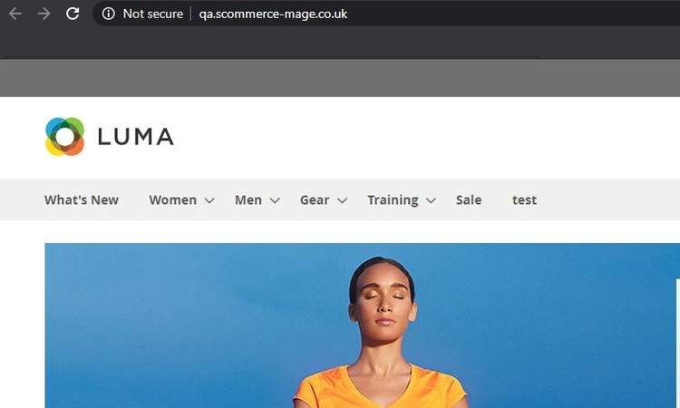
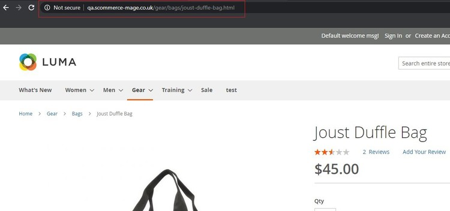
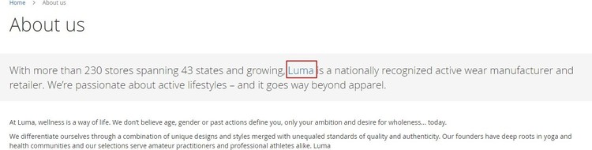

# Magento 2 Cross Linking SEO

### <mark style="color:blue;">Installation and User Guide for Magento 2 Cross Linking SEO</mark>&#x20;

**Table of Contents**

1. [_Installation_ ](magento-2-cross-linking-seo.md#\_toc\_250004)__
   * _Installation via app/code_
   * _Installation via Composer_
2. __[_Configuration Settings for SEO Base_ ](magento-2-cross-linking-seo.md#\_toc\_250003)__
   * _General Settings_&#x20;
3. __[_Configuration Settings for Cross Linking_ ](magento-2-cross-linking-seo.md#\_toc\_250001)__
   * _Cross Links Grid_&#x20;
   * _Add New Cross Link._&#x20;
   * _Build External Link to Any Website_&#x20;
   * _Alert Message for Inactive Product / Category_&#x20;
4. __[_Set Primary Categories_](magento-2-cross-linking-seo.md#set-primary-categories)__
5. [_Front-end Site view_ ](magento-2-cross-linking-seo.md#\_toc\_250000)__
   * _Cross Link on Category Page_&#x20;
   * _Category Page Cross Link Redirecting on External Link_&#x20;
   * _Cross Link on Product Page_&#x20;
   * _Product Page Cross Link Redirecting on Internal Link_&#x20;
   * _Cross Link on CMS Page_&#x20;

### <mark style="color:blue;">Installation</mark> <a href="#_toc_250004" id="_toc_250004"></a>

* <mark style="color:orange;">**Installation via app/code:**</mark>** ** Upload the content of the module to your root folder. This will not overwrite the existing Magento folder or files, only the new contents will be added. After the successful upload of the package, run below commands on Magento 2 root directory.

```
php bin/magento setup:upgrade
php bin/magento setup:di:compile
php bin/magento setup:static-content:deploy
```

* <mark style="color:orange;">**Installation via Composer:**</mark> Please follow the guide provided in the below link to complete the installation via composer.


[installation-via-composer.md](../installation-via-composer.md)


### <mark style="color:blue;">Configuration Settings for SEO Base</mark> <a href="#_toc_250003" id="_toc_250003"></a>

Go to _**Admin > Stores > Configuration > Scommerce Configuration > SEO Base**_

#### <mark style="color:orange;">General Settings</mark> <a href="#_toc_250002" id="_toc_250002"></a>

* **Enabled –** Select “Yes” or “No” to enable or disable the module.
* **License Key –** Please add the license for the extension which is provided in the order confirmation email. Please note license keys are site URL specific. If you require license keys for dev/staging sites then please email us at [core@scommerce-mage.com](mailto:core@scommerce-mage.com)


### <mark style="color:blue;">Configuration Settings for Cross Linking</mark> <a href="#_toc_250001" id="_toc_250001"></a>

Go to _Admin > Stores > Configuration > Scommerce Configuration > Cross Linking_

* **Enabled –** Select “Yes” or “No” to enable or disable the module.
* **Product Page Replacement Limit –** Please define the replacement limit per product page. It determines how many keywords will be replaced on the given page.
* **Category Page Replacement Limit –** Please define the replacement limit per category page. It determines how many keywords will be replaced on the given page.
* **CMS Page Replacement Limit –** Please define the CMS page replacement limit. It determines how many keywords will be replaced on the given page.
* **Product Attributes for Replacement –** Please select the product attributes where text will be replaced with link on product pages.
* **Category Attribute for Replacement –** Please select the category attributes where text will be replaced with link on category page.


* <mark style="color:orange;">**Cross Links Grid -**</mark>** ** You can manage and create new cross links from **Admin > Marketing > SEO Cross Linking > Cross Links**. This grid will have ID, Title, Status, Store View, Target, Replacement Limit, Priority, Nofollow, Action.


* <mark style="color:orange;">**Add New Cross Link -**</mark>** ** To add new cross link, go to **Admin > Marketing > SEO Cross Linking > Cross Links >** Click on "**Add New Link**" button. It redirects on "Add New Cross Link" page and by providing all the general information you can create a new cross link.


This will have following general information:-

* Active - Dropdown with 'YES' or 'NO' options
* Link Title - Title of the link
* Link Target - Dropdown with options self or blank
* Keywords - Keywords can be entered with line breaks and wildcard % anywhere with the keyword for example %phone% (iPhone7)
* Store View - Multi-select with options All Store Views, Default Store View
* Reference - Dropdown with options, Product ID, Category ID or Custom Url
* Reference Resource - This will show either category tree or product grid with filters or css grid with filters to choose category or product ID
* Priority - Priority to be given to the link which has highest priority first in case the replacement is lower number
* Replacement limit - Limit the number of links per page
* No Follow - This will add follow or nofollow with the link on frontend


* <mark style="color:orange;">**Build External Link to Any Website -**</mark>** ** You can set external link to any website from _Admin > Marketing > SEO Cross Linking > Cross Links >Reference - Custom Url > Custom Url_ - **** Provide External Link.

>)

* <mark style="color:orange;">**Alert Message for Inactive Product / Category -**</mark>** ** It shows an alert / warning message when you disable the category or product from _Admin > Catalog > Category / Product > Select Category / Product > Disable > Save._


__

* <mark style="color:orange;">**Alert Message for Inactive Category**</mark>


### <mark style="color:blue;">Set Primary Categories</mark>

You can use a script provided with the extension to automatically add primary categories for products. Admin can exclude certain categories from primary category and also prioritise one category over the other to be picked as the primary category.

Go to Admin>Catalog>Categories select a category then scroll down to find the option "Primary Category Settings". Here click on "Exclude From Primary Category" to exclude this category from primary category or enter the priority 0 being the highes. The highest priority category will be picked first for the primary category.

 (1).png>)

To automatically assingn primary category for all products run the command given below by going into the root directory of your store.

```
scommerce:seo-base:set-primary-category
```

_<mark style="color:red;">**N.B -**</mark>_ _<mark style="color:red;">If you are using older version then run the script provided in the extension folder at the path Data/SetPrimaryCategoryM2.php from ssh</mark>_

### <mark style="color:blue;">Front-end Site view</mark> <a href="#_toc_250000" id="_toc_250000"></a>

* <mark style="color:orange;">**Cross Link on Category Page -**</mark>** ** You can define the replacement limit for category page from _Admin > Stores > Configuration > Scommerce Configuration > Cross Linking > Category Page Replacement Limit - 1_. It determines how many keywords will be replaced on the given page and to define cross link, go to _Admin > Marketing > SEO Cross Linking > Cross Links > Select Link > Replacement Limit -1._


* <mark style="color:orange;">**Category Page Cross Link Redirecting on External Link -**</mark>** ** Click on the cross link "Luma" will redirect to external link.



* <mark style="color:orange;">**Cross Link on Product Page -**</mark>** ** You can define replacement limit for cross link from _Admin > Marketing > SEO Cross Linking > Cross Links > Select Link > Replacement Limit - 2._ Individual Cross link limit determines how many times the link will be replaced on the given page.


* <mark style="color:orange;">**Product Page Cross Link Redirecting on Internal Link -**</mark>** ** Click on the cross link "Duffle" will redirect to defined internal link.



* <mark style="color:orange;">**Cross Link on CMS Page**</mark> <mark style="color:orange;"></mark><mark style="color:orange;">-</mark> You can set replacement limit for cross link from _Admin > Marketing > SEO Cross Linking > Cross Links > Select Link > Replacement Limit - 1._ **** Individual Cross link limit determines how many times the link will be replaced on the given page.



If you have a question related to this extension please check out our [**FAQ section**](https://www.scommerce-mage.com/magento-2-cross-linking-seo.html#faq) first. If you can't find the answer you are looking for then please contact [**support@scommerce-mage.com**](mailto:core@scommerce-mage.com)**.**
