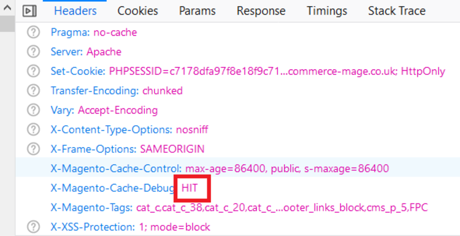
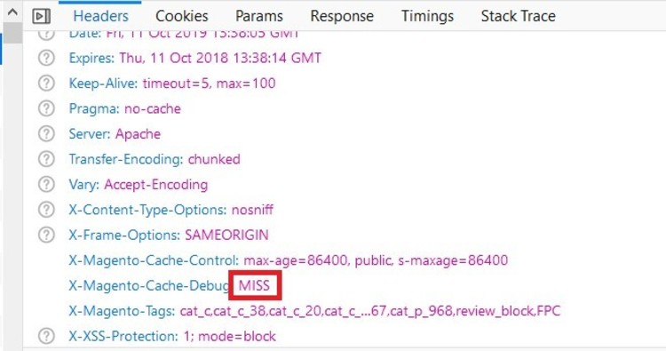

# Magento 2 Google Page Speed Optimizer

### <mark style="color:blue;">Installation and User Guide for Magento 2 Google Page Speed Optimizer</mark>&#x20;

**Table of Contents**

1. [I_nstallation_ ](magento-2-google-page-speed-optimizer.md#toc\_250024)
   * _Installation via app/code_&#x20;
   * _Installation via Composer_&#x20;
2. [_Configuration Settings for Optimiser Base_ ](magento-2-google-page-speed-optimizer.md#toc\_250023)
   * _General Settings_&#x20;
3. [_Configuration Settings for Speed Optimiser_ ](magento-2-google-page-speed-optimizer.md#toc\_250021)
   * _General Settings_&#x20;
   * _Minify HTML_&#x20;
   * _Javascript Settings_&#x20;
   * _CSS Settings_&#x20;
4. [_Configuration Settings for Lazy Loading_](magento-2-google-page-speed-optimizer.md#toc\_250016)&#x20;
   * _General Settings_&#x20;
   * _Lazy Loading on the Homepage_&#x20;
   * _Home Page Excluded from Lazy Loading_&#x20;
   * _Lazy Loading on the Category Page_&#x20;
   * _Lazy Loading on the Search Page_&#x20;
   * _Lazy Loading on the Cart Page_&#x20;
5. [_Configuration Settings for Image Optimizer_ ](magento-2-google-page-speed-optimizer.md#toc\_250014)
   * _General Settings_&#x20;
   * _Compress/Optimize Product Image_&#x20;
   * _Compress/Optimize Category Image._&#x20;
   * _Compress/Optimize CMS Image_&#x20;
6. [_Configuration Settings for Cache Warmer_ ](magento-2-google-page-speed-optimizer.md#toc\_250012)
   * _General Settings_&#x20;
   * _Cron Settings_&#x20;
7. [_Cache Warmer Grid_ ](magento-2-google-page-speed-optimizer.md#toc\_250009)
   * _Regenerate_&#x20;
8. [_Console Commands_ ](magento-2-google-page-speed-optimizer.md#toc\_250008)
   * _Category Page_&#x20;
   * _Product Page_&#x20;
   * _CMS Page_&#x20;
9. [_Front-end Screenshots_ ](magento-2-google-page-speed-optimizer.md#toc\_250007)
   * _Cache Hit for the category page after the execution of category page command_&#x20;
   * _Cache Miss for the Category Page_&#x20;
10. [_Set Primary Categories_](magento-2-google-page-speed-optimizer.md#set-primary-categories)
11. [_Google Page Speed Tests_ ](magento-2-google-page-speed-optimizer.md#toc\_250006)
    * _Home Page Mobile_&#x20;
    * _Home Page Desktop_&#x20;
    * _Category Page Mobile_&#x20;
    * _Category Page Desktop_&#x20;
    * _Product Page Mobile_&#x20;
    * _Product Page Desktop_&#x20;

### <mark style="color:blue;">Installation</mark> <a href="#toc_250024" id="toc_250024"></a>

* <mark style="color:orange;">**Installation via app/code:**</mark> Upload the content of the module to your root folder. This will not overwrite the existing Magento folder or files, only the new contents will be added. After the successful upload of the package, run below commands on Magento 2 root directory.

```
php bin/magento setup:upgrade
php bin/magento setup:di:compile
php bin/magento setup:static-content:deploy
```

* <mark style="color:orange;">**Installation via Composer:**</mark> Please follow the guide provided in the below link to complete the installation via composer.


[installation-via-composer.md](../installation-via-composer.md)


### <mark style="color:blue;">Configuration Settings for Optimiser Base</mark> <a href="#toc_250023" id="toc_250023"></a>

Go to _Admin > Stores > Configuration > Scommerce Configuration > Optimiser Base_

#### <mark style="color:orange;">General Settings</mark> <a href="#toc_250022" id="toc_250022"></a>

* **Enabled –** Select “Yes” or “No” to enable or disable the module.
* **License Key –** Please add the license for the extension which is provided in the order confirmation email. Please note license keys are site URL specific. If you require license keys for dev/staging sites then please email us at [support@scommerce-mage.com](mailto:support@scommerce-mage.com).


### <mark style="color:blue;">Configuration Settings for Speed Optimiser</mark> <a href="#toc_250021" id="toc_250021"></a>

Go to _Admin > Stores > Configuration > Scommerce Configuration > Speed Optimiser_

#### <mark style="color:orange;">General Settings</mark> <a href="#toc_250020" id="toc_250020"></a>

* **Enabled -** Select “Yes” or **“**No**”** to enable or disable the module.


#### <mark style="color:orange;">Minify HTML</mark> <a href="#toc_250019" id="toc_250019"></a>

* **Enabled -** Select “Yes” or **“**No**”** to enable or disable the module. If set to “Yes” then the module will remove all the unnecessary comments, line breaks, tabs and spaces from your HTML to reduce its size.
* **Defer Iframes –** Select “Yes” or “No”. If set to “Yes” then attribute defer will be added to the iframe.


#### <mark style="color:orange;">Javascript Settings</mark> <a href="#toc_250018" id="toc_250018"></a>

Select “Yes” to enable the Defer Iframes

* **Merge Javascript Files –** Select “Yes” or “No”. If set to “Yes” then it will merge all JS files into one to reduce the number of queries.
* **Enable Javascript Bundling –** Select “Yes” or “No”. If set to “Yes” then it will combine all JS files into few bundles and download them for each page. This will save time by reducing the number of server requests.
* **Javascript Files Minification –** Please select “Yes” or “No”. If set to “Yes” then the module will remove all the unnecessary comments, line breaks, tabs and spaces from your Java Script to reduce its size.


#### <mark style="color:orange;">CSS Settings</mark> <a href="#toc_250017" id="toc_250017"></a>

* **Merge CSS Files –** Select “Yes/No”. If set to “Yes” then it will merge all CSS files into one to reduce the number of queries.
* **Defer Fonts Loading –** Select “Yes/No”. If set to “Yes” then browser will load the page with system fonts and replace them with your fonts when they are loaded. It makes store pages load faster.
* **Fonts Display Swap –** Select “Yes/No”. If set to “Yes” then font-display will be replaced with swap. Helps avoid Luma-Icons issue.
* **CSS Files Minification –** Select “Yes” or “No”. If set to “Yes” then the module will remove all the unnecessary comments, line breaks, tabs and spaces from your CSS to reduce its size.


### <mark style="color:blue;">Configuration Settings for Lazy Loading</mark> <a href="#toc_250016" id="toc_250016"></a>

Go to _Admin > Stores > Configuration > Scommerce Configuration > Lazy Loading_

#### <mark style="color:orange;">General Settings</mark> <a href="#toc_250015" id="toc_250015"></a>

* **Enabled -** Select “Yes” or **“**No**”** to enable or disable the module.
* **Preload Images –** Select “Yes**”** to preload the images.
* **Loading Icon –** Show a preview image before the real image loads.
* **Skip Images Count by page category –** Enter a valid image count to skip the images from lazy load. Based on the count this option will decide how many images to load without lazy loading.
* **Ignore Images that Contain –** Provide a part of an image tag content into the field to exclude the image from the lazy load.
* **Exclude Pages –** Select the page(s) from multi-select options to exclude from the lazy load.


* <mark style="color:orange;">**Lazy Loading on the Homepage –**</mark> Enable the module to implement lazy loading on the homepage, here is the configuration path _Admin > Stores > Configuration > Lazy Loading- Enable "Yes"._ In the below screen grab you can see the product "Radiant Tee" with lazy loading.


* <mark style="color:orange;">**Home Page Excluded from Lazy Loading –**</mark> There is an option " Exclude Pages" available in the backend, from where you can select the page to exclude from the lazy loading.


* <mark style="color:orange;">**Lazy Loading on the Category Page –**</mark> Enable the module to implement the lazy loading on the category page _Admin > Stores > Configuration > Lazy Loading - Enable "Yes"._


* <mark style="color:orange;">**Lazy Loading on the Search Page –**</mark> There is an option available in the configuration settings at _Admin > Stores > Configuration > Lazy Loading- Enable_ and by selecting "Yes" or "No" you can enable or disable the lazy loading on the search page.


* <mark style="color:orange;">**Lazy Loading on the Cart Page –**</mark> You can implement lazy loading on the cart page by by enabling the module from the back-end configuration _Admin > Stores > Configuration > Lazy Loading- Enable "Yes"._

>)

### <mark style="color:blue;">Configuration Settings for Image Optimizer</mark> <a href="#toc_250014" id="toc_250014"></a>

Go to _Admin > Stores > Configuration > Scommerce Configuration > Image Optimizer_

#### <mark style="color:orange;">General Settings</mark> <a href="#toc_250013" id="toc_250013"></a>

* **Enabled -** Select “Yes” or **“**No**”** to enable or disable the module.
* **Compress Images while uploading -** Select available options to enable compression for new images uploaded via Magento admin. We recommend this to be enabled because all the new things will be compressed straight away.
* **Number of images to processed –** Define how many number of images you want to process when the cron job runs. Please note this number should be reasonable especially when you have multiple stores and many additional product images.
* **Minimum image size required after optimisation -**
* **Include folders –** Please select list of folders you want to include for compressing the image.
* **Compress Cached Product Images (Yes/No) –** Select “Yes” to compress cached product images generated by Magento. We could recommend to leave this setting turned off especially when you clear your cached images frequently and you have more than 5 additional images on the product page.
* **Image Compression Provider –** Please select image compression provider. **Provider API URL: Provider API URL. smush it –** [**http://api.resmush.it/ws.php?img=**](http://api.resmush.it/ws.php?img) **imageoptim –** [**https://im2.io/{ {username} }/full/**](https://im2.io/%7B%20%7Busername%7D%20%7D/full/) **kraken.io –** [**https://api.kraken.io./v1/url**](https://api.kraken.io/v1)
* **API Key –** Please enter API Key (if provider is kraken.io).
* **API Secret Key –** This will be required for certain providers like kraken.io
* **Exclude folders –** Please enter the list of folders you want to exclude from media directory (comma separated) for example foldername1, foldername2, /foldername /subfolder1, foldername/subfolder2
* **Backup Images (Yes/No) –** Select “Yes” to enable this feature to backup original images before compressing original file.
* **Debugging (Yes/No) –** Select “Yes” to enable debugging. This will write logs in var – log – imageoptimize.log
* **Image Optimiser Schedule –** Please define the Cron frequency to optimize images.


* <mark style="color:orange;">**Compress/Optimize Product Image -**</mark> You can compress product images by enabling module from _Admin > Stores > Configuration > Scommerce Configuration > Image Optimiser > Enabled - "Yes" > Compress Images while uploading - Select "Product "._


* <mark style="color:orange;">**Compress/Optimize Category Image -**</mark> You can compress category images by enabling module from _Admin > Stores > Configuration > Scommerce Configuration > Image Optimiser > Enabled - "Yes" > Compress Images while uploading - Select "Category "._


* <mark style="color:orange;">**Compress/Optimize CMS Image -**</mark> You can compress CMS images by enabling module from _Admin > Stores > Configuration > Scommerce Configuration > Image Optimiser > Enabled - "Yes" > Compress Images while uploading - Select "CMS "._


### <mark style="color:blue;">Configuration Settings for Cache Warmer</mark> <a href="#toc_250012" id="toc_250012"></a>

Go to _Admin > Stores > Configuration > Scommerce Configuration > Cache Warmer_

#### <mark style="color:orange;">General Settings</mark> <a href="#toc_250011" id="toc_250011"></a>

* **Enabled -** Select “Yes” or “No” to enable or disable the module
* **Regenerate cache after page update -** Please select "Yes" or "No" to regenerate cache for updated page.
* **Select Page -** Please select the page(s) from the multi-select option. This will regenerate the cache selected page(s) on page update.
* **Can Regenerate Cache Manually -** Please select " Yes" or "No". If set to "Yes" then you can regenerate cache manually from cache warmer grid.
* **Generate Log -** Select "Yes" to generate the log.


#### <mark style="color:orange;">Cron Settings</mark> <a href="#toc_250010" id="toc_250010"></a>

* **Cache Cron Schedule -** Schedule cron job to regenerate the cache for all non cached page(s).
* **Number of Concurrent Regeneration request -** Please define the number of concurrent request.


### <mark style="color:blue;">Cache Warmer Grid</mark> <a href="#toc_250009" id="toc_250009"></a>

When you enable the module and set _General Settings > Can Regenerate Cache Manually >_ to **"Yes"** then it adds an additional option "Regenerate" under the "Actions ->Select" drop-down at _Admin > System > Cache Warmer > Actions._ This grid will have Id, Page URL, Page Type - (Home, Product, Category, CMS), Status - (Cached/Un-cached), Last Cached - (Date, Time), and Action- (Regenerate, Delete).


* <mark style="color:orange;">**Regenerate -**</mark> It regenerates cache manually for Category/Product/CMS pages. By clicking on the "Regenerate" action you can regenerate cache manually for a specific URL.


### <mark style="color:blue;">Console Commands</mark> <a href="#toc_250008" id="toc_250008"></a>

You can regenerate cache for Product/Category/CMS page(s) by running the following console commands: -

* <mark style="color:orange;">**Category Page -**</mark> If you want to regenerate cache for the category page then run this command **`scommerce:cachewarmer:category`**


* <mark style="color:orange;">**Product Page -**</mark> To regenerate cache for the product page(s), use this command **`scommerce:cachewarmer:product`**


* <mark style="color:orange;">**CMS Page -**</mark> To regenerate cache for CMS page please use this command **`scommerce:cachewarmer:cmspage`**


### <mark style="color:blue;">Front-end Screenshots</mark> <a href="#toc_250007" id="toc_250007"></a>

* <mark style="color:orange;">**Cache Hit for the category page after the execution of category page command -**</mark> When you run the command for category then it regenerates the cache. On the front-end you can debug the cache and check the status "Hit" or "Miss" using browser tool (Inspect element) under _Network > Select Page URL > Header > Cache Debug: HIT_



* <mark style="color:orange;">**Cache Miss for the Category Page**</mark>** -** Flush the cache by executing the command (**c:f)** and then check cache using browser tool .



### <mark style="color:blue;">Set Primary Categories</mark>

You can use a script provided with the extension to automatically add primary categories for products. Admin can exclude certain categories from primary category and also prioritise one category over the other to be picked as the primary category.

Go to Admin>Catalog>Categories select a category then scroll down to find the option "Primary Category Settings". Here click on "Exclude From Primary Category" to exclude this category from primary category or enter the priority 0 being the highes. The highest priority category will be picked first for the primary category.

.png>)

To automatically assingn primary category for all products run the command given below by going into the root directory of your store.

```
scommerce:seo-base:set-primary-category
```

_<mark style="color:red;">**N.B -**</mark>_ _<mark style="color:red;">If you are using older version then run the script provided in the extension folder at the path Data/SetPrimaryCategoryM2.php from ssh</mark>_

### <mark style="color:blue;">Google Page Speed Tests</mark> <a href="#toc_250006" id="toc_250006"></a>

#### <mark style="color:orange;">Home Page Mobile</mark> <a href="#toc_250005" id="toc_250005"></a>


#### <mark style="color:orange;">Home Page Desktop</mark> <a href="#toc_250004" id="toc_250004"></a>


#### <mark style="color:orange;">Category Page Mobile</mark> <a href="#toc_250003" id="toc_250003"></a>


#### <mark style="color:orange;">Category Page Desktop</mark> <a href="#toc_250002" id="toc_250002"></a>


#### <mark style="color:orange;">Product Page Mobile</mark> <a href="#toc_250001" id="toc_250001"></a>


#### <mark style="color:orange;">Product Page Desktop</mark> <a href="#toc_250000" id="toc_250000"></a>


If you have a question related to this extension please check out our [**FAQ section**](https://www.scommerce-mage.com/magento-2-google-page-speed-optimizer.html#faq) first. If you can't find the answer you are looking for then please contact [**support@scommerce-mage.com**](mailto:core@scommerce-mage.com)**.**
