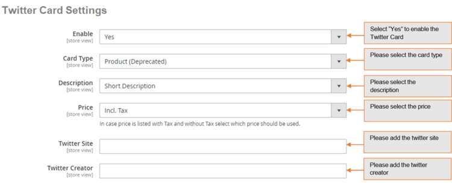
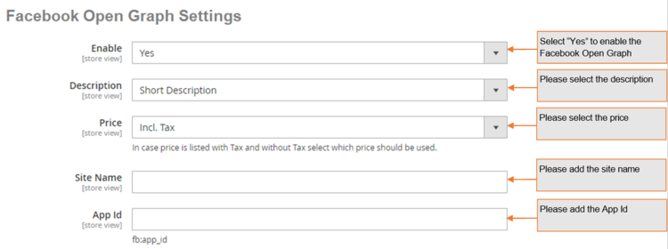

# Magento 2 Google Rich Snippets

### <mark style="color:blue;">Installation and User Guide for Magento 2 Rich Snippets for Google, Microsoft and Yahoo</mark>

**Table of Contents**

1. [_Installation_ ](magento-2-google-rich-snippets.md#\_toc\_250010)
   * _Installation via app/code_
   * _Installation via Composer_
2. [_Configuration Settings for SEO Base_ ](magento-2-google-rich-snippets.md#\_toc\_250009)
   * _General Settings_&#x20;
3. [_Configuration Settings for Rich Snippets_ ](magento-2-google-rich-snippets.md#\_toc\_250007)
   * _General Settings_&#x20;
   * _Rich Snippets General Settings_&#x20;
   * _Twitter Card Settings_&#x20;
   * _Facebook Open Graph Settings_&#x20;
   * _Pinterest Rich Pins Settings_&#x20;
   * _Free Shipping (Website Level)_
   * _Price Valid Until_
4. [_Structured Data / Markup Code of Front-end Page(s) in Structured Data Testing Tool_ ](magento-2-google-rich-snippets.md#\_toc\_250001)
   * _Home Page Markup Code_&#x20;
   * _Category Page Markup Code_&#x20;
   * _Product Page Markup Code_&#x20;
   * _Twitter, Facebook Open Graph Social Sharing Code_&#x20;
   * _Increased and Optimized Page Ranking in Search Results_&#x20;
5. [_Set Primary Categories_](magento-2-google-rich-snippets.md#set-primary-categories)

### <mark style="color:blue;">Installation</mark> <a href="#_toc_250010" id="_toc_250010"></a>

* <mark style="color:orange;">**Installation via app/code:**</mark> Upload the content of the module to your root folder. This will not overwrite the existing Magento folder or files, only the new contents will be added. After the successful upload of the package, run below commands on Magento 2 root directory.

```
php bin/magento setup:upgrade
php bin/magento setup:di:compile
php bin/magento setup:static-content:deploy
```

* <mark style="color:orange;">**Installation via Composer:**</mark> Please follow the guide provided in the below link to complete the installation via composer.


[installation-via-composer.md](../installation-via-composer.md)


### <mark style="color:blue;">Configuration Settings for SEO Base</mark> <a href="#_toc_250009" id="_toc_250009"></a>

Go to _Admin > Stores > Configuration > Scommerce Configuration > SEO Base_

#### <mark style="color:orange;">General Settings</mark> <a href="#_toc_250008" id="_toc_250008"></a>

* **Enabled –** Select “Yes” or “No” to enable or disable the module.
* **License Key –** Please add the license for the extension which is provided in the order confirmation email. Please note license keys are site URL specific. If you require license keys for dev/staging sites then please email us at [core@scommerce-mage.com](mailto:core@scommerce-mage.com)


### <mark style="color:orange;">Configuration Settings for Rich Snippets</mark> <a href="#_toc_250007" id="_toc_250007"></a>

Go to _Admin > Stores > Configuration > Scommerce Configuration > Rich Snippet_

#### <mark style="color:orange;">General Settings</mark> <a href="#_toc_250012" id="_toc_250012"></a>

* **Enable -** Select “Yes” or “No” to enable or disable the module.
* **Description –** Select description/short description from the drop down.
* **Price –** Select Price from the drop down. In case price is listed with tax and without tax select which price should be used.
* **Brand –** Select brand from the drop down.
* **Global Product Identifier –** Select product identifier from the drop-down list.
* **Global Identifier Type –** Select product identifier type from the drop-down list. It could be one of the following: gtin8, gtin13, gtin14, mpn.


#### <mark style="color:orange;">Rich Snippets General Settings</mark> <a href="#_toc_250011" id="_toc_250011"></a>

* **Enable -** Select “Yes” or “No” to enable or disable the module.
* **Description –** Select description/short description from the drop-down.
* **Price –** Select price from the drop down. In case price is listed with tax and without tax select which price should be used.
* **Wrap with div –** Select “Yes/No”. It helps prevent conflicts with SEO extensions.
* **Use JSON-LD –** Select “Yes/No” use JSON-LD format for product snippet.


#### <mark style="color:orange;">Twitter Card Settings</mark> <a href="#_toc_250010" id="_toc_250010"></a>

* **Enable -** Select “Yes” or “No” to enable or disable the module.
* **Card Type –** Select the card type.
* **Description -** Select description/short description from the drop down.
* **Price –** Select price from the drop down. In case price is listed with tax and without tax select which price should be used.
* **Twitter Site –** Set Twitter site name (@ username for the website used in the card footer)
* **Twitter Creator –** Set Twitter creator name (@username for the content creator / author)



#### <mark style="color:orange;">Facebook Open Graph Settings</mark> <a href="#_toc_250009" id="_toc_250009"></a>

 **Facebook Open Graph Settings**

* **Enable –** Set “Yes” to enable.
* **Description –** Select description/short description from the drop down.
* **Price –** Select price from the drop down. In case price is listed with tax and without tax select which price should be used.
* **Site Name –** Set Facebook site name.
* **App ID –** Set Facebook App ID.



#### <mark style="color:orange;">Pinterest Rich Pins Settings</mark> <a href="#_toc_250008" id="_toc_250008"></a>

* **Enable –** Set “Yes” to enable Pinterest Rich Pins . It uses same tags as Facebook open graph, make sure Facebook Open graph is enabled as well.


#### <mark style="color:orange;">Free Shipping(Website Level)</mark> <a href="#_toc_250010" id="_toc_250010"></a>

Some settings are only available on the website level for eg:- Region/State.

* **Show free shipping-** Select “Yes” or “No” to add or remove free shipping schema from the product page.
* **Country –**  It determines which country will have free shipping for the selected website
* **Region/State –** It determines which state within the selected country will have free shipping for the selected website
* **Base Currency -** Added as a part of free shipping schema, set 'YES' to allow use of base currency of the website otherwise the currency chosen by the customer.

.png>)

#### <mark style="color:orange;">Price Valid Until</mark> <a href="#_toc_250010" id="_toc_250010"></a>

Send Price valid until with the offers markup code for products.

* **Start Month-** Select the starting month from where the priceValidUntil field will be calculated. for example:- if you select the month of January then the calculations for the field will start from january.
* **Time Interval-** Select "quarterly", "Six-monthly", or "Yearly" based upon the selection the price valid until date will be calculated. Example:- if the start month is January and the current date is 23-11-2023 and the time interval selected is "Six-monthly" then the first six-monthly is between 01-01-2023 to 31-06-2023 and the second six-monthly period is between 01-07-2023 to 31-12-2023 hence the priceValidUntil will be 31-12-2023 as our date lies in this period.&#x20;

<figure><figcaption></figcaption></figure>

### <mark style="color:blue;">Structured Data / Markup Code of Front-end Page(s) in Structured Data Testing Tool</mark> <a href="#_toc_250007" id="_toc_250007"></a>

* <mark style="color:orange;">**Home Page Markup Code -**</mark> You can add structured data/markup code on home page from, _Admin > Stores > Configuration > Scommerce Configuration > Rich Snippet > Enable - Select "Yes"._ To test structured data, go to _Structured Data Testing Tool > Provide Home Page URL > Click "Run Test" button._

>)

* <mark style="color:orange;">**Category Page Markup Code -**</mark> You can add markup code, breadcrumbs on category page from, _Admin > Stores > Configuration > Scommerce Configuration > Rich Snippet > Enable - Select "Yes"._

>)

* <mark style="color:orange;">**Product Page Markup Code**</mark> <mark style="color:orange;"></mark><mark style="color:orange;">-</mark> To add structured data markup code on product page, set "Show free shipping" to "Yes" from, _Admin > Stores > Configuration > Scommerce Configuration > Rich Snippet>Free Shipping._


<mark style="color:orange;">**Shipping Markup Code**</mark> <mark style="color:orange;"></mark><mark style="color:orange;">-</mark> To add structured data markup code on product page, set "Enable" to "Yes" from, _Admin > Stores > Configuration > Scommerce Configuration > Rich Snippet._

<figure><figcaption></figcaption></figure>

<mark style="color:orange;">**Price Valid Until**</mark> <mark style="color:orange;"></mark><mark style="color:orange;">-</mark> To add the price valid until date with the structured data markup code on the product page, Set the "Start Month" and the "Time Interval" from, _Admin > Stores > Configuration > Scommerce Configuration > Rich Snippet > Price Valid Until._

<figure><figcaption></figcaption></figure>

### <mark style="color:blue;">Twitter, Facebook Open Graph Social Sharing Code</mark> <a href="#_toc_250006" id="_toc_250006"></a>

* <mark style="color:orange;">**Twitter Card -**</mark> You can enable Twitter Card from, _Admin > Stores > Configuration > Scommerce Configuration > Rich Snippet >Twitter Card Settings > Enable - "Yes"._

>)

* <mark style="color:orange;">**Facebook Open Graph -**</mark> Enable Facebook Open Graph from, _Admin > Stores > Configuration > Scommerce Configuration > Rich Snippet >Twitter Card Settings > Enable - "Yes"._

>)

* <mark style="color:orange;">**Increased and Optimized Page Ranking in Search Results -**</mark> In the below image you can see the increased and optimized page ranking in search results.

>)

### <mark style="color:blue;">Set Primary Categories</mark>

You can use a script provided with the extension to automatically add primary categories for products. Admin can exclude certain categories from primary category and also prioritise one category over the other to be picked as the primary category.

Go to Admin>Catalog>Categories select a category then scroll down to find the option "Primary Category Settings". Here click on "Exclude From Primary Category" to exclude this category from primary category or enter the priority 0 being the highes. The highest priority category will be picked first for the primary category.

.png>)

To automatically assingn primary category for all products run the command given below by going into the root directory of your store.

```
scommerce:seo-base:set-primary-category
```

_<mark style="color:red;">**N.B -**</mark>_ _<mark style="color:red;">If you are using older version then run the script provided in the extension folder at the path Data/SetPrimaryCategoryM2.php from ssh</mark>_

If you have a question related to this extension please check out our [**FAQ section**](https://www.scommerce-mage.com/magento-2-rich-snippets.html#faq) first. If you can't find the answer you are looking for then please contact [**support@scommerce-mage.com**](mailto:core@scommerce-mage.com)**.**
